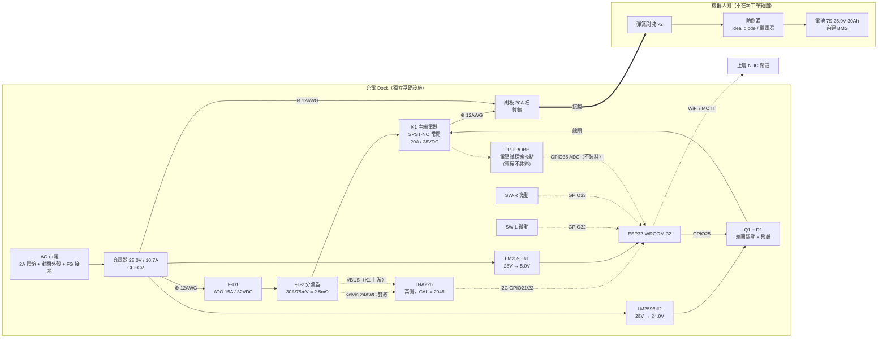
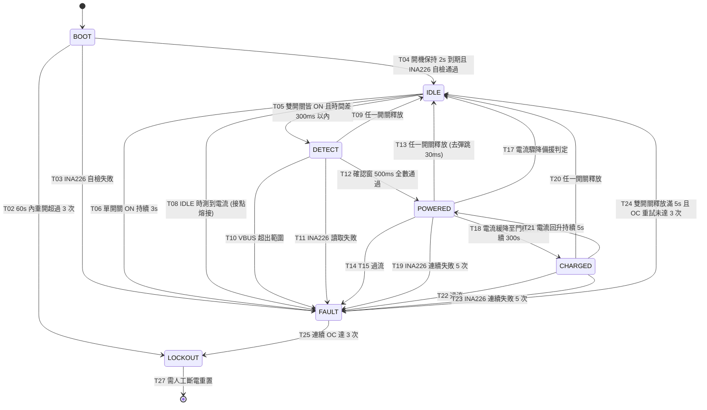

# 充電 Dock 控制電路設計（接觸式刷板方案）

> 版本：v1（設計定案，未施工）
> 最後更新：2026-08-07
> 電氣脈絡依據：`docs/power_design.md` §2（電壓基準）、§5（線徑與保險絲）、§15（充電拓樸沿革）
> INA226 使用經驗沿用：`firmware/pico_sensor_hub/src/ina226.{c,h}`

---

## 0. 本文件的定位與邊界

充電機構已定案改為**接觸式刷板**（棄無線感應耦合）：車底裝彈簧刷塊、dock 裝刷板。
`docs/power_design.md` §15 記述的是先前的無線方案，**該節未同步改寫，本文件為接觸式方案的權威來源**；
兩者衝突時以本文件為準。§2（電壓基準）、§5（線徑與保險絲）、§10.2（配線與端子）仍然有效並被本設計沿用。

### 0.1 Dock 是什麼、不是什麼

| | |
|---|---|
| **是** | 獨立的地面基礎設施，自帶 AC 市電、自帶 28.0V 充電器、自帶 ESP32 控制器 |
| **不是** | ROS 節點。dock **不接 Jetson、不進 ROS**，沒有任何有線通道連到機器人 |
| **通訊** | 只有 WiFi，且只回報狀態給上層 NUC 閘道（見 §10）。dock 端用無線**不違反**「Jetson 永不碰無線」的架構約束——那條約束的標的是 Jetson，dock 是另一台機器 |
| **不做的事** | **不做電量判斷**。22.4V 警告 / 21.7V 停機門檻歸 ROS 層（`power_design.md` §2），與 dock 無關。dock 只知道「有沒有電流在流」，不知道也不需要知道電池剩幾 % |

### 0.2 已拍板的 v1 裁決（不重新辯論）

| # | 裁決 | 本文件的落實位置 |
|---|---|---|
| 1 | 上電邏輯 = 微動開關 ×2（左右各一，同時觸發）→ ESP32 → 主繼電器閉合。**不做電壓試探**，但保留擴充點（不裝料） | §3.4、§6、§11 #P1–P4 |
| 2 | 主繼電器必須用**常開（NO）接點**，fail-safe 靠電路結構 | §3.3、§8 |
| 3 | INA226 電流監測保留（ESP32 I2C）：軟體過流切斷、電流驟降判離開、浮充水位判充飽 | §3.5、§6 |
| 4 | 硬體保險絲為最後防線 | §3.2 |
| 5 | 車端防倒灌不在本工單範圍，但需寫明 dock 對車端的假設 | §9 |

---

## 1. 電氣脈絡（來自 `power_design.md` §2，唯讀引用）

| 項目 | 值 | 出處 |
|---|---|---|
| 電池 | 7S 18650 Li-ion，25.9V 標稱 / 30Ah（777Wh），內建 BMS | §2 |
| **充電上限** | **28.0V（4.0V/cell）** | §2 |
| 🔴 充電器款式 | **必須是 28.0V 款。市售 7S「29.4V」充電器禁用**——驅動器規格上限 28V | §2 |
| 充電電流目標 | 0.2–0.3C ≈ **6–9A** | 本工單 |
| 充電器實際上限 | **10.7A**（Mean Well HLG-320H-30A 額定） | §10.1 #15 |

> **28.0V ＝ 4.0V/cell 這件事在 §6.4 有第二個用途**：它讓 CHARGED 狀態可以安全地保持繼電器閉合。
> 4.0V/cell 的長期浮充對 Li-ion 遠比 4.2V/cell 溫和，這是 dock 不需要「充飽後主動斷電」的依據。

---

## 2. 系統方塊圖

### 2.1 拓樸



### 2.2 ASCII 功率路徑（箭頭 ＝ 功率流方向：充電器 → 電池）

```
                     ┌──[LM2596 #1]──► 5.0V ──► ESP32 (VIN)
                     │
                     ├──[LM2596 #2]──► 24.0V ──► K1 線圈 ⊕
                     │                              │
                     │                              ▼ (線圈 ⊖)
                     │                        [D1 1N4007 跨線圈]
                     │                              │
                     │                            [Q1] ◄── GPIO25（閘極 10kΩ 下拉 GND）
                     │                              │
                     │                             GND
                     │
充電器 ⊕ ──[12AWG]──┴─[F-D1 15A]──[FL-2 分流器]──[K1 COM ─ NO]──[12AWG]──► 刷板 ⊕
                                       │              │
                                  Kelvin 24AWG    ○ TP-PROBE
                                  雙絞 + VBUS     （預留不裝料）
                                       ▼
                                   INA226 ──I2C──► ESP32

充電器 ⊖ ══[12AWG]══► ⊖ 端子台（dock 單點接地）══[12AWG]══► 刷板 ⊖
                            │
                            ├── INA226 GND
                            ├── ESP32 GND
                            ├── LM2596 #1/#2 OUT−（兩顆皆共地款）
                            └── 微動開關 ×2 的回線

  ⚠️ K1 為 SPST-**NO**：線圈失電 ⇒ COM–NO 開路 ⇒ 刷板無電。這是 fail-safe 的結構依據（§8）。
  ⚠️ AC 側 FG（保護接地）接金屬外殼，**不得與 DC ⊖ 相連**（§3.7）。
```

### 2.3 為什麼分流器放在 K1 **上游**

這是一個有後果的接線決策，不是隨手擺的：

| 放上游（本設計） | 放下游 |
|---|---|
| K1 斷開時 INA226 的 VBUS 仍讀得到**充電器輸出電壓**，DETECT 階段可先確認「充電器有電」再決定是否閉合（§6.3） | K1 斷開時 VBUS 讀 0，無從自檢 |
| VBUS 量的**永遠是 dock 自己的充電器**，任何情況下都量不到車端電池電壓——**結構上就做不到電量判斷**，與裁決 3 一致 | K1 閉合時 VBUS ≈ 車端電池電壓，等於偷偷具備了電量判斷能力，與裁決衝突 |
| F-D1 在分流器上游，保險絲的保護範圍涵蓋分流器那段配線（沿用 `power_design.md` §15.2 對 F1 位置的同一理由） | 分流器落在保險絲下游更遠處，保護鏈較長 |

> **DETECT 階段讀 VBUS ≠ 電壓試探。** 電壓試探指的是「先以小電流探測**車端電池**的電壓」，
> 本設計讀的是 **dock 自己充電器的輸出**，兩者標的不同。禁區針對的是前者，本設計沒有做。

---

## 3. 電路設計

### 3.1 功率路徑與元件序

```
充電器 ⊕ → F-D1(15A ATO) → FL-2 分流器 → K1(COM→NO) → 刷板 ⊕ → [接觸] → 車端刷塊 → 車端防倒灌 → 電池 ⊕
充電器 ⊖ → ⊖ 端子台 → 刷板 ⊖ → [接觸] → 車端刷塊 → 電池 ⊖
```

### 3.2 保護階梯（判準：每一層都要低於下一層）

| 層級 | 動作點 | 反應時間 | 由誰執行 |
|---|---|---|---|
| 正常充電 | 6–10.7A | — | 充電器 CC 限流 |
| 軟體警告 | **11.5A** 持續 3s | 3s | ESP32（僅記事件 + MQTT 告警，**不斷電**） |
| 軟體切斷（慢） | **12.0A** 持續 500ms | 0.5s | ESP32 → K1 斷開 → FAULT_OC |
| 軟體切斷（快） | **14.0A** 持續 100ms | 0.1s | ESP32 → K1 斷開 → FAULT_OC |
| **硬體最後防線** | **F-D1 = ATO 15A / 32VDC 快熔** | 20A 下數秒 | 保險絲（與韌體無關） |
| 元件額定天花板 | 刷板 **20A** 檔、K1 **20A/28VDC** | — | — |

**階梯成立的驗算：**

| 檢查 | 數值 | 結果 |
|---|---|---|
| 軟體切斷 12A vs 充電器上限 10.7A | 1.12 倍 | 正常充電不誤跳 ✅ |
| F-D1 15A vs 軟體切斷 12A | 1.25 倍 | 軟體先動作，保險絲是備援 ✅ |
| F-D1 15A vs 充電器 10.7A | 1.40 倍 | CC 滿載連續運轉不熔斷 ✅ |
| 刷板 20A vs F-D1 15A | 1.33 倍 | **保險絲低於刷板額定，層級正確** ✅ |
| K1 20A/28VDC vs 10.7A | 負載率 **54%** | 降額充足，抑制接點熔接 ✅ |

> 🔴 **刷板必須選 20A 檔，不能選 15A 檔。**
> 若選 15A 刷板，保險絲就得降到 10A 才能維持「保險絲 < 刷板額定」的層級，
> 而 10A 已低於充電器 CC 上限 10.7A，**滿載充電會誤熔斷**。
> 兩個方向都被夾死，20A 刷板 + 15A 保險絲是唯一可行組合。

> **ATO 刀片保險絲的 32VDC 額定是真 DC 額定**（SAE J1284 / ISO 8820-3 本來就是汽車 DC 應用），
> 28V 在範圍內，且與 `power_design.md` §10.1 #2 車上的 F1 同族料件，備品可共用。

### 3.3 主繼電器 K1 選型

**選定：Songle SLA-24VDC-SL-A（SPST-NO，24V 線圈）**

| 項目 | Datasheet 數值 | 本設計用量 | 餘裕 |
|---|---|---|---|
| **接點額定（DC）** | **20A / 28VDC**（另標 30A / 30VDC） | 10.7A @ 28.0V | **54% 負載率** ✅ |
| 接點型式 | **SPST-NO**（型號尾碼 **A** ＝ 1 form A ＝ 常開） | 需 NO | 符合裁決 2 ✅ |
| 最大切換電流 | 30A | 10.7A | 2.8× |
| 接點材質 | 銀合金（AgCdO / AgSnO₂ / AgNi） | — | — |
| 線圈電壓 | 24VDC | 24.0V（LM2596 #2） | — |
| 線圈功耗 | ~0.9W ⇒ **~38mA / ~640Ω** | 38mA | Q1 額定 600mA ⇒ 15× |
| 安規 | UL/CUL E179944、TUV R50056114、CCC | — | — |

🔴 **選型依據是 DC 額定，不是 AC 額定。** DC 電弧沒有 AC 的電流過零點可以自然熄弧，
比 AC 難斷得多，**拿 250VAC 那一欄來充數是錯的**。本型號 datasheet 直接標示 **20A/28VDC**，
與本應用的 28.0V 母線精確對應，這是選它的唯一理由。

**採購時必須在實物 datasheet 上確認的欄位**（不同批次/廠商標示會有出入）：
1. 接點額定欄位中**有沒有「xxA / 28VDC」或「xxA / 30VDC」這一列**——只有 AC 額定或只標「30A」而無電壓者，**不可採用**
2. 型號尾碼是 **-A**（1 form A ＝ SPST-NO）。**-C 是 SPDT（1 form C），有 NC 接點，不可用**
3. 線圈功耗（0.53W 省電版 ⇒ ~22mA / 1086Ω；0.9W 標準版 ⇒ ~38mA / 640Ω）。本設計對 **22–90mA 範圍皆成立**，不需重新設計

**替代方案（採購不到時）：24V 系統的汽車繼電器 + 帶尾線繼電器座**
- 優點：功率路徑走壓接尾線，完全不經 PCB／洞洞板
- 🔴 前提：datasheet 必須有明確的 **24VDC 或 28VDC 接點額定**。汽車繼電器常見的「40A」若未標電壓，或只標 14VDC，**都不合格**——14VDC 額定不能外推到 28V，DC 電弧長度隨電壓大幅增長

**❌ 為什麼不用 SSR（固態繼電器）**
SSR-40DD 之類的 MOSFET 型固態繼電器有明確的 DC 額定（如 40A/3–32VDC）且無電弧，看似更好，
但**半導體的典型失效模式是短路（fail-short）**：SSR 燒毀後刷板會**持續帶電**，
與裁決 2 要求的 fail-safe 方向**完全相反**。機械接點燒毀的主要失效模式是接點熔接（見 §8.3），
機率低於半導體過壓/過溫短路，且可被 §6 的自檢部分涵蓋。

**🔴 K1 的施工要求（PCB 針腳不可依賴洞洞板銅箔）**

SLA 系列是 PCB 針腳型繼電器。**洞洞板的銅箔絕對載不了 10.7A**，必須：

1. K1 的 **COM 與 NO 兩支接點針腳**，各以 **16 AWG 短線（≤10cm）直接焊在針腳上**，拉到 ⊖/⊕ 端子台
2. 焊接前把 16 AWG 剝線後**分股攤開包住針腳**再焊，不要對接堆錫
3. 線材在**離繼電器 3cm 內以束帶固定到板子**——焊點只負責導電，不負責承受拉扯
4. 線圈的兩支針腳（小電流 38mA）可正常走洞洞板銅箔
5. K1 建議獨立一小塊洞洞板，與 ESP32 主板分開，避免功率線橫越訊號區

> 16 AWG 安全載流 10–13A（`power_design.md` §5.1），對 10.7A 屬邊緣但**這段只有 ≤10cm**，
> 散熱條件遠好於長距離佈線；長距離段（端子台 ↔ 充電器 ↔ 刷板）一律 12 AWG。

### 3.4 繼電器驅動電路

```
                    +24.0V (LM2596 #2 OUT+)
                         │
                    ┌────┴────┐
                    │ K1 線圈 │  38mA / 640Ω
                    └────┬────┘
                         │      ▲ D1 1N4007（陰極朝 +24V）
                         ├──────┤
                         │      ▼
                         │
                    ┌────┴────┐
GPIO25 ──[R1 1kΩ]───┤ Q1 base │  2N2222A (TO-92)
                    │  (NPN)  │
              ┌─────┤ emitter │
              │     └────┬────┘
        [R2 10kΩ]        │
              │          │
             GND ────────┴──── GND (dock ⊖ 端子台)
```

| 元件 | 值 | 為什麼是這個值 |
|---|---|---|
| **Q1** | 2N2222A（NPN，TO-92）<br/>*替代：S8050、或邏輯電平 MOSFET IRLZ44N* | Ic(max) 600mA vs 線圈 38mA ＝ **15 倍餘裕**。TO-92 洞洞板好焊 |
| **R1**（基極串阻） | **1 kΩ** | Ib = (3.3 − 0.7) / 1k = **2.6mA**。飽和需 hFE ≥ 38/2.6 = **15**，2N2222A 在此電流下 hFE ≥ 75 ⇒ **深度飽和** ✅ |
| **R2**（基極下拉） | **10 kΩ** | 🔴 **fail-safe 關鍵元件，不可省**。ESP32 未開機／reset 中／已斷電時 GPIO25 為**浮空輸入**；R2 把基極確實拉到 0V，Q1 截止，線圈失電，K1 斷開。沒有 R2，浮空基極可能被雜訊耦合而誤導通 |
| **D1**（飛輪二極體） | **1N4007**，陰極接 +24V 側 | 線圈斷電時 L·di/dt 反電動勢會擊穿 Q1（2N2222A Vceo = 40V），D1 把它鉗在 0.7V |

**D1 對釋放時間的副作用（已評估，可接受）：**
純二極體續流會讓線圈電流緩慢衰減，繼電器釋放時間典型延長 2–5 倍
（SLA 典型釋放 ~5ms ⇒ 最壞 ~25ms）。這對本設計無影響：
韌體輪詢週期就是 100ms（§6.2 T_poll），25ms 遠在其下，不是瓶頸。
若日後實測發現「拖走時斷電太慢」，改善路徑是 D1 串一顆 24V 齊納（釋放加快 ~3 倍），
而不是拿掉 D1。

**GPIO25 的選腳理由**：非 strapping pin（ESP32 的 strapping 為 GPIO0/2/4/5/12/15），
開機過程不會被 bootloader 拉高；也非 flash 專用腳（GPIO6–11）。

### 3.5 電流量測（INA226，高側）

沿用 `firmware/pico_sensor_hub/src/ina226.h` 的全套常數，**韌體常數不需重算**：

| 參數 | 值 | 說明 |
|---|---|---|
| 分流器 | **FL-2 30A / 75mV ＝ 2.5mΩ** | 與車上 `power_design.md` §10.1a W4 **同一款**，料件與備品共用 |
| `CAL` | **2048** | 0.00512 / (0.001 × 0.0025)，與 `ina226.h:37` 完全一致 |
| Current_LSB | 1 mA | 同 `ina226.h:38` |
| Power_LSB | 25 mW | 同 `ina226.h:39` |
| 量測上限 | ±32.768 A | 81.92mV / 2.5mΩ |
| `CONFIG` | **0x4527**（16 次平均、VBUSCT/VSHCT 各 1.1ms、連續模式） | 同 `ina226.c:20`，轉換時間 35.2ms < T_poll 100ms ✅ |

**滿刻度使用率驗算：**

| 檢查 | 數值 | 結果 |
|---|---|---|
| 10.7A 時分流器壓降 | 10.7 × 2.5mΩ = **26.8mV** | 滿刻度 81.92mV 的 **33%** ✅ |
| 分流器功耗 | 10.7² × 0.0025 = **0.29W** | FL-2 為 30A 額定，遠低於其耗散能力 ✅ |
| 解析度 | 1 mA | 對 0.3A 充飽門檻 ＝ 300 階，綽綽有餘 ✅ |

**🔴 高側接法的三個必要條件：**

1. **`R100` 必須拆除**。INA226 模組板自帶的 0.1Ω 取樣電阻只能量到 0.8A，
   接上 10.7A 會直接燒毀。與 `power_design.md` §15.2、`ina226.h:19` 是同一條紀律
2. **共模電壓檢查**：IN+/IN− 都掛在 28V 上。INA226 共模輸入範圍 **0–36V**，
   VBUS 上限亦為 36V ⇒ 28V 合法 ✅。**這就是 INA226 能做高側量測的原因**，不需外加隔離
3. **Kelvin 接法**：大螺栓走電流，**兩個小螺絲以 24 AWG 雙絞細線取樣**。
   從大螺栓搭訊號會把螺栓接觸電阻一起算進去，讀值會飄（同 `power_design.md` §15.2）

**電流方向約定（🔴 與車上相反，不要抄錯）：**

| | dock 側（本文件） | 車上（`power_design.md` §16 E 區） |
|---|---|---|
| 觀察點 | 充電器看出去 | 電池看出去 |
| IN+ 接 | 分流器**靠充電器**那端 | — |
| IN− 接 | 分流器**靠 K1** 那端 | — |
| 充電進行中 | `CURRENT` 讀值為**正** | 讀值為**負** |

**VBUS 接點**：接分流器的 **IN− 端（＝ K1 上游）**，理由見 §2.3。

**ALERT 腳**：接 **GPIO34**。GPIO34 是**僅輸入腳且無內部上拉**，
而 INA226 的 ALERT 是 open-drain active-low ⇒ **必須外加 10kΩ 上拉到 3V3**，否則永遠讀到浮空。
v1 韌體沿用 `ina226.c:22` 的 CNVR 用法（轉換完成通知），可選；不接也能靠輪詢運作。

### 3.6 ESP32 與線圈供電

**兩顆 buck，各自從 28V 取電，不串接、不共用。**

| | LM2596 #1 | LM2596 #2 |
|---|---|---|
| 輸出 | **5.0V** | **24.0V** |
| 負載 | ESP32-WROOM-32 DevKit（VIN 腳） | K1 線圈 |
| 負載電流 | 平均 ~150mA，WiFi TX 峰值 ~500mA | 38mA |
| 模組額定 | 3A（實際 2A） | 3A |
| 餘裕 | **4×** | **50×** |
| 廢熱 | 28→5V 效率約 70% ⇒ 峰值 ~1.1W、平均 ~0.3W ⇒ **建議加小散熱片** | 28→24V 降壓比小，效率 >90% ⇒ <0.1W，免散熱 |

**🔴 為什麼是兩顆而不是共用一顆：**
K1 線圈吸合瞬間是電感性負載，湧浪約為穩態的 2 倍並帶陡峭 di/dt。
若與 ESP32 共用電源軌，這個擾動會在軌上造成壓降尖峰，把 ESP32 推到 brown-out 邊緣 → **重開機**。
而重開機會斷開 K1（§8）→ 再次吸合 → 再次擾動 → **振盪**。兩顆 buck 各自從 28V 取電，
彼此只透過 28V 母線（低阻抗、由充電器穩壓）耦合，擾動不會傳遞。

**🔴 兩顆都必須是「輸入輸出共地」的非隔離降壓款**（IN− 與 OUT− 相通）。
INA226 的 GND、ESP32 的 GND、微動開關回線全部掛在 dock ⊖ 上，共地是本設計的前提。
收貨後以三用電表電阻檔量 **IN− ↔ OUT− ≈ 0Ω** 確認（同 `power_design.md` §10.1 #9 的驗收動作）。

**❌ 禁用 mini560 及任何輸入上限 24V 的降壓模組**——母線是 28.0V，會燒。
與 `power_design.md` §10.1 #10 是同一個教訓。LM2596 輸入範圍 4.5–40V，28V 有充足餘裕。

### 3.7 接地與 AC 安全

**dock 內部單點接地**：⊖ 端子台即 dock 的星點，掛載項目：
充電器 ⊖、刷板 ⊖、INA226 GND、ESP32 GND、LM2596 #1/#2 的 OUT−、微動開關回線、Q1 射極。

| 項目 | 規定 | 理由 |
|---|---|---|
| **AC 側 FG（保護接地）** | 接**金屬外殼**，🔴 **不得與 DC ⊖ 相連** | 刷板 ⊖ 在充電期間與車體電池 ⊖ 連通；若 DC ⊖ 又接 PE，就替浮空的車體 DC 系統造出一條對地路徑，形成地迴路 |
| **上電前驗證** | 電表電阻檔量 **DC ⊖ ↔ 金屬外殼 ＝ 開路** | 不是開路就表示已有非預期連接，排除後才可上電 |
| AC 安全（沿用 `power_design.md` §15.7，**必須項非建議項**） | ① 裝入封閉外殼，AC 端子不得可觸及<br/>② AC 側 2A 慢熔或附保險絲的 IEC 插座<br/>③ 金屬外殼接 FG<br/>④ 上游插座建議具漏電斷路器（RCD） | dock 放在地面、有人會經過 |

> 充電器輸出（DC 側）與 AC 側本來就是隔離的，DC ⊖ 浮空於 PE 是正常且正確的狀態。

### 3.8 微動開關介面

**每一顆開關的電路（左右各一份，完全相同）：**

```
        3V3
         │
      [Rpu 1kΩ]
         │
GPIO32 ──┼──[Rs 100Ω]──○ SW-L (NO) ○──── GND
         │
      [C 100nF]
         │
        GND
```

| 元件 | 值 | 計算與理由 |
|---|---|---|
| **Rpu**（上拉） | **1 kΩ**（🔴 **不可用 10kΩ**） | 接點閉合時濕電流 = 3.3V / 1.1kΩ = **3.0mA**。一般銀接點的**最小濕電流**約 1mA@5V；低於此值，接點表面氧化膜不會被破壞，長期會接觸不良。10kΩ 上拉只有 0.33mA，**必然出問題** |
| **Rs**（串阻） | **100 Ω** | 與 C 組成 EMI 濾波（τ = 10µs，抑制 1–2m 線束拾取的雜訊）。<br/>🔴 **Rs 必須遠小於 Rpu**：閉合時 GPIO 電位 = 3.3 × 100/1100 = **0.30V**，低於 ESP32 的 V_IL(max) = 0.25 × 3.3 = 0.825V ✅。若 Rs 取 1kΩ，電位會是 1.65V，**讀不到 LOW** |
| **C** | **100 nF** 陶瓷 | 同上。**去彈跳不靠它做**，靠軟體（§6.2 T_debounce） |
| **開關型式** | **NO（常開）**，機械微動開關 | — |
| **接線** | GPIO → 開關 → **GND** | 🔴 **fail-safe 方向**：線斷、接頭鬆脫、開關內部斷路 ⇒ GPIO 被 Rpu 拉到 HIGH ⇒ 讀作「未觸發」⇒ 不會誤判為已入座。反過來接（開關對 3V3）則斷線會讀成觸發，是危險方向 |
| **線材** | **22 AWG 雙絞**，1–2m | 訊號與回線絞合以縮小迴圈面積 |

**接點選型注意**：3.0mA 已高於最小濕電流，一般銀接點可用；
若採購得到**鍍金接點**款（如 Omron D2F-01 系列）更保險，但非必要。

### 3.9 狀態指示 LED

| GPIO | LED | 串阻 | 含義 |
|---|---|---|---|
| **GPIO18** | 綠 | 470Ω | 恆亮 = POWERED／慢閃(1Hz) = CHARGED／滅 = IDLE |
| **GPIO19** | 紅 | 470Ω | 閃爍次數 = FAULT 代碼（§6.6）／恆亮 = LOCKOUT |

選 GPIO18/19 的理由：兩者皆非 strapping pin、非 flash 腳、非僅輸入腳。
**不要用 GPIO2**——它是 strapping pin，雖然 DevKit 板載 LED 接在上面且已處理，但佔用它會干擾燒錄。

---

## 4. 接線清單（Wire List）

> 🔴 本節與 §2 的圖不一致時，**以本節為準**。圖用來理解拓樸，清單用來照著接、接完打勾。

### 4.1 功率路徑（12 AWG，壓接，🔴 壓接端子上不可補焊錫——同 `power_design.md` §10.3）

| 線號 | 從 | 到 | 線徑 | 端子 |
|---|---|---|---|---|
| WD-1 | 充電器 V+ | F-D1 保險絲座 IN | 12 AWG | 針型 E4012 / 環形 R |
| WD-2 | F-D1 保險絲座 OUT | ⊕ 端子台 | 12 AWG | 同上 |
| WD-3 | ⊕ 端子台 | FL-2 分流器 A 端（大螺栓） | 12 AWG | 環形 R |
| WD-4 | FL-2 分流器 B 端（大螺栓） | ⊕ 端子台（第二位） | 12 AWG | 環形 R |
| WD-5 | ⊕ 端子台（第二位） | **K1 COM 針腳（焊接）** | **16 AWG，≤10cm** | 焊接 + 3cm 內束帶固定 |
| WD-6 | **K1 NO 針腳（焊接）** | ⊕ 端子台（第三位） | **16 AWG，≤10cm** | 同上 |
| WD-7 | ⊕ 端子台（第三位） | 刷板 ⊕ | 12 AWG | 依刷板端子形式（TBD 等實物） |
| WD-8 | 充電器 V− | ⊖ 端子台（dock 星點） | 12 AWG | 環形 R |
| WD-9 | ⊖ 端子台 | 刷板 ⊖ | 12 AWG | 依刷板端子形式（TBD） |

### 4.2 量測與控制訊號

| 線號 | 從 | 到 | 線徑 | 備註 |
|---|---|---|---|---|
| WD-10 | FL-2 小螺絲（A 側） | INA226 **IN+** | 24 AWG | 🔴 **與 WD-11 雙絞**（Kelvin） |
| WD-11 | FL-2 小螺絲（B 側） | INA226 **IN−** | 24 AWG | 同上 |
| WD-12 | FL-2 B 端 / ⊕ 端子台第二位 | INA226 **VBUS** | 24 AWG | K1 **上游**（§2.3） |
| WD-13 | ESP32 3V3 | INA226 **VS** | 24 AWG | INA226 晶片供電 |
| WD-14 | ESP32 GND | INA226 **GND** | 24 AWG | |
| WD-15 | ESP32 **GPIO21** | INA226 **SDA** | 排線 ≤20cm | 上拉由 INA226 模組自帶 |
| WD-16 | ESP32 **GPIO22** | INA226 **SCL** | 排線 ≤20cm | 同上 |
| WD-17 | ESP32 **GPIO34** | INA226 **ALERT** | 排線 ≤20cm | 🔴 需外加 10kΩ 上拉至 3V3 |
| WD-18 | ESP32 **GPIO32** ← Rs/C | SW-L 微動（NO 端） | 22 AWG 雙絞 | 見 §3.8 |
| WD-19 | SW-L 微動（另一端） | ⊖ 端子台 | 22 AWG 雙絞 | 與 WD-18 絞合 |
| WD-20 | ESP32 **GPIO33** ← Rs/C | SW-R 微動（NO 端） | 22 AWG 雙絞 | 見 §3.8 |
| WD-21 | SW-R 微動（另一端） | ⊖ 端子台 | 22 AWG 雙絞 | 與 WD-20 絞合 |
| WD-22 | ESP32 **GPIO25** | R1(1kΩ) → Q1 基極 | 板上走線 | 🔴 基極另接 R2 10kΩ 至 GND |
| WD-23 | LM2596 #2 OUT+ (24V) | K1 線圈 ⊕ 針腳 | 22 AWG | D1 陰極亦接此點 |
| WD-24 | K1 線圈 ⊖ 針腳 | Q1 集極 | 22 AWG | D1 陽極亦接此點 |
| WD-25 | Q1 射極 | ⊖ 端子台 | 22 AWG | |

### 4.3 供電

| 線號 | 從 | 到 | 線徑 |
|---|---|---|---|
| WD-26 | ⊕ 端子台 | LM2596 #1 IN+ | 22 AWG |
| WD-27 | ⊖ 端子台 | LM2596 #1 IN− | 22 AWG |
| WD-28 | LM2596 #1 OUT+ (5.0V) | ESP32 **VIN** | 22 AWG |
| WD-29 | LM2596 #1 OUT− | ESP32 **GND** | 22 AWG |
| WD-30 | ⊕ 端子台 | LM2596 #2 IN+ | 22 AWG |
| WD-31 | ⊖ 端子台 | LM2596 #2 IN− | 22 AWG |
| WD-32 | LM2596 #2 OUT− | ⊖ 端子台 | 22 AWG |

### 4.4 電壓試探擴充點（🔴 **預留，v1 不裝料**）

| 線號 | 從 | 到 | 狀態 |
|---|---|---|---|
| WD-P1 | ⊕ 端子台第三位（**K1 下游**） | 排針 **TP-PROBE-HI** | ✅ **v1 施作**：拉線並裝排針，標籤「TP-PROBE 預留不裝料」 |
| WD-P2 | ⊖ 端子台 | 排針 **TP-PROBE-LO** | ✅ **v1 施作**：同上 |
| — | TP-PROBE-HI | R_lim（1kΩ，**不裝**） | ⬜ 洞洞板留孔位，絲印/貼標「PROBE R_lim」 |
| — | 分壓 R_a 110kΩ / R_b 10kΩ（**不裝**） | ESP32 **GPIO35**（ADC1_CH7） | ⬜ 留孔位，貼標「PROBE DIV」 |
| — | 試探開關驅動（**不裝**） | ESP32 **GPIO26** | ⬜ 留孔位，貼標「PROBE DRV」 |

**分壓比預算**（供日後裝料時直接照做，不必重算）：
車端電池最高 28V ⇒ 28 × 10k/(110k + 10k) = **2.33V**，
落在 ESP32 ADC1（11dB 衰減）的線性區 ~0.15–2.45V 內 ✅。

**擴充點的第二個用途**：裝料後即可在 IDLE 狀態量測 K1 下游電壓，
用來偵測**接點熔接**（§8.3）——v1 不裝料時這個自檢有覆蓋盲區，見 §8.3。

---

## 5. ESP32 腳位表

| GPIO | 功能 | 方向 | 外部元件 | 備註 |
|---|---|---|---|---|
| **21** | I2C SDA | I/O | INA226 模組自帶上拉 | 400 kHz |
| **22** | I2C SCL | I/O | 同上 | |
| **32** | SW_L（左微動） | IN | Rpu 1k / Rs 100Ω / C 100nF | LOW = 觸發 |
| **33** | SW_R（右微動） | IN | 同上 | LOW = 觸發 |
| **25** | RELAY_DRV | OUT | R1 1kΩ → Q1；**R2 10kΩ 下拉 GND** | HIGH = K1 閉合 |
| **34** | INA226 ALERT | **IN only** | 🔴 **外部 10kΩ 上拉 3V3**（此腳無內部上拉） | open-drain active-low |
| **18** | LED 綠（狀態） | OUT | 470Ω | |
| **19** | LED 紅（故障） | OUT | 470Ω | |
| **26** | *(預留)* PROBE_DRV | — | **不裝料** | 電壓試探擴充 |
| **35** | *(預留)* PROBE_ADC | IN only | **不裝料** | 電壓試探擴充 |

**迴避清單**：GPIO0/2/4/5/12/15（strapping）、GPIO6–11（flash 專用）、GPIO34–39（僅輸入，無上拉、無輸出能力）。

---

## 6. 控制狀態機

### 6.1 狀態總覽



> **所有狀態的共同不變量：只有 POWERED 與 CHARGED 會讓 GPIO25 = HIGH。**
> BOOT / IDLE / DETECT / FAULT / LOCKOUT 一律 GPIO25 = LOW（K1 斷開，刷板無電）。

### 6.2 時間常數與門檻（每一個都有理由，不是拍腦袋）

| 常數 | 值 | 理由 |
|---|---|---|
| `T_poll` | **100 ms** | INA226 轉換時間 35.2ms（§3.5），100ms 有 2.8× 餘裕；沿用 `pico_sensor_hub` 的回報週期，經驗可移植 |
| `T_debounce_on` | **50 ms** | 機械微動彈跳典型 1–5ms；入座機構的整體振動會放大到 10–20ms。50ms 為 2.5–5× 餘裕 |
| `T_debounce_off` | **30 ms** | 釋放要比觸發**快**——拖走時必須搶在刷塊分離前斷電（§9.3）。30ms 仍是彈跳 5ms 的 6× |
| `T_sync` | **300 ms** | 雙開關觸發時間差上限。以入座速度 0.1 m/s 計，300ms ⇒ 容許 **30mm** 的左右幾何/對位偏差，涵蓋正常對位誤差 |
| `T_single_sw` | **3000 ms** | 單顆開關持續 ON 超過此值 ⇒ 判為異物或機構卡死（正常入座下另一顆早該在 300ms 內跟上） |
| `T_confirm` | **500 ms** | DETECT 停留時間。用途有三：等機械振動衰減、確認 VBUS、確認 INA226 可讀。500ms ＝ 5 個輪詢週期 |
| `T_inrush_blank` | **300 ms** | K1 閉合後的過流遮蔽窗。涵蓋接點彈跳（SLA 典型 <10ms）、線材與電池的湧浪、充電器 CC 環路穩定時間 |
| `T_oc_slow` | **500 ms** @ 12.0A | 慢過流。500ms 遠短於 15A 保險絲在 12A 下的（不）熔斷時間，軟體必先動作 |
| `T_oc_fast` | **100 ms** @ 14.0A | 快過流。單一輪詢週期即觸發 |
| `T_warn` | **3000 ms** @ 11.5A | 僅告警不斷電，讓上層有機會在真正跳掉前介入 |
| `T_full` | **300 s** (5 min) @ <0.3A | 充飽確認。CV 尾電流需要時間穩定；5 分鐘足以區分「真的充飽」與「暫時性電流下降」 |
| `T_leave_fast` | **1000 ms** | 電流驟降備援判定的持續時間 |
| `T_fault_clear` | **5000 ms** | FAULT 解除需雙開關皆釋放並維持此時間，確保機器人真的離開 |
| `T_boot_hold` | **2000 ms** | 開機後禁止閉合 K1。防止 reset 迴圈造成 K1 反覆吸放（每次吸放都是一次帶載拉弧） |
| `N_ina_fail` | **5** 次（= 500ms） | INA226 連續讀取失敗容忍次數。單次匯流排雜訊不該讓充電中斷（同 `ina226.c:145–149` 的設計哲學） |
| `N_oc_retry` | **3** 次 | 連續過流次數上限 ⇒ LOCKOUT。防止壞掉的車反覆嘗試，把 K1 接點磨光 |
| `N_boot_loop` | 60s 內 **3** 次 | 重開迴圈偵測 ⇒ LOCKOUT。計數存 RTC memory（軟 reset 不清除） |
| `I_warn` | **11.5 A** | 見 §3.2 保護階梯 |
| `I_oc_slow` | **12.0 A** | 同上 |
| `I_oc_fast` | **14.0 A** | 同上 |
| `I_float` | **0.3 A** | 充飽門檻。7S 30Ah 的 CV 尾電流 |
| `I_leave_prev` | **2.0 A** | 驟降判定的「前一取樣下限」 |
| `I_leave_now` | **0.3 A** | 驟降判定的「本次取樣上限」 |
| `I_weld` | **0.1 A** | IDLE 狀態下若讀到超過此電流 ⇒ 接點熔接（§8.3） |
| `V_bus_min` / `V_bus_max` | **26.0 V / 29.5 V** | DETECT 階段的充電器輸出檢查。下限抓 28.0V − 7%（涵蓋充電器負載調整率與量測誤差）；上限抓 +5%，超過表示充電器調錯或故障，🔴 **29.4V 款充電器會在此被擋下** |

### 6.3 轉移表（權威來源）

| # | 現態 | 事件／條件 | 次態 | K1 | 附帶動作 |
|---|---|---|---|---|---|
| T01 | *(上電)* | — | **BOOT** | 開 | GPIO25 最早期設為 OUTPUT+LOW；讀 RTC 重開計數 |
| T02 | BOOT | 60s 內重開次數 > `N_boot_loop` | **LOCKOUT** | 開 | 紅燈恆亮；MQTT 發 `lockout`（reason=`boot_loop`） |
| T03 | BOOT | `ina226_init()` 失敗 | **FAULT** | 開 | fault=`SENSOR` |
| T04 | BOOT | `T_boot_hold` 到期 且 INA226 OK | **IDLE** | 開 | 連 WiFi/MQTT（非阻塞，失敗不影響控制） |
| T05 | IDLE | 雙開關去彈跳後皆 ON，首末觸發時間差 ≤ `T_sync` | **DETECT** | 開 | 記錄 session 起始時間 |
| T06 | IDLE | 單開關 ON 持續 > `T_single_sw` | **FAULT** | 開 | fault=`SW_SINGLE` |
| T07 | IDLE | 雙開關 ON 但時間差 > `T_sync` | **IDLE**（不轉移） | 開 | 記事件 `sync_timeout`；等雙開關皆釋放後才重新計時 |
| T08 | IDLE | INA226 電流 > `I_weld` | **FAULT** | 開 | fault=`WELD`（🔴 K1 接點熔接，見 §8.3） |
| T09 | DETECT | 任一開關釋放（去彈跳 `T_debounce_off`） | **IDLE** | 開 | 記事件 `detect_aborted` |
| T10 | DETECT | VBUS < `V_bus_min` 或 > `V_bus_max` | **FAULT** | 開 | fault=`VBUS`（充電器沒電／電壓設定錯誤） |
| T11 | DETECT | INA226 讀取失敗 | **FAULT** | 開 | fault=`SENSOR` |
| T12 | DETECT | 停留滿 `T_confirm` 且上述皆通過 | **POWERED** | **閉合** | GPIO25=HIGH；啟動 `T_inrush_blank` 遮蔽窗；綠燈亮 |
| T13 | POWERED | 任一開關釋放（去彈跳 `T_debounce_off`） | **IDLE** | **開** | 🔴 **最優先**：先 GPIO25=LOW 再做其他事；記事件 `undocked` |
| T14 | POWERED | 遮蔽窗結束後，電流 > `I_oc_fast` 持續 `T_oc_fast` | **FAULT** | **開** | fault=`OC_FAST`；`oc_retry++` |
| T15 | POWERED | 遮蔽窗結束後，電流 > `I_oc_slow` 持續 `T_oc_slow` | **FAULT** | **開** | fault=`OC_SLOW`；`oc_retry++` |
| T16 | POWERED | 電流 > `I_warn` 持續 `T_warn` | **POWERED**（不轉移） | 閉合 | MQTT 發 `warn_current` |
| T17 | POWERED | 前一取樣 > `I_leave_prev` **且** 本次 < `I_leave_now`（＝驟降），持續 `T_leave_fast` | **IDLE** | **開** | 記事件 `undocked_by_current`（備援路徑，見 §6.5） |
| T18 | POWERED | 電流 < `I_float` **且為緩降**（非 T17 條件），持續 `T_full` | **CHARGED** | **維持閉合** | MQTT 發 `full`；綠燈改慢閃 |
| T19 | POWERED | INA226 連續讀取失敗 `N_ina_fail` 次 | **FAULT** | **開** | fault=`SENSOR`（降級策略見 §6.5） |
| T20 | CHARGED | 任一開關釋放 | **IDLE** | **開** | 同 T13 |
| T21 | CHARGED | 電流 > 2.0A 持續 5s | **POWERED** | 維持閉合 | 電池自放電後充電器補電，回到充電中 |
| T22 | CHARGED | 過流（同 T14/T15 條件） | **FAULT** | **開** | 同 T14/T15 |
| T23 | CHARGED | INA226 連續失敗 `N_ina_fail` 次 | **FAULT** | **開** | fault=`SENSOR` |
| T24 | FAULT | 雙開關皆釋放並持續 `T_fault_clear` 且 `oc_retry` < `N_oc_retry` | **IDLE** | 開 | 清 fault；紅燈滅 |
| T25 | FAULT | `oc_retry` ≥ `N_oc_retry` | **LOCKOUT** | 開 | 紅燈恆亮 |
| T26 | FAULT | 開關未全部釋放 | **FAULT**（駐留） | 開 | 🔴 **同一次入座內不重試**——防止過流反覆閉合造成拉弧與接點損耗 |
| T27 | LOCKOUT | *(無自動出口)* | **LOCKOUT** | 開 | 需**人工斷電重置**；MQTT 持續回報 |

**無未定義狀態的保證**：以上 6 個狀態 × 所有輸入組合皆有明確落點——
每個狀態的「不符合任何轉移條件」的預設行為是**駐留現態**（T07、T16、T26 為顯式列出的駐留例）。
韌體實作時 `switch` 的 `default` 分支必須是 `→ FAULT`（fault=`INTERNAL`），不得是靜默忽略。

### 6.4 為什麼 CHARGED 維持 K1 閉合

充電器是 CV 28.0V ＝ **4.0V/cell**。Li-ion 長期浮充在 4.0V/cell 比在 4.2V/cell 溫和得多，
本設計因此不需要「充飽後主動斷電」的機制。這也讓 dock 免於做電量判斷（裁決 3）：
維持連接時，電池吃多少電由**充電器的 CV 環路與車端 BMS** 決定，dock 只是旁觀並回報。

若日後決定要定時斷電（例如過夜停放超過 N 小時），那是新增 `CHARGED → IDLE` 的定時轉移，
**不需要改動任何電路**。

### 6.5 兩條難處理路徑的裁決

#### (a) 「機器人離開」vs「充飽」——兩者電流都會掉到接近 0

| | 微動開關（主要路徑，T13） | 電流驟降（備援路徑，T17） | 充飽（T18） |
|---|---|---|---|
| 觸發 | 開關釋放 | 前一取樣 >2.0A **且** 本次 <0.3A | 電流**緩降**至 <0.3A 並維持 300s |
| 反應時間 | 30ms（去彈跳） | ~1.1s | 300s |
| 為何能區分 | — | **變化率**：拖走是 100ms 內從 6A 掉到 0；充飽是 CV 階段數分鐘的漸進衰減。兩者的 di/dt 差了三個數量級 | — |

**主要路徑是微動開關**，因為它最快（30ms），而快是有意義的：
斷電必須搶在刷塊機械分離之前完成，否則就是 10A 的帶載拉弧（§9.3）。
電流驟降只是**備援**，用來涵蓋「微動開關機械卡死在 ON」的故障。

#### (b) INA226 失聯時的降級行為

**裁決：進 FAULT，斷開 K1。不做「無監測的降級運轉」。**

| 失聯時機 | 行為 |
|---|---|
| BOOT 自檢（T03） | 不進 IDLE，直接 FAULT。**永不閉合 K1** |
| DETECT 階段（T11） | 不閉合，回 FAULT |
| POWERED / CHARGED 中途（T19、T23） | 連續失敗 `N_ina_fail` = 5 次（500ms）後斷開 |

**理由**：INA226 一失聯，同時失去三項能力——軟體過流保護、充飽判定、離開的備援判定。
此時刷板仍帶電但完全無監測，只剩 15A 保險絲兜底，
而保險絲護的是導線短路，護不了「刷板接觸不良造成的局部發熱」。
**帶電但無監測，是本設計不接受的狀態。**

**單次失敗不算失聯**：`N_ina_fail` = 5 給了 5 個週期的重試，
與 `ina226.c:145–149` 的哲學一致——一次匯流排雜訊不該讓監測永久失效。

### 6.6 FAULT 代碼（紅燈閃爍次數 = 代碼）

| 代碼 | 閃爍 | 含義 | 解除方式 |
|---|---|---|---|
| `OC_FAST` | 1 | 瞬時過流 >14A | 雙開關釋放 5s（`oc_retry` 未達 3） |
| `OC_SLOW` | 2 | 持續過流 >12A | 同上 |
| `SW_SINGLE` | 3 | 單開關持續 ON >3s（異物） | 移除異物，雙開關釋放 5s |
| `SENSOR` | 4 | INA226 失聯 | 雙開關釋放 5s；若 BOOT 期發生則需修好硬體再重開 |
| `VBUS` | 5 | 充電器輸出不在 26.0–29.5V | 檢查充電器（含**是否誤用 29.4V 款**） |
| `WELD` | 6 | 🔴 K1 接點熔接 | **必須斷電並更換 K1**（§8.3） |
| `INTERNAL` | 7 | 韌體到達未定義分支 | 重開；連續發生視為 bug |
| `LOCKOUT` | 恆亮 | 連續 OC 3 次或開機迴圈 | **人工斷電重置** |

---

## 7. 場景走查（驗收判準 3）

### 7.1 場景一：正常充電一輪

| 步驟 | 事件 | 狀態 | K1 | 轉移 |
|---|---|---|---|---|
| 1 | dock 上電 | BOOT | 開 | T01 |
| 2 | 2s 到期，INA226 自檢通過 | IDLE | 開 | T04 |
| 3 | 機器人駛入，左刷塊先壓下 SW-L | IDLE | 開 | — |
| 4 | 120ms 後 SW-R 也壓下（<300ms） | **DETECT** | 開 | T05 |
| 5 | 500ms 內：雙開關維持 ON、VBUS 讀 28.0V ✅、INA226 可讀 ✅ | DETECT | 開 | — |
| 6 | `T_confirm` 到期 | **POWERED** | **閉合** | T12 |
| 7 | 0–300ms：湧浪電流 15A（遮蔽窗內，不判過流） | POWERED | 閉合 | — |
| 8 | 300ms 後穩定在 8.5A | POWERED | 閉合 | — |
| 9 | 2 小時後進 CV，電流緩降至 0.25A | POWERED | 閉合 | — |
| 10 | 維持 <0.3A 滿 300s，且非驟降 | **CHARGED** | **維持閉合** | T18 |
| 11 | MQTT 發 `full`，綠燈慢閃 | CHARGED | 閉合 | — |
| 12 | 機器人收到上層指令離站，刷塊退出，SW-L/SW-R 釋放 | **IDLE** | **開** | T20 |

✅ **完整涵蓋，無未定義狀態。**

### 7.2 場景二：充電中機器人被拖走

| 步驟 | 事件 | 狀態 | K1 | 轉移 |
|---|---|---|---|---|
| 1 | 充電中，電流 8.5A | POWERED | 閉合 | — |
| 2 | 有人把機器人推走，刷塊開始退出 | POWERED | 閉合 | — |
| 3 | **微動開關先於刷塊分離而釋放**（機構要求，§9.3） | POWERED | 閉合 | — |
| 4 | 去彈跳 30ms 後確認釋放 | **IDLE** | **開** | T13（🔴 最高優先，先拉低 GPIO25） |
| 5 | K1 釋放（含 D1 續流延遲，最壞 25ms） | IDLE | 開 | — |
| 6 | 此時刷塊**尚未分離**（幾何裕度保證，§9.3）⇒ **刷板已無電，分離時零電流** | IDLE | 開 | — |
| 7 | 刷塊完全脫離 | IDLE | 開 | — |
| 8 | MQTT 發 `undocked` | IDLE | 開 | — |

**總斷電時間 = 30ms（去彈跳）+ 100ms（最壞一個輪詢週期）+ 25ms（K1 釋放）= 155ms。**
這個數字直接決定 §9.3 對機構的幾何要求。

**若機構裕度不足（刷塊先分離）**：走的是**帶載拉弧**路徑，靠刷板 20A 額定與鍍鎳表面承受，
K1 隨後才斷開。這是降級但不失效的路徑，**已列為待驗證項 V-4**。

**若微動開關機械卡死在 ON**：走備援路徑——刷塊分離 ⇒ 電流從 8.5A 驟降至 0 ⇒
T17 在 ~1.1s 後斷開 K1。這條路徑期間刷板持續帶 28V（機器人已離開，刷板外露），
是 v1 的已知風險窗口，緩解見 §8.4。

✅ **完整涵蓋，含兩條降級路徑。**

### 7.3 場景三：異物壓到單顆開關

| 步驟 | 事件 | 狀態 | K1 | 轉移 |
|---|---|---|---|---|
| 1 | 待機中 | IDLE | 開 | — |
| 2 | 落葉/工具壓到 SW-L，去彈跳 50ms 後確認 ON | IDLE | 開 | — |
| 3 | SW-R 未觸發，`T_sync` 300ms 到期 | IDLE | 開 | T07（駐留，記事件 `sync_timeout`） |
| 4 | SW-L 持續 ON 至 3s | **FAULT** | 開 | T06，fault=`SW_SINGLE` |
| 5 | 紅燈閃 3 下；MQTT 發 fault | FAULT | 開 | — |
| 6 | 異物未移除 ⇒ SW-L 仍 ON | FAULT | 開 | T26（駐留，🔴 不重試） |
| 7 | 人員移除異物，SW-L 釋放 | FAULT | 開 | — |
| 8 | 雙開關皆釋放並持續 5s，`oc_retry` = 0 | **IDLE** | 開 | T24 |

🔴 **全程 K1 從未閉合**——單顆開關**在任何情況下都不足以讓刷板帶電**，
這是裁決 1「雙開關同時觸發」的直接落實。

**變體：異物壓住 SW-L 期間，機器人正常入座壓下 SW-R**
—— 此時已在 FAULT（步驟 4 之後），T26 駐留，**不會**因為湊滿兩顆而閉合。
必須先解決異物（雙開關全釋放 5s → IDLE），機器人重新入座才會走正常流程。這是刻意的保守設計。

✅ **完整涵蓋，含變體。**

### 7.4 場景四：ESP32 充電中途重開機

| 步驟 | 事件 | 狀態 | K1 | 依據 |
|---|---|---|---|---|
| 1 | 充電中，電流 8.5A | POWERED | 閉合 | — |
| 2 | ESP32 因故 reset（WDT / brown-out / panic / 人為按 EN） | — | — | — |
| 3 | **reset 瞬間 GPIO25 變回浮空輸入** | — | **開** | 🔴 **硬體保證**：R2 10kΩ 把 Q1 基極拉到 0V ⇒ Q1 截止 ⇒ 線圈失電 ⇒ NO 接點開路（§8.1） |
| 4 | bootloader 執行期間（~300ms）GPIO25 仍浮空 | — | **開** | 同上，全程由 R2 保證 |
| 5 | 韌體啟動，**最早期**即 `gpio_set_direction(25, OUTPUT)` + `gpio_set_level(25, 0)` | BOOT | 開 | T01 |
| 6 | 讀 RTC memory 重開計數，未達 3 次/60s | BOOT | 開 | — |
| 7 | `T_boot_hold` 2s 期間**禁止閉合**，INA226 自檢 | BOOT | 開 | — |
| 8 | 2s 到期，自檢通過 | **IDLE** | 開 | T04 |
| 9 | 機器人仍在座上 ⇒ 雙開關**仍為 ON** | IDLE | 開 | — |
| 10 | 但 T05 要求「觸發時間差 ≤ 300ms」——重開後兩顆是**同時**被讀到 ON（時間差 0ms） | **DETECT** | 開 | T05 ✅ |
| 11 | 500ms 確認：雙開關 ON、VBUS 28.0V、INA226 OK | DETECT | 開 | — |
| 12 | `T_confirm` 到期 | **POWERED** | **閉合** | T12 |

**充電中斷總時長 ≈ 300ms（bootloader）+ 2000ms（`T_boot_hold`）+ 500ms（`T_confirm`）≈ 2.8s。**
對 2 小時的充電週期而言可忽略。

🔴 **為什麼不做狀態持久化（不把 POWERED 寫進 NVS 然後開機還原）：**
重開機的**原因未知**——它可能就是過流造成的 brown-out。
盲目還原 K1 閉合 = 直接重演造成 reset 的那個故障。
一律從 IDLE 走完整流程，代價只有 2.8s，換來的是「reset 後絕不盲目送電」。

**reset 迴圈的防護**：若 60s 內重開超過 3 次（例如電源不穩定），
T02 直接進 LOCKOUT，K1 永不閉合，需人工介入。
沒有這道防護，reset 迴圈會讓 K1 每 2.8s 吸放一次，每次都是一次帶載拉弧。

✅ **完整涵蓋，且硬體保證與韌體行為分層說明。**

---

## 8. Fail-safe 論證（驗收判準 4）

> **問題：ESP32 韌體在任何狀態當掉，刷板會不會持續帶電？**
> **答案：不會。理由出自電路結構，不依賴韌體行為。**

### 8.1 三層結構性保證

| 層 | 機制 | 為什麼與韌體無關 |
|---|---|---|
| **1. 接點型式** | K1 是 **SPST-NO**（SLA-24VDC-SL-**A**，1 form A）。線圈失電 ⇒ COM–NO **開路** | 這是繼電器的**機械結構**。裁決 2 明文禁止 NC 與鎖存型，就是為了讓這一層成立 |
| **2. 線圈電流的唯一來源** | 線圈電流只能經 **Q1** 流過。Q1 導通與否只看基極電位 | 沒有第二條路徑能讓線圈通電 |
| **3. 基極下拉 R2 10kΩ** | 🔴 ESP32 **斷電／reset 中／被拔掉／GPIO25 浮空** 時，R2 把基極拉到 0V ⇒ Q1 截止 | R2 是**被動元件**，不需要任何程式碼執行 |

**推論**：ESP32 的任何「停止正常輸出高電位」的情形——斷電、reset、當機後被 WDT 重啟、
韌體 panic、甚至整片板子被拔掉——都會讓 GPIO25 停止驅動，
R2 接手把 Q1 關斷，K1 斷開，**刷板無電**。

### 8.2 「當掉」的完整涵蓋範圍

| 當掉的形式 | 結果 | 依據 |
|---|---|---|
| ESP32 斷電 | GPIO 全部無驅動 ⇒ R2 拉低 ⇒ K1 開 | 純硬體 ✅ |
| ESP32 硬體 reset（EN 腳、brown-out） | 同上，全程由 R2 保證（含 bootloader 期間） | 純硬體 ✅ |
| 韌體 panic / 例外 | ESP-IDF 預設 panic handler 行為為 **reset** ⇒ 同上 | 晶片機制 ✅ |
| 韌體卡死（死迴圈、死鎖） | **Task WDT + Interrupt WDT 觸發 reset** ⇒ 同上 | 🔴 **這使得「啟用 WDT」成為韌體的強制項，不是選項**——見 §8.5 |
| I2C 匯流排掛死 | `ina226.c` 的所有 I2C 呼叫皆帶 2ms 逾時、**絕不阻塞**（`ina226.h:22–23` 的健壯性契約），故不會演變成卡死；且 T19 會在 500ms 後斷開 K1 | 沿用既有韌體契約 ✅ |
| WiFi/MQTT 斷線或 broker 掛掉 | 🔴 **對控制迴路無影響**——網路只是回報通道，狀態機不依賴它。韌體必須以非阻塞方式處理網路 | 設計約束，見 §10.4 |

### 8.3 唯一的結構性漏洞：接點熔接（誠實揭露）

**K1 的接點若因反覆帶載切斷而熔接（welded），即使線圈失電，接點仍導通。**
這是機械繼電器的固有失效模式，NO 結構擋不住它。

**v1 的緩解：**

| 手段 | 內容 | 覆蓋度 |
|---|---|---|
| **降額** | 10.7A / 20A(28VDC) = **54% 負載率**。接點熔接的機率隨負載率非線性上升，54% 屬保守區 | 預防 |
| **減少帶載切斷次數** | T26（FAULT 內不重試）、T02/`T_boot_hold`（reset 迴圈防護）、微動開關先於刷塊釋放（§9.3，讓切斷發生在**電流仍在流但機構尚未分離**時，由 K1 單獨承擔而非兩處同時拉弧） | 預防 |
| **自檢（T08）** | IDLE 狀態下若 INA226 讀到電流 > `I_weld` 0.1A ⇒ 熔接 ⇒ FAULT_`WELD` | 🔴 **僅在機器人仍在座上時有效** |

**🔴 v1 的覆蓋盲區（必須寫明）**：
若接點熔接**且機器人已離開**，刷板側沒有迴路 ⇒ 電流為 0 ⇒ T08 偵測不到，
而 dock 刷板會**持續外露帶 28V**。

**盲區的解法就是電壓試探擴充點（§4.4）**：
TP-PROBE 量的是 **K1 下游**電壓，裝料後在 IDLE 狀態讀到 28V 即可直接判定熔接，
不論機器人在不在。**這是「預留擴充點」除了電壓試探之外的第二個正當理由，
也是建議 v2 優先裝料的項目。**

**v1 期間對盲區的實體緩解（必須施作）**：
1. dock 刷板**朝下安裝或加物理遮蔽**，降低異物橫跨兩極造成短路的機率
2. 28V DC 對人體不構成電擊致命風險，但**短路電流可達 10.7A（充電器 CC 上限）** ⇒ 遮蔽的目的是防短路，不是防觸電
3. 上游仍有 F-D1 15A 保險絲與 AC 側 2A 慢熔兜底

### 8.4 微動開關卡死在 ON 的風險窗口

見 §7.2 步驟「若微動開關機械卡死在 ON」：
刷塊分離後刷板持續帶電，直到 T17 電流驟降備援在 ~1.1s 後斷開。
**風險窗口 ≈ 1.1 秒**。
緩解：T17 備援本身、刷板遮蔽（同 §8.3）、以及微動開關選用**帶滾輪槓桿**款以降低機械卡死機率。

### 8.5 韌體強制項（照本設計實作時不可省略）

1. 🔴 **啟用 Task WDT 與 Interrupt WDT**，Task WDT 逾時建議 **5s**，並把狀態機所在的 task 註冊進去。
   §8.2「韌體卡死」那一列**完全依賴這一項**
2. 🔴 `app_main()` 的**第一件事**是 `gpio_set_direction(GPIO25, OUTPUT)` + `gpio_set_level(GPIO25, 0)`，
   在任何初始化（WiFi、I2C、NVS）之前
3. 🔴 **不做狀態持久化**（§7.4）
4. 🔴 網路（WiFi/MQTT）一律**非阻塞**，且執行於與狀態機**不同的 task**；
   網路 task 掛掉不得阻塞控制迴路
5. 🔴 `switch (state)` 的 `default` 分支必須 `→ FAULT`（fault=`INTERNAL`），不得靜默忽略

---

## 9. 車端介面需求（dock 對車端的假設）

> 本節的實作**不在本工單範圍**，但 dock 的設計成立與否取決於這些假設。
> 車端若不滿足，dock 的安全論證會出現缺口。

### 9.1 🔴 車端必須有防倒灌（ideal diode 或繼電器）

**dock 的假設：車端刷塊在 dock 未供電時不得帶電。**

若車端沒有防倒灌，電池 25.9V 會直接出現在**車底外露的刷塊**上。
機器人在場域移動時，這對金屬地面、工具、其他設備都是短路源，
而電池能提供的短路電流遠高於充電器（BMS 硬切之前可達數十 A）。

**dock 這一側已經盡到責任**：K1 是 NO 接點，dock 未供電時 dock 刷板無電（§8）。
但 dock 管不到車端——**車端防倒灌是車端的必要項，不是選配**。

**建議形式**（沿用 `power_design.md` §15.2 的既有選型經驗）：
MOS 理想二極體模組，壓降 ~0.02V、免焊、螺絲端子。
28.0V 的 CV 設定不需要像蕭特基那樣補償壓降。

### 9.2 極性與防呆（TBD，等賣家 3D 圖與實物）

| 項目 | v1 約定 | 狀態 |
|---|---|---|
| 極性 | **面向機器人（從 dock 看出去）左側刷板 = ⊕，右側 = ⊖** | 🔴 待與車端刷塊安裝方向對齊後定案 |
| 反接後果 | 車端理想二極體反偏 ⇒ 不導通 ⇒ 不會充電。但**理想二極體模組的反向耐壓需確認**（部分 MOS 防倒灌板反接會損壞） | **TBD** |
| 機械防呆 | **建議刷板幾何做成不對稱**（左右間距或高度不同），讓反向對接在機構上就不可能發生 | **TBD**，等 3D 圖 |
| 極性標示 | 刷板兩極**必須有永久性標示**（雷雕/色標，非貼紙） | 必須項 |

> 🔴 **不要依賴「理想二極體會擋反接」作為唯一防護**——那是電氣防護，
> 機械防呆才是根本解。等收到賣家 3D 圖後補上具體幾何。

### 9.3 🔴 微動開關與刷塊的行程關係（本節是機構設計的硬需求）

**要求：微動開關的觸發行程必須比刷塊接觸行程「更深」（更靠內）。**

這一條同時滿足進出兩個方向：

| 方向 | 順序 | 為什麼要這樣 |
|---|---|---|
| **進入** | 刷塊先接觸 → 微動後觸發 → （`T_confirm` 500ms）→ K1 閉合 | K1 閉合時接觸已完全建立，避免在接觸不穩定時送 10A（局部發熱、接觸電阻大） |
| **離開** | 微動先釋放 → K1 斷開 → 刷塊**才**分離 | 🔴 **刷塊分離時電流已為零，不拉弧**。這是刷板壽命與安全的關鍵 |

**幾何裕度計算**（來自 §7.2 的斷電時間 155ms）：

```
所需重疊長度 ≥ 機器人退離速度 × 總斷電時間 155ms
```

| 退離速度 | 所需重疊長度 | 可行性 |
|---|---|---|
| 0.5 m/s | **78 mm** | 需長刷板 |
| **0.1 m/s** | **16 mm** | ✅ **建議路徑** |
| 0.05 m/s | 8 mm | 更寬鬆 |

**兩條可選路徑（擇一，或都做）**：
1. **ROS 層限制脫離速度 ≤ 0.1 m/s**（軟體，零成本）⇒ 只需 16mm 重疊
2. **刷板重疊長度 ≥ 78mm**（硬體）⇒ 任意速度皆安全

> AGV 刷板本身通常有 50–150mm 長度，路徑 2 很可能自然成立。
> **實物到手後量測刷板有效接觸長度與微動開關行程差，才能定案**——列為待驗證項 **V-4**。
> 🔴 **注意這個要求對「被人推走」無效**——人推的速度不受 ROS 控制，
> 所以路徑 2（幾何裕度）比路徑 1 更根本。若刷板長度不足，
> 走的是 §7.2 的帶載拉弧降級路徑。

### 9.4 其他假設

| # | dock 假設車端 | 若不成立的後果 |
|---|---|---|
| 1 | 車端刷塊為**彈簧式**，提供穩定接觸壓力 | 接觸電阻大、局部發熱，且電流會抖動導致 T17 誤判離開 |
| 2 | 車端在充電期間**拒絕移動指令** | 帶載拉弧（同 §7.2）。這是 ROS 層的互鎖，dock 無法強制 |
| 3 | 車端 BMS 正常運作 | dock 不做電量判斷（裁決 3），過充的最後防線在車端 BMS |
| 4 | 車端刷塊與 dock 刷板的**接觸面材質相容**（皆鍍鎳） | 異種金屬接觸會電化學腐蝕，接觸電阻隨時間上升 |
| 5 | 車端 ⊖ 與車體的關係已知 | dock ⊖ 在充電期間經刷板與車體電池 ⊖ 連通；這是**單一連接點**，可接受。但若車端另有第二條對 dock 的路徑（例如共用機構接地），會形成迴路 |

---

## 10. WiFi 狀態回報

### 10.1 選定：MQTT over WiFi（不用 HTTP）

| | **MQTT（選定）** | HTTP（未選） |
|---|---|---|
| 推送 | ✅ dock 主動 publish，狀態變化即時送達 | ❌ 上層必須輪詢，延遲 = 輪詢週期 |
| **離線偵測** | 🔴 **Last Will and Testament（LWT）**：dock 斷網/當機/斷電時，broker **自動代發** offline 訊息 | ❌ 只能靠「連不上」推斷，分不清「網路慢」「dock 掛了」「dock 正常但沒回應」 |
| 新訂閱者 | ✅ `retain` flag ⇒ 一訂閱立刻拿到當前狀態 | ✅（每次都是完整查詢） |
| 額外元件 | 需要 broker | 不需要 |
| 頻寬 | 低（只在變化時送） | 較高（輪詢） |

**決定性理由是 LWT。** dock 是無人值守的地面設備，
「dock 自己掛了」這件事必須被上層知道，而**掛掉的 dock 沒辦法自己回報自己掛了**——
只有 broker 端的 LWT 機制能做到。HTTP 沒有等價功能。

**Broker 位置**：上層 **NUC 閘道**（ROS 2 系統常已配置 mosquitto）。
dock 以 WiFi 連至與 NUC 同一網段。
🔴 **Jetson 不參與這條鏈**，符合「Jetson 永不碰無線」的架構約束。

### 10.2 Topic 設計

| Topic | 方向 | QoS | Retain | 用途 |
|---|---|---|---|---|
| `dock/{dock_id}/status` | pub | 1 | ✅ | 上線狀態。**LWT 掛在此 topic** |
| `dock/{dock_id}/state` | pub | 1 | ✅ | 完整狀態快照。狀態變化時立即送 + 每 10s 心跳 |
| `dock/{dock_id}/event` | pub | 1 | ❌ | 狀態轉移與 fault 事件 |

`{dock_id}` 格式：`dock-01`、`dock-02`……（多 dock 場域用）。

### 10.3 訊息格式（JSON）

**`status`（含 LWT）**

```json
{ "schema": 1, "dock_id": "dock-01", "online": true, "fw": "0.1.0" }
```

LWT payload（由 broker 在 dock 失聯時代發，retain）：

```json
{ "schema": 1, "dock_id": "dock-01", "online": false }
```

**`state`（retained，狀態變化時 + 每 10s）**

```json
{
  "schema": 1,
  "dock_id": "dock-01",
  "ts_ms": 1754500000000,
  "time_synced": true,
  "uptime_s": 7321,
  "state": "POWERED",
  "relay_closed": true,
  "sw_left": true,
  "sw_right": true,
  "bus_mV": 28010,
  "current_mA": 8432,
  "power_mW": 236300,
  "ina226_ok": true,
  "fault": null,
  "oc_retry": 0,
  "session_s": 4210,
  "session_mAh": 9870
}
```

| 欄位 | 型別 | 說明 |
|---|---|---|
| `schema` | int | 格式版本。**上層必須檢查**，未來變更欄位時遞增 |
| `ts_ms` | int | Unix epoch 毫秒。**若 `time_synced` = false，此值為開機以來的毫秒數**（ESP32 無電池 RTC，需 SNTP 對時） |
| `time_synced` | bool | 🔴 SNTP 是否成功。上層不得在 false 時把 `ts_ms` 當絕對時間用 |
| `state` | string | `BOOT` \| `IDLE` \| `DETECT` \| `POWERED` \| `CHARGED` \| `FAULT` \| `LOCKOUT` |
| `relay_closed` | bool | GPIO25 的實際輸出狀態 |
| `bus_mV` / `current_mA` / `power_mW` | int | 直接對應 `ina226_read()` 的三個輸出。🔴 **`ina226_ok` = false 時這三個欄位為 `null`**，不得填舊值（同 `ina226.h:70–72` 的契約：回報假數值比不回報更危險） |
| `fault` | string \| null | `null` \| `OC_FAST` \| `OC_SLOW` \| `SW_SINGLE` \| `SENSOR` \| `VBUS` \| `WELD` \| `INTERNAL` |
| `session_mAh` | int | 本次入座的累計充入電量（電流積分）。**僅供記錄，dock 不據此做任何判斷**（裁決 3） |

**`event`（非 retained）**

```json
{
  "schema": 1, "dock_id": "dock-01", "ts_ms": 1754500000000,
  "event": "transition", "from": "DETECT", "to": "POWERED",
  "reason": "confirm_ok", "transition": "T12"
}
```

`event` 值：`transition` \| `fault` \| `warn_current` \| `docked` \| `undocked` \| `full` \| `lockout`。
`transition` 欄位直接填 §6.3 的轉移編號（`T01`–`T27`），**現場排錯時可直接對照轉移表**。

### 10.4 🔴 v1 是單向 publish-only（不接受任何遠端命令）

**dock 在 v1 不訂閱任何 topic，不接受任何遠端控制。**

理由：能遠端閉合 K1 就等於能遠端讓刷板帶電。
MQTT 在內網部署常常沒有認證或只有弱認證，
把「讓外露金屬帶電」的能力掛在這種通道上，是不可接受的風險。

**連 `clear_fault` 都不提供**——FAULT 的解除條件是物理性的（雙開關釋放 5s，T24），
LOCKOUT 的解除是人工斷電。兩者都刻意需要有人到現場，這是設計，不是缺漏。

若 v2 要加命令通道，前提是：TLS + 客戶端憑證 + 命令只能「斷開」不能「閉合」。

**網路失效不影響控制**：狀態機不依賴 MQTT。
broker 掛掉、WiFi 斷線、SNTP 對時失敗，dock 都照常充電與保護，
只是外界看不到狀態。這是 §8.5 韌體強制項 #4 的要求。

### 10.5 韌體實作留下一輪

v1 只定義格式。實作項（連線重試退避、SNTP、`session_mAh` 積分、
狀態變化去抖動以免洗頻）留待韌體工單。

---

## 11. BOM

> 價格為 **2026-08 台灣參考價**，實際以詢價為準。
> 管道欄的「露天/蝦皮」指以型號為關鍵字搜尋即可找到多家；「淘寶轉賣」指樂天/露天上的代購賣場。

### 11.1 主要元件

| # | 品項 | 型號 / 規格 | 數量 | 台灣購買管道 | 參考價 |
|---|---|---|---|---|---|
| **D1** | 充電器 | Mean Well **HLG-320H-30A**（電位器調至 **28.0V**）— 27–33V 可調、10.7A、CC+CV、IP65。<br/>🔴 尾碼**必須是 -30A**（A = 可調）。`HLG-320H-30`（無 A）固定 30V，**買錯無法使用**。<br/>🔴 **禁用任何 29.4V 固定輸出的 7S 充電器** | 1 | 明緯經銷（良興 EcLife、唐訊）、露天 | NT$2,900 |
| **D2** | 刷板組 | AGV 小車充電板配套刷板，**20A 檔、鍍鎳**（**不可選 15A 檔**，理由見 §3.2）。含 dock 側刷板 + 車底彈簧刷塊。賣家已提供 3D 圖檔 | 1 組 | 樂天「青春公社」（淘寶轉賣） | NT$800–2,000<br/>**需向賣家確認** |
| **D3** | **主繼電器 K1** | Songle **SLA-24VDC-SL-A** — 🔴 **SPST-NO**（尾碼 A = 1 form A）、接點 **20A/28VDC**、線圈 24VDC ~0.9W。<br/>🔴 **不可買 -C（SPDT，含 NC 接點）**。<br/>採購檢查清單見 §3.3 | 2（1 用 1 備） | 露天/蝦皮、LCSC(C80812) | NT$40–80/顆 |
| **D4** | 主保險絲 | 標準 **ATO 刀片 15A**、**32VDC**、快熔（SAE J1284 / ISO 8820-3）。與車上 F1 同族，備品可共用 | 3（1 用 2 備） | 汽車百貨、露天 | NT$30/包 |
| **D5** | 保險絲座 | 嵌入式 ATC 座或螺絲端子式（**線徑上限 4mm²，須容納 12 AWG / 3.31mm²**） | 1 | 汽車百貨、露天 | NT$80–150 |
| **D6** | 分流器 | **FL-2 30A / 75mV**（＝ 2.5mΩ）。與 `power_design.md` W4 同款 | 1 | 露天/蝦皮 | NT$100–200 |
| **D7** | 電流量測模組 | **INA226** 模組。🔴 **板上 0.1Ω（絲印 R100）必須拆除**，改接 D6 外部分流器；**Kelvin 接法**（§3.5） | 1 | 露天/蝦皮 | NT$80–150 |
| **D8** | 控制器 | **ESP32-WROOM-32 DevKit V1**（30 或 38 pin 皆可）。需 WiFi | 1 | 露天/蝦皮、光華商場 | NT$150–250 |
| **D9** | DC-DC #1（5V） | **LM2596 模組**，輸入 4.5–40V、輸出調至 **5.0V**。<br/>🔴 **必須是輸入輸出共地款**（收貨量 IN− ↔ OUT− ≈ 0Ω）。<br/>❌ **禁用 mini560**（輸入僅到 24V，28V 會燒）。<br/>🔥 建議加小散熱片 | 1 | 露天/蝦皮 | NT$30–50 |
| **D10** | DC-DC #2（24V） | **LM2596 模組**，輸出調至 **24.0V**（給 K1 線圈）。共地款同上。<br/>🔴 **必須與 D9 分開兩顆**，理由見 §3.6 | 1 | 同上 | NT$30–50 |
| **D11** | 微動開關 | 機械微動 **NO 接點**，**帶滾輪槓桿**（降低機械卡死機率）。如 Omron **V-15-1C25**（取其 NO 端）或 **D2F-01L**（鍍金接點，更佳）。IP 等級依安裝位置決定 | 2 + 1 備 | 露天/蝦皮、光華商場 | NT$40–100/顆 |
| **D12** | 繼電器驅動電晶體 Q1 | **2N2222A**（NPN, TO-92, Ic 600mA）。<br/>*替代：S8050、或邏輯電平 MOSFET IRLZ44N* | 5（1 用 4 備） | 光華商場、露天 | NT$5–20/包 |
| **D13** | 飛輪二極體 D1 | **1N4007**（1A / 1000V） | 10 | 同上 | NT$10/包 |
| **D14** | 電阻包 | 1kΩ ×4（R1、Rpu ×2、備）、10kΩ ×3（R2、ALERT 上拉、備）、100Ω ×3、470Ω ×3。**1/4W 即可** | 1 包 | 光華商場、露天 | NT$50 |
| **D15** | 電容 | 100nF 陶瓷 ×5（微動濾波）、100µF/50V 電解 ×2（buck 輸出加強，選配） | 1 包 | 同上 | NT$50 |
| **D16** | LED | 綠 ×1、紅 ×1，5mm | 2 | 同上 | NT$20 |
| **D17** | 洞洞板 | 雙面鍍錫洞洞板 ×2（主板 + K1 獨立小板，見 §3.3） | 2 | 光華商場、露天 | NT$50–100 |
| **D18** | 端子台 | **TB25**（25A 額定）×2 組（⊕ 與 ⊖ 各一，≥4 位）。與 `power_design.md` #18 同款 | 2 | 露天/蝦皮 | NT$50–100 |
| **D19** | 外殼 | IP54 以上防塵防潑水電器箱，容納充電器 + 控制板。🔴 **AC 端子不得可觸及**（§3.7） | 1 | 露天/蝦皮、五金行 | NT$300–600 |
| **D20** | AC 側保險絲 | **2A 慢熔** + 座，或附保險絲的 IEC 插座 | 1 | 光華商場、露天 | NT$50–100 |

### 11.2 線材與端子

| # | 品項 | 規格 | 用途 | 台灣購買管道 | 參考價 |
|---|---|---|---|---|---|
| D21 | 矽膠線 **12 AWG** | 耐溫 200°C，紅/黑 | 功率路徑（WD-1 ~ WD-9） | 露天/蝦皮（搜「矽膠線 12AWG」）、光華商場 | NT$150–250 |
| D22 | 矽膠線 **16 AWG** | 耐溫 200°C，紅/黑 | K1 針腳短跳線（WD-5、WD-6） | 同上（或用車上餘料，`power_design.md` #17 同款） | NT$100 |
| D23 | 線材 **22 AWG 雙絞** | — | 微動開關線（1–2m ×2）、buck 供電 | 光華商場、露天/蝦皮 | NT$100 |
| D24 | 線材 **24 AWG** | — | Kelvin 取樣（雙絞）、VBUS | 同上 | NT$50 |
| D25 | 環形端子 **R1.25-4 / R5.5-4** | M4 孔 | 端子台、分流器大螺栓 | 五金行、露天/蝦皮 | NT$50 |
| D26 | 針型端子 **E4012 / E1508** | 4.0 / 1.5mm² 管型 | 保險絲座、buck 螺絲端子 | 同上 | NT$50 |
| D27 | 排針 + 杜邦線 | 2.54mm | I2C、TP-PROBE 擴充點 | 光華商場、露天/蝦皮 | NT$50 |
| D28 | 束帶、標籤、熱縮套管 | — | 🔴 K1 針腳線材固定（§3.3）、線號標籤 | 五金行、露天/蝦皮 | NT$100 |

### 11.3 🔴 電壓試探擴充點（**預留不裝料**，v1 數量 = 0）

| # | 品項 | 規格 | 數量 | 說明 |
|---|---|---|---|---|
| **P1** | 限流電阻 R_lim | **1 kΩ / 1W** | **0（預留不裝料）** | 洞洞板留孔位，貼標「**PROBE R_lim — 預留不裝料**」 |
| **P2** | 分壓電阻 R_a | **110 kΩ / 1/4W** | **0（預留不裝料）** | 同上，貼標「**PROBE DIV — 預留不裝料**」 |
| **P3** | 分壓電阻 R_b | **10 kΩ / 1/4W** | **0（預留不裝料）** | 同上 |
| **P4** | 試探開關 | 小型繼電器或 MOSFET（型號待定） | **0（預留不裝料）** | 驅動接 GPIO26，貼標「**PROBE DRV — 預留不裝料**」 |
| — | 排針 **TP-PROBE-HI / LO** | 2.54mm ×2 | **2（✅ v1 施作）** | 拉線至 K1 下游與 ⊖ 端子台，標籤「**TP-PROBE 預留不裝料**」 |

> **v1 只施作走線與排針，不裝任何料。** 分壓比預算見 §4.4，日後裝料時直接照抄不必重算。
> 這組擴充點有**兩個**用途：①電壓試探（若日後推翻裁決 1）②接點熔接偵測（§8.3 的盲區解法，**建議 v2 優先裝料**）。

### 11.4 成本估算

| 項目 | 金額 |
|---|---|
| 充電器（HLG-320H-30A） | NT$2,900 |
| 刷板組（**需詢價**） | NT$800–2,000 |
| 電控元件（D3–D18、D20） | ~NT$900–1,500 |
| 外殼（D19） | NT$300–600 |
| 線材與端子（D21–D28） | ~NT$650–850 |
| **合計** | **~NT$5,550–7,850** |

> 壓接工具沿用車上既有（`power_design.md` §10.3），不重複採購。
> 最大的價格不確定性在**刷板組**——賣家已提供 3D 圖，但價格需向樂天賣場確認。

---

## 12. ESP32 開發環境調查（次要目標，僅調查未安裝）

### 12.1 本機現況（實測 2026-08-07）

| 項目 | 現況 |
|---|---|
| 架構 | **aarch64**（Jetson Orin NX），Ubuntu 22.04.5 LTS |
| `uv` | ✅ **已安裝**，`/home/robot0/.local/bin/uv`，v0.11.30 |
| `pipx` | ❌ 未安裝 |
| `cmake` / `ninja` | ✅ 皆已安裝（`/usr/bin/`） |
| `arduino-cli` / `idf.py` | ❌ 皆未安裝 |
| 使用者群組 | ✅ **已在 `dialout`** ⇒ 燒錄不需額外加群組或寫 udev 規則 |
| 磁碟餘裕 | 159G 可用 |
| 既有先例 | `~/pico-sdk` 存在 ⇒ 本機已有嵌入式工具鏈共存的經驗 |

### 12.2 兩個候選方案

| | **方案 A：ESP-IDF** | **方案 B：arduino-cli + arduino-esp32** |
|---|---|---|
| 對系統 Python 的影響 | ✅ **不 pip 進系統 Python**——`install.sh` 在 `$IDF_TOOLS_PATH`（預設 `~/.espressif`）底下建立**自己的 venv**，套件全裝在那裡 | ✅ **完全不碰 Python**——`arduino-cli` 是單一 Go 靜態 binary |
| aarch64 支援 | ⚠️ 官方 `tools/tools.json` **有 `linux-arm64` 條目**，但官方入門文件未把 arm64 列為正式支援平台。社群長期有人在 aarch64 上跑（含自行編譯工具鏈） | ⚠️ `arduino-cli` 本身有官方 ARM64 release；`esptool` 亦有 aarch64 binary。但 `arduino-esp32` core 歷史上曾在 arm64 缺少預編譯工具（如 2.0.0 時期的 `esptool_py`），**近年版本是否已補齊需實測** |
| 前置套件 | 需 `python3-venv`（**Ubuntu 22.04 通常已含**，需確認）、`libffi-dev`、`libssl-dev`、`dfu-util`、`libusb-1.0-0` 等 apt 套件 | 幾乎無（下載解壓即用） |
| 對本專案的契合度 | ✅ **高**——狀態機需要 Task WDT／Interrupt WDT（§8.5 強制項）、RTC memory（開機計數）、原生 MQTT client（`esp-mqtt`，含 LWT）。這些在 ESP-IDF 是一等公民 | ⚠️ WDT 與 RTC memory 在 Arduino 層要繞路（仍可透過底層 API），MQTT 需第三方 library |
| 磁碟佔用 | 較大（工具鏈 + venv，數 GB） | 較小 |

### 12.3 調查結論（建議，尚未執行）

**優先嘗試方案 A（ESP-IDF），方案 B 作為 fallback。**

理由：§8.5 列的五項韌體強制項裡，**WDT 與 RTC memory 這兩項是 fail-safe 論證的一部分**
（§8.2「韌體卡死」那一列完全依賴 WDT）。ESP-IDF 對這兩者是原生支援，
在 Arduino 層要繞底層 API，等於把安全關鍵功能建在較不穩固的抽象上。
`esp-mqtt` 原生支援 LWT（§10.1 的決定性理由）也是加分項。

**隔離原則（不論選哪個方案都適用）：**

| 原則 | 做法 |
|---|---|
| 🔴 **絕不 `pip install` 進系統 Python** | 承襲本機既有教訓。ESP-IDF 的 `install.sh` 本來就建自己的 venv，符合此原則——**但必須確認它沒有 fallback 到系統 pip** |
| 工具類 CLI 一律隔離 | 若需要獨立的 `esptool`／`esp-idf-monitor`，用 **`uv tool install esptool`**（本機 `uv` 已就緒），不要 `pip --user` |
| 工具鏈裝在自己的目錄 | `IDF_TOOLS_PATH=~/.espressif`（預設值即可），與 `~/pico-sdk` 並存 |
| 不改系統 PATH | 用 `. ~/esp/esp-idf/export.sh` 按需啟用，**不要寫進 `.bashrc`**（官方亦如此建議——常駐啟用 venv 會影響其他軟體） |

**必須實測驗證的事項（下一輪工單，本輪不執行）：**

| # | 待驗證 | 為什麼不能只靠查資料 |
|---|---|---|
| E-1 | ESP-IDF v5.x 的 `install.sh` 在 aarch64 上能否完整安裝 ESP32（Xtensa）工具鏈 | `tools.json` 有 `linux-arm64` 條目不等於**每一個**工具都有 arm64 build；缺任一個就會卡住 |
| E-2 | `install.sh` 建 venv 時是否會動到系統 Python | 需在乾淨環境觀察，不能假設 |
| E-3 | `python3-venv` 是否已裝 | 官方前置套件清單有列，本機未確認 |
| E-4 | 若 A 失敗，`arduino-cli core install esp32:esp32` 在 aarch64 是否成功 | 歷史上有缺 arm64 binary 的紀錄，需以當前版本實測 |
| E-5 | 燒錄能否成功（`dialout` 已就緒，但 USB-UART 晶片驅動需確認） | CP2102/CH340 在 Jetson 核心的支援狀況需插上實物才知道 |

> ⚠️ 本節**全部為調查結論，本輪未安裝任何套件**，符合工單禁區。

---

## 13. 待驗證項目

| # | 項目 | 何時驗 | 阻擋什麼 |
|---|---|---|---|
| **V-1** | K1 實物 datasheet 的接點額定欄位**確實有 28VDC 或 30VDC 那一列**，且尾碼為 -A（SPST-NO） | 收貨時 | §3.3 的整個選型論證、裁決 2 |
| **V-2** | K1 線圈實際電阻與電流（區分 0.53W／0.9W 版） | 收貨時 | 無（22–90mA 皆成立），僅供記錄 |
| **V-3** | LM2596 ×2 皆為**共地款**（IN− ↔ OUT− ≈ 0Ω） | 收貨時 | §3.6，不共地會使 INA226 與 ESP32 無共同參考點 |
| **V-4** | 🔴 **刷板有效接觸長度、微動開關行程差、機器人退離速度** ⇒ 驗證 §9.3 的 155ms 幾何裕度 | 收到刷板實物 + 3D 圖後 | §7.2 能否走「零電流分離」路徑，或退為帶載拉弧 |
| **V-5** | 刷板 ⊕/⊖ 幾何與車端刷塊對齊方向 ⇒ 定案 §9.2 的極性與機械防呆 | 同上 | §9.2 全節 |
| **V-6** | INA226 模組的 `R100` 已拆除，且高側接法下讀值正確（以已知負載校驗） | 板凳測試 | §3.5，未拆會燒毀模組 |
| **V-7** | 充電器調至 28.0V 後的實際輸出（含負載調整率）落在 `V_bus_min`/`V_bus_max` = 26.0–29.5V 內 | 板凳測試 | §6.2 的 T10 門檻，太窄會誤觸發 FAULT_`VBUS` |
| **V-8** | K1 閉合瞬間的實際湧浪電流與持續時間 ⇒ 驗證 `T_inrush_blank` = 300ms 是否足夠 | 板凳測試（接假負載） | §6.2，太短會在每次入座時誤判過流 |
| **V-9** | 電池實際充電曲線的 CV 尾電流 ⇒ 驗證 `I_float` = 0.3A 與 `T_full` = 300s | 首次完整充電 | §6.2 的 T18，門檻不對會永遠進不了 CHARGED |
| **V-10** | DC ⊖ ↔ 金屬外殼 **開路** | 上電前 | §3.7 的接地紀律 |
| **V-11** | 微動開關在 3.0mA 濕電流下的長期接觸可靠度 | 運轉數週後 | §3.8 的 Rpu = 1kΩ 決策；若仍氧化則需改鍍金接點 |
| **V-12** | ESP-IDF aarch64 安裝可行性（E-1 ~ E-5） | 韌體工單開始前 | §12 |

---

## 14. 殘留問題與已知限制

| # | 問題 | 影響 | 建議處置 |
|---|---|---|---|
| **R-1** | 🔴 **接點熔接 + 機器人已離開** 的偵測盲區（§8.3） | dock 刷板可能持續外露帶 28V 而無人知曉 | v1：刷板遮蔽 + 朝下安裝。**v2：TP-PROBE 擴充點裝料**（P1–P3），即可在 IDLE 直接量 K1 下游電壓判定熔接 |
| **R-2** | 微動開關卡死在 ON 時，有 ~1.1s 的帶電風險窗口（§8.4） | 刷塊分離後短暫帶電 | 已由 T17 電流驟降備援涵蓋；選帶滾輪槓桿的微動開關降低機率 |
| **R-3** | 「被人推走」不受 ROS 速度限制，可能超出 §9.3 的幾何裕度 | 帶載拉弧，刷板壽命下降 | 靠刷板長度（路徑 2）而非速度限制（路徑 1）才是根本解。待 V-4 定案 |
| **R-4** | 刷板組價格與具體規格未定 | BOM 總價區間大（±NT$1,200） | 向樂天賣家詢價並索取 20A 檔規格書 |
| **R-5** | 充電器 remote on/off 未使用 | 每次斷開都是帶載切斷 | HLG-320H-**A** 版有 PWM 調光腳，理論上可在斷 K1 前先關充電器輸出，**大幅降低拉弧**。v1 未採用（增加複雜度），列為 v2 改善項 |
| **R-6** | dock 無溫度監測 | 刷板接觸不良造成的局部發熱無法偵測（保險絲護不了） | v2 可在刷板端加 NTC 或用 INA226 的功率讀值做間接推估 |
| **R-7** | 多 dock 場域的 `dock_id` 分派機制未定 | v1 單 dock 無影響 | 韌體工單處理（NVS 存 ID 或用 MAC 後綴） |
| **R-8** | ESP32 開發環境的 aarch64 可行性僅為文件調查，未實測 | 韌體工單可能卡在環境 | E-1 ~ E-5，建議韌體工單第一步就先驗環境 |

---

## 15. 設計決策記錄

| # | 決策 | 理由 | 被否決的選項 |
|---|---|---|---|
| 1 | 分流器放 K1 **上游** | DETECT 可自檢充電器；且結構上量不到車端電池電壓，與「dock 不做電量判斷」一致 | 放下游（等於偷渡電量判斷能力） |
| 2 | 刷板選 **20A 檔**，保險絲 **15A** | 15A 刷板會逼保險絲降到 10A，低於充電器 CC 上限 10.7A ⇒ 滿載誤熔斷 | 15A 刷板 |
| 3 | K1 = SLA-24VDC-SL-**A** | datasheet 有明確 **20A/28VDC** 的 DC 額定，且 A 尾碼即 SPST-NO | -C 版（含 NC）、SSR（fail-short）、無 DC 額定的汽車繼電器 |
| 4 | **兩顆** buck（5V / 24V） | 線圈吸合湧浪會把共用軌上的 ESP32 推到 brown-out ⇒ reset ⇒ K1 斷開 ⇒ 再吸合 ⇒ 振盪 | 共用一顆 5V + 5V 線圈繼電器 |
| 5 | 微動開關上拉用 **1kΩ** 而非 10kΩ | 3.0mA 濕電流才能破壞接點氧化膜；10kΩ 只有 0.33mA，長期必然接觸不良 | 10kΩ（慣例值，但在此錯誤） |
| 6 | 微動開關接 **GPIO → 開關 → GND** | 斷線讀 HIGH = 未觸發 = 安全方向 | 開關對 3V3（斷線會誤判為已入座） |
| 7 | CHARGED **維持 K1 閉合** | 28.0V = 4.0V/cell，長期浮充遠比 4.2V/cell 溫和；且免於做電量判斷 | 充飽後斷電（需要電量判斷，違反裁決 3） |
| 8 | INA226 失聯 ⇒ **FAULT 斷電**，不降級運轉 | 帶電但無監測是不可接受的狀態；只剩保險絲兜底，而保險絲護不了接觸不良的局部發熱 | 降級運轉 + 定時上限 |
| 9 | **不做狀態持久化**，reset 後一律從 IDLE 走完整流程 | reset 原因未知，可能就是過流；盲目還原等於重演故障。代價僅 2.8s | NVS 存狀態並還原 |
| 10 | **MQTT** 而非 HTTP | LWT 是唯一能讓「掛掉的 dock 被上層知道」的機制 | HTTP（無等價的離線偵測） |
| 11 | v1 **不接受任何遠端命令** | 遠端閉合 K1 = 遠端讓外露金屬帶電；MQTT 內網部署常無認證 | 提供 `clear_fault` 等命令 topic |
| 12 | 微動開關行程比刷塊接觸行程**更深** | 同時滿足「進入時接觸先穩定」與「離開時零電流分離」 | 反過來（離開必拉弧） |

---

## 16. 與 `power_design.md` 的關係

| 章節 | 狀態 |
|---|---|
| §2 電壓基準 | ✅ **仍有效**，本文件完全沿用（28.0V 上限、29.4V 禁用） |
| §5 線徑與保險絲 | ✅ **仍有效**，本文件沿用 12/16 AWG 與 ATO 32VDC 保險絲族 |
| §10.2 配線與端子、§10.3 壓接紀律 | ✅ **仍有效**，dock 施工同樣適用（含「壓接端子上不可補焊錫」） |
| §15 第二階段——無線自動充電 | ⚠️ **已被本文件取代**（充電機構改接觸式刷板）。§15 未同步改寫，讀者應以本文件為準 |
| §15.2 的 INA226／分流器選型 | ✅ **部分沿用**：FL-2 2.5mΩ、CAL=2048、Kelvin 接法、R100 須拆，皆照抄。⚠️ **電流方向約定相反**（§3.5） |
| §15.7 充電站側電氣安全 | ✅ **仍有效且必須遵守**，本文件 §3.7 引用 |
| §16 接線清單 | 車上部分不受影響；dock 的接線清單在本文件 §4 |

> 建議由 planner 決定是否在 `power_design.md` §15 開頭加一行指向本文件的註記——
> **本工單禁區明訂不動 `power_design.md`，故本輪未修改。**
