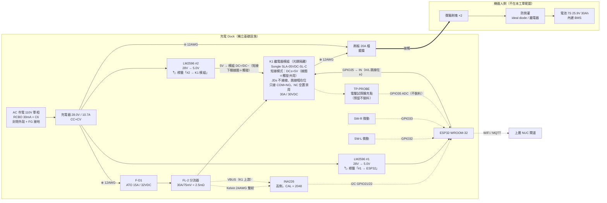
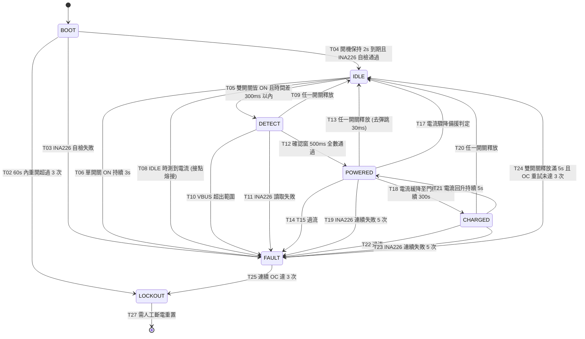

# 充電 Dock 控制電路設計（接觸式刷板方案）

> 版本：v1.2（設計定案，未施工）
> 最後更新：2026-08-11
> 🔴 **2026-08-11 AC 側定案**：dock 插座為 **110V 單相**（先前全文以 220V 為前提）。
> AC 保護由「2A 慢熔」改為 **RCBO 30mA + C 曲線 C6**（110V 下滿載 AC 約 3A，2A 會熔斷）。
> 影響 **§0.2 裁決 6、§2.1 方塊圖、§3.7、§8.3、§11.1 D20、§11.4、§16**。**DC 側完全不受影響。**
> 🔄 **v1.2 變更**：K1 模組改買**同一款的 5V 版**（Songle **SLA-05VDC-SL-C**），**保留短接模式**（DC/JD 兩顆跳線帽**在位不拆**），
> **LM2596 #2 由 28V→24V 改為 28V→5.0V**，專供模組 `DC+/DC−`（短接下同時餵線圈與觸發端）。GPIO25 直連 `IN`，`H/L` 跳線仍設 **H**。
> 功率側（COM ← 分流器後 28V、NO → 刷板、NC 空置禁用）**完全不變**。詳見 **§15 決策記錄 15（§15.3）**。
> 🔄 **v1.1 變更（沿革）**：主繼電器 K1 改用 icshop 光耦繼電器模組，取代 v1 的裸繼電器 + 自焊驅動電路（決策 13，仍有效）；
> 決策 14 的「24V 版 + 分離供電」已**由決策 15 推翻**，原文保留於 §15.2 供追溯。
> **§3.10 到貨驗收清單（A-1 ~ A-4）** 仍為安裝前置條件，其中 **A-1 為 §8 fail-safe 論證的前置條件**。
> 電氣脈絡依據：`docs/power_design.md` §2（電壓基準）、§5（線徑與保險絲）、§15（充電拓樸沿革）
> INA226 使用經驗沿用：`firmware/pico_sensor_hub/src/ina226.{c,h}`

---

## 0. 本文件的定位與邊界

充電機構已定案改為**接觸式刷板**（棄無線感應耦合）：車底裝彈簧刷塊、dock 裝刷板。
`docs/power_design.md` §15 記述的是先前的無線方案，**該節未同步改寫，本文件為接觸式方案的權威來源**；
兩者衝突時以本文件為準。§2（電壓基準）、§5（線徑與保險絲）、§10.2（配線與端子）仍然有效並被本設計沿用。

### 0.1 Dock 是什麼、不是什麼

| | |
|---|---|
| **是** | 獨立的地面基礎設施，自帶 **AC 市電（110V 單相，已定案）**、自帶 28.0V 充電器、自帶 ESP32 控制器 |
| **不是** | ROS 節點。dock **不接 Jetson、不進 ROS**，沒有任何有線通道連到機器人 |
| **通訊** | 只有 WiFi，且只回報狀態給上層 NUC 閘道（見 §10）。dock 端用無線**不違反**「Jetson 永不碰無線」的架構約束——那條約束的標的是 Jetson，dock 是另一台機器 |
| **不做的事** | **不做電量判斷**。22.4V 警告 / 21.7V 停機門檻歸 ROS 層（`power_design.md` §2），與 dock 無關。dock 只知道「有沒有電流在流」，不知道也不需要知道電池剩幾 % |

### 0.2 已拍板的 v1 裁決（不重新辯論）

| # | 裁決 | 本文件的落實位置 |
|---|---|---|
| 1 | 上電邏輯 = 微動開關 ×2（左右各一，同時觸發）→ ESP32 → 主繼電器閉合。**不做電壓試探**，但保留擴充點（不裝料） | §3.4、§6、§11 #P1–P4 |
| 2 | 主繼電器必須用**常開（NO）接點**，fail-safe 靠電路結構 | §3.3、**§3.10（A-1 前置驗收）**、§8 |
| 3 | INA226 電流監測保留（ESP32 I2C）：軟體過流切斷、電流驟降判離開、浮充水位判充飽 | §3.5、§6 |
| 4 | 硬體保險絲為最後防線 | §3.2 |
| 5 | 車端防倒灌不在本工單範圍，但需寫明 dock 對車端的假設 | §9 |
| 6 | 🔴 **dock 插座為 110V 單相**（**不是 220V**）。AC 側保護改用 **RCBO 30mA + C 曲線 C6**，**取代**原本以 220V 為前提的機內 2A 慢熔 | §3.7、§11.1 D20 |

---

## 1. 電氣脈絡（來自 `power_design.md` §2，唯讀引用）

| 項目 | 值 | 出處 |
|---|---|---|
| 電池 | 7S 18650 Li-ion，25.9V 標稱 / 30Ah（777Wh），內建 BMS | §2 |
| **充電上限** | **28.0V（4.0V/cell）** | §2 |
| 🔴 充電器款式 | **必須是 28.0V 款。市售 7S「29.4V」充電器禁用**——驅動器規格上限 28V | §2 |
| 充電電流目標 | 0.2–0.3C ≈ **6–9A** | 本工單 |
| 充電器實際上限 | **10.7A**（Mean Well HLG-320H-30A 額定） | §10.1 #15 |

> **28.0V ＝ 4.0V/cell 這件事在 §6.4 有第二個用途**：它讓 CHARGED 狀態可以安全地保持繼電器閉合。
> 4.0V/cell 的長期浮充對 Li-ion 遠比 4.2V/cell 溫和，這是 dock 不需要「充飽後主動斷電」的依據。

---

## 2. 系統方塊圖

### 2.1 拓樸



### 2.2 ASCII 功率路徑（箭頭 ＝ 功率流方向：充電器 → 電池）

```
                     ┌──[LM2596 #1]────► 5.0V ──► ESP32 (VIN) 【只供 ESP32】
                     │     5.0V          🏷️ 輸出端子貼標「#1 → ESP32」
                     │
                     │                 ┌────── K1 繼電器模組（短接模式）──────┐
                     │                 │ DC+ ●◄─── 5.0V（#2 專供）            │
                     ├──[LM2596 #2]───►│ DC− ● ──► ⊖ 端子台（星點，直接回）   │
                     │     5.0V        │ IN  ●◄─── GPIO25（3.3V HIGH = 吸合） │
                     │  🏷️「#2 → K1」  │ H/L 跳線 ＝【H】高電平觸發           │
                     │                 │ 🔵 DC/JD 兩顆短接跳線帽【在位不拆】  │
                     │                 │ JD+ ○ JD− ○ ── 不接線（跳線帽已餵）  │
                     │                 │ IN ─[R_lim]─▶|─ 光耦 LED             │
                     │                 │ ═══════ 光耦（IN ↔ 輸出級）═══════   │
                     │                 │ [板載驅動級 + 飛輪二極體] → 線圈 5V  │
                     │                 │ 輸出端子台：COM ─ NO ─ (NC 空置禁用) │
                     │                 └──────────┬──────────┬──────────────┘
                     │                          COM         NO
充電器 ⊕ ──[12AWG]──┴─[F-D1 15A]──[FL-2 分流器]──┘          └──[12AWG]──► 刷板 ⊕
                                       │                          │
                                  Kelvin 24AWG                ○ TP-PROBE
                                  雙絞 + VBUS                 （預留不裝料）
                                       ▼
                                   INA226 ──I2C──► ESP32

充電器 ⊖ ══[12AWG]══► ⊖ 端子台（dock 單點接地）══[12AWG]══► 刷板 ⊖
                            │
                            ├── INA226 GND
                            ├── ESP32 GND
                            ├── LM2596 #1/#2 OUT−（兩顆皆共地款）
                            ├── 繼電器模組 DC−（🔴 線圈回流 ~200–380mA，**直接回星點**，不經 ESP32 GND）
                            └── 微動開關 ×2 的回線

  ⚠️ 只使用 **COM + NO**：光耦無電流 ⇒ 線圈失電 ⇒ COM–NO 開路 ⇒ 刷板無電。fail-safe 依據見 §8。
  ⚠️ **兩顆 buck 輸出同為 5.0V ⇒ 端子必須貼標籤區分**（#1=ESP32、#2=K1 模組），**每顆各一條出線**。
     🟢 兩顆對調無後果（同型號可互換）。🔴 **要防的是兩個負載被接到同一顆、或兩顆 OUT+ 被併接**
     ——那等於回到共用一顆，分軌保護當場失效（§3.6）。
  ⚠️ 短接模式下 `DC±` 同時是線圈供電與觸發端供電；光耦仍夾在 **IN 與輸出級之間**，
     fail-safe 第 3 層（IN 無驅動 ⇒ LED 無電流）不受影響（§8.1）。
  ⚠️ 本體為 -C（SPDT），**NC 端子一律空置並貼「禁用」標籤**（§3.3）。
  ⚠️ AC 側 FG（保護接地）接金屬外殼，**不得與 DC ⊖ 相連**（§3.7）。
```

### 2.3 為什麼分流器放在 K1 **上游**

這是一個有後果的接線決策，不是隨手擺的：

| 放上游（本設計） | 放下游 |
|---|---|
| K1 斷開時 INA226 的 VBUS 仍讀得到**充電器輸出電壓**，DETECT 階段可先確認「充電器有電」再決定是否閉合（§6.3） | K1 斷開時 VBUS 讀 0，無從自檢 |
| VBUS 量的**永遠是 dock 自己的充電器**，任何情況下都量不到車端電池電壓——**結構上就做不到電量判斷**，與裁決 3 一致 | K1 閉合時 VBUS ≈ 車端電池電壓，等於偷偷具備了電量判斷能力，與裁決衝突 |
| F-D1 在分流器上游，保險絲的保護範圍涵蓋分流器那段配線（沿用 `power_design.md` §15.2 對 F1 位置的同一理由） | 分流器落在保險絲下游更遠處，保護鏈較長 |

> **DETECT 階段讀 VBUS ≠ 電壓試探。** 電壓試探指的是「先以小電流探測**車端電池**的電壓」，
> 本設計讀的是 **dock 自己充電器的輸出**，兩者標的不同。禁區針對的是前者，本設計沒有做。

---

## 3. 電路設計

### 3.1 功率路徑與元件序

```
充電器 ⊕ → F-D1(15A ATO) → FL-2 分流器 → K1(COM→NO) → 刷板 ⊕ → [接觸] → 車端刷塊 → 車端防倒灌 → 電池 ⊕
充電器 ⊖ → ⊖ 端子台 → 刷板 ⊖ → [接觸] → 車端刷塊 → 電池 ⊖
```

### 3.2 保護階梯（判準：每一層都要低於下一層）

| 層級 | 動作點 | 反應時間 | 由誰執行 |
|---|---|---|---|
| 正常充電 | 6–10.7A | — | 充電器 CC 限流 |
| 軟體警告 | **11.5A** 持續 3s | 3s | ESP32（僅記事件 + MQTT 告警，**不斷電**） |
| 軟體切斷（慢） | **12.0A** 持續 500ms | 0.5s | ESP32 → K1 斷開 → FAULT_OC |
| 軟體切斷（快） | **14.0A** 持續 100ms | 0.1s | ESP32 → K1 斷開 → FAULT_OC |
| **硬體最後防線** | **F-D1 = ATO 15A / 32VDC 快熔** | 20A 下數秒 | 保險絲（與韌體無關） |
| 元件額定天花板 | 刷板 **20A** 檔、K1 **30A/30VDC** | — | — |

**階梯成立的驗算：**

| 檢查 | 數值 | 結果 |
|---|---|---|
| 軟體切斷 12A vs 充電器上限 10.7A | 1.12 倍 | 正常充電不誤跳 ✅ |
| F-D1 15A vs 軟體切斷 12A | 1.25 倍 | 軟體先動作，保險絲是備援 ✅ |
| F-D1 15A vs 充電器 10.7A | 1.40 倍 | CC 滿載連續運轉不熔斷 ✅ |
| 刷板 20A vs F-D1 15A | 1.33 倍 | **保險絲低於刷板額定，層級正確** ✅ |
| K1 30A/30VDC vs 10.7A | 負載率 **36%** | 降額充足，抑制接點熔接 ✅ |

> **刷板 20A 仍是最低的元件額定天花板**（K1 改模組後升到 30A）。保險絲 15A < 刷板 20A 的層級關係不變，
> 「20A 刷板 + 15A 保險絲」的夾擠論證完全不受本次變更影響。

> 🔴 **刷板必須選 20A 檔，不能選 15A 檔。**
> 若選 15A 刷板，保險絲就得降到 10A 才能維持「保險絲 < 刷板額定」的層級，
> 而 10A 已低於充電器 CC 上限 10.7A，**滿載充電會誤熔斷**。
> 兩個方向都被夾死，20A 刷板 + 15A 保險絲是唯一可行組合。

> **ATO 刀片保險絲的 32VDC 額定是真 DC 額定**（SAE J1284 / ISO 8820-3 本來就是汽車 DC 應用），
> 28V 在範圍內，且與 `power_design.md` §10.1 #2 車上的 F1 同族料件，備品可共用。

### 3.3 主繼電器 K1 選型

**選定：icshop「30A 5V/12V/24V 繼電器模組-帶光耦」的 5V 版（現成模組，非裸繼電器）**

- 商品連結：<https://www.icshop.com.tw/products/368030501112>，NT$79/片
- 🔴 **下單時線圈電壓務必選 `5V`**（同一頁面有 5V/12V/24V 三個選項，價格相同）
- 板上繼電器本體：**Songle SLA-05VDC-SL-C**（本體印字 **30A 250VAC / 30VDC**，與 24V 版同款接點）
- 板上另有：光耦（IN 與輸出級電氣隔離）、板載驅動級與飛輪二極體、輸出螺絲端子台（標「常閉／公共／常開」），
  以及**兩組功能完全不同的跳線**——`DC/JD` 的**短接帽 ×2（本設計維持在位）**、
  `H/L` 的**觸發極性跳線 ×1（本設計設 `H`）**（詳見 §3.4）

| 項目 | 數值 | 本設計用量 | 餘裕 |
|---|---|---|---|
| **接點額定（DC）** | **30A / 30VDC**（本體印字直接可讀，見 A-3） | 10.7A @ 28.0V | **36% 負載率** ✅ |
| 接點型式 | **SPDT / 1 form C**（-C 尾碼）。**本設計只接 COM + NO** | 需 NO | 符合裁決 2 ✅（做法見下） |
| 接點材質 | 銀合金（AgCdO / AgSnO₂ / AgNi） | — | — |
| 線圈電壓 | **5VDC** | 5.0V（LM2596 #2 → **DC+**，短接下經跳線帽餵到 JD+） | — |
| **DC± 總耗流**（短接模式：線圈 + 板載驅動級 + 指示 LED） | 線圈 **~200–380mA**（SLA 線圈功率固定 ~1–1.9W，電壓低則電流大）＋ 指示/電源 LED ~10–20mA ⇒ **估 ~210–400mA 穩態**；吸合突入 ~2× | ~400mA（取上限） | LM2596 #2 額定 3A ⇒ ~**7.5×**（實務 2A ⇒ **5×**），見 §3.6 |
| `JD+` / `JD−` | **不接線**（短接跳線帽已把 JD± 併到 DC±） | — | — |
| 輸入介面 | 光耦隔離；觸發電流 **2–4mA**、高電平門檻 **2.5–5V**（🟢 **5V 版原生數據，不是推定**） | GPIO25 3.3V 直推 | 門檻裕度 0.8V，I_F 落在規格帶下緣，見 §3.4.4 與 A-2 |

🔴 **選型依據仍是 DC 額定，不是 AC 額定。** DC 電弧沒有 AC 的電流過零點可以自然熄弧，
比 AC 難斷得多，**拿 250VAC 那一欄來充數是錯的**。本模組的繼電器本體印字同時標了
**30A 250VAC 與 30A 30VDC**，後者與本應用 28.0V 母線精確對應，這是選它的唯一理由。
本體印字即為 DC 額定的確認來源（驗收項 **A-3**），不需另外索取 datasheet。

**🔴 為什麼 -C（SPDT）在模組版是可接受的**

原設計（裸繼電器）明訂「不可買 -C」，理由是 NC 接點在焊接式安裝下容易被誤接、
且無法從外觀確認接了哪一支。**這條禁令對裸買仍然有效**；模組版則因為兩個條件而例外：

1. 模組把三個接點拉到**有絲印標示的螺絲端子台**（「常閉／公共／常開」），接錯不是「不小心焊到旁邊那腳」的層級，是要刻意鎖進標錯的孔位
2. 本設計以**標示防呆**取代型號防呆：**NC 端子一律空置，並在端子台旁貼永久標籤「NC 禁用 — 空置」**

⇒ 施工紀律：**只鎖 COM 與 NO 兩個端子，NC 端子不接任何線材、不做備用預留。**
NC 一旦接線，線圈失電時刷板側就會被接到別的節點，§8 的 fail-safe 論證直接失效。

**❌ 為什麼不用 SSR（固態繼電器）**
SSR-40DD 之類的 MOSFET 型固態繼電器有明確的 DC 額定（如 40A/3–32VDC）且無電弧，看似更好，
但**半導體的典型失效模式是短路（fail-short）**：SSR 燒毀後刷板會**持續帶電**，
與裁決 2 要求的 fail-safe 方向**完全相反**。機械接點燒毀的主要失效模式是接點熔接（見 §8.3），
機率低於半導體過壓/過溫短路，且可被 §6 的自檢部分涵蓋。

**🔴 K1 模組的施工要求（功率路徑走端子台，不經洞洞板）**

改用模組後，功率路徑**完全不再經過洞洞板銅箔或焊接針腳**——這是本次變更最大的施工收益：

1. **COM 與 NO 各以螺絲端子台鎖線**，優先直接鎖 12 AWG；若模組端子容線量不足（常見上限 2.5mm² ＝ 14 AWG），
   改以 **14 AWG 短跳線（≤10cm）**轉接到 ⊕ 端子台，兩端皆用針型端子壓接
2. **NC 端子空置 + 貼「NC 禁用 — 空置」標籤**（見上）
3. 端子螺絲鎖固後以扭力手感確認，並在線材離模組 3cm 內以束帶固定到底板
4. 低壓側共**三條線**：**DC+ / DC− / IN**（`JD±` 不接）。
   🔴 **DC+ 與 DC− 必須用 22 AWG，不可用杜邦線**——短接模式下這兩條承載**全部線圈電流 ~200–380mA 加吸合突入**，
   杜邦線的線徑與壓接品質都不適合持續此電流；只有 **IN（2–4mA）**可用杜邦線
5. 🔴 **DC− 直接回 ⊖ 端子台（星點），不要串經 ESP32 GND**——線圈電流不是訊號級小電流，
   讓它流過 ESP32 的地線會在訊號地上抬出吸放脈衝（§3.7）
6. 🔴 **接線前確認 DC/JD 兩顆短接跳線帽仍在位**（A-4）。本設計線圈與觸發端同為 5V 域，
   跳線帽在位是**正確狀態**，拆掉反而會讓線圈完全沒有供電（JD± 未接線 ⇒ K1 永不吸合）
7. 模組建議以螺柱獨立固定，與 ESP32 主板分開，避免功率線橫越訊號區

> 14 AWG 安全載流 15–20A（`power_design.md` §5.1），對 10.7A 有餘裕；
> 長距離段（端子台 ↔ 充電器 ↔ 刷板）一律 12 AWG。
> 原設計「16 AWG 焊在 PCB 針腳上 + 3cm 內束帶」的做法**已不適用**，
> 僅在 §15 決策記錄的 fallback 條目下保留。

**替代方案（fallback，模組買不到或 A-1/A-2 驗收失敗時）**：
回到裸繼電器 ＋ 自焊驅動電路（Q1 2N2222A / R1 1kΩ / R2 10kΩ / D1 1N4007），
完整方案保留在 §15 決策記錄 #3。採用 fallback 時，§8 的 fail-safe 論證要換回「R2 基極下拉」版本。

> 🔴 **v1.2 註記：LM2596 #2 現在調在 5.0V，走此 fallback 有兩條路，偏好 (b)。**
>
> | 路 | 做法 | 代價 |
> |---|---|---|
> | **(a)** | 買 **SLA-05VDC-SL-A**，#2 維持 5.0V | 線圈 ~200–380mA 全流過 Q1。🔴 **決策 3 的 R1 = 1kΩ 不夠**：Ib = 2.6mA，在 Ic ≈ 300mA 時 hFE 已掉到 ~40 ⇒ Ic 上限僅 ~100mA，**推不動線圈**。R1 須改 **220Ω**（Ib ≈ 11.8mA，GPIO 負擔合法）並複算飽和 |
> | **(b) 偏好** | 買 **SLA-24VDC-SL-A**，**把 #2 的 VR 重調回 24.0V** | 線圈 ~38mA，決策 3 的 Q1/R1/R2/D1 元件值**完全沿用不必重算**；代價只是轉一次 VR（程序同 §3.6） |
>
> 選 (b) 的理由：fallback 的價值在於「論證與元件值都是現成的、不必重新驗算」，
> 為了省一次調壓而去改 R1 並重新驗算飽和，是把退路弄得比主方案還不確定，方向錯了。

### 3.4 繼電器模組介面（**短接模式**，5V 版）

**自焊驅動電路（Q1 / R1 / R2 / D1）已全部由模組內建取代**，本節只描述介面接線與跳線設定。

#### 3.4.1 板上兩組跳線的正確功能（🔴 兩組完全不同，不要混為一談）

商品頁原文為準，逐條照錄：

| 跳線 | 功能 | 商品頁原文 | 本設計 |
|---|---|---|---|
| **`DC+/JD+` 與 `DC−/JD−`**（兩顆跳線帽） | **分離供電跳線**。短接 ⇒ 觸發端與線圈端同電壓；拆除 ⇒ 兩級各自獨立供電 | 「DC+ 和 JD+ 用跳線帽短接，DC− 和 JD− 用跳線帽短接，觸發端與繼電器控制端電壓相同」；拆開則「可做到前後兩級不同電壓完全隔離（如繼電器用 24V，觸發用 5V）」 | 🔵 **短接（在位不拆）** |
| **`H/L`**（一顆跳線帽） | **觸發極性切換**，與供電無關 | 「跳線與 L 端連接時，IN 端為低電平觸發；與 H 端連接時為高電平觸發」 | 🔴 **設 `H`（高電平觸發）** |

> ⚠️ **本文件 v1.1 早期版本把「JD 跳線」寫成高/低電平觸發切換，是錯的**，已全文更正。
> 更正依據與誤解成因記在 §15 決策記錄 **14**（該決策本身已由決策 **15** 推翻，但這條原理更正仍然有效）。

#### 3.4.2 為什麼主方案用短接模式（5V 版）

**線圈與觸發端同為 5V 域，短接模式下兩者共用 `DC±` 這一組供電，恰好就是本設計要的東西。**

| 檢查 | 短接模式（本設計，5V 版） |
|---|---|
| 觸發端電位 | **5.0V**（DC+ 直接就是 5V）⇒ 板上限流電阻本來就是按 5V 選的 |
| 3.3V 直推是否合法 | ✅ 對「高電平 2.5–5V」門檻合法，裕度 0.8V（§3.4.4） |
| 線圈供電 | 經跳線帽從 DC+ 餵到 JD+，`JD±` **不需接線** |
| 跨壓域短路風險 | **不存在**——兩顆 buck 同為 5.0V，跳線帽兩側同電位 |
| 接線點 | **5 個**（DC+ / DC− / IN / COM / NO），比 v1.1 的 7 點少 2 個 |

⇒ **施工紀律：兩顆 DC/JD 短接跳線帽維持在位（A-4 確認**在位**，不是確認拆除）。**
🔴 **反向誤動作才是這一版要防的**：若有人「照 v1.1 的舊做法」把跳線帽拆掉，
`JD±` 又沒接線 ⇒ **線圈完全沒有供電 ⇒ K1 永不吸合**。這是功能失效，方向上是安全的
（刷板不會帶電），但會變成一個難查的「怎麼都不吸合」故障。

> 📌 **v1.1 曾採用「24V 版 + 分離供電」，已於 v1.2 推翻。** 那是「買 24V 版」前提下的**正確**解：
> 24V 版短接時觸發端會變成 24V，3.3V 直推灌不進 2–4mA，非拆帽不可。改買 5V 版後前提消失。
> **分離供電只在買 12V/24V 版時才需要**；完整脈絡與推翻理由見 **§15.3**。

#### 3.4.3 接線與設定

```
   +5.0V  (LM2596 #2 OUT+，🏷️「#2 → K1 模組」) ──► ● DC+ ┐
   ⊖ 端子台 (dock 星點，🔴 不經 ESP32 GND) ─────► ● DC− │ 5V 域（線圈＋觸發共用）
   ESP32 GPIO25 ────────────────────────────────► ● IN  │  IN ─[R_lim]─▶|─ 光耦 LED
                                                        │
   H/L 跳線 ＝ 【H】高電平觸發 ─────────────────────────┘
   🔵 DC+/JD+、DC−/JD− 兩顆短接跳線帽 ── 【在位不拆】
   ○ JD+ / ○ JD− ── 不接線（由跳線帽從 DC± 餵入）
                            ═══ 光耦（IN ↔ 輸出級）═══
                              板載驅動級 ─► 線圈 5V
                              線圈兩端已並聯板載飛輪二極體

   輸出端子台：  ○ 常閉 NC ── 空置，貼「NC 禁用」標籤
                 ● 公共 COM ── 接 FL-2 分流器下游（⊕ 端子台第二位）
                 ● 常開 NO  ── 接 ⊕ 端子台第三位 → 刷板 ⊕
```

**模組共 5 個接線點**：低壓側 3 條（DC+ / DC− / IN）＋ 功率側 2 條（COM / NO），
**NC 空置、JD± 不接**。

| 介面 | 接到 | 說明 |
|---|---|---|
| **DC+** | LM2596 **#2** OUT+（**5.0V**，🏷️ 專供 K1 模組） | 短接模式下**同時**供線圈側與觸發側，**~210–400mA 穩態**（含吸合突入 ~2×）。🔴 22 AWG，不可用杜邦線 |
| **DC−** | **⊖ 端子台（dock 星點）** | 🔴 **直接回星點，不經 ESP32 GND**——這條承載全部線圈電流（§3.7） |
| **IN** | ESP32 **GPIO25** | 高電平觸發：HIGH = 吸合，LOW/開路 = 釋放。2–4mA，可用杜邦線 |
| **JD+ / JD−** | **不接** | 短接跳線帽已把 JD± 併到 DC±。接了不會壞，但屬多餘接線，施工時不接 |
| **`H/L` 跳線** | — | 🔴 **必須設在 `H`（高電平觸發）位**（驗收項 **A-4**）。設成 `L` 會讓 §8 的 fail-safe 方向反轉 |
| **`DC/JD` 短接跳線帽 ×2** | — | 🔵 **必須在位**（驗收項 **A-4**）。拆掉會讓線圈失去供電，見 §3.4.2 |
| **COM / NO** | 功率路徑 | 見 §3.3 施工要求與 §4.1 |
| **NC** | **不接** | 🔴 空置並貼標籤 |

#### 3.4.4 觸發端裕度分析（決定 A-2 為什麼仍然必測）

**規格（商品頁 **5V 版**觸發端數據，🟢 本設計買的就是 5V 版 ⇒ 這是本尊數據，不是推定）**：
觸發電流 **2–4mA**、高電平觸發 **2.5–5V**、低電平 **0–1.5V**。

| 檢查 | 數值 | 結果 |
|---|---|---|
| ESP32 GPIO 高電平輸出 vs 高電平門檻下限 | 3.3V vs 2.5V | 合法，但**裕度只有 0.8V** ⚠️ |
| GPIO 壓降後的實際電位 | 3.3V 輸出在數 mA 負載下典型掉 0.1–0.2V ⇒ ~3.1–3.2V | 仍在門檻上，但裕度再縮到 ~0.6–0.7V ⚠️ |
| 電流能力 | 需 2–4mA；ESP32 單腳最大 40mA（建議 ≤20mA） | 綽綽有餘 ✅ |
| **I_F 推算**（🔴 這是本節的核心數字） | 規格上限 4mA @ 5V、光耦 V_F ≈ 1.2V ⇒ **R_lim ≈ (5 − 1.2)/4mA ≈ 950Ω ≈ 1kΩ**。<br/>3.3V 直推 ⇒ **I_F ≈ (3.3 − 1.2)/1kΩ ≈ 2.1mA** | **恰好落在規格帶（2–4mA）的下緣**，餘裕僅 ~5% ⚠️ |
| 低溫／元件離散／LM2596 #2 的 5V 誤差 | 疊加可能吃掉 0.3–0.5V ⇒ I_F 掉到 ~1.7–1.8mA | **這就是 A-2 要逼出來的邊緣行為** |

**🔴 為什麼原生 5V 域仍然要測 A-2：不確定性下降，但沒有歸零。**

| # | 收斂狀況 | 說明 |
|---|---|---|
| 1 | 🟢 **「觸發端規格是否適用」不再是問題** | v1.1 的推定 1（24V 版能否套用 5V 版數據）**隨改買 5V 版而消滅**，R-11 一併消滅（§14） |
| 2 | ⚠️ **I_F 落在規格帶下緣仍是實測問題** | 上表的 R_lim ≈ 1kΩ 是**由規格上限反推**的，實際板子可能用 680Ω（I_F 更大，更好）或 1.5kΩ（I_F ≈ 1.4mA，**低於規格下限**）。這只有量得到，算不出來 |
| 3 | ⚠️ **LED 電流路徑的拓樸仍是推定** | 推定為「IN → R_lim → 光耦 LED → DC−」（`H` 模式由 IN 灌入）。若實際是「DC+ 經內部電阻供 LED、IN 只當開關」，則 3.3V 的高低只需跨過門檻、電流由 5V 決定 ⇒ **裕度反而更好**。兩種拓樸都不改變 A-2 的做法，只改變解讀 |

⇒ **A-2 步驟⑤ 串電流表量 IN 端灌入電流**，就是同時回答第 2、3 點。
**A-2 仍是安裝前置條件，不是選配**——差別在於 v1.1 時 A-2 是「賭它過不過」，
v1.2 是「已知它應該會過，去確認邊緣裕度」。

**GPIO25 的選腳理由**（不變）：非 strapping pin（ESP32 的 strapping 為 GPIO0/2/4/5/12/15），
開機過程不會被 bootloader 拉高；也非 flash 專用腳（GPIO6–11）。

**釋放時間**：模組的板載飛輪二極體同樣會延長釋放時間（SLA 典型釋放 ~5ms ⇒ 最壞 ~25ms）。
這對本設計無影響：韌體輪詢週期是 100ms（§6.2 `T_poll`），25ms 遠在其下。
§7.2 的 155ms 總斷電時間預算沿用此值，**不因改模組而變動**。

### 3.5 電流量測（INA226，高側）

沿用 `firmware/pico_sensor_hub/src/ina226.h` 的全套常數，**韌體常數不需重算**：

| 參數 | 值 | 說明 |
|---|---|---|
| 分流器 | **FL-2 30A / 75mV ＝ 2.5mΩ** | 與車上 `power_design.md` §10.1a W4 **同一款**，料件與備品共用 |
| `CAL` | **2048** | 0.00512 / (0.001 × 0.0025)，與 `ina226.h:37` 完全一致 |
| Current_LSB | 1 mA | 同 `ina226.h:38` |
| Power_LSB | 25 mW | 同 `ina226.h:39` |
| 量測上限 | ±32.768 A | 81.92mV / 2.5mΩ |
| `CONFIG` | **0x4527**（16 次平均、VBUSCT/VSHCT 各 1.1ms、連續模式） | 同 `ina226.c:20`，轉換時間 35.2ms < T_poll 100ms ✅ |

**滿刻度使用率驗算：**

| 檢查 | 數值 | 結果 |
|---|---|---|
| 10.7A 時分流器壓降 | 10.7 × 2.5mΩ = **26.8mV** | 滿刻度 81.92mV 的 **33%** ✅ |
| 分流器功耗 | 10.7² × 0.0025 = **0.29W** | FL-2 為 30A 額定，遠低於其耗散能力 ✅ |
| 解析度 | 1 mA | 對 0.3A 充飽門檻 ＝ 300 階，綽綽有餘 ✅ |

**🔴 高側接法的三個必要條件：**

1. **`R100` 必須拆除**。INA226 模組板自帶的 0.1Ω 取樣電阻只能量到 0.8A，
   接上 10.7A 會直接燒毀。與 `power_design.md` §15.2、`ina226.h:19` 是同一條紀律
2. **共模電壓檢查**：IN+/IN− 都掛在 28V 上。INA226 共模輸入範圍 **0–36V**，
   VBUS 上限亦為 36V ⇒ 28V 合法 ✅。**這就是 INA226 能做高側量測的原因**，不需外加隔離
3. **Kelvin 接法**：大螺栓走電流，**兩個小螺絲以 24 AWG 雙絞細線取樣**。
   從大螺栓搭訊號會把螺栓接觸電阻一起算進去，讀值會飄（同 `power_design.md` §15.2）

**電流方向約定（🔴 與車上相反，不要抄錯）：**

| | dock 側（本文件） | 車上（`power_design.md` §16 E 區） |
|---|---|---|
| 觀察點 | 充電器看出去 | 電池看出去 |
| IN+ 接 | 分流器**靠充電器**那端 | — |
| IN− 接 | 分流器**靠 K1** 那端 | — |
| 充電進行中 | `CURRENT` 讀值為**正** | 讀值為**負** |

**VBUS 接點**：接分流器的 **IN− 端（＝ K1 上游）**，理由見 §2.3。

**ALERT 腳**：接 **GPIO34**。GPIO34 是**僅輸入腳且無內部上拉**，
而 INA226 的 ALERT 是 open-drain active-low ⇒ **必須外加 10kΩ 上拉到 3V3**，否則永遠讀到浮空。
v1 韌體沿用 `ina226.c:22` 的 CNVR 用法（轉換完成通知），可選；不接也能靠輪詢運作。

### 3.6 ESP32 與線圈供電（**兩顆 buck 同為 5.0V，不同軌**）

**兩顆 buck，各自從 28V 取電，輸出電壓相同但不串接、不並接、不共用負載。**

| | LM2596 #1 | LM2596 #2 |
|---|---|---|
| 輸出 | **5.0V** | **5.0V**（🔄 v1.1 為 24.0V） |
| 🏷️ 端子標籤 | **「#1 → ESP32」** | **「#2 → K1 模組」** |
| 負載 | ESP32-WROOM-32 DevKit（VIN 腳）**單一負載** | K1 繼電器模組 **DC+**（短接模式 ⇒ 線圈 + 板載驅動級 + 指示 LED，全部在這一顆上） |
| 負載電流 | 平均 ~150mA／WiFi TX 峰值 **~500mA** | 線圈 **~200–380mA** + LED ~10–20mA ⇒ 穩態 **~210–400mA**；<br/>吸合突入 ~2× ⇒ 瞬時 **~800mA**（毫秒級） |
| 模組額定 | 3A（實際 2A） | 3A（實際 2A） |
| 餘裕 | **4×**（2A / 500mA） | 穩態 **5×**（2A / 400mA）；含吸合突入 **~2.5×**（2A / 800mA）。以 3A 額定驗算則為 7.5× / 3.75× ✅ |
| 廢熱 | 28→5V 效率約 70% ⇒ 峰值 ~1.1W、平均 ~0.36W ⇒ **建議加小散熱片** | 28→5V 同效率 ⇒ 穩態耗散 **~0.45–0.86W** ⇒ 🔄 **v1.2 起同樣建議加小散熱片**（v1.1 的 28→24V 幾乎不發熱，該結論已不適用） |

> 🔴 **線圈電流是待實測收斂項。** SLA 系列的線圈**功率**大致固定（~1–1.9W），電壓愈低電流愈大：
> 5V 版線圈電阻約 13–25Ω ⇒ **200–380mA**。這個區間是由功率反推的，
> **到貨後以電表量線圈電阻、並在 A-2 步驟⑤ 實測 DC+ 耗流收斂**（V-2 ③）。
> 即使取最壞的 380mA 加 2× 突入，對 3A 額定仍有 3.75× 餘裕 ⇒ **選型結論不受實測結果影響**，
> 實測的用途是建立排錯基準線與確認散熱需求。

**🔴 為什麼是兩顆而不是共用一顆（論證版本：「同壓不同軌」）：**
K1 線圈吸合瞬間是電感性負載，湧浪約為穩態的 2 倍並帶陡峭 di/dt。
若與 ESP32 共用電源軌，這個擾動會在軌上造成壓降尖峰，把 ESP32 推到 brown-out 邊緣 → **重開機**。
而重開機會斷開 K1（§8）→ 再次吸合 → 再次擾動 → **振盪**。

> **改成兩顆同為 5V 之後，這個理由一字不改仍然成立。**
> 關鍵從來不是「兩軌電壓不同」，而是**兩軌各自有獨立的回授迴路與輸出電容，只在 28V 母線上匯流**——
> 而 28V 母線是低阻抗、由充電器穩壓的，擾動傳不過去。
> **線圈湧浪造成的壓降只出現在 #2 的輸出上，而 #2 的唯一負載是 K1 模組本身**；
> ESP32 掛在 #1，看不到這個擾動。§3.6 的 brown-out 振盪論證因此**完全保留**。
>
> 🔴 **也正因為如此，兩顆 OUT+ 絕對不可以「反正都是 5V」就併在一起。** 併接的後果有二：
> ① 兩顆獨立回授迴路並聯，電壓稍高的那顆會被另一顆倒灌，長期可靠度不明；
> ② **分軌保護當場失效**，brown-out 振盪風險完全回來。

**🔴 兩顆輸出同為 5.0V 帶來的新紀律：端子標籤（必須項）**

| 項目 | 規定 |
|---|---|
| 標籤 | 兩顆 buck 的 **OUT+ 端子旁各貼永久標籤**：**「#1 → ESP32」**、**「#2 → K1 模組」**（料件見 §11.2 D28） |
| 調壓程序 | 🔴 **上電接負載前**先各自單獨調壓：**只接 28V 輸入、輸出端不接任何負載**，以電表量 OUT+ 並轉 VR 調到 **5.00V ±0.05V**，調完**立刻貼標籤**再接線 |
| 🔴 **#2 從 24V 改調 5V 的專用警告** | v1.1 曾把 #2 設定為 **24.0V**。若手上這顆 **#2 已經被調到 24V**（或是照 v1.1 先調好才發現改版），**必須在接上 K1 模組之前把 VR 轉回 5.00V**。<br/>🔴 **24V 灌進 5V 線圈會直接燒線圈**（線圈電阻 13–25Ω ⇒ 24V 下電流 ~1–1.8A、功耗 ~23–44W，遠超 ~1–1.9W 的設計值）。<br/>⇒ **程序**：① 拆掉 WD-23（DC+）② 只接 28V 輸入 ③ 量 OUT+ 並轉 VR 到 5.00V ④ 貼標籤 ⑤ 才接回 WD-23。<br/>⚠️ LM2596 的 VR 是多圈微調電位器，從 24V 轉到 5V 要轉不少圈，**邊轉邊量，不要憑圈數猜** |
| 🟢 **兩顆對調 = 同電位、同型號，完全無後果** | 這是改買 5V 版換來的**紅利，不是風險**：v1.1 的 24V/5V 兩軌一旦接錯，ESP32 會直接吃 24V 而**報廢**；v1.2 兩顆是同型號同輸出的可互換件，「ESP32 接到 #2、模組接到 #1」在電氣上與功能上**都完全等價**，什麼事都不會發生 |
| 🔴 **標籤真正要防的是「兩個負載接到同一顆」** | 這才是同壓帶來的**新誤動作類別**，且遠比對調更可能發生——現場看到兩個都是 5V 的輸出端子，很容易就近抓同一顆把 ESP32 VIN 與模組 DC+ 一起接上去（`WD-28` 與 `WD-23` 同源），**另一顆整顆閒置**。<br/>後果：**回到「共用一顆」的配置 ⇒ 分軌保護當場失效 ⇒ brown-out 振盪風險完全回來**，而且**不會立刻現形**（要等到第一次吸合才出現重開機），現場極難查 |
| ⇒ **上電前檢查（必須做）** | 🔴 量 **#1 OUT+ ↔ #2 OUT+ 為開路**（若量到 ≈0Ω，就是兩顆被併接或兩個負載共用同一顆），並清點：**#1 只有 WD-28 一條出線**、**#2 只有 WD-23 一條出線**。此項併入 **V-3** |

**🔴 兩顆都必須是「輸入輸出共地」的非隔離降壓款**（IN− 與 OUT− 相通）。
INA226 的 GND、ESP32 的 GND、微動開關回線全部掛在 dock ⊖ 上，共地是本設計的前提。
收貨後以三用電表電阻檔量 **IN− ↔ OUT− ≈ 0Ω** 確認（同 `power_design.md` §10.1 #9 的驗收動作）。

**❌ 禁用 mini560 及任何輸入上限 24V 的降壓模組**——母線是 28.0V，會燒。
與 `power_design.md` §10.1 #10 是同一個教訓。LM2596 輸入範圍 4.5–40V，28V 有充足餘裕。

### 3.7 接地與 AC 安全

**dock 內部單點接地**：⊖ 端子台即 dock 的星點，掛載項目：
充電器 ⊖、刷板 ⊖、INA226 GND、ESP32 GND、LM2596 #1/#2 的 OUT−、微動開關回線、
**K1 繼電器模組 DC−**。

> 🔴 **為什麼 DC− 必須直接回星點，不可以像 v1.1 那樣經 ESP32 GND。**
>
> v1.1 讓 DC− 接 ESP32 GND 是有前提的：當時 DC− 只是**觸發側**回線，
> 短接模式下的 DC− 卻是**線圈回線**——電流從 ~20mA 變成 **~200–380mA，還帶吸合/釋放的脈衝**。
>
> | | v1.1（分離供電） | v1.2（短接模式） |
> |---|---|---|
> | DC− 承載 | 觸發側 ~10–20mA 直流 | **線圈 ~200–380mA + 吸放脈衝** |
> | 接法 | DC− → ESP32 GND → 星點 | 🔴 **DC− → 星點（直接）** |
> | 若沿用 v1.1 接法的後果 | — | 幾百 mA 的脈衝電流流過 ESP32 的地線與杜邦接點，在**訊號地**上抬出壓差 ⇒ 干擾 GPIO25 的參考電位、干擾 I2C、極端情況把 ESP32 推到 brown-out——正是 §3.6 要避免的那個振盪 |
>
> ⇒ **DC− 用 22 AWG 直接鎖到 ⊖ 端子台**（WD-24）。ESP32 GND 另有自己回星點的路徑（§4.3 WD-29 + #1 共地）。
> **兩者在星點匯流，而不是串在一起**——這就是「單點接地」的字面意思。

> 📌 **光耦在本設計裡隔離的是「IN 與輸出級」，不是「兩個電源域」。**
> 短接模式下 `DC±` 同時餵線圈與觸發端，兩者本來就同電位，**談不上電壓域分開**。
> 光耦的價值仍然完整保留在**驅動級隔離與 fail-safe 結構**（§8.1 第 3 層）：
> IN 沒有驅動 ⇒ LED 無電流 ⇒ 輸出級不導通 ⇒ 線圈失電。這一層與 DC± 怎麼接無關。
>
> 🔴 **不論哪一種模式，本設計都不是 galvanic isolation**——dock 只有一個 ⊖ 星點。
> v1.1 曾詳述「分離供電 ≠ 電源隔離」，該段脈絡移入 **§15.3**；
> 若哪天真要做兩地隔離，DC− 就不能回星點，那是另一個設計，不在 v1 範圍。

| 項目 | 規定 | 理由 |
|---|---|---|
| **AC 側 FG（保護接地）** | 接**金屬外殼**，🔴 **不得與 DC ⊖ 相連** | 刷板 ⊖ 在充電期間與車體電池 ⊖ 連通；若 DC ⊖ 又接 PE，就替浮空的車體 DC 系統造出一條對地路徑，形成地迴路 |
| **上電前驗證** | 電表電阻檔量 **DC ⊖ ↔ 金屬外殼 ＝ 開路** | 不是開路就表示已有非預期連接，排除後才可上電 |
| 🔴 **AC 供電規格** | **110V 單相（已定案，§0.2 裁決 6）** | AC 側所有保護件的額定都依 110V 計算；**220V 版的數字一律不可沿用**（同樣功率下 110V 的電流是 220V 的兩倍） |
| AC 安全（沿用 `power_design.md` §15.7，**必須項非建議項**） | ① 裝入封閉外殼，AC 端子不得可觸及<br/>② 🔴 **AC 側裝 RCBO 30mA + C 曲線 C6**（漏電＋過流二合一，**取代**原本的機內 2A 慢熔）<br/>③ 金屬外殼接 FG<br/>④ 若仍要保留機內慢熔作為備案，額定寫 **T4A@110V**（T5A 亦可）；🔴 **2A 只適用 220V，110V 下會誤熔斷** | dock 放在地面、有人會經過；漏電保護在地面潮濕環境是必須項，不是建議項 |

> **🔴 為什麼從「2A 慢熔」改成「RCBO 30mA + C6」**（本節數字全部以 110V 為前提）
>
> | 項目 | 值 | 說明 |
> |---|---|---|
> | 充電器滿載 AC 輸入電流 | **~3A @110V** | 同一顆充電器在 220V 下只有一半。**原本的 2A 慢熔是以 220V 算出來的**，直接搬到 110V 會在滿載充電時熔斷 |
> | 慢熔備案額定 | **T4A**（或 T5A） | 3A 滿載 ÷ T4A ＝ 1.33 倍裕度，與 §3.2 DC 側的層級思路一致 |
> | RCBO 漏電動作值 | **30mA** | 人身保護等級；dock 在地面、金屬外殼接 FG，漏電才是這個場景的主風險 |
> | RCBO 曲線與額定 | **C 曲線 / C6** | C6 對 3A 滿載有 2 倍裕度。🔴 **不可選 C2**：C2 的磁脫扣區間（5–10×In ＝ 10–20A）低於充電器冷開機湧浪，會誤跳；C6 的磁脫扣區間是 **30–60A**（10–20×In），湧浪峰值雖落在此區間內仍**不會**誤跳，理由見下兩列 |
> | 冷開機湧浪（官方 SPEC 實值） | **HLG-150H：65A，twidth ＝ 425µs**<br/>**HLG-320H：70A，twidth ＝ 1010µs**<br/><sub>（COLD START @230VAC；twidth 量測於 50% Ipeak；Per NEMA 410）</sub> | 兩款都列，因**充電器型號尚未拍板**（§10.1）。湧浪峰值 ≈ 線電壓峰值 ÷ 輸入級等效阻抗 ⇒ 與電壓近似成正比，**110V 下約減半：~31A（150H）／~33A（320H）**。<br/>（先前文中的「~75A@230V」是估值，已以官方 SPEC 實值取代） |
> | 🔴 **為什麼峰值落在磁脫扣區間也不會跳** | **脈寬 0.4–1.0 ms ≪ 磁脫扣機構動作時間** | 磁脫扣是**電磁機械機構**：線圈吸動銜鐵＋推動解扣連桿需要**數 ms 等級的持續電流**才能完成行程；HLG 的湧浪是單發脈衝，半高寬只有 425µs／1010µs，在銜鐵走完行程前電流早已衰減，機構回落 ⇒ **不脫扣**。同理其 I²t 也遠低於脫扣門檻。<br/>旁證：明緯 SPEC 自己列「16A **C 型**斷路器可掛 2 台 HLG-320H」——若峰值即脫扣，一台都掛不了 |
>
> **湧浪資料來源**：Mean Well 官方 SPEC PDF（`meanwell.com/Upload/PDF/HLG-150H/HLG-150H-SPEC.PDF`、
> `.../HLG-320H/HLG-320H-SPEC.PDF`，INPUT 段 `INRUSH CURRENT (Typ.)` 列）。
> ⚠️ 若現場實測仍在冷開機瞬間跳脫，退路是升到 **C10**（磁脫扣 50–100A）；
> 代價是過流保護變鬆——C10 對 3A 滿載 ＝ **3.3×In**，等於 AC 側幾乎只剩漏電保護在把關，
> 因此**先用 C6，跳了再升**，不要一開始就選 C10。
>
> RCBO 一顆同時提供漏電與過流保護，**功能上涵蓋原本的機內慢熔**，所以是取代而非疊加。
> 保留慢熔備案的唯一理由是「現場只有普通插座、上游沒有可加裝 RCBO 的配電位置」——
> 走這條路時額定務必用 **T4A**，不要照抄舊文件的 2A。

> 充電器輸出（DC 側）與 AC 側本來就是隔離的，DC ⊖ 浮空於 PE 是正常且正確的狀態。

### 3.8 微動開關介面

**每一顆開關的電路（左右各一份，完全相同）：**

```
        3V3
         │
      [Rpu 1kΩ]
         │
GPIO32 ──┼──[Rs 100Ω]──○ SW-L (NO) ○──── GND
         │
      [C 100nF]
         │
        GND
```

| 元件 | 值 | 計算與理由 |
|---|---|---|
| **Rpu**（上拉） | **1 kΩ**（🔴 **不可用 10kΩ**） | 接點閉合時濕電流 = 3.3V / 1.1kΩ = **3.0mA**。一般銀接點的**最小濕電流**約 1mA@5V；低於此值，接點表面氧化膜不會被破壞，長期會接觸不良。10kΩ 上拉只有 0.33mA，**必然出問題** |
| **Rs**（串阻） | **100 Ω** | 與 C 組成 EMI 濾波（τ = 10µs，抑制 1–2m 線束拾取的雜訊）。<br/>🔴 **Rs 必須遠小於 Rpu**：閉合時 GPIO 電位 = 3.3 × 100/1100 = **0.30V**，低於 ESP32 的 V_IL(max) = 0.25 × 3.3 = 0.825V ✅。若 Rs 取 1kΩ，電位會是 1.65V，**讀不到 LOW** |
| **C** | **100 nF** 陶瓷 | 同上。**去彈跳不靠它做**，靠軟體（§6.2 T_debounce） |
| **開關型式** | **NO（常開）**，機械微動開關 | — |
| **接線** | GPIO → 開關 → **GND** | 🔴 **fail-safe 方向**：線斷、接頭鬆脫、開關內部斷路 ⇒ GPIO 被 Rpu 拉到 HIGH ⇒ 讀作「未觸發」⇒ 不會誤判為已入座。反過來接（開關對 3V3）則斷線會讀成觸發，是危險方向 |
| **線材** | **22 AWG 雙絞**，1–2m | 訊號與回線絞合以縮小迴圈面積 |

**接點選型注意**：3.0mA 已高於最小濕電流，一般銀接點可用；
若採購得到**鍍金接點**款（如 Omron D2F-01 系列）更保險，但非必要。

### 3.9 狀態指示 LED

| GPIO | LED | 串阻 | 含義 |
|---|---|---|---|
| **GPIO18** | 綠 | 470Ω | 恆亮 = POWERED／慢閃(1Hz) = CHARGED／滅 = IDLE |
| **GPIO19** | 紅 | 470Ω | 閃爍次數 = FAULT 代碼（§6.6）／恆亮 = LOCKOUT |

選 GPIO18/19 的理由：兩者皆非 strapping pin、非 flash 腳、非僅輸入腳。
**不要用 GPIO2**——它是 strapping pin，雖然 DevKit 板載 LED 接在上面且已處理，但佔用它會干擾燒錄。

### 3.10 🔴 K1 繼電器模組到貨驗收清單（A-1 ~ A-4，**安裝前置條件**）

> **這四項不是選配。** A-1 是 §8 fail-safe 論證的前提，A-2 是驅動可行性的前提，
> A-3/A-4 是選型與設定的確認。**四項全過才准把模組裝進 dock 並接上功率線。**
> 任一項不過 ⇒ 依該項「不過的話」欄處置；**退路一律以退回 §15 決策記錄 #3 的裸繼電器方案為優先**。
>
> **測試環境（🔵 短接模式 + `H` 位，與 dock 上的最終配置完全相同）**：
> 模組單獨在板凳上測，**功率端（COM/NO）完全不接線**，只接 **DC+ / DC− / IN** 三條。
>
> | 項目 | 設定 |
> |---|---|
> | **DC/JD 兩顆短接跳線帽** | 🔵 **維持在位不拆**。A 系列全部在短接模式下執行 |
> | **`H/L` 跳線** | 🔴 **設在 `H`（高電平觸發）** |
> | 供電 | DC+ ← **5V**（LM2596 #2 或任何 5V 電源，**須能供 ≥1A**）、DC− ← 電源 ⊖ |
> | `JD+` / `JD−` | **不接**（跳線帽已從 DC± 餵入） |
> | 判定方式 | **聽繼電器吸合聲 + 三用電表電阻檔量 COM–NO 通斷**雙重確認，不要只看板上指示 LED（LED 亮不代表接點真的吸合） |
>
> 🟢 **v1.2 起板凳測試只需要一顆 5V 電源**（v1.1 的分離供電要同時借 5V 與 24V 兩組，
> 且要把兩組 ⊖ 共接才能複現共地條件）。**測試環境與最終配置一致 ⇒ 測出來的結論可直接外推**，
> 不再有「板凳用某模式、dock 用另一模式」的落差。
>
> ⚠️ 電源選用注意：線圈 ~200–380mA 加吸合突入 ~800mA，**USB 充電頭類的弱電源可能在吸合瞬間掉壓**，
> 造成誤判為「推不動」。板凳電源請確認能供 ≥1A（或直接用 LM2596 #2）。

| # | 項目 | 步驟 | 預期結果 | 不過的話 |
|---|---|---|---|---|
| **A-1** | 🔴 **浮空測試**（fail-safe 前提） | ① 先完成 **A-4**（兩顆短接跳線帽**在位**、`H/L` 在 `H`）<br/>② DC+/DC− 接 **5V**（`JD±` 不接），**IN 端完全懸空**（不接任何線）<br/>③ 上電，靜置 10s，期間用手輕拍模組、以帶電導線在 IN 附近 5cm 掃過（模擬雜訊耦合）<br/>④ 量 COM–NO 電阻 | **K1 不吸合**：無吸合聲、COM–NO 為**開路（∞Ω）**，全程 10s 皆然 | 🔴 **停止安裝。** 表示模組板上有預設拉高電路或跳線設定不符，§8 的結構論證不成立。改測 IN 對 DC− 加 10kΩ 下拉後是否通過；仍不過則退回裸繼電器方案（§15 #3） |
| **A-2** | **3.3V 驅動測試**（短接模式、原生 5V 域） | ① 同上供電<br/>② 以 ESP32 GPIO25（或任何 3.3V 邏輯輸出）接 IN，輸出 HIGH<br/>③ 確認吸合後，**反覆切換 HIGH/LOW 至少 20 次**，每次停留 1s<br/>④ 把 **DC+ 降到 4.75V**（LM2596 誤差下限）重測 5 次<br/>　（🔴 這一步同時壓測兩件事：觸發端 I_F 變小 **與** 線圈電壓降低，5V 繼電器的吸合電壓典型為額定的 75–80% ＝ 3.75–4.0V，4.75V 應仍有餘裕）<br/>⑤ 🔴 **量測並記錄**：吸合時 IN 端對 DC− 的電壓、**串電流表量 IN 端灌入電流**（驗證是否落在 2–4mA，並回推 R_lim）、**DC+ 的穩態耗流**、線圈電阻 ⇒ 填入 **V-2** | **每一次都可靠吸合與釋放**，無漏吸、無延遲吸合、無抖動；IN 端電流量到 **2–4mA** 量級（⑤ 同時收斂 §3.4.4 第 2、3 點與 §3.6 的線圈電流估值） | 🔴 **優先退回裸繼電器方案**（§15 決策記錄 #3，路 (b)：SLA-24VDC-SL-A + #2 重調 24V，見 §3.3）。**只有在裸繼電器買不到（缺料／停產）時**，才改走下方「A-2 fallback：2N2222A 緩衝」——理由見該段開頭的偏好序說明 |
| **A-3** | **本體印字確認** | 目視繼電器本體上蓋印字 | 型號欄為 **SLA-05VDC-SL-C**（🔴 電壓欄是 **05**，不是 12 或 24）；額定欄同時有 **30A 250VAC** 與 **30A 30VDC**，🔴 **30VDC 那一列必須存在** | 只有 AC 額定 ⇒ **不可採用**（§3.3 的 DC 額定紀律）。買到 12V/24V 版 ⇒ 🔴 **不可接 5V**（線圈吸不動），退換貨；或改走 v1.1 的分離供電配置（§15.3，需重調 #2 電壓並回頭改 §3.4，本輪不預先寫入設計） |
| **A-4** | 🔵 **跳線確認（兩組都要看）** | ① 目視 `DC+/JD+` 與 `DC−/JD−` 兩處：**兩顆短接跳線帽都在位且插到底**<br/>② 目視 `H/L` 跳線，對照板上絲印<br/>③ 上電前以電表電阻檔確認 **DC+ ↔ JD+ 為短路（≈0Ω）**、**DC− ↔ JD− 為短路（≈0Ω）**（目視可能被「插一半」誤導） | ① 兩顆短接跳線帽**皆在位**，③ 兩處皆量到 ≈0Ω<br/>② `H/L` 跳線在 **`H`（高電平觸發）**位 | 跳線帽缺失或插一半 ⇒ **裝妥後重跑 A-1 與 A-2**（缺帽時線圈完全無供電 ⇒ 表現為「怎麼都不吸合」，§3.4.2）。`H/L` 位置錯 ⇒ 撥到 `H` 後同樣重跑 A-1 與 A-2 |

**A-2 fallback：加一顆 2N2222A 緩衝（3.3V 推不動光耦時）**

> 🔴 **偏好序：A-2 不過 ⇒ 先退回裸繼電器方案（§15 #3），本 fallback 只在裸繼電器取得不到（缺料／停產）時才採用。**
> 理由：本 fallback 的 fail-safe 是**複合論證**，同時依賴「自焊的 R2 基極下拉」**與**「模組在低電平觸發模式下 IN 懸空不吸合」，
> 依賴層數比主方案和裸繼電器方案都多一層；裸繼電器方案的論證完全自主（第 3 層就是自己焊的 R2，值自己算、不需驗收），
> 已完整保留在決策 3，是更低風險的退路。

```
   ⚠️ 採用此 fallback 時，`H/L` 跳線必須改設【L】低電平觸發
      （DC/JD 兩顆短接跳線帽仍然【在位】，5V 單軌不變）

                                       ● DC+ ── +5.0V（LM2596 #2）
   GPIO25 ──[R1 1kΩ]──┬── B            ● DC− ── ⊖ 端子台（dock 星點）
                      │   ┌───────┐    ○ JD+ ── 不接（跳線帽已餵）
                 [R2 10kΩ]│2N2222A│ C ─► ● IN
                      │   └───┬───┘    ○ JD− ── 不接
                     GND      E ──── ⊖ 端子台（dock 星點）

   GPIO25 = HIGH ⇒ Q 飽和 ⇒ IN 被拉到 ~0.2V ⇒ 低電平觸發 ⇒ K1 吸合
   GPIO25 = LOW / 浮空 ⇒ R2 拉低基極 ⇒ Q 截止 ⇒ IN 開路 ⇒ K1 釋放
```

- **為什麼這樣能解決問題**：`L` 模式下，光耦 LED 的電流由模組板上的 **DC+（5V）**
  經內部限流電阻供給，**不再受 ESP32 3.3V 高電平的天花板限制**——
  I_F 回到原廠 5V 工作點（滿的 2–4mA，而非直推的 ~2.1mA）；
  2N2222A 只負責把 IN 拉到地，是純開關用途（Ic 僅數 mA，遠低於 600mA 額定）。
- **R1 = 1kΩ**：Ib = (3.3 − 0.7)/1k = 2.6mA，對數 mA 的 IN 電流深度飽和。
- **R2 = 10kΩ 基極下拉**：🔴 **不可省**。ESP32 浮空時它負責讓 Q 截止（與原裸繼電器方案的 R2 同一角色）。
- 🔴 **採用 fallback 後，fail-safe 論證變成複合式**（見 §8.1 的 fallback 註記），
  **必須重跑 A-1 的低電平變體**：`H/L` 設 `L`、IN 懸空、上電 10s，確認 K1 仍不吸合。
  若模組在 `L` 模式下對 IN 有內部上拉到 DC+（有些版本有），懸空即等同觸發，
  **此時 fallback 不可用**，直接退回裸繼電器方案（§15 #3）。
- 料件：2N2222A、1kΩ、10kΩ 已在 BOM 的 D12/D14 內備有（見 §11.1）。

**退路總表（🔴 偏好序由上而下，不可跳號升格）**

| 退路 | 做法 | 適用時機 | 代價與限制 |
|---|---|---|---|
| **主方案** | **5V 版 + 短接模式 + `H` + GPIO25 直推** | A-2 通過 | 無 |
| **退路 1（優先）** | 退回裸繼電器方案（§15 #3），走 §3.3 的**路 (b)**：買 **SLA-24VDC-SL-A** + 把 **#2 的 VR 重調回 24.0V** | A-2 不過 | 需自焊 Q1/R1/R2/D1 與轉一次 VR；但 fail-safe 論證完全自主、元件值完全沿用 |
| **退路 2** | 2N2222A 緩衝 + `L` 模式，短接模式與 5V 單軌**都不變** | 退路 1 缺料／停產 | fail-safe 論證退為複合式 |
| **退路 3**<br/>（🔴 **非本設計施工項**，只有走到這一階才適用） | 退路 2 仍不足 ⇒ 改回 v1.1 的分離供電配置（§15.2）：兩顆短接帽拆除，`JD± ← 5V`（線圈）、`DC+ ← 12V`（觸發） | 退路 2 實測 LED 電流仍不足以穩定吸合 | 🔴 **需要第三組電源（12V）**，dock 上目前沒有 ⇒ 得多買一顆 LM2596 或把 #1/#2 之一改配置，工程量最大。並須先由 **A-2 步驟⑤** 的實測回推 R_lim，再驗算提高後的 I_F **不超過光耦 LED 絕對最大順向電流**（PC817 類典型連續 50mA）；2N2222A 的 V_CE 要承受 DC+ 全電壓（12V 遠在 V_CEO 40V 內 ✅）。<br/>🔴 **絕對不可只把 DC+ 提高而不拆跳線帽**——跳線帽在位時 DC+ 就是線圈電壓，12V 灌進 5V 線圈會燒線圈 |

> **為什麼不做「H 模式 + 把 IN 推到 5V」**：`H` 模式下 LED 電流由 IN 灌入，
> 要把 IN 推到 5V 就需要**高側開關**（PNP 或兩級反相），而高側 PNP 在
> **GPIO25 浮空時基極電位不確定，可能導通** ⇒ 直接破壞 §8 第 3 層的 fail-safe 方向。
> 用一個會傷害 fail-safe 的電路去換驅動裕度，方向是錯的，**本設計不採用**。

> 📌 **v1.1 曾把「DC+ 可調」列為分離供電的一項紅利**（退路 3 在當時只需改一條線）。
> 改買 5V 版後這項紅利確實**縮水**：短接模式下 DC+ 被綁死等於線圈電壓，
> 要動它就得先拆帽回分離供電、再多一組電源。誠實記錄在 §15.3 的代價欄，
> 但這是**第三層退路**的成本，換來的是主方案少 2 個接點、少一個施工誤動作類別、
> 且 R-11 直接消滅——交換是划算的。

🔴 **偏好序原則不變**：**裸繼電器方案永遠優先於任何 fallback**。
退路 2/3 只是把「裸繼電器也拿不到」時的可行空間寫清楚，不是把它們升格。

**驗收紀錄**：四項結果（含實測數值：吸合時 **IN 端電壓與灌入電流**、**DC+ 實測電壓與穩態耗流**、
**線圈電阻**）記在 §13 的 V-1/V-2 欄位，不要只打勾——
A-2 的實測餘裕是日後排錯的基準線，IN 端電流是收斂 §3.4.4 第 2/3 點的唯一證據，
線圈電阻與耗流則收斂 §3.6 的 200–380mA 估值。

---

## 4. 接線清單（Wire List）

> 🔴 本節與 §2 的圖不一致時，**以本節為準**。圖用來理解拓樸，清單用來照著接、接完打勾。

### 4.1 功率路徑（12 AWG，壓接，🔴 壓接端子上不可補焊錫——同 `power_design.md` §10.3）

| 線號 | 從 | 到 | 線徑 | 端子 |
|---|---|---|---|---|
| WD-1 | 充電器 V+ | F-D1 保險絲座 IN | 12 AWG | 針型 E4012 / 環形 R |
| WD-2 | F-D1 保險絲座 OUT | ⊕ 端子台 | 12 AWG | 同上 |
| WD-3 | ⊕ 端子台 | FL-2 分流器 A 端（大螺栓） | 12 AWG | 環形 R |
| WD-4 | FL-2 分流器 B 端（大螺栓） | ⊕ 端子台（第二位） | 12 AWG | 環形 R |
| WD-5 | ⊕ 端子台（第二位） | **K1 模組輸出端子「公共 COM」** | 12 AWG；端子容線量不足時改 **14 AWG，≤10cm** | 螺絲端子鎖固 + 3cm 內束帶固定 |
| WD-6 | **K1 模組輸出端子「常開 NO」** | ⊕ 端子台（第三位） | 同上 | 同上 |
| — | **K1 模組輸出端子「常閉 NC」** | **不接** | — | 🔴 空置，貼永久標籤「**NC 禁用 — 空置**」（§3.3）。此列為施工檢查項，不是接線 |
| WD-7 | ⊕ 端子台（第三位） | 刷板 ⊕ | 12 AWG | 依刷板端子形式（TBD 等實物） |
| WD-8 | 充電器 V− | ⊖ 端子台（dock 星點） | 12 AWG | 環形 R |
| WD-9 | ⊖ 端子台 | 刷板 ⊖ | 12 AWG | 依刷板端子形式（TBD） |

### 4.2 量測與控制訊號

| 線號 | 從 | 到 | 線徑 | 備註 |
|---|---|---|---|---|
| WD-10 | FL-2 小螺絲（A 側） | INA226 **IN+** | 24 AWG | 🔴 **與 WD-11 雙絞**（Kelvin） |
| WD-11 | FL-2 小螺絲（B 側） | INA226 **IN−** | 24 AWG | 同上 |
| WD-12 | FL-2 B 端 / ⊕ 端子台第二位 | INA226 **VBUS** | 24 AWG | K1 **上游**（§2.3） |
| WD-13 | ESP32 3V3 | INA226 **VS** | 24 AWG | INA226 晶片供電 |
| WD-14 | ESP32 GND | INA226 **GND** | 24 AWG | |
| WD-15 | ESP32 **GPIO21** | INA226 **SDA** | 排線 ≤20cm | 上拉由 INA226 模組自帶 |
| WD-16 | ESP32 **GPIO22** | INA226 **SCL** | 排線 ≤20cm | 同上 |
| WD-17 | ESP32 **GPIO34** | INA226 **ALERT** | 排線 ≤20cm | 🔴 需外加 10kΩ 上拉至 3V3 |
| WD-18 | ESP32 **GPIO32** ← Rs/C | SW-L 微動（NO 端） | 22 AWG 雙絞 | 見 §3.8 |
| WD-19 | SW-L 微動（另一端） | ⊖ 端子台 | 22 AWG 雙絞 | 與 WD-18 絞合 |
| WD-20 | ESP32 **GPIO33** ← Rs/C | SW-R 微動（NO 端） | 22 AWG 雙絞 | 見 §3.8 |
| WD-21 | SW-R 微動（另一端） | ⊖ 端子台 | 22 AWG 雙絞 | 與 WD-20 絞合 |
| WD-22 | ESP32 **GPIO25** | K1 模組 **IN** | 杜邦線或 24 AWG，≤30cm | 🔴 3.3V 直推，`H/L` 跳線在 **`H`**（高電平觸發）。**須先通過 A-2**（§3.10）；A-2 不過時**優先退回裸繼電器方案**（§15 #3），2N2222A 緩衝接法僅在裸繼電器缺料時採用 |
| **WD-23** | LM2596 **#2** OUT+ **(5.0V)**<br/>🏷️ 端子貼標「#2 → K1 模組」 | K1 模組 **DC+** | **22 AWG**<br/>🔴 **不可用杜邦線** | 🔄 **v1.2 改**（原為 24V → JD+）。短接模式下這一條同時供**線圈 + 板載驅動級 + 指示 LED**，**~210–400mA 穩態、吸合突入 ~800mA**（§3.6） |
| **WD-24** | K1 模組 **DC−** | **⊖ 端子台（dock 星點）** | **22 AWG**<br/>🔴 **不可用杜邦線** | 🔄 **v1.2 改**（原為 JD− → ⊖）。🔴 **直接回星點，不得改接 ESP32 GND**——這條承載全部線圈電流（§3.7） |
| WD-25 | *(已移除)* | — | — | 原為「Q1 射極 → ⊖ 端子台」。自焊驅動電路已由模組取代，本線號**作廢不使用**；線號不重編以免與既有標籤/照片對不上 |
| WD-33 | *(已移除)* | — | — | 🔄 **v1.2 作廢**。原為 v1.1 分離供電的「LM2596 #1 OUT+ (5V) → 模組 DC+」；改用 5V 版短接模式後觸發側供電已併入 **WD-23**。線號**作廢不重編**（沿用 WD-25 的慣例） |
| WD-34 | *(已移除)* | — | — | 🔄 **v1.2 作廢**。原為 v1.1 分離供電的「ESP32 GND → 模組 DC−」；回線已併入 **WD-24** 並改為直接回星點。線號**作廢不重編** |
| — | K1 模組 **`JD+` / `JD−`** | **不接** | — | 🔵 **施工檢查項，不是接線**：短接跳線帽已把 JD± 併到 DC±，這兩支端子**不接任何線材** |
| — | K1 模組 **`DC+/JD+`、`DC−/JD−` 短接跳線帽 ×2** | **在位** | — | 🔵 **施工檢查項，不是接線**：兩顆跳線帽必須**在位且插到底**，上電前以電表確認 DC+↔JD+、DC−↔JD− 皆 ≈0Ω（A-4）。🔴 **拆掉會讓線圈完全沒有供電 ⇒ K1 永不吸合**（§3.4.2） |
| — | K1 模組 **`H/L` 跳線** | **`H` 位** | — | 🔴 施工檢查項（A-4）。設成 `L` 會讓 §8 的 fail-safe 方向反轉 |

> **線號處置說明（v1.2）**：模組低壓側從 v1.1 的 5 條收斂回 **3 條**。
> 處置沿用本文件「**作廢不重編**」慣例（同 WD-25）：
> **WD-23/WD-24 留用但改義**（改為 DC+/DC−），**WD-33/WD-34 作廢不使用**，
> 既有線號一律不重編，以免與已印製的標籤／照片對不上。
> 模組完整接線清單：**WD-22（IN）／WD-23（DC+）／WD-24（DC−）** ＋ 功率側 **WD-5（COM）／WD-6（NO）**
> ⇒ **合計 5 個接點**，NC 空置、JD± 不接。

### 4.3 供電

| 線號 | 從 | 到 | 線徑 |
|---|---|---|---|
| WD-26 | ⊕ 端子台 | LM2596 **#1** IN+ | 22 AWG |
| WD-27 | ⊖ 端子台 | LM2596 **#1** IN− | 22 AWG |
| WD-28 | LM2596 **#1** OUT+ (5.0V) | ESP32 **VIN** | 22 AWG |
| WD-29 | LM2596 **#1** OUT− | ESP32 **GND** | 22 AWG |
| WD-30 | ⊕ 端子台 | LM2596 **#2** IN+ | 22 AWG |
| WD-31 | ⊖ 端子台 | LM2596 **#2** IN− | 22 AWG |
| WD-32 | LM2596 **#2** OUT− | ⊖ 端子台 | 22 AWG |
| — | *(交叉引用)* LM2596 **#2** OUT+ (5.0V) → K1 模組 DC+ | 見 **WD-23**（§4.2） | — |

> 🔴 **兩顆 buck 輸出同為 5.0V ⇒ 接線前先各自調壓、先貼標籤**（§3.6）：
> **#1 的 OUT+ 只接 ESP32 VIN（WD-28）**，**#2 的 OUT+ 只接 K1 模組 DC+（WD-23）**，
> **每顆各一條出線**。
> 🟢 兩顆對調沒有後果（同型號、同輸出、可互換）。
> 🔴 **要防的是「WD-28 與 WD-23 被接到同一顆」或「兩顆 OUT+ 被併接」**——
> 那等於回到共用一顆，分軌保護失效，且要等第一次吸合才現形（§3.6）。
> 上電前量 **#1 OUT+ ↔ #2 OUT+ 為開路**（V-3）。

### 4.4 電壓試探擴充點（🔴 **預留，v1 不裝料**）

| 線號 | 從 | 到 | 狀態 |
|---|---|---|---|
| WD-P1 | ⊕ 端子台第三位（**K1 下游**） | 排針 **TP-PROBE-HI** | ✅ **v1 施作**：拉線並裝排針，標籤「TP-PROBE 預留不裝料」 |
| WD-P2 | ⊖ 端子台 | 排針 **TP-PROBE-LO** | ✅ **v1 施作**：同上 |
| — | TP-PROBE-HI | R_lim（1kΩ，**不裝**） | ⬜ 洞洞板留孔位，絲印/貼標「PROBE R_lim」 |
| — | 分壓 R_a 110kΩ / R_b 10kΩ（**不裝**） | ESP32 **GPIO35**（ADC1_CH7） | ⬜ 留孔位，貼標「PROBE DIV」 |
| — | 試探開關驅動（**不裝**） | ESP32 **GPIO26** | ⬜ 留孔位，貼標「PROBE DRV」 |

**分壓比預算**（供日後裝料時直接照做，不必重算）：
車端電池最高 28V ⇒ 28 × 10k/(110k + 10k) = **2.33V**，
落在 ESP32 ADC1（11dB 衰減）的線性區 ~0.15–2.45V 內 ✅。

**擴充點的第二個用途**：裝料後即可在 IDLE 狀態量測 K1 下游電壓，
用來偵測**接點熔接**（§8.3）——v1 不裝料時這個自檢有覆蓋盲區，見 §8.3。

---

## 5. ESP32 腳位表

| GPIO | 功能 | 方向 | 外部元件 | 備註 |
|---|---|---|---|---|
| **21** | I2C SDA | I/O | INA226 模組自帶上拉 | 400 kHz |
| **22** | I2C SCL | I/O | 同上 | |
| **32** | SW_L（左微動） | IN | Rpu 1k / Rs 100Ω / C 100nF | LOW = 觸發 |
| **33** | SW_R（右微動） | IN | 同上 | LOW = 觸發 |
| **25** | RELAY_DRV | OUT | **直接接 K1 模組 IN**（光耦輸入，模組內建限流電阻；模組由 **LM2596 #2 的 5V 軌**經 DC+ 供電，短接模式，見 §3.4.3） | HIGH = K1 閉合（`H/L` 跳線在 **`H`**，A-4）。觸發電流 **2–4mA**、門檻 **2.5–5V**（🟢 5V 版原生數據）；3.3V 直推推算 I_F ≈ 2.1mA，落在規格帶下緣 ⇒ **A-2 必測**（§3.4.4） |
| **34** | INA226 ALERT | **IN only** | 🔴 **外部 10kΩ 上拉 3V3**（此腳無內部上拉） | open-drain active-low |
| **18** | LED 綠（狀態） | OUT | 470Ω | |
| **19** | LED 紅（故障） | OUT | 470Ω | |
| **26** | *(預留)* PROBE_DRV | — | **不裝料** | 電壓試探擴充 |
| **35** | *(預留)* PROBE_ADC | IN only | **不裝料** | 電壓試探擴充 |

**迴避清單**：GPIO0/2/4/5/12/15（strapping）、GPIO6–11（flash 專用）、GPIO34–39（僅輸入，無上拉、無輸出能力）。

---

## 6. 控制狀態機

### 6.1 狀態總覽



> **所有狀態的共同不變量：只有 POWERED 與 CHARGED 會讓 GPIO25 = HIGH。**
> BOOT / IDLE / DETECT / FAULT / LOCKOUT 一律 GPIO25 = LOW（K1 斷開，刷板無電）。

### 6.2 時間常數與門檻（每一個都有理由，不是拍腦袋）

| 常數 | 值 | 理由 |
|---|---|---|
| `T_poll` | **100 ms** | INA226 轉換時間 35.2ms（§3.5），100ms 有 2.8× 餘裕；沿用 `pico_sensor_hub` 的回報週期，經驗可移植 |
| `T_debounce_on` | **50 ms** | 機械微動彈跳典型 1–5ms；入座機構的整體振動會放大到 10–20ms。50ms 為 2.5–5× 餘裕 |
| `T_debounce_off` | **30 ms** | 釋放要比觸發**快**——拖走時必須搶在刷塊分離前斷電（§9.3）。30ms 仍是彈跳 5ms 的 6× |
| `T_sync` | **300 ms** | 雙開關觸發時間差上限。以入座速度 0.1 m/s 計，300ms ⇒ 容許 **30mm** 的左右幾何/對位偏差，涵蓋正常對位誤差 |
| `T_single_sw` | **3000 ms** | 單顆開關持續 ON 超過此值 ⇒ 判為異物或機構卡死（正常入座下另一顆早該在 300ms 內跟上） |
| `T_confirm` | **500 ms** | DETECT 停留時間。用途有三：等機械振動衰減、確認 VBUS、確認 INA226 可讀。500ms ＝ 5 個輪詢週期 |
| `T_inrush_blank` | **300 ms** | K1 閉合後的過流遮蔽窗。涵蓋接點彈跳（SLA 典型 <10ms）、線材與電池的湧浪、充電器 CC 環路穩定時間 |
| `T_oc_slow` | **500 ms** @ 12.0A | 慢過流。500ms 遠短於 15A 保險絲在 12A 下的（不）熔斷時間，軟體必先動作 |
| `T_oc_fast` | **100 ms** @ 14.0A | 快過流。單一輪詢週期即觸發 |
| `T_warn` | **3000 ms** @ 11.5A | 僅告警不斷電，讓上層有機會在真正跳掉前介入 |
| `T_full` | **300 s** (5 min) @ <0.3A | 充飽確認。CV 尾電流需要時間穩定；5 分鐘足以區分「真的充飽」與「暫時性電流下降」 |
| `T_leave_fast` | **1000 ms** | 電流驟降備援判定的持續時間 |
| `T_fault_clear` | **5000 ms** | FAULT 解除需雙開關皆釋放並維持此時間，確保機器人真的離開 |
| `T_boot_hold` | **2000 ms** | 開機後禁止閉合 K1。防止 reset 迴圈造成 K1 反覆吸放（每次吸放都是一次帶載拉弧） |
| `N_ina_fail` | **5** 次（= 500ms） | INA226 連續讀取失敗容忍次數。單次匯流排雜訊不該讓充電中斷（同 `ina226.c:145–149` 的設計哲學） |
| `N_oc_retry` | **3** 次 | 連續過流次數上限 ⇒ LOCKOUT。防止壞掉的車反覆嘗試，把 K1 接點磨光 |
| `N_boot_loop` | 60s 內 **3** 次 | 重開迴圈偵測 ⇒ LOCKOUT。計數存 RTC memory（軟 reset 不清除） |
| `I_warn` | **11.5 A** | 見 §3.2 保護階梯 |
| `I_oc_slow` | **12.0 A** | 同上 |
| `I_oc_fast` | **14.0 A** | 同上 |
| `I_float` | **0.3 A** | 充飽門檻。7S 30Ah 的 CV 尾電流 |
| `I_leave_prev` | **2.0 A** | 驟降判定的「前一取樣下限」 |
| `I_leave_now` | **0.3 A** | 驟降判定的「本次取樣上限」 |
| `I_weld` | **0.1 A** | IDLE 狀態下若讀到超過此電流 ⇒ 接點熔接（§8.3） |
| `V_bus_min` / `V_bus_max` | **26.0 V / 29.5 V** | DETECT 階段的充電器輸出檢查。下限抓 28.0V − 7%（涵蓋充電器負載調整率與量測誤差）；上限抓 +5%，超過表示充電器調錯或故障，🔴 **29.4V 款充電器會在此被擋下** |

### 6.3 轉移表（權威來源）

| # | 現態 | 事件／條件 | 次態 | K1 | 附帶動作 |
|---|---|---|---|---|---|
| T01 | *(上電)* | — | **BOOT** | 開 | GPIO25 最早期設為 OUTPUT+LOW；讀 RTC 重開計數 |
| T02 | BOOT | 60s 內重開次數 > `N_boot_loop` | **LOCKOUT** | 開 | 紅燈恆亮；MQTT 發 `lockout`（reason=`boot_loop`） |
| T03 | BOOT | `ina226_init()` 失敗 | **FAULT** | 開 | fault=`SENSOR` |
| T04 | BOOT | `T_boot_hold` 到期 且 INA226 OK | **IDLE** | 開 | 連 WiFi/MQTT（非阻塞，失敗不影響控制） |
| T05 | IDLE | 雙開關去彈跳後皆 ON，首末觸發時間差 ≤ `T_sync` | **DETECT** | 開 | 記錄 session 起始時間 |
| T06 | IDLE | 單開關 ON 持續 > `T_single_sw` | **FAULT** | 開 | fault=`SW_SINGLE` |
| T07 | IDLE | 雙開關 ON 但時間差 > `T_sync` | **IDLE**（不轉移） | 開 | 記事件 `sync_timeout`；等雙開關皆釋放後才重新計時 |
| T08 | IDLE | INA226 電流 > `I_weld` | **FAULT** | 開 | fault=`WELD`（🔴 K1 接點熔接，見 §8.3） |
| T09 | DETECT | 任一開關釋放（去彈跳 `T_debounce_off`） | **IDLE** | 開 | 記事件 `detect_aborted` |
| T10 | DETECT | VBUS < `V_bus_min` 或 > `V_bus_max` | **FAULT** | 開 | fault=`VBUS`（充電器沒電／電壓設定錯誤） |
| T11 | DETECT | INA226 讀取失敗 | **FAULT** | 開 | fault=`SENSOR` |
| T12 | DETECT | 停留滿 `T_confirm` 且上述皆通過 | **POWERED** | **閉合** | GPIO25=HIGH；啟動 `T_inrush_blank` 遮蔽窗；綠燈亮 |
| T13 | POWERED | 任一開關釋放（去彈跳 `T_debounce_off`） | **IDLE** | **開** | 🔴 **最優先**：先 GPIO25=LOW 再做其他事；記事件 `undocked` |
| T14 | POWERED | 遮蔽窗結束後，電流 > `I_oc_fast` 持續 `T_oc_fast` | **FAULT** | **開** | fault=`OC_FAST`；`oc_retry++` |
| T15 | POWERED | 遮蔽窗結束後，電流 > `I_oc_slow` 持續 `T_oc_slow` | **FAULT** | **開** | fault=`OC_SLOW`；`oc_retry++` |
| T16 | POWERED | 電流 > `I_warn` 持續 `T_warn` | **POWERED**（不轉移） | 閉合 | MQTT 發 `warn_current` |
| T17 | POWERED | 前一取樣 > `I_leave_prev` **且** 本次 < `I_leave_now`（＝驟降），持續 `T_leave_fast` | **IDLE** | **開** | 記事件 `undocked_by_current`（備援路徑，見 §6.5） |
| T18 | POWERED | 電流 < `I_float` **且為緩降**（非 T17 條件），持續 `T_full` | **CHARGED** | **維持閉合** | MQTT 發 `full`；綠燈改慢閃 |
| T19 | POWERED | INA226 連續讀取失敗 `N_ina_fail` 次 | **FAULT** | **開** | fault=`SENSOR`（降級策略見 §6.5） |
| T20 | CHARGED | 任一開關釋放 | **IDLE** | **開** | 同 T13 |
| T21 | CHARGED | 電流 > 2.0A 持續 5s | **POWERED** | 維持閉合 | 電池自放電後充電器補電，回到充電中 |
| T22 | CHARGED | 過流（同 T14/T15 條件） | **FAULT** | **開** | 同 T14/T15 |
| T23 | CHARGED | INA226 連續失敗 `N_ina_fail` 次 | **FAULT** | **開** | fault=`SENSOR` |
| T24 | FAULT | 雙開關皆釋放並持續 `T_fault_clear` 且 `oc_retry` < `N_oc_retry` | **IDLE** | 開 | 清 fault；紅燈滅 |
| T25 | FAULT | `oc_retry` ≥ `N_oc_retry` | **LOCKOUT** | 開 | 紅燈恆亮 |
| T26 | FAULT | 開關未全部釋放 | **FAULT**（駐留） | 開 | 🔴 **同一次入座內不重試**——防止過流反覆閉合造成拉弧與接點損耗 |
| T27 | LOCKOUT | *(無自動出口)* | **LOCKOUT** | 開 | 需**人工斷電重置**；MQTT 持續回報 |

**無未定義狀態的保證**：以上 6 個狀態 × 所有輸入組合皆有明確落點——
每個狀態的「不符合任何轉移條件」的預設行為是**駐留現態**（T07、T16、T26 為顯式列出的駐留例）。
韌體實作時 `switch` 的 `default` 分支必須是 `→ FAULT`（fault=`INTERNAL`），不得是靜默忽略。

### 6.4 為什麼 CHARGED 維持 K1 閉合

充電器是 CV 28.0V ＝ **4.0V/cell**。Li-ion 長期浮充在 4.0V/cell 比在 4.2V/cell 溫和得多，
本設計因此不需要「充飽後主動斷電」的機制。這也讓 dock 免於做電量判斷（裁決 3）：
維持連接時，電池吃多少電由**充電器的 CV 環路與車端 BMS** 決定，dock 只是旁觀並回報。

若日後決定要定時斷電（例如過夜停放超過 N 小時），那是新增 `CHARGED → IDLE` 的定時轉移，
**不需要改動任何電路**。

### 6.5 兩條難處理路徑的裁決

#### (a) 「機器人離開」vs「充飽」——兩者電流都會掉到接近 0

| | 微動開關（主要路徑，T13） | 電流驟降（備援路徑，T17） | 充飽（T18） |
|---|---|---|---|
| 觸發 | 開關釋放 | 前一取樣 >2.0A **且** 本次 <0.3A | 電流**緩降**至 <0.3A 並維持 300s |
| 反應時間 | 30ms（去彈跳） | ~1.1s | 300s |
| 為何能區分 | — | **變化率**：拖走是 100ms 內從 6A 掉到 0；充飽是 CV 階段數分鐘的漸進衰減。兩者的 di/dt 差了三個數量級 | — |

**主要路徑是微動開關**，因為它最快（30ms），而快是有意義的：
斷電必須搶在刷塊機械分離之前完成，否則就是 10A 的帶載拉弧（§9.3）。
電流驟降只是**備援**，用來涵蓋「微動開關機械卡死在 ON」的故障。

#### (b) INA226 失聯時的降級行為

**裁決：進 FAULT，斷開 K1。不做「無監測的降級運轉」。**

| 失聯時機 | 行為 |
|---|---|
| BOOT 自檢（T03） | 不進 IDLE，直接 FAULT。**永不閉合 K1** |
| DETECT 階段（T11） | 不閉合，回 FAULT |
| POWERED / CHARGED 中途（T19、T23） | 連續失敗 `N_ina_fail` = 5 次（500ms）後斷開 |

**理由**：INA226 一失聯，同時失去三項能力——軟體過流保護、充飽判定、離開的備援判定。
此時刷板仍帶電但完全無監測，只剩 15A 保險絲兜底，
而保險絲護的是導線短路，護不了「刷板接觸不良造成的局部發熱」。
**帶電但無監測，是本設計不接受的狀態。**

**單次失敗不算失聯**：`N_ina_fail` = 5 給了 5 個週期的重試，
與 `ina226.c:145–149` 的哲學一致——一次匯流排雜訊不該讓監測永久失效。

### 6.6 FAULT 代碼（紅燈閃爍次數 = 代碼）

| 代碼 | 閃爍 | 含義 | 解除方式 |
|---|---|---|---|
| `OC_FAST` | 1 | 瞬時過流 >14A | 雙開關釋放 5s（`oc_retry` 未達 3） |
| `OC_SLOW` | 2 | 持續過流 >12A | 同上 |
| `SW_SINGLE` | 3 | 單開關持續 ON >3s（異物） | 移除異物，雙開關釋放 5s |
| `SENSOR` | 4 | INA226 失聯 | 雙開關釋放 5s；若 BOOT 期發生則需修好硬體再重開 |
| `VBUS` | 5 | 充電器輸出不在 26.0–29.5V | 檢查充電器（含**是否誤用 29.4V 款**） |
| `WELD` | 6 | 🔴 K1 接點熔接 | **必須斷電並更換 K1**（§8.3） |
| `INTERNAL` | 7 | 韌體到達未定義分支 | 重開；連續發生視為 bug |
| `LOCKOUT` | 恆亮 | 連續 OC 3 次或開機迴圈 | **人工斷電重置** |

---

## 7. 場景走查（驗收判準 3）

### 7.1 場景一：正常充電一輪

| 步驟 | 事件 | 狀態 | K1 | 轉移 |
|---|---|---|---|---|
| 1 | dock 上電 | BOOT | 開 | T01 |
| 2 | 2s 到期，INA226 自檢通過 | IDLE | 開 | T04 |
| 3 | 機器人駛入，左刷塊先壓下 SW-L | IDLE | 開 | — |
| 4 | 120ms 後 SW-R 也壓下（<300ms） | **DETECT** | 開 | T05 |
| 5 | 500ms 內：雙開關維持 ON、VBUS 讀 28.0V ✅、INA226 可讀 ✅ | DETECT | 開 | — |
| 6 | `T_confirm` 到期 | **POWERED** | **閉合** | T12 |
| 7 | 0–300ms：湧浪電流 15A（遮蔽窗內，不判過流） | POWERED | 閉合 | — |
| 8 | 300ms 後穩定在 8.5A | POWERED | 閉合 | — |
| 9 | 2 小時後進 CV，電流緩降至 0.25A | POWERED | 閉合 | — |
| 10 | 維持 <0.3A 滿 300s，且非驟降 | **CHARGED** | **維持閉合** | T18 |
| 11 | MQTT 發 `full`，綠燈慢閃 | CHARGED | 閉合 | — |
| 12 | 機器人收到上層指令離站，刷塊退出，SW-L/SW-R 釋放 | **IDLE** | **開** | T20 |

✅ **完整涵蓋，無未定義狀態。**

### 7.2 場景二：充電中機器人被拖走

| 步驟 | 事件 | 狀態 | K1 | 轉移 |
|---|---|---|---|---|
| 1 | 充電中，電流 8.5A | POWERED | 閉合 | — |
| 2 | 有人把機器人推走，刷塊開始退出 | POWERED | 閉合 | — |
| 3 | **微動開關先於刷塊分離而釋放**（機構要求，§9.3） | POWERED | 閉合 | — |
| 4 | 去彈跳 30ms 後確認釋放 | **IDLE** | **開** | T13（🔴 最高優先，先拉低 GPIO25） |
| 5 | K1 釋放（含**板載飛輪二極體**續流延遲，最壞 25ms） | IDLE | 開 | — |
| 6 | 此時刷塊**尚未分離**（幾何裕度保證，§9.3）⇒ **刷板已無電，分離時零電流** | IDLE | 開 | — |
| 7 | 刷塊完全脫離 | IDLE | 開 | — |
| 8 | MQTT 發 `undocked` | IDLE | 開 | — |

**總斷電時間 = 30ms（去彈跳）+ 100ms（最壞一個輪詢週期）+ 25ms（K1 釋放）= 155ms。**
這個數字直接決定 §9.3 對機構的幾何要求。

**若機構裕度不足（刷塊先分離）**：走的是**帶載拉弧**路徑，靠刷板 20A 額定與鍍鎳表面承受，
K1 隨後才斷開。這是降級但不失效的路徑，**已列為待驗證項 V-4**。

**若微動開關機械卡死在 ON**：走備援路徑——刷塊分離 ⇒ 電流從 8.5A 驟降至 0 ⇒
T17 在 ~1.1s 後斷開 K1。這條路徑期間刷板持續帶 28V（機器人已離開，刷板外露），
是 v1 的已知風險窗口，緩解見 §8.4。

✅ **完整涵蓋，含兩條降級路徑。**

### 7.3 場景三：異物壓到單顆開關

| 步驟 | 事件 | 狀態 | K1 | 轉移 |
|---|---|---|---|---|
| 1 | 待機中 | IDLE | 開 | — |
| 2 | 落葉/工具壓到 SW-L，去彈跳 50ms 後確認 ON | IDLE | 開 | — |
| 3 | SW-R 未觸發，`T_sync` 300ms 到期 | IDLE | 開 | T07（駐留，記事件 `sync_timeout`） |
| 4 | SW-L 持續 ON 至 3s | **FAULT** | 開 | T06，fault=`SW_SINGLE` |
| 5 | 紅燈閃 3 下；MQTT 發 fault | FAULT | 開 | — |
| 6 | 異物未移除 ⇒ SW-L 仍 ON | FAULT | 開 | T26（駐留，🔴 不重試） |
| 7 | 人員移除異物，SW-L 釋放 | FAULT | 開 | — |
| 8 | 雙開關皆釋放並持續 5s，`oc_retry` = 0 | **IDLE** | 開 | T24 |

🔴 **全程 K1 從未閉合**——單顆開關**在任何情況下都不足以讓刷板帶電**，
這是裁決 1「雙開關同時觸發」的直接落實。

**變體：異物壓住 SW-L 期間，機器人正常入座壓下 SW-R**
—— 此時已在 FAULT（步驟 4 之後），T26 駐留，**不會**因為湊滿兩顆而閉合。
必須先解決異物（雙開關全釋放 5s → IDLE），機器人重新入座才會走正常流程。這是刻意的保守設計。

✅ **完整涵蓋，含變體。**

### 7.4 場景四：ESP32 充電中途重開機

| 步驟 | 事件 | 狀態 | K1 | 依據 |
|---|---|---|---|---|
| 1 | 充電中，電流 8.5A | POWERED | 閉合 | — |
| 2 | ESP32 因故 reset（WDT / brown-out / panic / 人為按 EN） | — | — | — |
| 3 | **reset 瞬間 GPIO25 變回浮空輸入** | — | **開** | 🔴 **硬體保證**：IN 端無高電平 ⇒ 光耦 LED 無電流 ⇒ 模組輸出級不導通 ⇒ 線圈失電 ⇒ NO 接點開路（§8.1，前提為 A-1 通過） |
| 4 | bootloader 執行期間（~300ms）GPIO25 仍浮空 | — | **開** | 同上，全程由光耦結構保證 |
| 5 | 韌體啟動，**最早期**即 `gpio_set_direction(25, OUTPUT)` + `gpio_set_level(25, 0)` | BOOT | 開 | T01 |
| 6 | 讀 RTC memory 重開計數，未達 3 次/60s | BOOT | 開 | — |
| 7 | `T_boot_hold` 2s 期間**禁止閉合**，INA226 自檢 | BOOT | 開 | — |
| 8 | 2s 到期，自檢通過 | **IDLE** | 開 | T04 |
| 9 | 機器人仍在座上 ⇒ 雙開關**仍為 ON** | IDLE | 開 | — |
| 10 | 但 T05 要求「觸發時間差 ≤ 300ms」——重開後兩顆是**同時**被讀到 ON（時間差 0ms） | **DETECT** | 開 | T05 ✅ |
| 11 | 500ms 確認：雙開關 ON、VBUS 28.0V、INA226 OK | DETECT | 開 | — |
| 12 | `T_confirm` 到期 | **POWERED** | **閉合** | T12 |

**充電中斷總時長 ≈ 300ms（bootloader）+ 2000ms（`T_boot_hold`）+ 500ms（`T_confirm`）≈ 2.8s。**
對 2 小時的充電週期而言可忽略。

🔴 **為什麼不做狀態持久化（不把 POWERED 寫進 NVS 然後開機還原）：**
重開機的**原因未知**——它可能就是過流造成的 brown-out。
盲目還原 K1 閉合 = 直接重演造成 reset 的那個故障。
一律從 IDLE 走完整流程，代價只有 2.8s，換來的是「reset 後絕不盲目送電」。

**reset 迴圈的防護**：若 60s 內重開超過 3 次（例如電源不穩定），
T02 直接進 LOCKOUT，K1 永不閉合，需人工介入。
沒有這道防護，reset 迴圈會讓 K1 每 2.8s 吸放一次，每次都是一次帶載拉弧。

✅ **完整涵蓋，且硬體保證與韌體行為分層說明。**

---

## 8. Fail-safe 論證（驗收判準 4）

> **問題：ESP32 韌體在任何狀態當掉，刷板會不會持續帶電？**
> **答案：不會。理由出自電路結構，不依賴韌體行為。**

### 8.1 三層結構性保證

| 層 | 機制 | 為什麼與韌體無關 |
|---|---|---|
| **1. 接點使用方式** | 本體為 SLA-05VDC-SL-**C**（SPDT），但**只接 COM + NO，NC 端子空置禁用**（§3.3）。線圈失電 ⇒ COM–NO **開路** ⇒ 刷板無電 | 這是繼電器的**機械結構** + 一條可目視稽核的施工紀律（端子台上有絲印、NC 端貼禁用標籤）。裁決 2 要求的「常開接點」由此落實 |
| **2. 線圈電流的唯一來源** | 線圈電流只能經模組**板載輸出級**流過，而輸出級的導通完全取決於**光耦電晶體**是否被 LED 點亮 | 沒有第二條路徑能讓線圈通電。🔴 **短接模式不影響這一層**：DC+ 雖然同時是線圈供電與觸發端供電，但它**只供電、不決定通斷**——線圈迴路上仍然只有板載輸出級這一個開關，而那個開關由光耦控制。「同一條軌」不等於「多一條路徑」 |
| **3. 光耦 LED 無電流 ⇒ 不吸合** | 🔴 ESP32 **斷電／reset 中／被拔掉／GPIO25 浮空** 時，IN 端沒有高電平 ⇒ **LED 電流為零** ⇒ 光耦電晶體截止 ⇒ 輸出級不導通 ⇒ 線圈失電 | 光耦是**被動的光學耦合結構**：LED 不通電就不發光，這件事不需要任何程式碼執行、也不需要任何外加元件維持。⚠️ 前提是 **`H/L` 跳線在 `H`**：`H` 模式下 LED 電流由 IN 灌入，IN 無驅動即無電流；`L` 模式方向相反（見 §3.4.1） |

**推論**：ESP32 的任何「停止正常輸出高電位」的情形——斷電、reset、當機後被 WDT 重啟、
韌體 panic、甚至整片板子被拔掉——都會讓 GPIO25 停止驅動 IN，
光耦 LED 電流歸零，輸出級關斷，K1 斷開，**刷板無電**。

**🔴 這條論證依賴到貨驗收 A-1 通過，A-1 是安裝前置條件而非選配。**

上面第 3 層的前提是「IN 端沒有被驅動時，光耦 LED 確實沒有電流」。
這在**本設計選定的模式——短接模式（DC/JD 兩顆跳線帽在位）＋ `H/L` 跳線在 `H`（高電平觸發）——
下應當成立**，但成立與否取決於模組板上的實際電路：
若該批模組在 IN 端有預設拉高、或跳線位置與絲印不符，IN 懸空時 LED 反而導通，
**第 3 層當場失效，整個 §8 的結論不成立**。

規格書與商品頁都回答不了「這片板子上到底有沒有奇怪的預設拉高」，
所以本設計把它降為一個**必須實測的前置條件**：

> **A-1（§3.10）：短接模式（DC+ 5V、`JD±` 不接）＋ `H` 位，IN 懸空、模組上電 10s，
> K1 必須不吸合（COM–NO 開路）。**
> A-1 不過 ⇒ 不得安裝，退回 §15 決策記錄 #3 的裸繼電器方案。

> **🔴 供電模式與 fail-safe 方向無關（釐清，不要記錯理由）**：
> 決定 fail-safe 方向的只有 **`H/L` 跳線**——`H` 位下 LED 電流由 IN 灌入，IN 無驅動即無電流。
> **DC/JD 跳線帽在位或拆除，都不會改變這一點**。
>
> v1.1 曾禁用短接模式，理由是**驅動可行性**（24V 版短接時觸發端變 24V ⇒ 3.3V 直推灌不進 2–4mA）
> 與**接線安全**（24V/5V 兩軌會被跳線帽短路）；v1.1 §8.1 當時就已明寫
> 「短接模式不會反轉 fail-safe 方向」。改買 5V 版後那兩個理由雙雙消失，
> 短接模式因此成為主方案，而 **§8 的三層論證一字未動**——這正是當初把「fail-safe」
> 與「驅動可行性」分開寫的價值：前提換了，論證不用重寫。

原設計以 **R2 10kΩ 基極下拉**作為第 3 層——那是一顆**自己焊上去、值自己算的**被動元件，
論證完全在自己手上，不需要驗收。改用現成模組的代價，就是把這一層的信心來源
從「自己的電路設計」換成「一次一次性的實測」。
**A-1 就是為了補回這個信心差額而存在的**，跳過它等於整條 fail-safe 鏈少一環。

> **採用 A-2 fallback（2N2222A 緩衝 + `L` 低電平觸發）時，本節論證改為複合式**：
> 第 3 層變成「**R2 10kΩ 把 2N2222A 基極拉低 ⇒ Q 截止 ⇒ IN 開路** ⇒ 光耦 LED 無電流」，
> 亦即**同時**依賴自焊的 R2 與模組在 `L` 模式下的懸空行為（短接模式與 5V 單軌維持不變）。
> 此時 **A-1 必須以 `L` 模式重跑**（§3.10）；模組若對 IN 有內部上拉，fallback 不可用。

### 8.2 「當掉」的完整涵蓋範圍

| 當掉的形式 | 結果 | 依據 |
|---|---|---|
| ESP32 斷電 | GPIO 全部無驅動 ⇒ IN 無高電平 ⇒ 光耦 LED 無電流 ⇒ K1 開 | 純硬體 ✅（前提 A-1：短接模式 + `H` 位） |
| ESP32 硬體 reset（EN 腳、brown-out） | 同上，全程由光耦結構保證（含 bootloader 期間） | 純硬體 ✅（前提 A-1：短接模式 + `H` 位） |
| 韌體 panic / 例外 | ESP-IDF 預設 panic handler 行為為 **reset** ⇒ 同上 | 晶片機制 ✅ |
| **#1 軌失效**（LM2596 #1 掛掉／WD-28 脫落） | ESP32 失電 ⇒ GPIO25 無驅動 ⇒ IN 無高電平 ⇒ K1 開。模組本身還活著（吃 #2），但沒有訊號 ⇒ 不吸合 | 方向安全 ✅ |
| **#2 軌失效**（LM2596 #2 掛掉／WD-23 或 WD-24 脫落） | 模組**完全無供電** ⇒ 線圈與光耦都沒電 ⇒ K1 開。ESP32 仍活著（吃 #1）並照常上報 | 方向安全 ✅ |
| **#2 軌失效但 ESP32 還活著**（上一列的延伸） | ESP32 會以為自己閉合了 K1（`relay_closed` = true），實際上 K1 是開的 ⇒ 🔴 **MQTT 的 `relay_closed` 欄位在此情境下失真**。**刷板無電，方向仍然安全。**<br/>充電中才壞 ⇒ 電流由 8.5A 掉到 0 ⇒ **T17 帶回 IDLE** ✅；<br/>⚠️ 若**入座前就已經壞了**，電流全程為 0、無驟降 ⇒ T17 不成立，會走 T18 在 300s 後誤報 **CHARGED**（狀態失真，但 K1 從頭到尾是開的） | 分軌設計固有的「回報失真但實體安全」情境，且**與本次變更無關**（v1.1 的 24V 軌失效行為相同）。v1 接受，列為 **R-12**；不加接點回授（那是 v2 才值得的成本） |
| 韌體卡死（死迴圈、死鎖） | **Task WDT + Interrupt WDT 觸發 reset** ⇒ 同上 | 🔴 **這使得「啟用 WDT」成為韌體的強制項，不是選項**——見 §8.5 |
| I2C 匯流排掛死 | `ina226.c` 的所有 I2C 呼叫皆帶 2ms 逾時、**絕不阻塞**（`ina226.h:22–23` 的健壯性契約），故不會演變成卡死；且 T19 會在 500ms 後斷開 K1 | 沿用既有韌體契約 ✅ |
| WiFi/MQTT 斷線或 broker 掛掉 | 🔴 **對控制迴路無影響**——網路只是回報通道，狀態機不依賴它。韌體必須以非阻塞方式處理網路 | 設計約束，見 §10.4 |

### 8.3 唯一的結構性漏洞：接點熔接（誠實揭露）

**K1 的接點若因反覆帶載切斷而熔接（welded），即使線圈失電，接點仍導通。**
這是機械繼電器的固有失效模式，NO 結構擋不住它。

**v1 的緩解：**

| 手段 | 內容 | 覆蓋度 |
|---|---|---|
| **降額** | 10.7A / 30A(30VDC) = **36% 負載率**。接點熔接的機率隨負載率非線性上升，36% 屬保守區（改用模組後餘裕比 v1 更寬鬆，見 §15 決策 13） | 預防 |
| **減少帶載切斷次數** | T26（FAULT 內不重試）、T02/`T_boot_hold`（reset 迴圈防護）、微動開關先於刷塊釋放（§9.3，讓切斷發生在**電流仍在流但機構尚未分離**時，由 K1 單獨承擔而非兩處同時拉弧） | 預防 |
| **自檢（T08）** | IDLE 狀態下若 INA226 讀到電流 > `I_weld` 0.1A ⇒ 熔接 ⇒ FAULT_`WELD` | 🔴 **僅在機器人仍在座上時有效** |

**🔴 v1 的覆蓋盲區（必須寫明）**：
若接點熔接**且機器人已離開**，刷板側沒有迴路 ⇒ 電流為 0 ⇒ T08 偵測不到，
而 dock 刷板會**持續外露帶 28V**。

**盲區的解法就是電壓試探擴充點（§4.4）**：
TP-PROBE 量的是 **K1 下游**電壓，裝料後在 IDLE 狀態讀到 28V 即可直接判定熔接，
不論機器人在不在。**這是「預留擴充點」除了電壓試探之外的第二個正當理由，
也是建議 v2 優先裝料的項目。**

**v1 期間對盲區的實體緩解（必須施作）**：
1. dock 刷板**朝下安裝或加物理遮蔽**，降低異物橫跨兩極造成短路的機率
2. 28V DC 對人體不構成電擊致命風險，但**短路電流可達 10.7A（充電器 CC 上限）** ⇒ 遮蔽的目的是防短路，不是防觸電
3. 上游仍有 F-D1 15A 保險絲與 **AC 側 RCBO（30mA / C6 @110V）** 兜底

### 8.4 微動開關卡死在 ON 的風險窗口

見 §7.2 步驟「若微動開關機械卡死在 ON」：
刷塊分離後刷板持續帶電，直到 T17 電流驟降備援在 ~1.1s 後斷開。
**風險窗口 ≈ 1.1 秒**。
緩解：T17 備援本身、刷板遮蔽（同 §8.3）、以及微動開關選用**帶滾輪槓桿**款以降低機械卡死機率。

### 8.5 韌體強制項（照本設計實作時不可省略）

1. 🔴 **啟用 Task WDT 與 Interrupt WDT**，Task WDT 逾時建議 **5s**，並把狀態機所在的 task 註冊進去。
   §8.2「韌體卡死」那一列**完全依賴這一項**
2. 🔴 `app_main()` 的**第一件事**是 `gpio_set_direction(GPIO25, OUTPUT)` + `gpio_set_level(GPIO25, 0)`，
   在任何初始化（WiFi、I2C、NVS）之前
3. 🔴 **不做狀態持久化**（§7.4）
4. 🔴 網路（WiFi/MQTT）一律**非阻塞**，且執行於與狀態機**不同的 task**；
   網路 task 掛掉不得阻塞控制迴路
5. 🔴 `switch (state)` 的 `default` 分支必須 `→ FAULT`（fault=`INTERNAL`），不得靜默忽略

---

## 9. 車端介面需求（dock 對車端的假設）

> 本節的實作**不在本工單範圍**，但 dock 的設計成立與否取決於這些假設。
> 車端若不滿足，dock 的安全論證會出現缺口。

### 9.1 🔴 車端必須有防倒灌（ideal diode 或繼電器）

**dock 的假設：車端刷塊在 dock 未供電時不得帶電。**

若車端沒有防倒灌，電池 25.9V 會直接出現在**車底外露的刷塊**上。
機器人在場域移動時，這對金屬地面、工具、其他設備都是短路源，
而電池能提供的短路電流遠高於充電器（BMS 硬切之前可達數十 A）。

**dock 這一側已經盡到責任**：K1 是 NO 接點，dock 未供電時 dock 刷板無電（§8）。
但 dock 管不到車端——**車端防倒灌是車端的必要項，不是選配**。

**建議形式**（沿用 `power_design.md` §15.2 的既有選型經驗）：
MOS 理想二極體模組，壓降 ~0.02V、免焊、螺絲端子。
28.0V 的 CV 設定不需要像蕭特基那樣補償壓降。

### 9.2 極性與防呆（TBD，等賣家 3D 圖與實物）

| 項目 | v1 約定 | 狀態 |
|---|---|---|
| 極性 | **面向機器人（從 dock 看出去）左側刷板 = ⊕，右側 = ⊖** | 🔴 待與車端刷塊安裝方向對齊後定案 |
| 反接後果 | 車端理想二極體反偏 ⇒ 不導通 ⇒ 不會充電。但**理想二極體模組的反向耐壓需確認**（部分 MOS 防倒灌板反接會損壞） | **TBD** |
| 機械防呆 | **建議刷板幾何做成不對稱**（左右間距或高度不同），讓反向對接在機構上就不可能發生 | **TBD**，等 3D 圖 |
| 極性標示 | 刷板兩極**必須有永久性標示**（雷雕/色標，非貼紙） | 必須項 |

> 🔴 **不要依賴「理想二極體會擋反接」作為唯一防護**——那是電氣防護，
> 機械防呆才是根本解。等收到賣家 3D 圖後補上具體幾何。

### 9.3 🔴 微動開關與刷塊的行程關係（本節是機構設計的硬需求）

**要求：微動開關的觸發行程必須比刷塊接觸行程「更深」（更靠內）。**

這一條同時滿足進出兩個方向：

| 方向 | 順序 | 為什麼要這樣 |
|---|---|---|
| **進入** | 刷塊先接觸 → 微動後觸發 → （`T_confirm` 500ms）→ K1 閉合 | K1 閉合時接觸已完全建立，避免在接觸不穩定時送 10A（局部發熱、接觸電阻大） |
| **離開** | 微動先釋放 → K1 斷開 → 刷塊**才**分離 | 🔴 **刷塊分離時電流已為零，不拉弧**。這是刷板壽命與安全的關鍵 |

**幾何裕度計算**（來自 §7.2 的斷電時間 155ms）：

```
所需重疊長度 ≥ 機器人退離速度 × 總斷電時間 155ms
```

| 退離速度 | 所需重疊長度 | 可行性 |
|---|---|---|
| 0.5 m/s | **78 mm** | 需長刷板 |
| **0.1 m/s** | **16 mm** | ✅ **建議路徑** |
| 0.05 m/s | 8 mm | 更寬鬆 |

**兩條可選路徑（擇一，或都做）**：
1. **ROS 層限制脫離速度 ≤ 0.1 m/s**（軟體，零成本）⇒ 只需 16mm 重疊
2. **刷板重疊長度 ≥ 78mm**（硬體）⇒ 任意速度皆安全

> AGV 刷板本身通常有 50–150mm 長度，路徑 2 很可能自然成立。
> **實物到手後量測刷板有效接觸長度與微動開關行程差，才能定案**——列為待驗證項 **V-4**。
> 🔴 **注意這個要求對「被人推走」無效**——人推的速度不受 ROS 控制，
> 所以路徑 2（幾何裕度）比路徑 1 更根本。若刷板長度不足，
> 走的是 §7.2 的帶載拉弧降級路徑。

### 9.4 其他假設

| # | dock 假設車端 | 若不成立的後果 |
|---|---|---|
| 1 | 車端刷塊為**彈簧式**，提供穩定接觸壓力 | 接觸電阻大、局部發熱，且電流會抖動導致 T17 誤判離開 |
| 2 | 車端在充電期間**拒絕移動指令** | 帶載拉弧（同 §7.2）。這是 ROS 層的互鎖，dock 無法強制 |
| 3 | 車端 BMS 正常運作 | dock 不做電量判斷（裁決 3），過充的最後防線在車端 BMS |
| 4 | 車端刷塊與 dock 刷板的**接觸面材質相容**（皆鍍鎳） | 異種金屬接觸會電化學腐蝕，接觸電阻隨時間上升 |
| 5 | 車端 ⊖ 與車體的關係已知 | dock ⊖ 在充電期間經刷板與車體電池 ⊖ 連通；這是**單一連接點**，可接受。但若車端另有第二條對 dock 的路徑（例如共用機構接地），會形成迴路 |

---

## 10. WiFi 狀態回報

### 10.1 選定：MQTT over WiFi（不用 HTTP）

| | **MQTT（選定）** | HTTP（未選） |
|---|---|---|
| 推送 | ✅ dock 主動 publish，狀態變化即時送達 | ❌ 上層必須輪詢，延遲 = 輪詢週期 |
| **離線偵測** | 🔴 **Last Will and Testament（LWT）**：dock 斷網/當機/斷電時，broker **自動代發** offline 訊息 | ❌ 只能靠「連不上」推斷，分不清「網路慢」「dock 掛了」「dock 正常但沒回應」 |
| 新訂閱者 | ✅ `retain` flag ⇒ 一訂閱立刻拿到當前狀態 | ✅（每次都是完整查詢） |
| 額外元件 | 需要 broker | 不需要 |
| 頻寬 | 低（只在變化時送） | 較高（輪詢） |

**決定性理由是 LWT。** dock 是無人值守的地面設備，
「dock 自己掛了」這件事必須被上層知道，而**掛掉的 dock 沒辦法自己回報自己掛了**——
只有 broker 端的 LWT 機制能做到。HTTP 沒有等價功能。

**Broker 位置**：上層 **NUC 閘道**（ROS 2 系統常已配置 mosquitto）。
dock 以 WiFi 連至與 NUC 同一網段。
🔴 **Jetson 不參與這條鏈**，符合「Jetson 永不碰無線」的架構約束。

### 10.2 Topic 設計

| Topic | 方向 | QoS | Retain | 用途 |
|---|---|---|---|---|
| `dock/{dock_id}/status` | pub | 1 | ✅ | 上線狀態。**LWT 掛在此 topic** |
| `dock/{dock_id}/state` | pub | 1 | ✅ | 完整狀態快照。狀態變化時立即送 + 每 10s 心跳 |
| `dock/{dock_id}/event` | pub | 1 | ❌ | 狀態轉移與 fault 事件 |

`{dock_id}` 格式：`dock-01`、`dock-02`……（多 dock 場域用）。

### 10.3 訊息格式（JSON）

**`status`（含 LWT）**

```json
{ "schema": 1, "dock_id": "dock-01", "online": true, "fw": "0.1.0" }
```

LWT payload（由 broker 在 dock 失聯時代發，retain）：

```json
{ "schema": 1, "dock_id": "dock-01", "online": false }
```

**`state`（retained，狀態變化時 + 每 10s）**

```json
{
  "schema": 1,
  "dock_id": "dock-01",
  "ts_ms": 1754500000000,
  "time_synced": true,
  "uptime_s": 7321,
  "state": "POWERED",
  "relay_closed": true,
  "sw_left": true,
  "sw_right": true,
  "bus_mV": 28010,
  "current_mA": 8432,
  "power_mW": 236300,
  "ina226_ok": true,
  "fault": null,
  "oc_retry": 0,
  "session_s": 4210,
  "session_mAh": 9870
}
```

| 欄位 | 型別 | 說明 |
|---|---|---|
| `schema` | int | 格式版本。**上層必須檢查**，未來變更欄位時遞增 |
| `ts_ms` | int | Unix epoch 毫秒。**若 `time_synced` = false，此值為開機以來的毫秒數**（ESP32 無電池 RTC，需 SNTP 對時） |
| `time_synced` | bool | 🔴 SNTP 是否成功。上層不得在 false 時把 `ts_ms` 當絕對時間用 |
| `state` | string | `BOOT` \| `IDLE` \| `DETECT` \| `POWERED` \| `CHARGED` \| `FAULT` \| `LOCKOUT` |
| `relay_closed` | bool | GPIO25 的實際輸出狀態 |
| `bus_mV` / `current_mA` / `power_mW` | int | 直接對應 `ina226_read()` 的三個輸出。🔴 **`ina226_ok` = false 時這三個欄位為 `null`**，不得填舊值（同 `ina226.h:70–72` 的契約：回報假數值比不回報更危險） |
| `fault` | string \| null | `null` \| `OC_FAST` \| `OC_SLOW` \| `SW_SINGLE` \| `SENSOR` \| `VBUS` \| `WELD` \| `INTERNAL` |
| `session_mAh` | int | 本次入座的累計充入電量（電流積分）。**僅供記錄，dock 不據此做任何判斷**（裁決 3） |

**`event`（非 retained）**

```json
{
  "schema": 1, "dock_id": "dock-01", "ts_ms": 1754500000000,
  "event": "transition", "from": "DETECT", "to": "POWERED",
  "reason": "confirm_ok", "transition": "T12"
}
```

`event` 值：`transition` \| `fault` \| `warn_current` \| `docked` \| `undocked` \| `full` \| `lockout`。
`transition` 欄位直接填 §6.3 的轉移編號（`T01`–`T27`），**現場排錯時可直接對照轉移表**。

### 10.4 🔴 v1 是單向 publish-only（不接受任何遠端命令）

**dock 在 v1 不訂閱任何 topic，不接受任何遠端控制。**

理由：能遠端閉合 K1 就等於能遠端讓刷板帶電。
MQTT 在內網部署常常沒有認證或只有弱認證，
把「讓外露金屬帶電」的能力掛在這種通道上，是不可接受的風險。

**連 `clear_fault` 都不提供**——FAULT 的解除條件是物理性的（雙開關釋放 5s，T24），
LOCKOUT 的解除是人工斷電。兩者都刻意需要有人到現場，這是設計，不是缺漏。

若 v2 要加命令通道，前提是：TLS + 客戶端憑證 + 命令只能「斷開」不能「閉合」。

**網路失效不影響控制**：狀態機不依賴 MQTT。
broker 掛掉、WiFi 斷線、SNTP 對時失敗，dock 都照常充電與保護，
只是外界看不到狀態。這是 §8.5 韌體強制項 #4 的要求。

### 10.5 韌體實作留下一輪

v1 只定義格式。實作項（連線重試退避、SNTP、`session_mAh` 積分、
狀態變化去抖動以免洗頻）留待韌體工單。

---

## 11. BOM

> 價格為 **2026-08 台灣參考價**，實際以詢價為準。
> 管道欄的「露天/蝦皮」指以型號為關鍵字搜尋即可找到多家；「淘寶轉賣」指樂天/露天上的代購賣場。

### 11.1 主要元件

| # | 品項 | 型號 / 規格 | 數量 | 台灣購買管道 | 參考價 |
|---|---|---|---|---|---|
| **D1** | 充電器 | Mean Well **HLG-320H-30A**（電位器調至 **28.0V**）— 27–33V 可調、10.7A、CC+CV、IP65。<br/>🔴 尾碼**必須是 -30A**（A = 可調）。`HLG-320H-30`（無 A）固定 30V，**買錯無法使用**。<br/>🔴 **禁用任何 29.4V 固定輸出的 7S 充電器** | 1 | 明緯經銷（良興 EcLife、唐訊）、露天 | NT$2,900 |
| **D2** | 刷板組 | AGV 小車充電板配套刷板，**20A 檔、鍍鎳**（**不可選 15A 檔**，理由見 §3.2）。含 dock 側刷板 + 車底彈簧刷塊。賣家已提供 3D 圖檔 | 1 組 | 樂天「青春公社」（淘寶轉賣） | NT$800–2,000<br/>**需向賣家確認** |
| **D3** | **主繼電器 K1（模組）** | icshop「**30A 5V/12V/24V 繼電器模組-帶光耦**」的 **🔵 5V 版**<br/>🔴 **下單時線圈電壓必須選 `5V`**（同頁面另有 12V/24V 選項，價格相同，選錯就是換一顆線圈電壓，接 5V 吸不動）<br/>連結：<https://www.icshop.com.tw/products/368030501112><br/>板上繼電器為 Songle **SLA-05VDC-SL-C**，本體印字 **30A 250VAC / 30VDC**（接點與 24V 版同款）<br/>🔴 **-C 為 SPDT，本設計只接 COM+NO，NC 空置貼「禁用」標籤**（§3.3）<br/>🔵 **採短接模式**：`DC+/JD+`、`DC−/JD−` 兩顆短接跳線帽**維持在位不拆**，`DC±` 吃 **5V**（LM2596 #2 專供），`JD±` **不接線**，`H/L` 跳線設 `H`（§3.4）<br/>🔴 **到貨後必須先過 A-1 ~ A-4 才可安裝**（§3.10） | **2**（1 用 1 備） | icshop（現庫存 6 件） | **NT$79/片** |
| **D4** | 主保險絲 | 標準 **ATO 刀片 15A**、**32VDC**、快熔（SAE J1284 / ISO 8820-3）。與車上 F1 同族，備品可共用 | 3（1 用 2 備） | 汽車百貨、露天 | NT$30/包 |
| **D5** | 保險絲座 | 嵌入式 ATC 座或螺絲端子式（**線徑上限 4mm²，須容納 12 AWG / 3.31mm²**） | 1 | 汽車百貨、露天 | NT$80–150 |
| **D6** | 分流器 | **FL-2 30A / 75mV**（＝ 2.5mΩ）。與 `power_design.md` W4 同款 | 1 | 露天/蝦皮 | NT$100–200 |
| **D7** | 電流量測模組 | **INA226** 模組。🔴 **板上 0.1Ω（絲印 R100）必須拆除**，改接 D6 外部分流器；**Kelvin 接法**（§3.5） | 1 | 露天/蝦皮 | NT$80–150 |
| **D8** | 控制器 | **ESP32-WROOM-32 DevKit V1**（30 或 38 pin 皆可）。需 WiFi | 1 | 露天/蝦皮、光華商場 | NT$150–250 |
| **D9** | DC-DC **#1**（5V → ESP32） | **LM2596 模組**，輸入 4.5–40V、輸出調至 **5.0V**，**只供 ESP32 VIN**。<br/>🔴 **必須是輸入輸出共地款**（收貨量 IN− ↔ OUT− ≈ 0Ω）。<br/>❌ **禁用 mini560**（輸入僅到 24V，28V 會燒）。<br/>🔥 建議加小散熱片。<br/>🏷️ **OUT+ 端子貼標「#1 → ESP32」**（§3.6） | 1 | 露天/蝦皮 | NT$30–50 |
| **D10** | DC-DC **#2**（5V → K1 模組） | **LM2596 模組**，🔄 **v1.2 輸出改調至 5.0V**（原 24.0V），**專供 K1 模組 `DC+`**（短接模式下同時餵線圈與觸發端，~210–400mA 穩態、吸合突入 ~800mA）。共地款同上。<br/>🔴 **必須與 D9 分開兩顆**，理由見 §3.6；🔴 **兩顆 OUT+ 不可併接**。<br/>🔥 **v1.2 起同樣建議加小散熱片**（28→5V 耗散 ~0.45–0.86W，不再是 v1.1 的 28→24V 免散熱）。<br/>🏷️ **OUT+ 端子貼標「#2 → K1 模組」**（§3.6） | 1 | 同上 | NT$30–50 |
| **D11** | 微動開關 | 機械微動 **NO 接點**，**帶滾輪槓桿**（降低機械卡死機率）。如 Omron **V-15-1C25**（取其 NO 端）或 **D2F-01L**（鍍金接點，更佳）。IP 等級依安裝位置決定 | 2 + 1 備 | 露天/蝦皮、光華商場 | NT$40–100/顆 |
| **D12** | NPN 電晶體（**A-2 fallback 用**） | **2N2222A**（NPN, TO-92, Ic 600mA）。<br/>⚠️ 主方案（GPIO 直推光耦）**不需要**；主要用途是退回 §15 #3 裸繼電器方案時作為 Q1，僅在裸繼電器缺料時才用作 §3.10 A-2 的 IN 端緩衝。<br/>*替代：S8050* | 5（備料） | 光華商場、露天 | NT$5–20/包 |
| **D13** | 二極體（**fallback 備料**） | **1N4007**（1A / 1000V）。<br/>⚠️ 主方案**不需要**——飛輪二極體已在模組板上。僅供退回 §15 #3 裸繼電器方案時作為 D1 | 10（備料） | 同上 | NT$10/包 |
| **D14** | 電阻包 | 1kΩ ×4（Rpu ×2、A-2 fallback 的 R1、備）、10kΩ ×3（ALERT 上拉、A-2 fallback 的 R2、備）、100Ω ×3、470Ω ×3。**1/4W 即可** | 1 包 | 光華商場、露天 | NT$50 |
| **D15** | 電容 | 100nF 陶瓷 ×5（微動濾波）、100µF/50V 電解 ×2（buck 輸出加強，選配） | 1 包 | 同上 | NT$50 |
| **D16** | LED | 綠 ×1、紅 ×1，5mm | 2 | 同上 | NT$20 |
| **D17** | 洞洞板 | 雙面鍍錫洞洞板 ×2（ESP32 主板 + 備用）。<br/>ℹ️ K1 改用模組後**不再需要獨立的功率小板**（§3.3） | 2 | 光華商場、露天 | NT$50–100 |
| **D18** | 端子台 | **TB25**（25A 額定）×2 組（⊕ 與 ⊖ 各一，≥4 位）。與 `power_design.md` #18 同款 | 2 | 露天/蝦皮 | NT$50–100 |
| **D19** | 外殼 | IP54 以上防塵防潑水電器箱，容納充電器 + 控制板。🔴 **AC 端子不得可觸及**（§3.7） | 1 | 露天/蝦皮、五金行 | NT$300–600 |
| **D20** | AC 側保護 | 🔄 **RCBO 30mA + C 曲線 C6**（漏電＋過流二合一，**取代**原 2A 慢熔）。<br/>🔴 **不可選 C2**（會被充電器開機湧浪誤跳，理由見 §3.7）。<br/>備案：上游無處加裝 RCBO 時才改用 **T4A@110V 慢熔** + 座（🔴 **不是 2A——2A 是 220V 的數字**） | 1 | 五金行、電料行（士林電機／台芝／施耐德等 DIN 導軌品） | **需詢價**（RCBO 遠高於保險絲） |

### 11.2 線材與端子

| # | 品項 | 規格 | 用途 | 台灣購買管道 | 參考價 |
|---|---|---|---|---|---|
| D21 | 矽膠線 **12 AWG** | 耐溫 200°C，紅/黑 | 功率路徑（WD-1 ~ WD-9） | 露天/蝦皮（搜「矽膠線 12AWG」）、光華商場 | NT$150–250 |
| D22 | 矽膠線 **14 AWG** | 耐溫 200°C，紅/黑 | K1 模組端子短跳線（WD-5、WD-6），僅在端子容線量塞不下 12 AWG 時使用 | 同上（或用車上餘料，`power_design.md` #17 同款） | NT$100 |
| D23 | 線材 **22 AWG**（微動開關段須雙絞） | — | 微動開關線（1–2m ×2）、buck 供電、🔄 **K1 模組 `DC+`/`DC−` 兩條（WD-23/24，🔴 承載線圈電流，不可用杜邦線）** | 光華商場、露天/蝦皮 | NT$100 |
| D24 | 線材 **24 AWG** | — | Kelvin 取樣（雙絞）、VBUS | 同上 | NT$50 |
| D25 | 環形端子 **R1.25-4 / R5.5-4** | M4 孔 | 端子台、分流器大螺栓 | 五金行、露天/蝦皮 | NT$50 |
| D26 | 針型端子 **E4012 / E1508** | 4.0 / 1.5mm² 管型 | 保險絲座、buck 螺絲端子 | 同上 | NT$50 |
| D27 | 排針 + 杜邦線 | 2.54mm，**母-母杜邦線 ≥4 條** | I2C、TP-PROBE 擴充點、**K1 模組 `IN`（WD-22，2–4mA）**。<br/>🔴 **`DC+`/`DC−` 不可用杜邦線**，走 D23 的 22 AWG（§3.3 施工要求 4） | 光華商場、露天/蝦皮 | NT$50 |
| D28 | 束帶、標籤、熱縮套管 | — | 🔴 K1 模組端子線材固定、**NC 端子「禁用 — 空置」永久標籤**（§3.3）、線號標籤、<br/>🆕 **兩顆 buck 的 OUT+ 端子標籤「#1 → ESP32」／「#2 → K1 模組」**（§3.6 的必須項——兩軌同為 5.0V，只能靠標籤區分） | 五金行、露天/蝦皮 | NT$100 |
| ~~D29~~ | ~~小夾鏈袋 + 標籤（跳線帽處置）~~ | — | 🔄 **v1.2 移除**。短接模式下兩顆跳線帽**留在板上不拆**，沒有跳線帽需要裝袋保管（§3.4.2）。<br/>品項編號**作廢不重編**（沿用本文件對 WD-25 的慣例），數量 **0**，不採購 | **0** | — | **NT$0** |

### 11.3 🔴 電壓試探擴充點（**預留不裝料**，v1 數量 = 0）

| # | 品項 | 規格 | 數量 | 說明 |
|---|---|---|---|---|
| **P1** | 限流電阻 R_lim | **1 kΩ / 1W** | **0（預留不裝料）** | 洞洞板留孔位，貼標「**PROBE R_lim — 預留不裝料**」 |
| **P2** | 分壓電阻 R_a | **110 kΩ / 1/4W** | **0（預留不裝料）** | 同上，貼標「**PROBE DIV — 預留不裝料**」 |
| **P3** | 分壓電阻 R_b | **10 kΩ / 1/4W** | **0（預留不裝料）** | 同上 |
| **P4** | 試探開關 | 小型繼電器或 MOSFET（型號待定） | **0（預留不裝料）** | 驅動接 GPIO26，貼標「**PROBE DRV — 預留不裝料**」 |
| — | 排針 **TP-PROBE-HI / LO** | 2.54mm ×2 | **2（✅ v1 施作）** | 拉線至 K1 下游與 ⊖ 端子台，標籤「**TP-PROBE 預留不裝料**」 |

> **v1 只施作走線與排針，不裝任何料。** 分壓比預算見 §4.4，日後裝料時直接照抄不必重算。
> 這組擴充點有**兩個**用途：①電壓試探（若日後推翻裁決 1）②接點熔接偵測（§8.3 的盲區解法，**建議 v2 優先裝料**）。

### 11.4 成本估算

| 項目 | 金額 |
|---|---|
| 充電器（HLG-320H-30A） | NT$2,900 |
| 刷板組（**需詢價**） | NT$800–2,000 |
| 電控元件（D3–D18），其中 **K1 模組 ×2 = NT$158（定價）** | ~NT$930–1,400 |
| 外殼（D19） | NT$300–600 |
| 🔄 **AC 保護 RCBO 30mA + C6（D20，需詢價）** | **未計入**（原 2A 慢熔的 NT$50–100 已自上一列扣除） |
| 線材與端子（D21–D28；**D29 已移除**） | ~NT$630–850 |
| **合計** | **~NT$5,560–7,750 ＋ RCBO 詢價** |

> 壓接工具沿用車上既有（`power_design.md` §10.3），不重複採購。
> 最大的價格不確定性在**刷板組**——賣家已提供 3D 圖，但價格需向樂天賣場確認。
> K1 改用 icshop 模組後價格從「NT$40–80/顆的區間」變成 **NT$79/片的定價**，
> 差額對總價影響 <NT$100，但省掉了 Q1/R1/R2/D1 的自焊工序與一塊功率洞洞板。
>
> **v1.2 對總價的影響：−NT$20**（D29 夾鏈袋移除）。
> 🔵 **5V 版與 24V 版同價 NT$79/片，改版沒有採購成本**；
> D10 從「28→24V 免散熱」變成「28→5V 建議加散熱片」，散熱片單價 <NT$10 且 D9 本來就要買，
> 已含在電控元件區間內，不另列。

---

## 12. ESP32 開發環境調查（次要目標，僅調查未安裝）

### 12.1 本機現況（實測 2026-08-07）

| 項目 | 現況 |
|---|---|
| 架構 | **aarch64**（Jetson Orin NX），Ubuntu 22.04.5 LTS |
| `uv` | ✅ **已安裝**，`/home/robot0/.local/bin/uv`，v0.11.30 |
| `pipx` | ❌ 未安裝 |
| `cmake` / `ninja` | ✅ 皆已安裝（`/usr/bin/`） |
| `arduino-cli` / `idf.py` | ❌ 皆未安裝 |
| 使用者群組 | ✅ **已在 `dialout`** ⇒ 燒錄不需額外加群組或寫 udev 規則 |
| 磁碟餘裕 | 159G 可用 |
| 既有先例 | `~/pico-sdk` 存在 ⇒ 本機已有嵌入式工具鏈共存的經驗 |

### 12.2 兩個候選方案

| | **方案 A：ESP-IDF** | **方案 B：arduino-cli + arduino-esp32** |
|---|---|---|
| 對系統 Python 的影響 | ✅ **不 pip 進系統 Python**——`install.sh` 在 `$IDF_TOOLS_PATH`（預設 `~/.espressif`）底下建立**自己的 venv**，套件全裝在那裡 | ✅ **完全不碰 Python**——`arduino-cli` 是單一 Go 靜態 binary |
| aarch64 支援 | ⚠️ 官方 `tools/tools.json` **有 `linux-arm64` 條目**，但官方入門文件未把 arm64 列為正式支援平台。社群長期有人在 aarch64 上跑（含自行編譯工具鏈） | ⚠️ `arduino-cli` 本身有官方 ARM64 release；`esptool` 亦有 aarch64 binary。但 `arduino-esp32` core 歷史上曾在 arm64 缺少預編譯工具（如 2.0.0 時期的 `esptool_py`），**近年版本是否已補齊需實測** |
| 前置套件 | 需 `python3-venv`（**Ubuntu 22.04 通常已含**，需確認）、`libffi-dev`、`libssl-dev`、`dfu-util`、`libusb-1.0-0` 等 apt 套件 | 幾乎無（下載解壓即用） |
| 對本專案的契合度 | ✅ **高**——狀態機需要 Task WDT／Interrupt WDT（§8.5 強制項）、RTC memory（開機計數）、原生 MQTT client（`esp-mqtt`，含 LWT）。這些在 ESP-IDF 是一等公民 | ⚠️ WDT 與 RTC memory 在 Arduino 層要繞路（仍可透過底層 API），MQTT 需第三方 library |
| 磁碟佔用 | 較大（工具鏈 + venv，數 GB） | 較小 |

### 12.3 調查結論（建議，尚未執行）

**優先嘗試方案 A（ESP-IDF），方案 B 作為 fallback。**

理由：§8.5 列的五項韌體強制項裡，**WDT 與 RTC memory 這兩項是 fail-safe 論證的一部分**
（§8.2「韌體卡死」那一列完全依賴 WDT）。ESP-IDF 對這兩者是原生支援，
在 Arduino 層要繞底層 API，等於把安全關鍵功能建在較不穩固的抽象上。
`esp-mqtt` 原生支援 LWT（§10.1 的決定性理由）也是加分項。

**隔離原則（不論選哪個方案都適用）：**

| 原則 | 做法 |
|---|---|
| 🔴 **絕不 `pip install` 進系統 Python** | 承襲本機既有教訓。ESP-IDF 的 `install.sh` 本來就建自己的 venv，符合此原則——**但必須確認它沒有 fallback 到系統 pip** |
| 工具類 CLI 一律隔離 | 若需要獨立的 `esptool`／`esp-idf-monitor`，用 **`uv tool install esptool`**（本機 `uv` 已就緒），不要 `pip --user` |
| 工具鏈裝在自己的目錄 | `IDF_TOOLS_PATH=~/.espressif`（預設值即可），與 `~/pico-sdk` 並存 |
| 不改系統 PATH | 用 `. ~/esp/esp-idf/export.sh` 按需啟用，**不要寫進 `.bashrc`**（官方亦如此建議——常駐啟用 venv 會影響其他軟體） |

**必須實測驗證的事項（下一輪工單，本輪不執行）：**

| # | 待驗證 | 為什麼不能只靠查資料 |
|---|---|---|
| E-1 | ESP-IDF v5.x 的 `install.sh` 在 aarch64 上能否完整安裝 ESP32（Xtensa）工具鏈 | `tools.json` 有 `linux-arm64` 條目不等於**每一個**工具都有 arm64 build；缺任一個就會卡住 |
| E-2 | `install.sh` 建 venv 時是否會動到系統 Python | 需在乾淨環境觀察，不能假設 |
| E-3 | `python3-venv` 是否已裝 | 官方前置套件清單有列，本機未確認 |
| E-4 | 若 A 失敗，`arduino-cli core install esp32:esp32` 在 aarch64 是否成功 | 歷史上有缺 arm64 binary 的紀錄，需以當前版本實測 |
| E-5 | 燒錄能否成功（`dialout` 已就緒，但 USB-UART 晶片驅動需確認） | CP2102/CH340 在 Jetson 核心的支援狀況需插上實物才知道 |

> ⚠️ 本節**全部為調查結論，本輪未安裝任何套件**，符合工單禁區。

---

## 13. 待驗證項目

| # | 項目 | 何時驗 | 阻擋什麼 |
|---|---|---|---|
| **V-1** | 🔴 **K1 模組到貨驗收 A-1 ~ A-4 全數通過**（完整步驟與 fallback 見 **§3.10**，**全部在短接模式 + `H` 位下執行**）：<br/>　A-1 IN 懸空不吸合／A-2 3.3V 直推可靠吸合（含 DC+ 降到 4.75V）／A-3 本體印字 SLA-**05**VDC-SL-C 且有 **30A 30VDC** 欄位／A-4 **兩顆 DC/JD 短接跳線帽在位（量 ≈0Ω）且 `H/L` 在 `H` 位** | 收貨時，**安裝與接功率線之前** | **A-1 阻擋 §8 的整條 fail-safe 論證**（不過即不成立）；A-2 阻擋 §3.4 的直推接法（不過**優先退回裸繼電器方案**，2N2222A fallback 僅在裸繼電器缺料時採用）；A-3 阻擋 §3.3 的 DC 額定論證與裁決 2，**且買錯線圈電壓（12V/24V）接 5V 會吸不動**；A-4 阻擋 §8.1 的觸發方向，**且跳線帽缺失時線圈完全無供電 ⇒ K1 永不吸合**（§3.4.2） |
| **V-2** | 🔴 **觸發端與線圈實測（收斂 §3.4.4 第 2/3 點與 §3.6 的線圈電流估值）**：<br/>　① 吸合時 **IN 端灌入電流**（是否落在 2–4mA；推算值 ≈2.1mA）與 IN 端對 DC− 電壓<br/>　② 由 ① 推算板上 **IN 端限流電阻值** ⇒ 判定 3.3V 直推的實際裕度（推算 R_lim ≈ 1kΩ；若實際為 1.5kΩ 則 I_F ≈ 1.4mA，低於規格下限）<br/>　③ 🔄 **DC+ 的穩態耗流**與**線圈電阻**（驗證 §3.6 的 200–380mA 區間；線圈電阻預期 13–25Ω） | 收貨時（併入 A-2 步驟⑤執行） | ①② **阻擋的不再是「規格是否適用」**（🟢 改買 5V 版後 2–4mA / 2.5–5V 已是本尊數據，R-11 消滅），而是 **I_F 落在規格帶下緣的實際裕度**；③ 收斂 §3.6 的線圈電流估值與 LM2596 #2 的散熱需求（餘裕充足，僅供記錄與日後排錯基準線） |
| **V-3** | LM2596 ×2 皆為**共地款**（IN− ↔ OUT− ≈ 0Ω）；🔄 **v1.2 新增**：兩顆**各自調到 5.00V ±0.05V 並貼好標籤**，且上電前量 **#1 OUT+ ↔ #2 OUT+ 為開路**、清點**每顆各只有一條出線**（#1→WD-28、#2→WD-23） | 收貨時 + 上電前 | §3.6。不共地會使 INA226 與 ESP32 無共同參考點；🔄 開路/出線清點是**同壓分軌的新檢查**——它抓的是「兩個負載被接到同一顆」或「兩顆 OUT+ 被併接」，那會讓分軌保護失效且要等第一次吸合才現形 |
| **V-4** | 🔴 **刷板有效接觸長度、微動開關行程差、機器人退離速度** ⇒ 驗證 §9.3 的 155ms 幾何裕度 | 收到刷板實物 + 3D 圖後 | §7.2 能否走「零電流分離」路徑，或退為帶載拉弧 |
| **V-5** | 刷板 ⊕/⊖ 幾何與車端刷塊對齊方向 ⇒ 定案 §9.2 的極性與機械防呆 | 同上 | §9.2 全節 |
| **V-6** | INA226 模組的 `R100` 已拆除，且高側接法下讀值正確（以已知負載校驗） | 板凳測試 | §3.5，未拆會燒毀模組 |
| **V-7** | 充電器調至 28.0V 後的實際輸出（含負載調整率）落在 `V_bus_min`/`V_bus_max` = 26.0–29.5V 內 | 板凳測試 | §6.2 的 T10 門檻，太窄會誤觸發 FAULT_`VBUS` |
| **V-8** | K1 閉合瞬間的實際湧浪電流與持續時間 ⇒ 驗證 `T_inrush_blank` = 300ms 是否足夠 | 板凳測試（接假負載） | §6.2，太短會在每次入座時誤判過流 |
| **V-9** | 電池實際充電曲線的 CV 尾電流 ⇒ 驗證 `I_float` = 0.3A 與 `T_full` = 300s | 首次完整充電 | §6.2 的 T18，門檻不對會永遠進不了 CHARGED |
| **V-10** | DC ⊖ ↔ 金屬外殼 **開路** | 上電前 | §3.7 的接地紀律 |
| **V-11** | 微動開關在 3.0mA 濕電流下的長期接觸可靠度 | 運轉數週後 | §3.8 的 Rpu = 1kΩ 決策；若仍氧化則需改鍍金接點 |
| **V-12** | ESP-IDF aarch64 安裝可行性（E-1 ~ E-5） | 韌體工單開始前 | §12 |

---

## 14. 殘留問題與已知限制

| # | 問題 | 影響 | 建議處置 |
|---|---|---|---|
| **R-1** | 🔴 **接點熔接 + 機器人已離開** 的偵測盲區（§8.3） | dock 刷板可能持續外露帶 28V 而無人知曉 | v1：刷板遮蔽 + 朝下安裝。**v2：TP-PROBE 擴充點裝料**（P1–P3），即可在 IDLE 直接量 K1 下游電壓判定熔接 |
| **R-2** | 微動開關卡死在 ON 時，有 ~1.1s 的帶電風險窗口（§8.4） | 刷塊分離後短暫帶電 | 已由 T17 電流驟降備援涵蓋；選帶滾輪槓桿的微動開關降低機率 |
| **R-3** | 「被人推走」不受 ROS 速度限制，可能超出 §9.3 的幾何裕度 | 帶載拉弧，刷板壽命下降 | 靠刷板長度（路徑 2）而非速度限制（路徑 1）才是根本解。待 V-4 定案 |
| **R-4** | 刷板組價格與具體規格未定 | BOM 總價區間大（±NT$1,200） | 向樂天賣家詢價並索取 20A 檔規格書 |
| **R-5** | 充電器 remote on/off 未使用 | 每次斷開都是帶載切斷 | HLG-320H-**A** 版有 PWM 調光腳，理論上可在斷 K1 前先關充電器輸出，**大幅降低拉弧**。v1 未採用（增加複雜度），列為 v2 改善項 |
| **R-6** | dock 無溫度監測 | 刷板接觸不良造成的局部發熱無法偵測（保險絲護不了） | v2 可在刷板端加 NTC 或用 INA226 的功率讀值做間接推估 |
| **R-7** | 多 dock 場域的 `dock_id` 分派機制未定 | v1 單 dock 無影響 | 韌體工單處理（NVS 存 ID 或用 MAC 後綴） |
| **R-8** | ESP32 開發環境的 aarch64 可行性僅為文件調查，未實測 | 韌體工單可能卡在環境 | E-1 ~ E-5，建議韌體工單第一步就先驗環境 |
| **R-9** | 🔴 **§8 fail-safe 第 3 層改由現成模組的光耦結構提供，成立與否無法從規格書確認**（§15 決策 13 代價 #1） | A-1 未執行前，整份設計的 fail-safe 結論處於「待驗證」狀態，不可據以施工 | **A-1 為安裝前置條件**（§3.10、V-1）。不過即退回 §15 #3 裸繼電器方案；備料（D12/D13/D14）已就緒 |
| **R-10** | 🔴 **3.3V 直推的門檻裕度只有 0.8V，且推算 I_F ≈ 2.1mA 落在規格帶（2–4mA）下緣**（§3.4.4） | 可能出現「常溫可吸合、低溫或元件離散下漏吸」的邊緣行為。<br/>🔄 **v1.2 的改變**：門檻裕度數字不變（0.8V 是 5V 版規格與 3.3V GPIO 的固有差距，與買哪一版無關），但**不確定性下降一層**——現在是「已知該過、去量邊緣」，不再是「賭 24V 版適不適用」 | **A-2 含 20 次切換 + DC+ 降到 4.75V 的壓力測試**（🔄 v1.1 的「24V 側降到 22V」已隨 24V 軌取消而移除），就是為了逼出邊緣行為；不過則**優先退回裸繼電器方案**（§15 #3 路 (b)），2N2222A 緩衝 fallback 僅在裸繼電器缺料時採用 |
| ~~**R-11**~~ | ~~§3.4.4 引用的觸發端規格（2–4mA／2.5–5V）是商品頁的 5V 版數據，「24V 版在分離供電下等同 5V 版」是推定~~ | ✅ **v1.2 已消滅。** 改買 **5V 版**後，商品頁的 2–4mA / 2.5–5V **就是本尊數據**，不再需要跨版本外推 | 🟢 **無殘留動作。** 這是 v1.2 最實質的收穫之一：一條「只能靠實測賭」的風險被**採購決策**直接消掉，而不是靠更多驗收步驟去覆蓋。<br/>⚠️ 保留的部分：R_lim 實際值仍需 **A-2 步驟⑤ + V-2** 實測（§3.4.4 第 2 點），但那是「量裕度」不是「驗推定」 |
| **R-12** | 🆕 **LM2596 #2 在入座前就失效時，狀態機會在 300s 後誤報 `CHARGED`**（§8.2 末列）：K1 實際從未閉合、刷板全程無電，但 `relay_closed` 與 `state` 欄位失真 | **實體安全不受影響**（刷板無電）；影響的是上層看到的狀態。充電中才失效的情境由 T17 正確涵蓋 | v1 接受並明文揭露。**與本次變更無關**（v1.1 的 24V 軌失效行為相同）。<br/>v2 的解法有二：① TP-PROBE 裝料後在 POWERED 檢查 K1 下游是否真的有電壓（與 R-1 的熔接偵測共用同一組料）；② 加接點回授。①成本更低且一石二鳥，建議與 R-1 一併處理 |

---

## 15. 設計決策記錄

| # | 決策 | 理由 | 被否決的選項 |
|---|---|---|---|
| 1 | 分流器放 K1 **上游** | DETECT 可自檢充電器；且結構上量不到車端電池電壓，與「dock 不做電量判斷」一致 | 放下游（等於偷渡電量判斷能力） |
| 2 | 刷板選 **20A 檔**，保險絲 **15A** | 15A 刷板會逼保險絲降到 10A，低於充電器 CC 上限 10.7A ⇒ 滿載誤熔斷 | 15A 刷板 |
| 3 | ~~K1 = 裸繼電器 SLA-24VDC-SL-**A** + 自焊驅動（Q1 2N2222A / R1 1kΩ / R2 10kΩ 基極下拉 / D1 1N4007 飛輪）~~<br/>**⬇️ 已於決策 13 降級為 fallback，保留可追溯** | datasheet 有明確 **20A/28VDC** 的 DC 額定，A 尾碼即 SPST-NO；fail-safe 第 3 層由自焊的 R2 基極下拉提供，論證完全在自己手上、不需驗收 | -C 版（含 NC）、SSR（fail-short）、無 DC 額定的汽車繼電器 |
| 4 | **兩顆** buck（v1/v1.1 為 5V / 24V；🔄 v1.2 起為 **5V / 5V 分軌**，見決策 15） | 線圈吸合湧浪會把共用軌上的 ESP32 推到 brown-out ⇒ reset ⇒ K1 斷開 ⇒ 再吸合 ⇒ 振盪。**決定性的是「兩顆獨立回授迴路只在 28V 母線匯流」，不是兩軌電壓不同** ⇒ 改成同壓後論證不變（§3.6） | 共用一顆 buck 同時供 ESP32 與線圈 |
| 5 | 微動開關上拉用 **1kΩ** 而非 10kΩ | 3.0mA 濕電流才能破壞接點氧化膜；10kΩ 只有 0.33mA，長期必然接觸不良 | 10kΩ（慣例值，但在此錯誤） |
| 6 | 微動開關接 **GPIO → 開關 → GND** | 斷線讀 HIGH = 未觸發 = 安全方向 | 開關對 3V3（斷線會誤判為已入座） |
| 7 | CHARGED **維持 K1 閉合** | 28.0V = 4.0V/cell，長期浮充遠比 4.2V/cell 溫和；且免於做電量判斷 | 充飽後斷電（需要電量判斷，違反裁決 3） |
| 8 | INA226 失聯 ⇒ **FAULT 斷電**，不降級運轉 | 帶電但無監測是不可接受的狀態；只剩保險絲兜底，而保險絲護不了接觸不良的局部發熱 | 降級運轉 + 定時上限 |
| 9 | **不做狀態持久化**，reset 後一律從 IDLE 走完整流程 | reset 原因未知，可能就是過流；盲目還原等於重演故障。代價僅 2.8s | NVS 存狀態並還原 |
| 10 | **MQTT** 而非 HTTP | LWT 是唯一能讓「掛掉的 dock 被上層知道」的機制 | HTTP（無等價的離線偵測） |
| 11 | v1 **不接受任何遠端命令** | 遠端閉合 K1 = 遠端讓外露金屬帶電；MQTT 內網部署常無認證 | 提供 `clear_fault` 等命令 topic |
| 12 | 微動開關行程比刷塊接觸行程**更深** | 同時滿足「進入時接觸先穩定」與「離開時零電流分離」 | 反過來（離開必拉弧） |
| **13** | 🔄 **K1 改用 icshop 光耦繼電器模組（×2，NT$79/片），取代決策 3 的裸繼電器 + 自焊驅動** | 見 §15.1 詳述。**本決策仍有效**；其中「買 24V 版」這一項已由決策 **15** 改為 **5V 版** | 決策 3 的裸繼電器方案（**降級為 fallback，未刪除**） |
| **14** | ~~🔧 **模組改採分離供電模式**：拆除 `DC+/JD+`、`DC−/JD−` 兩顆短接跳線帽，**JD± 吃 24V（線圈側）、DC± 吃 5V（觸發側，與 ESP32 同軌）**，`H/L` 跳線設 `H`~~<br/>**⬇️ 已於決策 15 推翻（前提改變），§15.2 原文全文保留供追溯** | 見 §15.2 詳述（含**原理解錯在哪**的誠實記錄）。<br/>🔴 **被推翻的不是這個決策的推理，而是它的前提**：在「買 24V 版」前提下，分離供電是**唯一**可行解；改買 5V 版後前提消失 | 短接模式（**24V 版下**觸發端＝24V ⇒ 3.3V 直推必不過）；改用 5V 版模組（當時判定「線圈就吃不到 24V 軌，且 24V 版採購已定案」——🔴 **這個否決理由後來被推翻，見 §15.3**） |
| **15** | 🔵 **K1 改買 5V 版（SLA-05VDC-SL-C）＋ 保留短接模式；LM2596 #2 由 24.0V 改調 5.0V 專供模組 `DC±`** | 見 **§15.3** 詳述（含 v1.1 分離供電為何被推翻的誠實記錄） | 決策 14 的「24V 版 + 分離供電」（**降級，原文保留**）；改買 12V 版（3.3V 直推同樣灌不進，且要多一組 12V 電源）；微動互鎖／GPIO 以外的觸發方式（不在本輪範圍） |

### 15.1 決策 13 詳述：K1 改用光耦繼電器模組

> 🔄 **v1.2 註記**：本節「線圈電壓維持 24V」與理由 #5 的「24V 版」敘述，
> 已由**決策 15（§15.3）**改為 **5V 版 + LM2596 #2 調 5.0V**。
> 本節原文保留（決策記錄只增不刪）；**「改用模組取代裸繼電器」這個決策本身仍然有效**，
> 理由 #1–#4 也完全不受影響。

**變更內容**：主繼電器由「裸繼電器 SLA-24VDC-SL-A + 自焊 Q1/R1/R2/D1 驅動電路」
改為「icshop 30A 光耦繼電器模組（板上為 SLA-24VDC-SL-C）」，
線圈電壓維持 24V，接既有 LM2596 #2 的 24V 軌。

**採用理由：**

| # | 理由 |
|---|---|
| 1 | **消去自焊驅動電路的四顆料與所有焊接風險**：Q1/R1/R2/D1 由模組內建。R2 漏焊、D1 極性接反這類「焊錯就沒有 fail-safe」的施工風險直接消失 |
| 2 | **功率路徑改走螺絲端子台**，不再需要「16 AWG 焊在 PCB 針腳上」的高風險工序，也省掉一塊獨立功率洞洞板（§3.3） |
| 3 | **接點額定從 20A/28VDC 升到 30A/30VDC**，負載率由 54% 降到 **36%**，接點熔接的預防餘裕更好（§8.3） |
| 4 | **成本幾乎不變**（NT$79/片 vs 原 NT$40–80/顆），現貨可取（icshop 庫存 6 件） |
| 5 | **24V 版讓分軌設計更乾淨**：模組**線圈側（JD+）**直接吃 LM2596 #2 的 24V 軌，線圈湧浪與 ESP32 的 5V 軌天然分離，§3.6 的分軌理由完全不變且不需要任何轉接（觸發側改吃 5V 軌一事見決策 **14**） |

**付出的代價（誠實記錄）：**

| # | 代價 |
|---|---|
| 1 | 🔴 **fail-safe 第 3 層的信心來源改變**：從「自己焊的 R2 下拉，值自己算」變成「模組板上的光耦不被誤觸發」。後者無法從規格書確認 ⇒ 必須以 **A-1 浮空測試**實測補回，A-1 因此是**安裝前置條件**（§8.1、§3.10） |
| 2 | **3.3V 直推的門檻裕度只有 0.8V**（§3.4.4；**分離供電下**才有這個裕度，短接模式連門檻都摸不到），需 **A-2** 實測；不過則**優先退回裸繼電器方案**，2N2222A 緩衝 + `L` 觸發僅在裸繼電器缺料時採用（該路徑的 fail-safe 論證退為複合式，見下方偏好序） |
| 3 | **本體是 -C（SPDT）**，違反原設計「不可買 -C」的防呆。改以**標示防呆**達成：NC 端子空置 + 永久「禁用」標籤（§3.3）。**裸買仍禁 -C**，此為模組版例外 |

**fallback 觸發條件與退路**：A-1 不過（模組有預設拉高）、**A-2 不過（3.3V 推不動光耦）**、
A-3 不過（只有 AC 額定或買到 5V/12V 版）、或模組缺貨 ⇒ **一律先退回決策 3 的裸繼電器方案**，
完整電路與元件值保留在 §3.3「替代方案」段與本表決策 3；BOM 的 D12（2N2222A）、D13（1N4007）、
D14（電阻包）已按 fallback 需求備料，退路隨時可走。

🔴 **偏好序（A-2 不過時）**：**裸繼電器方案優先**；§3.10 的「2N2222A 緩衝 + 低電平觸發」
**只在裸繼電器取得不到（缺料／停產）時才採用**。理由：2N2222A fallback 的 fail-safe 是複合論證，
同時依賴「自焊的 R2 基極下拉」與「模組在低電平觸發下 IN 懸空不吸合」，依賴層數比主方案與裸繼電器方案都多一層；
裸繼電器方案的論證完全自主、不需驗收，是更低風險的退路。

**受本變更影響的章節**：§2.1、§2.2、§3.2、§3.3、§3.4、§3.6、§3.7、**§3.10（新增）**、
§4.1、§4.2、§5、§7.4、§8.1、§8.2、§8.3、§11.1、§11.2、§11.4、§13。

### 15.2 決策 14 詳述：改採分離供電模式（含原理解錯在哪）

> ⬇️ 🔴 **本節所述的「24V 版 + 分離供電」已於 v1.2 由決策 15（§15.3）推翻，不再是現行設計依據。**
> 全文保留供追溯，理由有三：
> ① 其中的**跳線原理更正**（`DC/JD` 是分離供電、`H/L` 是觸發極性）**仍然有效且是現行依據**；
> ② 它是「買 24V 版」前提下的**正確**解，不是錯誤決策，抹掉會讓後人看不懂為什麼曾經要拆跳線帽；
> ③ 若日後因缺料只買得到 12V/24V 版，本節就是直接可用的配置說明（§3.10 退路 3 亦引用）。
>
> **閱讀時請把本節的「本設計」一律理解為「v1.1 的設計」。**

**🔴 先講錯在哪（誠實記錄，不藏）**

本文件 v1.1 的初版把板上的跳線寫成：

> ~~「JD 高/低電平觸發跳線」「JD 跳線 ＝ 高電平觸發位置」~~

**這是錯的。** 使用者提供商品頁關鍵資訊後查證原文，板上其實有**兩組功能完全不同**的跳線：

| 實際 | 原文（商品頁） | 我們原本的誤解 |
|---|---|---|
| `DC+/JD+` 與 `DC−/JD−` ＝ **分離供電跳線**（兩顆跳線帽） | 「DC+ 和 JD+ 用跳線帽短接，DC− 和 JD− 用跳線帽短接，觸發端與繼電器控制端電壓相同」；拆開則「可做到前後兩級不同電壓完全隔離（如繼電器用 24V，觸發用 5V）」 | 誤當成觸發極性切換 |
| `H/L` ＝ **觸發極性跳線**（一顆跳線帽） | 「跳線與 L 端連接時，IN 端為低電平觸發，與 H 端連接時為高電平觸發」 | 完全沒注意到這一組的存在 |

**誤解的成因**：把「JD」這個標記直覺讀成 jumper／觸發設定，
又只憑「板上有一組跳線」的印象就補完了功能敘述，**沒有回頭查商品頁原文**。
規格類敘述只要沒有原文佐證就是推定——這次是把推定寫成了肯定句，是本文件在方法上的失誤，
不是模組的問題。

**🔴 這個誤解會造成的實際後果（為什麼必須修，不能只是改個字）**

短接模式（跳線帽在位）下，**觸發端電位就是線圈電壓 24V**，板上限流電阻按 24V 選。
ESP32 用 3.3V 直推 IN，灌進光耦 LED 的電流只有設計值的 ~14%（3.3/24），
遠低於觸發所需的 **2–4mA** ⇒ **A-2 幾乎必不過**，
而 A-2 不過就要退回裸繼電器方案——**等於整個模組化變更白做**。

原 §3.4 的「IN 串 1kΩ ⇒ I_F ≈ 2.1mA」估算**只對 5V 版成立**，
拿來套 24V 版是第二層錯誤（已作廢，見 §3.4.4）。

**變更內容（planner 裁決，照此執行）**

| 項目 | 設定 |
|---|---|
| 兩顆 `DC/JD` 短接跳線帽 | 🔴 **拆除**（施工檢查項 A-4，拆下裝袋貼標保管，BOM **D29**） |
| 線圈側 | **JD+ ← 24V 軌（LM2596 #2）**、**JD− ← ⊖ 星點** |
| 觸發側 | **DC+ ← 5V 軌（LM2596 #1，與 ESP32 VIN 同軌）**、**DC− ← ESP32 GND** |
| 觸發訊號 | **IN ← GPIO25**，`H/L` 跳線設 **`H`**（高電平觸發） |
| 採購 | **不變**：仍買 24V 版 ×2（線圈要 24V；觸發側改吃 5V 不影響選版） |

**採用理由**

| # | 理由 |
|---|---|
| 1 | **這是唯一能讓 3.3V 直推成立的模式**。3.3V 對「高電平 2.5–5V」門檻合法（裕度 0.8V）；短接模式下連門檻都摸不到 |
| 2 | **分軌理由不但不變，還更乾淨**：線圈的電感性湧浪完全留在 24V 軌，5V 軌只多了 ~10–20mA 的阻性小負載，中間隔著光耦（§3.6） |
| 3 | **DC+ 從此成為可調參數**，多出一級退路（§3.10 退路 3：DC+ 提高到 12V/24V），短接模式下它被綁死等於線圈電壓 |
| 4 | **採購與已裁決事項全部不受影響**：24V 版、高電平觸發、NC 禁用、NO fail-safe 皆維持原判 |

**付出的代價（誠實記錄）**

| # | 代價 |
|---|---|
| 1 | **多兩條線與一道施工檢查**：低壓側從 3 條變 5 條（WD-33/WD-34 新增），且必須確認兩顆跳線帽已拆 |
| 2 | 🔴 **新增一個施工誤動作的嚴重後果**：跳線帽未拆就接線上電 ⇒ **24V 與 5V 兩條電源軌被跳線帽直接短路**。這是分離供電引入的新風險，已寫進 A-4、§3.4.2 與 §4.2 三處 |
| 3 | 🔴 **觸發端規格仍是推定**：§3.4.4 引用的 2–4mA / 2.5–5V 是**商品頁 5V 版數據**，「24V 版在分離供電下等同 5V 版」要靠 **A-2 步驟⑥ + V-2** 實測才能收斂（R-11） |
| 4 | **「分離」二字容易被讀過頭**：拓樸上兩級確實分開，但 dock 上 DC− 與 JD− 最終同回一個 ⊖ 星點 ⇒ **不是 galvanic isolation**（§3.7 已明寫，避免日後被當成隔離設計引用） |

**對 fail-safe 論證的影響：結構不變**

§8 的三層論證（NO 接點使用方式／線圈電流唯一來源／光耦 LED 無電流則不吸合）**完全不受影響**，
只是「A-1 前提」的模式描述同步為**分離供電 + `H` 位**。
🔴 特別釐清：**短接模式不會反轉 fail-safe 方向**（`H` 位下 IN 懸空一樣沒有 LED 電流），
禁用它的理由是**驅動可行性與接線安全**，不是 fail-safe——§8.1 已明寫，不要把兩件事混講。

**受本變更影響的章節**：§2.1、§2.2、§3.3、**§3.4（全面改寫，新增 3.4.1–3.4.4）**、§3.6、§3.7、
§3.10（A-1/A-2/A-4 改寫、fallback 段落與退路表更新）、§4.2、§4.3、§5、§7.2、§8.1、§8.2、
§11.1（D3/D9/D10）、§11.2（D23/D27/**D29 新增**）、§11.4、§13（V-1/V-2）、§14（R-10 改寫／**R-11 新增**）。

### 15.3 決策 15 詳述：改買 5V 版 + 保留短接模式（**推翻決策 14**）

**變更內容**

| 項目 | v1.1（決策 14） | 🔵 v1.2（決策 15） |
|---|---|---|
| 模組線圈版本 | 24V 版（SLA-24VDC-SL-C） | **5V 版（SLA-05VDC-SL-C）**，同款商品、同價 NT$79/片 |
| 供電模式 | 分離供電（拆兩顆跳線帽） | **短接模式（跳線帽在位不拆）** |
| LM2596 #2 | 28V → **24.0V** → `JD+`（線圈側） | 28V → **5.0V** → `DC+`（短接下同時餵線圈與觸發端） |
| LM2596 #1 | 5V → ESP32 **＋ 模組 `DC+`（觸發側）** | 5V → **只供 ESP32** |
| 模組接線點 | **7 點**（JD+/JD−/DC+/DC−/IN/COM/NO） | **5 點**（DC+/DC−/IN/COM/NO），`JD±` 不接 |
| `DC−` 回線 | 經 ESP32 GND 再到星點 | 🔴 **直接回 ⊖ 星點**（線圈電流大，§3.7） |
| 觸發訊號 | GPIO25 → IN，`H` 位 | **不變** |
| 功率側 | COM ← 分流器後 28V、NO → 刷板、NC 空置 | **完全不變** |

**🔴 先講清楚：v1.1 的分離供電不是錯的，是前提變了（誠實記錄）**

這一點必須寫在最前面，否則後人會誤讀成「v1.1 又搞錯了一次」。

> **在「買 24V 版」這個前提下，分離供電是唯一正確解。** 24V 版短接時觸發端電位就是 24V，
> 板上限流電阻按 24V 選，3.3V 直推灌進光耦的電流只有設計值 ~14% ⇒ A-2 必不過。
> 拆帽把 `DC+` 降到 5V，是當時唯一能讓 GPIO 直推成立的做法。§15.2 的推理**沒有瑕疵**。

**問題出在更上游一層：決策 14 把「24V 版採購已定案」當成不可動的約束，
於是在錯的層級上找解。** 真正的問題不是「24V 版怎麼用 3.3V 推」，
而是「**為什麼一定要買 24V 版**」——而那個理由（「線圈就吃不到 24V 軌」）本身是循環的：
24V 軌之所以存在，唯一目的就是餵這顆線圈。

⇒ **方法上的教訓**：當一個變更需要「拆料件上的跳線帽 + 多兩條線 + 多一個施工誤動作類別 +
留一條無法從規格書收斂的推定」才能成立時，該回頭質疑的是**選型**，不是繼續加補強。
這與 §15.2 的教訓（規格沒原文佐證就是推定）是同一類問題的兩個層面。

**採用理由（planner 與使用者共同確認）**

| # | 理由 |
|---|---|
| 1 | **分軌結構原封保留**。24V 軌唯一的負載本來就是繼電器線圈；線圈改 5V 後，LM2596 #2 改調 5V 專供模組，**兩顆 buck、各自從 28V 取電、只在 28V 母線匯流的結構完全不動**。線圈的 ~200–380mA 穩態與吸合突入全打在 #2，ESP32 的 #1 不受擾 ⇒ **§3.6 的 brown-out 振盪論證一字不改**（決策 4 仍有效） |
| 2 | **接線 7 點 → 5 點**：`JD±` 不接、跳線帽不拆 ⇒ §3.4 大幅簡化，A-4 從「拆帽 + 裝袋 + 貼標 + 量開路」四步收斂為「量 ≈0Ω 確認在位」 |
| 3 | 🟢 **R-11 直接消滅**：2–4mA / 高電平 2.5–5V **就是 5V 版本尊數據**，不再是跨版本推定。這是一條「只能靠實測賭」的風險被**採購決策**消掉，不是靠更多驗收步驟去覆蓋（§14） |
| 4 | **跳線帽短路風險消失**：短接模式沒有跨壓域短接問題；且兩顆 buck 同為 5.0V，即使端子誤接也是同電位 ⇒ 電氣上無損（§3.6 的紅利欄） |
| 5 | **fail-safe 結構論證不變**：IN 懸空 ⇒ LED 無電流 ⇒ 不吸合，只由 `H/L` 決定，與 `DC/JD` 怎麼接無關。v1.1 §8.1 當時就已寫下「短接模式不會反轉 fail-safe 方向」的釐清框，**正好呼應本次變更**——當初把 fail-safe 與驅動可行性分開寫，現在收到了紅利 |
| 6 | **採購成本零增加**：同一頁面 5V/12V/24V 同價 NT$79/片；D29 夾鏈袋移除，總價 −NT$20（§11.4） |

**付出的代價（誠實記錄）**

| # | 代價 |
|---|---|
| 1 | 🔴 **LM2596 #2 從「幾乎不發熱」變成「需要散熱片」**。v1.1 的 28→24V 降壓比小、效率 >90% ⇒ <0.1W；v1.2 的 28→5V 效率 ~70%、輸出 ~1–2W ⇒ **耗散 ~0.45–0.86W**，與 #1 同級。BOM D10 已加註建議散熱片（§3.6、§11.1） |
| 2 | 🔴 **`DC−` 從訊號級回線變成線圈級回線**（~20mA → ~200–380mA 加脈衝），因此**不能再沿用 v1.1 的「DC− 接 ESP32 GND」接法**，必須直接回星點；`DC+`/`DC−` 也不再能用杜邦線。這是本變更唯一**新增**的施工紀律（§3.3 施工要求 4/5、§3.7、§4.2 WD-23/24） |
| 3 | ⚠️ **兩顆 buck 輸出同為 5.0V ⇒ 新增一個誤動作類別：兩個負載被接到同一顆**。<br/>🟢 **對調**沒有後果（同型號可互換，這是紅利）；🔴 但現場看到兩個都是 5V 的輸出，很容易就近抓同一顆把 WD-28 與 WD-23 一起接上去，**另一顆整顆閒置** ⇒ 等於回到共用一顆、分軌保護失效，且**要等第一次吸合才現形**，極難查。<br/>以「調壓後立刻貼標籤」＋「上電前量兩顆 OUT+ 開路、清點每顆各一條出線」處理（§3.6、V-3）。<br/>📌 對照 v1.1：當時兩軌電壓不同，同一個誤動作若共用到 24V 那顆，**24V 直灌 ESP32 ⇒ 報廢**（若共用到 5V 那顆則是線圈吸不動，立刻現形）。v1.2 的嚴重度低得多，但**正因為它不會立刻現形，檢查反而不能省** |
| 4 | ⚠️ **「DC+ 可調」這項紅利縮水**。分離供電下 DC+ 是自由參數（§3.10 退路 3 原本只需改一條線）；短接模式下它被綁死等於線圈電壓，要動它得先拆帽回分離供電、再多一組 12V 電源。**這是第三層退路的成本**，換來主方案少 2 個接點與 R-11 消滅，交換划算（§3.10 退路表） |
| 5 | ⚠️ **裸繼電器 fallback 的路徑變複雜一階**：#2 現調 5.0V ⇒ 走 fallback 時偏好「買 SLA-24VDC-SL-A + 把 #2 的 VR 重調回 24.0V」（路 (b)），才能沿用決策 3 的全部元件值；若堅持 5V 線圈（路 (a)），R1 須從 1kΩ 改 220Ω 並重算飽和（§3.3 替代方案） |
| 6 | ⚠️ **A-2 仍然必測**。3.3V vs 門檻下限 2.5V 的 0.8V 裕度是「5V 版規格 vs 3.3V GPIO」的固有差距，**與買哪一版無關**，改版不會讓它消失；推算 I_F ≈ 2.1mA 仍落在規格帶下緣（§3.4.4、R-10） |

**不重新辯論的事項（本輪範圍外，維持原判）**

NC 端子禁用、NO fail-safe 結構、高電平觸發（`H` 位）、GPIO25 直連（不納入微動互鎖）、
分流器放 K1 上游、功率側設計與保險絲鏈——**以上全部不因本變更而動**。

**受本變更影響的章節**：§0（版本標頭）、§2.1、§2.2、§3.3、**§3.4（全節改寫）**、§3.6（全節改寫）、
§3.7、§3.10（測試環境、A-1~A-4、fallback 與退路表、驗收紀錄）、§4.2（WD-23/24 改義、WD-33/34 作廢）、
§4.3、§5、§8.1、§8.2、§11.1（D3/D9/D10）、§11.2（D23/D27/D28／**D29 移除**）、§11.4、
§13（V-1/V-2/V-3）、§14（R-10 改寫／**R-11 標記消滅**／**R-12 新增**）、§15（決策 4/13/14 加註、**決策 15 新增**）。

---

## 16. 與 `power_design.md` 的關係

| 章節 | 狀態 |
|---|---|
| §2 電壓基準 | ✅ **仍有效**，本文件完全沿用（28.0V 上限、29.4V 禁用） |
| §5 線徑與保險絲 | ✅ **仍有效**，本文件沿用其線徑載流表（dock 功率路徑用 12 AWG，K1 模組端子短跳線用 14 AWG）與 ATO 32VDC 保險絲族 |
| §10.2 配線與端子、§10.3 壓接紀律 | ✅ **仍有效**，dock 施工同樣適用（含「壓接端子上不可補焊錫」） |
| §15 第二階段——無線自動充電 | ⚠️ **已被本文件取代**（充電機構改接觸式刷板）。§15 未同步改寫，讀者應以本文件為準 |
| §15.2 的 INA226／分流器選型 | ✅ **部分沿用**：FL-2 2.5mΩ、CAL=2048、Kelvin 接法、R100 須拆，皆照抄。⚠️ **電流方向約定相反**（§3.5） |
| §15.7 充電站側電氣安全 | ✅ **原則仍有效且必須遵守**（封閉外殼、AC 端子不可觸及、外殼接 FG），本文件 §3.7 引用。<br/>⚠️ **但保護件的具體額定已被本文件取代**：§15.7 的「AC 側 2A 慢熔」是**以 220V 為前提**寫的（且標的是舊無線方案的 24V PSU），**dock 為 110V**，一律以本文件 **§3.7 的 RCBO 30mA + C6** 為準 |
| §16 接線清單 | 車上部分不受影響；dock 的接線清單在本文件 §4 |

> 建議由 planner 決定是否在 `power_design.md` §15 開頭加一行指向本文件的註記——
> **本工單禁區明訂不動 `power_design.md`，故本輪未修改。**
