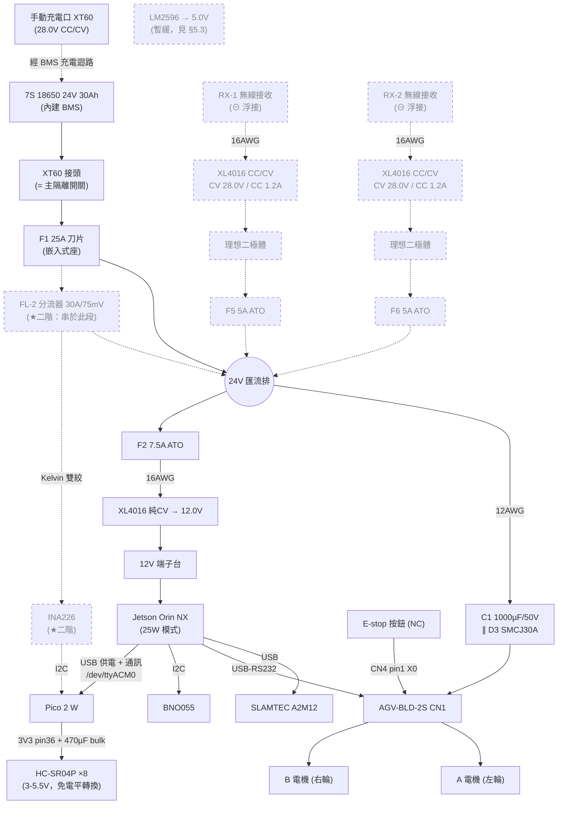
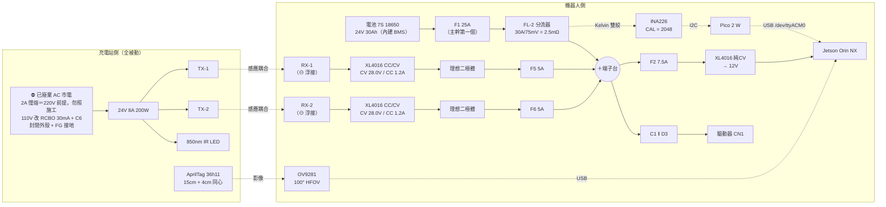

# 機器人配電設計 (Power Distribution Design)

> 最後更新：2026-08-11
> 依據：TROY AGV-BLD-2S 使用手冊 (20160713)、Jetson Orin NX 實測功耗、7S 18650 24V 30Ah 電池組

---

## ⛔ 2026-08-11 方案裁決：無線自動充電已廢棄

> 使用者於 **2026-08-11** 裁決：**舊的無線（電磁感應耦合）充電方案移除，
> 自動充電一律採接觸式刷板 dock**。權威設計見 **`docs/charging_dock_design.md`**
> （該文件 §16 列有本文件各節的有效性對照）。兩者衝突時以該文件為準。
>
> **本文件不刪除無線內容**——整份保留供決策脈絡追溯。但標記 ⛔ 的章節
> **一律不得作為施工或採購依據**。

| 分類 | 章節 | 狀態 |
|---|---|---|
| ⛔ **廢棄（無線方案專屬）** | §10.1a（W 系列 BOM）、**§15 全節**、§16 **D 區**（充電腿）、§16 **K 區**（充電站側）、§16 J 區 **W-J4**（對位相機）、§13 **#11–#15**、§17.1 二階表同項、§17.3 第 **9** 項、§17.4 **段 6**。<br/>**通則：全文凡標 ★二階／★第二階段 且屬「充電腿（RX・充電 buck・理想二極體・F5／F6）、充電站側、視覺對位」者一律廢棄**——含 §1、§4、§5.1、§7、§12、§16.0 元件對照表（`U1`–`U4`／`D1`／`D2`／`F5`／`F6`）、§16.4.5、§17.2、§17.5 等衍生引用，不再逐處標記 | **不得施工**；僅供追溯 |
| ✅ **仍有效（被 dock 沿用）** | §2 電壓基準、§5 線徑與保險絲、§10.2 配線與端子、§10.3 壓接紀律、§10.1 **#2**（F1 同族料件）、§10.1 **#15**（充電器＝dock 主充電器，見該處註記）、§15.2 的 **INA226／分流器／理想二極體選型**、**§15.7 AC 安全原則** | 各節有就地註記 |
| 🟡 **機構中性（不隨無線廢棄）** | §16 **E 區**（車上主幹電流量測／庫倫計 SOC）、§13 **#16／#17／#18** | 量的是主幹電流，與充電機構無關，維持有效 |

> 🔴 **全文四處「2A 慢熔」（§10.1a W10、§15.1 方塊圖、§15.7 第 2 項、§16 K 區 W-K1）
> 一律不得照施工。** 那是**以 220V 為前提**寫的，且標的是已廢棄的無線充電站 24V PSU。
> **dock 的 AC 為 110V，2A 會誤熔斷**——保護件一律以 `charging_dock_design.md` §3.7 的
> **RCBO 30mA + C 曲線 C6** 為準（若仍要保留機內慢熔作為備案，額定為 **T5A@110V**）。

> ⚠️ **接觸式方案的車端（刷塊、車端防倒灌、極性防呆、微動開關行程）尚未寫入本文件。**
> dock 對車端的需求見 `charging_dock_design.md` §9；
> 原 §16 D 區的充電腿設計（RX → buck → 理想二極體 → F5／F6）**不可直接套用**。

---

## 1. 系統單線圖

```
電池 7S 18650 24V 30Ah (內建 BMS)
  │
[XT60] ← 主隔離（30A，機器現況）
  │
[F1 25A 刀片保險絲座]  ← 主幹第一個元件，在分流器上游
  │
[FL-2 分流器 30A/75mV] ──Kelvin 雙絞──► INA226 ──I2C──► Pico 2 W   ★第二階段
  │
  ├──[12AWG]──► C1 1000µF ∥ D3 SMCJ30A ──► AGV-BLD-2S CN1 ──► 左右輪 BLDC
  │                                              ▲
  │                        E-stop 按鈕(NC) ──────┘ CN4 X0 使能
  │
  ├──[F2 7.5A]──[16AWG]──── XL4016 純CV ──► 12V ──► Jetson Orin NX
  │                                                           │
  │                                                     USB ──┴──► Pico 2 W
  │                                                                  │ 3V3
  │                                                                  └──► HC-SR04P ×8
  │
  ├──[F5 5A]──[理想二極體]──[XL4016 CC/CV]◄──[16AWG]── RX-1（⊖浮接）  ★第二階段
  └──[F6 5A]──[理想二極體]──[XL4016 CC/CV]◄──[16AWG]── RX-2（⊖浮接）  ★第二階段
       （充電腿功率流方向為 RX → 電池，箭頭示意充電電流流入）

接地：星形。星點＝－端子台（以 12AWG 短線鎖在電池負極），只有一層。
      馬達 GND 以 12AWG 獨立直拉星點；訊號側各以 16AWG 直接掛回星點的各自位置。
      第二階段：兩顆充電 buck 的 OUT− 各自獨立拉回星點，中途不併接。

★ 標記為第二階段（無線自動充電）新增元件，完整設計見 §15。
   第一階段不含這些元件，其餘部分兩階段相同。
   ⊖浮接 ＝ RX 負極只接到充電 buck 的 IN−，不可接車體、機箱或星點（見 §15.3）。
```

> ⛔ **★ 記號的定義已於 2026-08-11 部分廢除**：★ 標記中**與無線充電腿有關者
> （RX-1／RX-2、兩顆充電 buck、理想二極體、F5／F6）整條廢棄**，上圖該兩列不得施工。
> **分流器與 INA226（★ 但屬主幹電流量測）不受影響**，理由見 §16 E 區。
> 接觸式方案的車端充電路徑尚未定案，需求見 `charging_dock_design.md` §9。

## 2. 電壓基準

電池：7S 18650 Li-ion，標稱 25.9V，30Ah（777Wh），內建 BMS

| 狀態 | 電壓 | 說明 |
|------|------|------|
| **充電上限** | **28.0V (4.0V/cell)** | 驅動器規格上限 28V（手冊 §8.2）。**充電器必須是 28.0V 款，市售 7S「29.4V」充電器不可用** |
| 標稱 | 25.9V | 功率計算基準 |
| 軟體低電量警告 | 22.4V (3.2V/cell) | 由 `/motor/voltage` 判斷 |
| 軟體強制停機 | 21.7V (3.1V/cell) | 同上 |
| 驅動器欠壓保護 | 21.0V（參數 210） | 已設定 |
| BMS 硬切 | ~19.6V (2.8V/cell) | 最後防線 |

> ⚠️ **電壓判斷須做移動平均**：馬達加速時匯流排會瞬降 1–2V，直接取瞬時值會誤觸發低電量保護。建議 30 秒窗口濾波後再比對閾值。

## 3. 負載盤點（實測基準）

實測日期 2026-07-25，工具：Jetson 板載 INA3221

| 負載 | 實測 / 規格 | 12V 側 | **24V 側** |
|------|------------|--------|-----------|
| Jetson Orin NX（25W 模式） | 模組 VDD_IN 實測：閒置 **7.0W**／CPU 8 核滿載 **16.0W**；含載板 + LiDAR 推估系統 35W（見下方推導） | 2.9A | 1.6A |
| Pico 2 W + HC-SR04P ×8 | ~1.5W（**經 Jetson USB 供電**，已含在下列合計） | — | — |
| 電子分支合計 | 36.5W | 3.0A | **1.7A** |
| 馬達驅動器（連續 200W @ 21V） | — | — | 9.5A |
| 馬達驅動器（200% 過載，5s） | — | — | **19A** |
| **系統峰值** | | | **~21A** |

**Jetson 必須鎖 25W 模式**（`sudo nvpmodel -m 3`，設定持久化）。可用模式：`0=MAXN, 1=10W, 2=15W, 3=25W`。
載板為 Jetson Orin NX Engineering Reference Developer Kit，DC jack 輸入範圍 **9–20V**，故 12V 合法。

### 3.1 「系統 35W」的推導與驗證

**35W 是設計用的上限值，非預期運轉值。** 組成：

| 項目 | 數值 | 來源 |
|------|------|------|
| Jetson 模組 | 25W | nvpmodel 25W 模式的**預算上限**（非實際耗用） |
| 載板（Ethernet PHY、USB 控制器、NVMe SSD、風扇、載板 DC-DC 損耗） | ~8W | **估算，尚未實測**——INA3221 僅量模組 VDD_IN，不含載板 |
| LiDAR A2M12（USB 5V × 500mA） | ~2.5W | 規格書 |
| **合計** | **~35W** | |

**負載實測驗證（2026-07-28，8 核 CPU 100%）**：

| 狀態 | 模組 VDD_IN | tj |
|------|-----------|-----|
| 閒置（ROS2 節點全開） | 7.0W | 45°C |
| **CPU 8 核滿載** | **15.7–16.0W** | 52°C |

> 實測顯示 CPU 完全飽和時模組僅 16W，**未觸及 25W 預算上限**——因工作負載
> （Nav2 / SLAM / EKF）為 CPU-bound，無 GPU 推論。
> 故實際最壞情況約為 16W + 10W = **26W**，35W 的估算保守約 35%。

**設計對此數值不敏感**——真正的約束是 XL4016 的 5A 實際持續能力（12V × 5A = **60W 輸出上限**）：

| 情境 | 系統功耗 | XL4016 使用率 | F2 7.5A 餘裕 |
|------|---------|-------------|-------------|
| 實際最壞（實測外推） | 26W | 43% | 5.5× |
| 本設計採用值 | 35W | 58% | 4.7× |
| XL4016 極限 | 60W | 100% | 2.7× |

> **結論**：設計在系統功耗 60W 以內皆成立；而 nvpmodel 將模組硬性封頂於 25W，
> 若要超過 60W 需載板本身消耗 35W，不可能發生。

**待補實測**：於 19V 變壓器與電源孔之間串接 DC 電壓電流表（約 NT$50–150），
可直接讀取整機功率，補上目前僅為估算的載板耗電。

## 4. 配電架構

> **實線 ＝ 第一階段**（手動充電）即需施作；**虛線 ＝ 第二階段**（無線自動充電）追加，第一階段不裝。
> 本圖只畫配電路徑；第二階段的視覺對位元件（相機、AprilTag、IR 照明）與充電站側拓樸見 **§15.1**。



> 充電腿的箭頭方向為**功率流**（RX → 電池）。第二階段的兩條自動充電腿與上方的**手動充電口並存**，
> 兩者都匯入同一個 ＋端子台（24V 匯流排）——自動充電上線後手動充電口不拆除，見 §15。

## 5. 線徑與保險絲

### 5.1 對照表

| 迴路 | 線徑 | 保險絲 | 依據 |
|------|------|--------|------|
| 電池主幹 → 匯流排 | **12 AWG** | **F1 25A 刀片**（ATO 快熔） | 峰值 21A = 25A 的 84%，不誤跳；12 AWG 對應 30A 迴路 |
| 匯流排 → 驅動器 CN1 | **12 AWG** | （由 F1 保護） | 與主幹同線徑，F1 已覆蓋，**不需第二顆保險絲** |
| 匯流排 → 降壓模組 | **16 AWG** | **F2 7.5A ATO** | 負載 1.7A，4.4 倍餘裕給開機湧浪；16AWG 安全載流 10–13A |
| 馬達 GND → 電池負極 | **12 AWG** | — | 獨立回流路徑，不與訊號地共用 |
| 訊號 GND → 電池負極 | 16 AWG | — | 直接掛回星點（－端子台）的訊號 GND 位 |
| **分流器串於主幹**（★二階） | **12 AWG** | （由 F1 覆蓋） | 串在主幹上，與主幹同線徑；F1 已在其上游，**不需獨立保險絲** |
| **充電腿 ×2**（★二階） | **16 AWG** | **F5／F6 5A ATO**（每腿各一） | 充電電流僅 2.4A（兩顆 buck 各 CC 1.2A），F5 為 **2.1 倍餘裕**；16AWG 安全載流 10–13A，遠高於 F5 額定 |

**全車僅兩種線徑（12 AWG / 16 AWG）、第一階段兩顆保險絲。**
第二階段（★二階）追加兩條 16 AWG 充電腿與 F5／F6 5A ×2——**沿用既有線徑，不新增第三種**，詳見 §15。

> **充電腿為何用 16 AWG（而非 18 AWG，也不可用 12 AWG）**
>
> - **保險絲保護的是導線**；導線能力高於保險絲永遠是安全的方向。
>   16 AWG 安全載流 10–13A，對 2.4A 的充電電流餘裕比 18 AWG 更大。
> - **維持「全車僅兩種線徑」這項設計性質**：不新增第三種線徑，
>   連帶不必多備一種熱縮與端子規格。
> - ❌ **不可用 12 AWG 代替**：充電 buck 模組的螺絲端子容納上限通常僅 **2.5–4mm²**，
>   12 AWG（3.31mm²）難以置入；且線材過硬、彎折半徑大，
>   會把模組從安裝孔**拉歪**。
> - **F5／F6 仍為 5A，不隨線徑變動**——它是依負載 2.4A 定出的 2.1 倍餘裕，與線徑無關。

**主幹匯流端子台：TB25（25A 額定）即可，不需升級 TB45。**

| 檢查項 | 數值 | 結果 |
|---|---|---|
| 連續電流 | 11.2A ＝ TB25 額定的 **45%** | 餘裕充足 ✅ |
| 系統峰值 | 21A，但**僅持續 5 秒** | 端子台金屬熱容量足以吸收此短時脈衝 ✅ |

> **待確認**：**12 AWG（3.31mm²）能否置入 TB25 的壓板**——收到實物後試裝（見 §13）。
> 若無法置入，退路是把 12 AWG **壓接 Y3.5-4S 叉形端子後再夾**（§10.2 #19 已備）。

> **主接頭 XT60（機器現況）**：額定 30A 連續 / 60A 突波，涵蓋系統峰值 21A。
> 錫杯設計線徑 12–14 AWG，與本設計的 12 AWG 相容。
>
> ⚠️ **充電口若同為 XT60，存在誤插風險**（充電器插到主迴路 / 主接頭插到充電口）。
> 建議以不同顏色外殼或改用其他接頭型式做防呆。

### 5.2 動力路徑採 12 AWG（偏離手冊建議值 AWG10）

驅動器手冊 §3.2.1 對 CN1 的敘述為「**建議**使用線材 AWG10」——為建議值而非強制規格。
本設計採 12 AWG，依據如下：

| 項目 | 數值 |
|------|------|
| 驅動器最大輸出 | 200W |
| 連續電流（200W @ 21V 最惡劣電池電壓）+ 電子分支 | **11.2A** |
| 峰值（200% 過載 5 秒）+ 電子分支 | **21A** |
| 12 AWG (3.31mm²) 汽車配線慣例 | 對應 **30A 迴路** |
| 連續餘裕 | **2.7×** |
| 峰值壓降（單程 1.5m） | 21A × 3m × 5.2mΩ/m = **0.33V**（21V 的 1.6%） |

**實務理由**（10 AWG 在本應用中反而處處卡關）：

- 市售鋰電池組多出廠配 **12–14 AWG** 尾線與 XT60 接頭，用 10 AWG 需改裝電池
- XT60 錫杯為 12–14 AWG 設計，10 AWG 焊入困難
- 刀片保險絲座線徑上限 **4mm²**：12 AWG (3.31mm²) 可用，10 AWG (5.26mm²) 不可
- 12 AWG 柔軟度佳，機箱內佈線容易

> 手冊建議值對 200W／8.3A 的負載本身極為保守（10 AWG 可承載 30–40A）。

### 5.2.1 F1 為何定案 25A（不降 15A、不升 30A）

**結論：F1 採 25A，已定案。** 採購與施工皆以此為準，不需再議。

**依據：本機電池組出廠尾線經實機量測確認為 14 AWG**（2.08mm²，汽車配線慣例對應 20A 迴路；
量測日期 2026-07-30，非型錄推估）。該尾線為整條主幹路徑上最細的一段，
而保險絲須保護最弱環節——這正是 F1 上限被壓住、不能往 30A 走的原因。

| 檢查項 | 數值 | 結果 |
|--------|------|------|
| 系統峰值（堵轉 5 秒） | 21A = 25A 額定的 **84%** | 不會誤跳 ✅ |
| 連續最惡劣 | 11.2A = 45% | 餘裕充足 ✅ |
| 對 12 AWG（30A 迴路） | 25A | 保護充分 ✅ |
| 對 14 AWG 電池尾線 | 25A | 可接受——尾線短（10–20cm）、裸露散熱佳，且另有 BMS 過流保護 ✅ |

**兩個方向都被擋住，25A 是唯一可行值：**

| 候選值 | 為何不採用 |
|--------|-----------|
| **15A** | 系統峰值 21A 已超過額定值，堵轉 5 秒的正常過載會直接熔斷 F1 → 全車斷電。這不是保護，是誤跳 |
| **30A** | 路徑最弱環節是 14 AWG 電池尾線（對應 20A 迴路）。25A 之所以可接受，靠的是上表最後一列那三個條件（尾線短、裸露散熱佳、BMS 兜底）；30A 已超出這個例外所能撐住的範圍。要用 30A 必須先把尾線換成 12 AWG（見下方升級選項） |

> **升級選項**：若日後向電池廠改訂 **12 AWG 尾線**，F1 可提高至 30A，峰值餘裕由 19% 增至 43%。

### 5.3 5V 軌暫緩（下位機改由 USB 供電）

**選用 HC-SR04P（國外型號 RCWL-1601）取代 HC-SR04 後，整條 5V 軌可暫時省略。**

| | HC-SR04 | **HC-SR04P** |
|--|---------|-------------|
| 工作電壓 | 5V only | **3–5.5V** |
| 邏輯電平 | 固定 5V | **跟隨供電電壓**（3.3V 供電即輸出 3.3V） |
| 軟體相容性 | — | 完全相容，程式碼不需修改 |

供電路徑改為：

```
Jetson USB ──► Pico 2 W (VBUS→VSYS) ──► Pico 內建 3V3 穩壓器 ──► HC-SR04P ×8
```

Pico 本來就要用 USB 連 Jetson 做通訊，同一條線兼供電，不需額外佈線。

#### 3V3 電流預算

**這筆帳只算「從 3V3 腳位流出去餵外部電路」的電流。** Pico 本體（RP2350、快閃記憶體、
無線晶片）的消耗不從這支腳流出，不計入；發射突波是微秒級尖峰、由就近的去耦電容供應，
穩壓器不參與，也不與穩態電流相加。

Pico 2 W Datasheet 對這支腳的原文：

> 3V3 is the main 3.3 V supply to RP2350 and its I/O, generated by the on-board SMPS.
> This pin can be used to power external circuitry (maximum output current will depend on
> RP2350 load and VSYS voltage; **it is recommended to keep the load on this pin under 300 mA**).

| 3V3 外部負載 | 電流 |
|---|---|
| HC-SR04P ×8（**2.2mA**/顆） | 17.6mA |
| INA226 模組（★二階） | ~1mA |
| **合計** | **≈ 19mA** |
| **對 300mA 建議上限** | **6%（餘裕約 15 倍）** |

**結論：穩態電流餘裕充裕，非設計瓶頸。**

兩點易誤解處要講清楚：

- **300mA 是系統級的保守建議，不是穩壓器的能力上限。** Pico 2 W 板上用的是
  **RT6154 buck-boost**，Richtek 規格書標稱最大負載 **4A**；300mA 這個數字受限於板上走線、
  RP2350 自身消耗與 VSYS 供電能力，是整板一起看的建議值。
- **2.2mA 是 HC-SR04P 的值，不是 HC-SR04 的值。** 原版 HC-SR04 為 15mA 級；
  2.2mA 出自其等效品 **RCWL-1601** 的官方標示。兩者差 7 倍，**買到哪一種必須實測確認**（見 §13 #8）。

#### 四個必要條件

1. **去耦電容**：Pico 3V3 (pin 36) 旁接 **470µF/25V 電解電容**（bulk），
   每顆 HC-SR04P 的 VCC–GND 各接 **0.1µF 陶瓷電容**。
   **理由是瞬時電流變化率（di/dt），與平均電流多小無關**——超音波發射為 40kHz 突波，
   尖峰電流上升時間在微秒級，**穩壓器的控制迴路頻寬追不上**，只能由就近電容供應。
   **無此電容整組感測器會不穩。**

   > **但書**：若裝上 470µF 後出現 Pico 無法啟動或反覆重開，**把 bulk 降回 220µF**。
   > 此現象的成因是穩壓器啟動時的湧浪電流，**不是感測器故障**——不要往感測器方向排查。

2. **韌體必須循序觸發，8 顆感測器不可共用 TRIG**（硬性約束，非建議）：

   **理由一（量測正確性，這個更嚴重）**：HC-SR04 系列全部使用同一個 40kHz、
   **無編碼也無識別碼**，接收器只要偵測到超過門檻的 40kHz 能量就結束計時，
   **分辨不出是自己的回波還是鄰居的直達波**。而鄰居的直達波路徑更短、能量更強
   （未經反射衰減），**每次都先到**：

   | 訊號 | 路徑 | 到達時間 | 換算讀值 |
   |---|---|---|---|
   | 鄰居直達波（間距 25cm） | 0.25m 單程 | 0.73ms | 誤報 **12.5cm** |
   | 自身回波（1m 外目標） | 2m 來回 | 5.8ms | 正確 100cm |

   後果是**恆定假警報**（機器人原地不敢動），而非偶發誤差——且程式邏輯完全正確，極難排查。

   **理由二（電流）**：8 顆同時發射的瞬時電流達 **1.6A**，超出去耦電容能就近供應的量級。

   > ⚠️ **「共用 TRIG 但一次只讀一支 ECHO」不成立**：TRIG 控制的是**發射**，
   > 8 顆已經同時把音波打進空氣中，讀不讀 ECHO 改變不了物理現象；電流突波同樣照常發生。

   **輪詢時序（供韌體實作參考）**：

   ```
   單顆量測：最大量程 4m → 來回 8m ÷ 343 m/s ≈ 23ms
   每顆配置 30ms（含殘響衰減等待）
   8 顆一輪 = 240ms → 更新率約 4Hz
   ```

   適用性驗算：行駛速度 0.1125 m/s × 0.24s ＝ **一輪掃完僅前進 2.7cm**，避障裕度充足。
   若日後需提高更新率，條件式優化是讓**波束不重疊的兩顆**同時觸發（4 輪 = 120ms、8Hz），
   但須先實測確認不串音、且突波升至 400mA 時電容仍足夠——**不建議初期採用**。

   **輪詢順序不可照編號遞增（硬性約束）**

   上面講的是「必須一顆一顆來」，這裡講**順序本身**。兩者都是硬性約束。

   **約束：輪詢順序不可照編號遞增**（US1 → US2 → US3 …）。

   **理由**：編號是**順時針繞一圈**排的（見 §16 F 區對應表），
   照編號輪詢時，連續觸發的正好是**實體相鄰**的兩顆——
   前一顆的殘響尚未衰減完，就換相鄰的下一顆開始接收，
   容易把殘留的 40kHz 能量當成自己的回波（成因與上面「分辨不出是誰的音波」同一個）。

   **建議順序（對角交錯）**：

   ```
   US1(前左) → US5(後右) → US3(右前) → US7(左後) → US2(前右) → US6(後左) → US4(右後) → US8(左前)
   ```

   此順序下，任兩顆**實體相鄰**的感測器之間都隔了 **3 個時槽 ≈ 90ms**（3 × 30ms），
   殘響已充分衰減。

   **附帶效益**：這個順序也讓上一段提到的「日後提高更新率」可並行配對一目了然——
   波束完全不重疊的對打配對為 **`US1+US5`、`US2+US6`、`US3+US7`、`US4+US8`**，
   四輪即可掃完（120ms、約 8Hz）。
   採用前的兩個但書同上：須先實測確認不串音，且瞬時電流由 200mA 升至 400mA，
   須確認去耦電容仍足夠。

3. **感測器線用雙絞**：訊號與 GND 絞在一起，縮小迴圈面積，避免感應馬達雜訊。
4. **接受 Pico 失去電源獨立性**：

| 情境 | Pico 是否存活 |
|------|-------------|
| Jetson 軟體當機 / kernel panic | ✅ 存活（USB 埠供電為硬體控制，不受軟體影響）|
| Jetson 關機 / 12V 軌故障 | ❌ 一併斷電 |

> 此取捨可接受的前提：安全功能由**驅動器 500ms watchdog + X0 硬體急停**負責，不依賴 Pico。

#### 其他 Pico 韌體約束

上面第 2 點（循序觸發、輪詢順序）之外，還有一條與感測器無關的韌體約束：

5. **GP18 須啟用內建上拉**（★二階）：INA226 的 ALERT 為 open-drain 輸出，
   無上拉時讀不到有效電平、警報永遠不觸發。完整理由與外部上拉備案見 **§16 E 區 W-E8**。

#### 波束覆蓋與死角

> 🔴 **結論先講：八顆感測器無法達成 360° 覆蓋。**
> 這是這套感測器的**能力上限**，不是安裝或調校可以補救的事。

**事實**：HC-SR04 系列的有效測量角約 **15°**。

**推算**：

| 項目 | 數值 |
|---|---|
| 八顆合計有效覆蓋 | 8 × 15° = **120°** |
| 若均勻繞 360° 佈置，每顆間隔 | 45° |
| 相鄰兩顆之間的死角 | 45° − 15° = **30°** |

也就是說，均勻環繞佈置會讓**每個方向都只有部分覆蓋**，
且腳邊的低矮障礙物容易正好落在兩顆之間的 30° 死角裡。

**因此本設計採「關鍵方向優先」佈置**（方位編號見 §16 F 區對應表）：

| 方位 | 佈置方式 | 理由 |
|---|---|---|
| 前 ×2（US1／US2） | 各外八約 **±20°**，前方合計覆蓋約 55° | 行進方向，死角代價最高 |
| 後 ×2（US5／US6） | 同樣外八 | 倒車與後退脫困 |
| 左 ×2（US7／US8）、右 ×2（US3／US4） | 分別對準**前輪與後輪的位置** | 管的是貼牆距離與轉彎時的側面刮擦，不是偵測遠方障礙 |

> 此佈置是**有意識地把死角留在斜前方約 45° 的低風險區**，
> 而非均勻分散讓每個方向都只有部分覆蓋。
> 超音波在本設計中的定位是**近距離補盲**，主要避障仍由 LiDAR 承擔。

實際覆蓋範圍與死角的實測方法見 **§13 #8a**。

#### GPIO 分配（硬性配置規則）

Pico 2 W 規格頁明載「Exposes **26** multi-function 3.3 V general purpose I/O」。
其中四支保留給板上功能，不可挪用：

| 保留腳 | 用途 |
|---|---|
| GPIO23 | 無線晶片電源開啟訊號 |
| GPIO24 | 無線 SPI data / IRQ |
| GPIO25 | 無線 SPI CS（拉高時同時使能 GPIO29 讀 VSYS） |
| GPIO29 | 無線 SPI CLK / ADC3 量測 VSYS÷3 |

使用者可用範圍為 **GP0–GP22 與 GP26–GP28**。

##### ⚠️ GP26–GP28 不可接感測器

Datasheet 原文：

> GPIO 26-29 are ADC-capable and have an **internal reverse diode to the IOVDD (3.3 V) rail**,
> so the input voltage must not exceed IOVDD plus about 300 mV. If the RP2350 is unpowered,
> applying a voltage to these GPIO pins will 'leak' through the diode into the IOVDD rail.
> **GPIO pins 0-25 (and the debug pins) do not have this restriction**.

意即：Pico 未上電時，若感測器那側仍有電壓灌進 GP26–GP28，電流會經該二極體漏進 3V3 軌。
故感測器一律配置在 GP0–GP25 區段。

**本設計配置表：**

| 腳位 | 用途 |
|---|---|
| **GP0–GP15** | 8 組（TRIG, ECHO）——全數配置在無反向二極體限制的區段 |
| **GP16 / GP17** | I2C0 SDA / SCL → INA226（★二階） |
| **GP18** | INA226 ALE（低母線電壓警報，選用） |
| GP19–GP22、GP26–GP28 | 備用 7 支 |

#### USB 供電側驗算

VBUS（5V）經 Pico 板上的蕭特基二極體 → VSYS（datasheet 允許範圍 **1.8–5.5V**）→ RT6154 降壓至 3.3V。

> 這顆蕭特基是 **Pico 模組板內部的元件**，Pico datasheet 稱它 `D1`。
> 它與本專案原理圖上的 `D1`（充電腿 A 的理想二極體模組，見 §16.0）**沒有任何關係**，
> 本文其餘各節提到的 `D1` 一律指原理圖上的元件。
以 3V3 側 120mA 的保守估計（含 Pico 本體）反推 5V 側電流：

```
(120mA × 3.3V) ÷ (0.9 × 4.7V) ≈ 94mA
```

USB 2.0 標準供電 500mA，**餘裕 5 倍以上**——Jetson 的 USB 埠供電不構成限制。

**恢復 5V 軌的條件**（裝回 LM2596 即可，F2 分支與線路皆保留）：

- Pico 要擔任安全監控（監看 Jetson 心跳、獨立觸發急停）
- 加裝 12V/5V 周邊（警示燈、額外感測器）
- 3V3 外部負載逼近 300mA 建議上限（現況僅 6%，見上方電流預算）

#### 資料來源

本節的官方數據可自行查證：

- Raspberry Pi Pico 2 W Datasheet（接腳說明與電源鏈章節）：
  <https://datasheets.raspberrypi.com/picow/pico-2-w-datasheet.pdf>
- Richtek RT6154A/RT6154B 規格書（buck-boost、最大負載 4A）：
  <https://www.richtek.com/assets/product_file/RT6154A=RT6154B/DS6154AB-05.pdf>
  （產品頁：<https://www.richtek.com/Products/Switching%20Regulators/Buck-Boost%20Converter/RT6154ART6154B?sc_lang=en>）
- Adafruit RCWL-1601 產品規格（3–5.5V、2.2mA）：
  <https://www.adafruit.com/product/4007>

## 6. 保護元件（C1 + D3）

| 元件 | 型號 | 規格 |
|------|------|------|
| C1 | Panasonic **EEU-FC1H102**（FC 系列） | 1000µF / 50V、低 ESR 34mΩ、ripple 2.235A、105°C 5000h、16×25mm、腳距 7.5mm、AEC-Q200 車規 |
| D3 | Littelfuse **SMCJ30A** | 單向 TVS、DO-214AB(SMC)、standoff 30V、崩潰 33.3–36.8V、箝位 48.4V、峰值 1500W、漏電 <1µA |

**接法：兩者皆並聯於驅動器 CN1 端子（+24V 與 GND 之間），引腳越短越好。**

```
CN1 +24V ──┬──────────┬────────
           │          │
          ═╪═ C1     ─┴─ D3 陰極(色帶端)朝上
           │          ▽
           │          │
CN1 GND ───┴──────────┴────────
```

> D3 方向錯誤（陰極接 GND）會順向導通造成短路，上電即炸 F1。
> KiCad 中確認 Pin 1（K）接 +24V、Pin 2（A）接 GND。

### 6.1 施工細節

**接線方式**：C1 引腳與主幹 12AWG **共壓入同一顆針型端子**後再鎖進 CN1，
不另外開分接點——這是「引腳越短越好」的實作方式。

**端子規格要備 E6012（6mm²）**：

| 項目 | 截面積 |
|---|---|
| 12 AWG 主幹線 | 3.31mm² |
| ＋ C1 引腳 | 合計約 **3.8mm²** |
| E4012 上限（§10.2 #22） | 4.0mm² |

3.8mm² 已經**貼著 E4012 的上限**，壓接餘裕不足，故改備 **E6012（6mm²）**管型端子。

**C1 本體必須固定**：以**束帶或熱熔膠**把電容本體固定於機箱或線束上。
電容有重量，若僅靠兩隻引腳懸空支撐，行駛震動會讓引腳根部疲勞斷裂。

**D3 跨焊點須套熱縮**：D3 跨焊在 C1 引腳上（焊接為此處正確工法，見 §10.3 對照表），
焊點完成後**套熱縮套管**絕緣，避免裸焊點碰觸鄰近金屬。

> ⚠️ **CN1 端子容量待收實物確認**：驅動器 CN1 的螺絲夾式端子能否容納 E6012（6mm²）
> 尚未經實物驗證。若容不下，需改為在 CN1 端子外側設分接點——收到實物後確認（列於 §13 #10a）。

**保護目的**：驅動器手冊 CN1 頁警告「驅動電源可能由於電機的再生電力產生高壓」。
主要防護對象是**切斷負載電流時的配線電感反衝**（2µH × 20A 中斷 → 數十伏突波）。

> 參考數據：本機行駛極速 0.1125 m/s 時反電動勢僅 2.6V，正常行駛的 regen 可忽略。
> 人力推車需達 **1.42 m/s**（快走）反電動勢才會到 33.3V 觸發 D3 導通。
> 使用手冊應註明「推車請以步行速度」。

## 7. 接地策略（星形）

**核心原則：所有 GND 最終都回電池負極，但不可共用同一段導線。**

共用導線時，馬達的 PWM 斬波電流會在該線段產生 V = I×R 的壓降
（19A × 1m 16AWG 13.1mΩ = **0.25V**，且隨 PWM 高頻彈跳），
使所有以該點為參考的電路「0V 參考點」跟著跳動 → I2C / RS232 / ADC 受擾。
此現象稱為**共用阻抗耦合（common impedance coupling）**。

```
電池−                     ┌──[12AWG 獨立]──► 驅動器 CN1 GND
  ║                       │
  ╚═[12AWG 短]═► 星點 ════┼──[16AWG]──► XL4016 IN−
              （－端子台）├──[16AWG]──► 訊號 GND（Pico／感測器匯流點）
                          ├──[16AWG]──► （LM2596 GND，5V 軌恢復時）
                          │
                          ├──► 充電 buck-1 的 OUT−   ★第二階段：各自獨立拉回星點，
                          └──► 充電 buck-2 的 OUT−      兩顆之間中途不併接
```

**星點只有一層**：所有 GND 各自直接掛在 －端子台的位置上，
中間**不存在第二層匯集端子台**。哪一條掛哪一位由下方的順序鐵律決定。

**鐵律：訊號地不可從馬達那條 12AWG 分接或串接，兩者只在星點匯合。**

### 星點實體：端子台 + 連接條

**星點以「端子台 + 連接條」實作**（不使用銅排或黃銅接線柱，故也不需要 R5.5-5 環形端子）。
連接條為**實心銅片，阻抗低於 16 AWG 導線**，作為星點本體是可行的。

#### 🔴 位置順序鐵律：電池⊖ 必須夾在「馬達 GND」與「所有其他 GND」之間

連接條把相鄰位置連成一體，所以**掛載順序決定電流走哪一段銅片**——接對接錯的差別全在排列。

**✅ 正確排列**

```
 [馬達GND] ─ [電池⊖] ─ [XL4016 IN−] ─ [訊號GND] ─ [充電buck OUT−]
     └────19A────┘
     馬達峰值電流只穿過這一段連接條，
     不流經任何訊號地掛載的位置
```

**❌ 錯誤排列**

```
 [電池⊖] ─ [訊號GND] ─ [馬達GND]
     └────────19A────────┘
     馬達電流穿過「訊號GND 所在」的連接條段，
     0V 參考點隨 PWM 彈跳 → 等於星形接地失效
```

**判斷方法**：從任一個訊號地位置往電池⊖ 看過去，
路上**不可以經過馬達 GND 的位置**。把電池⊖ 排在馬達 GND 旁邊就自動滿足。

> ⚠️ **－端子台本身就是星點**：它必須以**短 12AWG 直接鎖在電池⊖**，不可用細長線拉過去。
> 若這段線細又長，全車所有回流電流都得先擠過它，等於把星形接地退化成共用阻抗——
> 本節開頭要消除的問題會整批回來。

> ★ **第二階段補充**：兩顆充電 buck 的 OUT− 屬於會流過充電電流的回流路徑，
> 必須各自獨立回星點。若兩顆先併在一起再回星點，或搭到訊號 GND 的位置上，
> 充電電流會在共用段產生壓降，互相干擾各自的 CV 判斷。
> RX 側的 ⊖ 只接到充電 buck 的 IN−，**不可接車體、機箱或星點**——
> 「浮接」的精確定義與施工紀律見 **§15.3**。

### 既有地迴路與緩解

驅動器手冊 §1.3 明示**電源地與信號地（CN4-14/19/20）內部相通**，
故 Jetson 的地會經 USB-RS232 的 GND 連至動力地，與 DC-DC 的地線形成迴圈。
採非隔離 DC-DC 時以下列紀律壓制：

1. DC-DC 輸入負極**直接拉回星點**，不沿路搭接
2. RS232 線盡量短，動力線與訊號線分束走、交叉時垂直
3. **升級路徑**：若實測 RS232 錯誤率高或 IMU 毛刺明顯，換裝隔離式 DC-DC
   （Mean Well SD-100B-12 / SD-15B-5，約 NT$1,500），機箱預留安裝位

> 取捨理由：HS 協議有 CRC16 + 驅動器 500ms 通訊 watchdog，雜訊失效模式為丟包重試 / 自動煞停，
> 不會造成失控。故接受非隔離方案（省約 NT$1,500）。

### ⚠️ 選型限制：12V 降壓模組必須是「輸入輸出共地」款

**結論先講：12V 軌採 XL4016 純 CV 版（單電位器、無恆流調整），已定案。**
關鍵不在品牌或晶片型號，而在**買到哪一個版本**——同樣叫 XL4016，
CC/CV 雙電位器版不能用，純 CV 版可以，原因如下。

上述地迴路（Jetson 地 → USB-RS232 GND → 動力地）除了雜訊問題，還會讓**某一類降壓模組直接失效**，
選料前必須先排除。

**限制的來源是 CC 功能，不是晶片**：帶 CC/CV（定電流／定電壓）功能的降壓模組，
為了量測輸出電流，會把電流採樣電阻（sense resistor，毫歐級的康銅電阻）**串在輸出負極上**。
這種模組的 IN− 與 OUT− 之間隔著採樣電阻，並非同一個節點，
賣場規格常直接標註「輸入地與輸出地不可共接」或「不可共地」。

**因此同一顆 XL4016 有兩種版本，只有一種能用：**

| 版本 | 辨識特徵 | 本設計可用性 |
|---|---|---|
| **純 CV 版** | **單電位器**（只能調電壓）、無恆流調整、無電流數顯 | ✅ **可用**——無 CC 採樣電阻，IN− 與 OUT− 在 PCB 上即同一節點，屬共地款 |
| CC/CV 版（含數顯恆流版） | 雙電位器（電壓 + 電流）、多帶電壓/電流數顯 | ❌ **不可用**——採樣電阻串在輸出負極，會被本設計的地迴路旁路 |

**衝突機制**：本設計中 Jetson（模組的輸出側負載）的地另有一條路徑經 USB-RS232 連回動力地，
也就是回到模組的輸入負極。這條路徑與採樣電阻並聯，後果有兩個：

1. **CC 失效**：部分輸出回流電流不經採樣電阻，模組量到的電流小於實際值，
   限流判斷失準——設定的過流保護等於失效。
2. **回流電流誤走訊號地**：被旁路的那部分電流改走 USB-RS232 的 GND，
   而 CN4 側訊號線僅 AWG24。負載電流灌進訊號地會抬高並汙染 0V 參考點，
   RS232 / IMU 受擾，正是本節開頭要壓制的共用阻抗耦合，反而被放大。

**為什麼捨棄 CC 沒有損失**：**12V 軌只需要 CV 穩壓，不需要 CC。**
Jetson 載板為定電壓輸入負載（9–20V），電流由負載自己決定；過流保護已由 F2 7.5A 承擔，
不倚賴模組的限流功能。放掉 CC 只是放掉一個本設計用不到的功能。

**若要改用其他型號，須同時滿足兩個門檻：**

| 門檻 | 要求 |
|---|---|
| **共地** | IN− 與 OUT− 必須同一節點（純 CV、無電流採樣電阻） |
| **電流能力** | 12V 軌連續需求 **3.0A**（§3 電子分支 36.5W ÷ 12V），模組**實際持續能力須 ≥5A**，即 1.7 倍以上餘裕 |

符合上述兩項的方向：

- **XL4016 純 CV 版** — 實際持續 5A，本設計選用款
- **車用鑄鋁外殼降壓模組 24V→12V 10A** — 共地設計，有殼防塵抗震、散熱佳

> ⚠️ **不要用 LM2596 或 XL4015 帶 12V 軌**：兩者實際持續能力分別約 2A 與 3A，
> 對 3.0A 的連續需求是帶不動或零餘裕。
> LM2596 在本設計中的用途僅限 **5V 軌恢復時**（見 §5.3、§10.1 #10），**不可用於 12V 軌**。

**收貨驗證方法**見 §13 待驗證項目；BOM 對應項為 §10.1 #9。

## 8. 急停設計

**方案：E-stop 按鈕（NC 常閉）直接控制驅動器 CN4 pin 1（X0 驅動器使能）。**

X0 是驅動器的**硬體使能腳位**，與 RS232 通訊完全獨立——Jetson 當機、ROS 節點崩潰、
軟體邏輯錯誤皆無法影響它。

| 狀況 | NC 接點 | 結果 |
|------|--------|------|
| 正常 | 導通 | 驅動器使能 |
| 按下急停 | 斷開 | 馬達失能（失控狀態，自由滑行）✅ |
| **線材震斷 / 端子鬆脫** | 斷開 | 馬達失能 ✅ **失效方向安全（fail-safe）** |

**額外安全網（免費）**：驅動器內建 **500ms 通訊中斷保護**。
`hs_motor_controller.py` 以 50Hz（20ms）發送命令，餘裕 25 倍；
ROS 節點掛掉時馬達會在 500ms 內自動煞停。

### ⚠️ 上線前必須實測兩件事

**① X0 是 sourcing 還是 sinking？** 手冊 p.6 與 p.7 的圖示矛盾：

| 手冊位置 | 畫的內容 | 暗示 |
|---------|---------|------|
| p.6 CN4 接線圖 | +24V 經開關接到 pin 1–6 | Sourcing |
| p.7 輸入端口特性 | 內部 +5V → 電阻 → X0~X5，外部接 0V | Sinking |

**量測方法**：驅動器上電、CN4 除 RS232 外不接任何線，
三用電表黑棒接 CN4 pin 14（信號地）、紅棒接 pin 1（X0）：

- 量到 **~24V 或 ~5V** → 內部已上拉（sinking）→ 接法：`X0 ─ E-stop ─ pin 14 (GND)`
- 量到 **~0V** → 需外部供電（sourcing）→ 接法：`CN1 +24V ─ E-stop ─ X0`

**② X0 在 RS232 通訊模式下是否有效？** 手冊啟動流程圖將「模擬量控制」與「通訊控制」分成兩條路徑，
未說明通訊模式下 X0 是否仍作用。實測：接好後讓機器人行走，按下急停確認馬達是否停止。

- 有效 → 本設計成立
- 無效 → 改接 X1/X2（電機制動，會電磁煞停）或加裝接觸器切動力電

> **注意**：X0–X5 為驅動器內部 24V **非隔離**信號，只能接乾接點（按鈕/繼電器實體接點），
> **不可由 Jetson GPIO 直接驅動**。
>
> X0 vs X1/X2：X0 = 失能自由滑行（符合 Category 0 移除動力）；X1/X2 = 立即電磁制動。
> 本機速度僅 0.1125 m/s，兩者皆可，可依實測手感選擇。

### 升級路徑（量產階段）

加裝 **KM1 接觸器自保持迴路**切斷馬達動力電，達成真正的 Category 0 停止
（Category 0 由 IEC 60204-1 定義；ISO 13850 要求急停須為 Cat.0 或 1）。X0 方案無法涵蓋「驅動器本身故障 / MOSFET 失效短路」的情境。
增加成本約 NT$280（接觸器 + 繼電器座 + START 按鈕）。

## 8.5 Jetson 關機程序

根檔案系統為 **ext4 on NVMe**（`/dev/nvme0n1p1`）。XT60 為主隔離開關，**直接拔除即為硬斷電**——
存地圖、寫 log 當下斷電會損壞該檔案，NVMe 寫入快取中的資料亦會遺失。

**操作程序（系統無其他電源開關，全靠這兩個動作）：**

```
開機：插上 XT60 ──► 12V 上電 ──► Jetson 自動開機（J14 PIN7/8 保持開路）

關機：1. 按 J14 電源鍵（或網頁 API 的 power endpoint）
      2. 等待關機完成（carrier board 電源 LED 熄滅、風扇停止）
      3. 拔除 XT60
```

> Jetson 完全當機時，**長按 J14 電源鍵約 10 秒**強制斷電——此為硬體級路徑，
> 不依賴 OS 或任何軟體，故無須另設實體電源開關。

### 電源鍵接線（按鈕排針，2.54mm 間距）

**本機載板為 JETSON-ORIN-IO-BASE（第三方，非 NVIDIA P3768）。**
device tree 雖回報 `nvidia,p3768-0000+p3767-0000`（軟體相容），
但**實體排針為廠商自行設計的 1×12 單排，與 NVIDIA 官方 2×6 的 J14 完全不同**。

腳位依載板絲印（每個功能各配一支獨立 GND，皆為相鄰兩腳）：

| # | 絲印 | 用途 |
|:---:|------|------|
| **1** | **PWR BTN** | ┐ **電源鍵** |
| **2** | **GND** | ┘ |
| 3 / 4 | FC REC / GND | 強制燒錄模式 |
| 5 / 6 | SYS RST / GND | 系統重置 |
| **7** | **AUTO ON** | ┐ **短接 = 停用自動開機** |
| **8** | **DIS** | ┘ |
| 9 / 10 | UART TXD / RXD | Debug console |
| **11 / 12** | **LED+ / LED−** | **狀態指示燈** |

**本設計接法：**

```
瞬時按鈕（NO）──► PWR BTN ＋ GND（pin 1+2）
AUTO ON ＋ DIS（pin 7+8）──► 保持開路（維持自動開機：插上 XT60 即開機）
LED+ / LED−（pin 11+12）──► LED + 1kΩ 限流電阻（選配）
```

> **LED 可作為「可拔電」指示**：系統運作時亮、關機後熄滅，
> 正好指示何時可安全拔除 XT60，無須另做電路。

> ⚠️ **勿套用 NVIDIA SP-11324 的 J14 腳位表**——那是 P3768 官方載板（2×6 雙排），
> 腳位定義與本機載板完全不同。以板上絲印為準。

#### 開發階段的按鈕：4 pin tactile switch

**開發階段採用 4 pin 瞬時按鈕（PCB 用 tactile switch）代用**，面板化階段再換 22mm 款（見 §10.1 #11a）。

**電氣上完全可行**：PWR BTN 只需要**乾接點對 GND 瞬間短路**，電流為微安級，
按鈕的載流能力不是考量點。

##### 🔴 選腳警示：4 pin 內部兩兩相通，選錯即永久短路

4 pin tactile switch 的**內部兩兩相通**（**1-2 一組、3-4 一組**）。
若把兩支腳選在**同一組**，那兩腳未按時就已導通——
**等同電源鍵被持續按住**，Jetson 會**無法開機，或反覆重開**。

> ✅ **下線前必做**：以電表**通斷檔**確認選到的兩支腳是
> **「未按不通、按下才通」**（即分屬不同組）。確認後才可接上排針。

##### 固定方式

tactile switch 是 **PCB 用件**，腳位細且脆：

- 必須以**洞洞板或熱熔膠固定**，**不可讓杜邦線懸空承力**——震動會使腳位斷裂
- **須裝設於可觸及位置**：長按 10 秒的強制斷電路徑也依賴這顆按鈕
  （見上方 §8.5 關機程序），裝在打不開的機箱裡等於失去這條救援手段

### 8.5.1 電源鍵行為與系統設定（實測 2026-07-29）

**已驗證：60 秒倒數來自 GNOME，非硬體問題**

| 觀察 | 原因 |
|------|------|
| 按下電源鍵出現 60 秒倒數對話框 | `gsd-media-keys` 持有 `handle-power-key` 的 **block inhibitor**，攔截後由 GNOME 處理；`power-button-action = 'interactive'` |
| 無法設為「立即關機」 | 該 gsettings key 僅接受 `nothing / suspend / hibernate / interactive`，**沒有 shutdown 選項** |
| **切至 `multi-user.target` 後按下立即關機** ✅ | GNOME 停止 → inhibitor 消失 → logind 預設 `HandlePowerKey=poweroff` 生效 |

> 拔除螢幕**無效**——gdm 仍會自動登入並啟動 session，inhibitor 依舊存在。

**自動開機正常運作**：插上 XT60 後風扇立即轉、LED 亮，30 秒為韌體與開機時間，**非上電延遲**。

| 階段 | 時間 |
|------|------|
| UEFI 韌體（含 5s 選單等待） | ~14s |
| Kernel | 7.6s |
| Userspace → graphical.target | 8.3s |
| **插電到畫面** | **~30s** |

> UEFI `BootOrder` 第一順位為 NVMe（Boot0001），**未卡在 PXE/HTTP 網路開機逾時**（該項為 30 秒延遲最常見成因，本機不適用）。

### 8.5.2 部署前系統設定（開發階段暫不執行）

```bash
# 必要 —— 電源鍵立即生效的前提
sudo systemctl set-default multi-user.target

# 選用 —— 開機加速，合計約省 10 秒
sudo efibootmgr -t 1                                        # UEFI 選單 5s→1s，省 ~4s
sudo systemctl disable --now snapd.service snapd.socket snapd.seeded.service
sudo systemctl disable --now lvm2-monitor.service
```

**依據**：

- `snapd.seeded.service` 位於開機關鍵路徑，佔 **3.873s**；已安裝的 snap 僅 Canonical 基礎套件
  （`core24` / `gnome-46-2404` / `gtk-common-themes` / `mesa-2404`），**無應用程式相依**
- rootfs 為 `/dev/nvme0n1p1` 直接掛載，**未使用 LVM**，`lvm2-monitor` 佔 1.63s 為純浪費
- 關閉圖形介面另可釋出約 **1GB RAM** 與數瓦功耗，對 25W 預算與散熱有利

**預期**：~30s → ~20s。

**開發階段現況**：維持 `graphical.target`。電源鍵按下會顯示 60 秒倒數；
需立即關機時改用 SSH `sudo poweroff` 或網頁 API 的 power endpoint。
臨時切換：`sudo systemctl isolate multi-user.target` ／ `isolate graphical.target`。

**行為**：運行中短按 → 送出 KEY_POWER → systemd 正常關機；關機時短按 → 開機；長按 ~10s → 強制斷電（緊急用）。

**實機驗證（2026-07-28）**：`/proc/bus/input/devices` 存在 `gpio-keys` 裝置（event0），
KEY bitmap `10000000000000` = bit 52 + offset 64 = **keycode 116 (KEY_POWER)**，
確認 OS 已註冊電源鍵，無須額外軟體。

> 40-pin GPIO + systemd service 亦可實現，但不必要：J14 為硬體級路徑，
> Jetson 當機時 GPIO 腳本一併失效，而 J14 長按強制關機仍有效。

## 9. 散熱

實測基準（2026-07-25，25W 模式）：Jetson tj = 45°C，板載風扇 PWM 178/255（節流 95°C ／ 臨界 104°C，實測自 sysfs trip points）。

| 熱源 | 發熱 | 對策 |
|------|------|------|
| Jetson 系統（25W 模式） | ~35W | 板載風扇自管，無需外加 |
| 馬達驅動器 | ~5–20W | **鎖在 ≥140×90mm 金屬底板**（手冊 §8.2）；周邊留 2cm；IP00 須裝機箱內 |
| XL4016 | ~4W | 散熱片；3.2A < 5A 免風扇門檻 |
| **箱內合計** | **~44W** | 見下方判斷 |

**風扇：目前不裝。** 判斷依據：

- 機箱**開放或有通風孔** → 不需風扇
- 機箱**完全密閉** → 需 12V 80mm 排風扇（約 NT$100）

> ⚠️ 卡關點是**馬達驅動器的 50°C 環境溫限**（手冊 §8.1），不是 Jetson。
> 驗證方法：連續運轉 30 分鐘後量測。Jetson 溫度 `cat /sys/devices/virtual/thermal/thermal_zone*/temp`；
> 驅動器外殼以手觸摸，燙到無法久放即需補裝風扇。

## 10. BOM

### 10.1 主要元件

| # | 品項 | 型號 / 規格 | 數量 | 台灣參考價 |
|---|------|------------|------|-----------|
| 1 | 主接頭 | Amass **XT60**（機器現況）— 30A 連續 / 60A 突波、3.5mm 鍍金 | 1 對 | NT$40–80 |
| 2 | 主保險絲 | 標準 **ATO 刀片 25A**、32VDC、快熔（SAE J1284 / ISO 8820-3） | 2（1 用 1 備） | NT$30 |
| 3 | 主保險絲座 | 防水嵌入式 ATC 座（**尾線須 ≥12 AWG／3.3mm²**，額定 30A）或螺絲端子式（線徑上限 4mm²） | 1 | NT$80–150 |
| 4 | 電子分支保險絲 | 標準 **ATO 7.5A**、32VDC | 2 | NT$30 |
| 5 | 保險絲座 | 嵌入式 ATC 保險絲座（16AWG 尾線即可） | 1 | NT$50–100 |
| 6 | ~~電源開關~~ | **已移除**——J14 電源鍵涵蓋開關機，XT60 負責完全斷電（見 §12） | 0 | — |
| 7 | 電解電容 | Panasonic **EEU-FC1H102** — 1000µF/50V、ESR 34mΩ、105°C 5000h、AEC-Q200 | 1 | NT$30–50 |
| 8 | TVS | Littelfuse **SMCJ30A** — 單向、30V standoff、1500W、DO-214AB | 1 + 備品 | NT$20–40 |
| 9 | DC-DC 12V | **XL4016 純 CV 版（單電位器／無恆流調整）** — 入 4–40V、出 1.25–36V、實際持續 **5A**、180kHz、61×41×27mm。<br>⚠️ **不可買 CC/CV 雙電位器版或數顯恆流版**（採樣電阻串在輸出負極，會被本設計的地迴路旁路，機制見 §7）。<br>✅ 收貨後以三用電表電阻檔量 **IN− ↔ OUT−：~0Ω ＝ 共地款，可用**。<br>🔥 **散熱片為必要**：12V 側 3.0A 約 4W 廢熱（見 §9） | 1 | NT$95–150 |
| 10 | DC-DC 5V | **LM2596** 模組 — 入 4.5–40V、出 5V/3A（實際 2A）。**勿用 mini560**（輸入僅到 24V，滿電 28V 會燒） | **0（暫緩）** | NT$30–50 |
| 10a | DC 電源插頭 | 5.5mm OD，內徑 2.1 或 2.5mm — 接 Jetson 載板電源孔 | 1 | NT$30 |
| 11 | E-stop 按鈕 | IDEC **YW1B-V4E01R** — 22mm、40mm 蘑菇頭、1NC、旋轉復位、IP65、direct-opening (IEC 60947-5-1 Annex K) | 1 | NT$165–200 |
| 11a | Jetson 電源鍵 | **開發階段：4 pin tactile switch（PCB 用瞬時按鈕）** + 2-pin 杜邦線（2.54mm）。⚠️ 內部兩兩相通（1-2 / 3-4），**須以電表通斷檔選到「未按不通、按下才通」的兩腳**，並以洞洞板或熱熔膠固定（見 §8.5）。<br>**面板化階段**再換 22mm 瞬時按鈕（momentary NO） | 1 | NT$50–100 |
| 12 | 下位機 | Raspberry Pi **Pico 2 W** + 螺絲端子擴充板 — RP2350、原生 USB、PIO ×12。**經 USB 接 Jetson（供電 + 通訊）** | 1 | 現有 |
| 13 | 超音波感測器 | **HC-SR04P** ×8 — **3–5.5V**、邏輯電平跟隨供電、**2.2mA/顆**（RCWL-1601 官方標示）、軟體相容 HC-SR04（國外型號 RCWL-1601）。⚠️ 市售標「HC-SR04P」者不保證為同一顆驅動晶片，部分僅是原版加穩壓器、耗電仍為 15mA 級——**收貨須實測**（見 §13 #8） | 8 | NT$320–480 |
| 13a | 去耦電容 | **470µF/25V** 電解（Pico 3V3 bulk）+ **0.1µF** 陶瓷 ×8（每顆感測器 VCC–GND）。若 Pico 出現無法啟動／反覆重開，bulk 降回 **220µF**（見 §5.3） | 1+1包 | NT$45 |
| 14 | 充電口 | Amass **XT60E-M** 面板式 — 30A | 1 | NT$40–80 |
| 15 | 充電器 | Mean Well **HLG-320H-30A**（電位器調至 **28.0V**）— 27–33V 可調、10.7A、CC+CV、IP65、7 年保固。<br>**第一階段手動充電必需**；~~第二階段的自動充電改由車上 buck 做 CC/CV 後，此件**降級為維護／備援用途**（對接故障、單獨為電池充電時使用），屆時可用任何可調 CC/CV 電源替代，不必然需要此型號~~<br/>🔴 **上述降級敘述已於 2026-08-11 失效**：無線方案（車上 buck 做 CC/CV）已廢棄，**接觸式 dock 反而是由 dock 側的 28.0V 充電器直接做 CC/CV**——此型號因而是**充電鏈的主件，不是備援**。`charging_dock_design.md` §1 即以本列的 **10.7A** 為充電器上限依據；dock 的實際選型（HLG-320H／HLG-150H）見該文件 §11 | 1 | NT$2,900 |

> **#15 注意**：型號尾碼必須是 **-30A**（A = 內建電位器可調）。`HLG-320H-30`（無 A）電壓固定 30V，**不可調到 28.0V，買錯無法使用**。
> 這是全案最貴單品；可先用手邊任何可調 CC/CV 電源過渡，或洽明緯經銷（良興、唐訊）詢訂貨價。

#### 10.1a ⛔ 第二階段品項（無線自動充電）——**整表已廢棄**

> ⛔ **本表整表已廢棄（2026-08-11 裁決）：無線方案移除，本表品項一律不得採購。**
> 接觸式 dock 的 BOM 見 `charging_dock_design.md` §11。
> **例外**：**W4（FL-2 分流器）與 W5（INA226 模組）** 的**選型**被 dock 沿用為同款料件
> （`charging_dock_design.md` §3.5，備品可共用）；W11 只是沿用 §10.2 #17 的既有線材。

**以下為第二階段（§15）所需，第一階段不需採購。編號另立 W 系列以免與上表混淆；
價格未列，故不計入 §10.4 第一階段材料合計。**

| # | 品項 | 型號 / 規格 | 數量 | 台灣參考價 |
|---|------|------------|------|-----------|
| W1 | 無線充電模組 | TX ×2 + RX ×2，24V 系統。**TX 側各需 >2.5A**（24V）；**RX 額定輸出電流待確認**（見 §13 #11），CC 設定值依實測定案 | 2 組 | 待詢價 |
| W2 | 理想二極體模組 | **MOS 防倒灌板**，每條充電腿一顆。壓降 ~0.02V、免焊、螺絲端子。**取代 SR5100 蕭特基**（見 §12） | 2 | 待詢價 |
| W3 | 充電用 DC-DC | **XL4016 CC/CV 版** ×2（此處**需要** CC，故用雙電位器版；與 §10.1 #9 的 12V 軌純 CV 版**不是同一款**，勿混用） | 2 | 待詢價 |
| W4 | 分流器 | **FL-2 30A / 75mV**（＝ **2.5mΩ**），串於主幹、位於 F1 下游 | 1 | 待詢價 |
| W5 | 電流量測模組 | **INA226** 模組。⚠️ **板上自帶的 0.1Ω 取樣電阻（R100）須拆除**，改接 W4 外部分流器；接法為 **Kelvin**（見 §15） | 1 | 待詢價 |
| W6 | 充電腿保險絲 | **ATO 5A**、32VDC（每條充電腿各一，共 2 條腿） | 3（2 用 1 備） | 待詢價 |
| W7 | 相機 | **OV9281** — mono、**100° HFOV**、低畸變、**無 IR filter**（才能用 850nm 夜間照明） | 1 | 待詢價 |
| W8 | IR 照明 | **850nm** IR LED **24V 版**（**不可用 940nm**——OV9281 在 940nm 感度掉一半）。選 24V 版即可直接接充電站 PSU 輸出，不需另加降壓模組 | 1 組 | 待詢價 |
| W9 | AprilTag 標記 | **36h11**，同心雙 tag：外圈 **15cm** + 中心 **4cm**，**霧面**護貝（亮面會反光） | 1 組 | 待詢價 |
| W10 | ~~充電站電源~~ ⛔ | ~~**24V 8A 200W**。⚠️ 開放式（open frame）**AC 端子外露**，必須裝入封閉外殼、AC 側加 **2A 慢熔**、金屬外殼接地（見 §15 安全要求）~~<br/>🔴 **已廢棄，勿採購亦勿照施工**：此件是無線 TX 的專用電源。**「2A 慢熔」為 220V 前提**，dock 為 110V 會誤熔斷 → 一律依 `charging_dock_design.md` §3.7（**RCBO 30mA + C6**）。dock 自帶 28.0V 充電器，不用此件 | ~~1~~ 0 | — |
| W11 | 充電腿線材 | 矽膠線 **16 AWG**，紅/黑（**與 §10.2 #17 同一種線**，不新增線徑） | — | 待詢價 |

> **第一階段（單模組驗證）配置**：車上的 **RX 減為 1 顆**、W2 / W3 各減為 1、W6 減為 2（1 用 1 備）
> （即拿掉 RX-2 / buck-2 及其 F6 與理想二極體整條）；
> **充電站側的 TX 仍為 2 顆**——§13 #15 的雙 TX 互擾與間距驗證需要兩顆同時通電。
> 其餘品項不變。詳見 §15.6。

### 10.2 配線與端子

| # | 品項 | 規格 | 用途 |
|---|------|------|------|
| 16 | 矽膠線 12 AWG | 耐溫 200°C，紅/黑 | 主幹、馬達、馬達 GND |
| 17 | 矽膠線 16 AWG | 耐溫 200°C，紅/黑 | 電子分支、訊號 GND、**充電腿 ×2（★二階）** |
| 18 | 端子台 **TB25**（25A 額定） | 12V / GND 各一組（≥4 位） | 各電壓分配、星形接地匯集、**主幹匯流**。5V 軌暫緩故由 3 組減為 2 組。**不需升級 TB45**（依據見 §5.1 下方說明） |
| 18a | **連接條**（端子台配件） | 實心銅片，配合 #18 位數 | **星點本體**——實心銅片阻抗低於 16 AWG 導線。⚠️ **掛載順序有鐵律**，見 §7 |
| 18b | 雙絞線 / 4 芯排線 | VCC / TRIG / ECHO / GND | 接 HC-SR04P；訊號與 GND 絞合以縮小迴圈面積 |
| 19 | 叉形端子 **Y3.5-4S**（備用） | 適用 ~4mm²、M3.5 孔 | **退路用**：若 12 AWG 無法直接置入 TB25 壓板，壓接此端子後再夾（見 §13） |
| 20 | 環形端子 **R1.25-4** | 適用 0.25–1.65mm²、M4 孔 | 端子台（16AWG） |
| 21 | 叉形端子 **Y1.25-3.5** | M3.5 孔 | E-stop 按鈕（IDEC YW 為 M3.5 螺絲） |
| 22 | 針型端子 **E6012 / E4012 / E1508** | 6.0 / 4.0 / 1.5mm² 管型 | 驅動器 CN1、保險絲座、XL4016 的螺絲夾式端子。<br>**CN1 處需 E6012**——12AWG 與 C1 引腳共壓合計約 3.8mm²，已貼 E4012 的 4.0mm² 上限（見 §6.1） |
| 23 | ~~電阻 1kΩ + 2kΩ~~ | 1/4W | **不需要**——HC-SR04P 為 3.3V 邏輯，免分壓。僅在買到非 P 版（5V only）時才需備料 |
| 24 | CN4 端子 | PHD 2.0-22AW + PHD 2.0-T 壓接端子、AWG24 線 | 驅動器出廠已附 1 個端子 + 20 根線材 |

### 10.3 工具（必要）

| 品項 | 用途 |
|------|------|
| **棘輪式端子壓接鉗**（1.25–8mm²） | 壓 R / Y 型端子。**禁止用老虎鉗代替**——壓接不良會發熱、震動後脫落 |
| **針型端子壓接鉗**（方口/六角口） | 壓 E 型管型端子 |
| 三用電表 | X0 電壓量測、DC-DC 空載調壓 |

#### 🔴 壓接紀律：動力迴路必須壓接，且壓接端子上不可補焊錫

**兩件事都是禁止項，不是可以疊加的保險：**

| | 規定 |
|---|---|
| ✅ **必須** | 動力迴路的連接**採壓接**（汽車／船舶規範 ABYC E-11 對電池迴路的要求） |
| ❌ **禁止** | 在**壓接端子上補焊錫**。「壓接完再補一點焊錫更牢」是**錯的**，會讓接頭比純壓接更早失效 |

正確壓接會讓端子與線芯的銅**冷焊成氣密接合**，導電性與機械強度**優於焊錫**。
補焊不但沒有補強，還會破壞壓接賴以成立的三個條件：

**a. 焊錫冷流（creep）→ 夾持壓力鬆弛**
壓接的機械強度來自線芯與端子筒**持續互壓的彈性形變**。
焊錫在持續壓力下會**緩慢流動變形**，夾持壓力隨之鬆弛 → 接觸電阻上升 → 發熱惡化，形成正回饋。

**b. 焊錫沿絞線滲入（wicking）→ 硬點與應力集中後移**
焊錫會沿絞線毛細滲入，使線材變硬。
斷裂應力集中點因此**從端子喇叭口後移到毫無保護的裸線段**——
喇叭口原本有絕緣護套／熱縮分擔應力，後移之後就沒有任何保護，震動下疲勞折斷。
線束驗收標準（IPC/WHMA-A-620 一類）**將焊錫滲入絞線列為缺陷**。

**c. 破壞氣密性 → 電化學腐蝕**
正確壓接的接合面**內部無空氣，故不氧化**。
補焊會帶入**助焊劑殘留**，殘留吸濕後引發電化學腐蝕。

##### 哪裡該焊、哪裡不可補焊

| ✅ 該用焊錫（焊接本來就是該處的正確工法） | ❌ 不可補焊（壓接完成即為完成品） |
|---|---|
| **XT60 錫杯**——本身即焊接結構 | 所有**管型 E 型**端子（CN1、保險絲座、DC-DC 螺絲夾式端子） |
| **D3 跨焊於 C1 引腳**（見 §6） | 所有**環形 R 型**端子（端子台） |
| **INA226 拆除 R100 後的兩條取樣細線**（見 §15.2 Kelvin 接法） | 所有**叉形 Y 型**端子（E-stop 按鈕） |
| | **主幹動力線**的任何連接點 |
| | **端子台螺絲夾點** |

##### 想提高壓接可靠性，做這三件事（不是補焊）

1. **壓接後做拉力測試**——線材不得自端子滑出。
   **滑出即剪掉重壓一顆新端子，不可補焊補救。**
2. **確認棘輪鉗口徑與線徑對應**——用錯口徑是壓接不良的首因
   （與上表「禁止用老虎鉗代替」同一脈絡）。
3. **需要防潮時用帶膠熱縮套管**（adhesive-lined heatshrink）。
   **焊錫不是密封材料。**

### 10.4 成本估算

明細見 `boom.xlsx`（數量 0 = 現有 / 暫緩 / 選配，改數字即納入合計）。

| 項目 | 金額 |
|------|------|
| 充電器（HLG-320H-30A） | NT$2,900 |
| 其他所有元件 + 線材 + 端子 | ~NT$2,930 |
| **材料合計** | **~NT$5,830** |
| 壓接工具（一次性） | NT$900 |
| **總計** | **~NT$6,730** |

## 11. 驅動器參數設定

| 參數 | 出廠值 | 設定值 | 理由 |
|------|--------|--------|------|
| 欠壓保護電壓 | 120 (12.0V) | **210 (21.0V)** | 3.0V/cell，保護鋰電池 |
| 過壓保護電壓 | 300 (30.0V) | **290 (29.0V)** | 第二道過壓防線 |
| 通訊中斷保護 | 100 (500ms) | 500ms | 內建 deadman；`hs_motor_controller.py` 以 50Hz 發送，餘裕 25 倍 |
| 電機功率 / 極對數 | — | 依馬達銘牌 | 設錯會燒馬達或誤觸發過載保護 |

## 12. 設計決策記錄

以下元件經評估後**移除**，記錄理由以供審查與日後回溯：

| 移除項 | 理由 | 回復條件 |
|--------|------|---------|
| 馬達分支獨立保險絲（F2 23A） | 馬達分支與主幹同為 12AWG，F1 25A 已保護該線徑。第二顆僅提供故障隔離 | 需要「馬達故障時 Jetson 仍存活以記錄故障」時加回 |
| 6 路保險絲盒 | 電子分支合併為單一迴路後只需 1 顆保險絲 | 增加獨立供電的周邊時 |
| **整條 5V 軌（LM2596 + 5V 端子台 + 一路 16AWG）** | 改用 **HC-SR04P**（3–5.5V、邏輯電平跟隨供電）後，感測器可直接由 Pico 3V3 供電；Pico 本身由 Jetson USB 供電（本來就要接 USB 通訊）。詳見 §5.3 | Pico 要擔任安全監控、或加裝 12V/5V 周邊時，裝回 LM2596 即可（F2 分支與線路皆保留） |
| **ECHO 分壓電阻 ×16（1k + 2k）** | HC-SR04P 輸出即 3.3V，無需電平轉換。連帶省去一片洞洞板與 16 顆電阻的焊接工時 | 買到非 P 版（5V only）時才需要 |
| 電池隔離開關（旋轉式 ≥50A） | XT60 拔插即為主隔離 | 需要頻繁通斷而不想拔接頭時 |
| **電源開關 SW1（全部移除）** | J14 電源鍵已涵蓋開關機與強制關閉（長按 10 秒為硬體級，Jetson 當機亦有效），XT60 負責完全斷電。SW1 唯一的差異功能與 XT60 重複，僅在 24V 路徑上多一個接點與面板開孔。<br>（附帶效益：船型開關 24VDC 下實際能力僅 10–15A、無法串於 21A 主迴路的限制隨之消失） | 需要在不拔 XT60 的前提下完全切斷 12V 待機耗電時 |
| KM1 接觸器 + START 按鈕 + 繼電器座 | 降級為 X0 硬體使能急停。X0 已可涵蓋「軟體失控 / Jetson 當機」 | 量產階段、或需符合 IEC 60204-1 Cat.0 停止（ISO 13850 要求急停須為 Cat.0 或 1） 時 |
| 第二顆 TVS（曾暫稱 D2，未實作） | D3 已位於突波源頭（驅動器端），先箝位再往回傳。⚠️ 代號 `D2` 現已配給充電腿 B 的理想二極體模組（§16.0），此項若日後回復須另取代號 | XL4016 反覆損壞時，於其輸入端加裝 |
| 隔離式 DC-DC（SD-100B-12 / SD-15B-5） | 以星形接地紀律替代，省約 NT$1,500 | RS232 錯誤率高或 IMU 毛刺明顯時 |
| 機箱排風扇 | demo 階段機箱開放，總發熱 ~44W 可自然散逸 | 機箱密閉、或驅動器外殼實測過熱時 |

**⛔ 第二階段（無線自動充電）評估後移除的設計**——詳細背景見 §15：

> ⛔ **本表的「理由」欄以無線方案為前提，該前提已於 2026-08-11 廢除。**
> 🔴 **第 2 列（接觸式安全機構）的回復條件「若日後改回接觸式充電」已經成立**——
> 該整套機構在 `charging_dock_design.md` 中已重新設計並實作（主繼電器 K1、
> 微動開關 ×2 入座判定、fail-safe 論證、極性防呆），**以該文件為準**。

| 移除項 | 理由 | 回復條件 |
|--------|------|---------|
| **RX 電壓偵測分壓板**（100k/8.2k ×2 → Pico ADC） | 該電路會把**浮接的 RX⊖ 接到系統地**，等於旁路充電 buck 的 CC 採樣電阻——與 §7 所述 12V 軌的失效機制同一個原理。入座偵測改用**充電電流 + AprilTag 位置**確認，功能不減 | 需要「哪一顆線圈沒耦合上」的**個別**診斷時，改用光耦（PC817）**隔離**版本 |
| **接觸式充電的整套安全機構**（充電繼電器、pilot 電阻、safe-charge 上電順序、座端 MCU、外露接點防呆） | 改無線後**接點消失**，充電站側變成全被動（電源 + TX ×2 + tag + IR 燈），無可動零件、無外露帶電金屬、無拉弧風險，整套機構失去存在理由 | 若日後改回接觸式充電 |
| **SR5100 蕭特基防倒灌** | 改用**理想二極體模組**（MOS 防倒灌板），壓降由 0.3V 降至 ~0.02V，且免焊、螺絲端子 | — |

## 13. 待驗證項目

| # | 項目 | 方法 | 阻擋什麼 |
|---|------|------|---------|
| 1 | **X0 為 sourcing 或 sinking** | 三用電表量 CN4 pin1 對 pin14 開路電壓（見 §8） | E-stop 接線方向 |
| 2 | **X0 在 RS232 模式下是否有效** | 接線後行走測試，按急停看馬達是否停止 | 急停方案是否成立 |
| 3 | 馬達型號與極對數 | 讀馬達銘牌 | 驅動器「電機功率 / 極對數」參數 |
| 4 | 機箱密閉度與驅動器溫度 | 連續運轉 30 分鐘後量測 | 是否需加裝排風扇 |
| 5 | XL4016 尾線/端子相容性 | 收到實物後確認 | 是否需轉接 |
| 6 | **電池 BMS 持續放電電流與過流門檻**<br>⚠️ 目前**假設 >25A，尚無供應商書面確認**——不可當成已定案的結論引用 | 索取電池組規格書或 BMS 型號並取得**書面**放電規格；無書面資料則實測堵轉時 BMS 是否切斷 | **BMS 過流門檻若低於系統峰值 21A，堵轉 5 秒時會被 BMS 硬切 → 全車瞬間斷電**（比 F1 熔斷更難察覺，因為 BMS 多會自動復歸，現象是行進中突然重開機）。<br>若確認 < 25A，整體配電須重新分配 |
| 7 | **賣家出貨是否為 P 版** | 收貨後量測：3.3V 供電時 ECHO 是否有輸出 | 非 P 版須補 16 顆分壓電阻，且 5V 軌不能省 |
| 8 | **實際買到的 P 版感測器耗電與量測穩定度** | 8 顆全接、循序輪詢連續 10 分鐘，觀察是否有漏讀或 Pico 重開；一併量測 3V3 外部負載電流 | **非阻擋級，但須確認**。2.2mA 是 RCWL-1601 的官方標示，市售標「HC-SR04P」者**不保證為同一顆驅動晶片**（部分僅是原版加裝穩壓器，耗電仍為 15mA 級）。8 顆全接時兩種情形分別為 **17.6mA** 與 **120mA**，都在 300mA 建議上限內，故不阻擋設計成立；實測是要確認買到哪一種，以及去耦電容是否足夠（見 §5.3） |
| 8a | **八顆感測器的實際有效波束角與死角範圍** | 依 §5.3「波束覆蓋與死角」的佈置實際安裝後，以標準障礙物（例如直徑 5cm 圓柱）在機器人周圍**每 10° 移動一次**並記錄是否被偵測到，繪出實測覆蓋圖 | **避障策略的死角補償方式**。若實測死角大於推算的 30°，需增加感測器數量或改用波束較寬的型號 |
| 9 | Jetson 載板電源孔內徑 | 卡尺量測（2.1 或 2.5mm） | DC 電源插頭選型 |
| 9a | **12 AWG（3.31mm²）能否置入 TB25 的壓板** | 收到實物後試裝 | **主幹匯流端子選型**。TB25 的電流能力已確認足夠（連續 11.2A ＝ 45%，見 §5.1），未定的只有機械置入。<br>若無法置入，退路＝12 AWG 壓接 **Y3.5-4S** 後再夾（§10.2 #19） |
| 10 | **12V 降壓模組（§10.1 #9）確認為共地款** | 三用電表電阻檔量 **IN− ↔ OUT−**：<br>**~0Ω ＝ 共地款，可用**；<br>量到毫歐級以上或不導通 ＝ 買到 CC/CV 版，**須換** | **12V 軌能否上電**。CC/CV 版在本設計的地迴路下會 CC 失效、且回流電流誤走 AWG24 訊號地（機制見 §7） |
| 10a | **驅動器 CN1 端子容量** | 收到驅動器實物後**試裝 E6012（6mm²）針型端子**——12AWG 主幹線與 C1 引腳共壓合計約 3.8mm²（見 §6.1） | **CN1 端子選型，以及是否需在 CN1 外側另設分接點**。若 E6012 置入不了，共壓方案不成立，須改為外設分接點 |
| 10b | **馬達三相線（U／V／W）與霍爾線的既有線徑與端子型式** | 拆檢實機既有配線並記錄（線徑、端子型號、線長） | **日後延長或更換馬達時的選料**。本機現況已完成配線並可正常行走，本次配電改造不變動該部分（見 §16 涵蓋範圍）；此資訊目前只存在於實體上、無任何文件記錄，屬資料缺口。線材規格另見驅動器手冊 §3.2.1 |

> **原理圖完成後的複核（2026-08-04）**：上表 18 項逐條對照過現行原理圖網表，
> **沒有任何一項因為原理圖畫完而失效**——18 項全部是實體量測或收貨查驗（極性、模組型號、
> 端子置入、BMS 門檻、感測器行為、車體導通、RX 規格），不是圖面問題，圖畫好也代替不了。
> 兩項與圖面現況相關，補充如下（原條目內容不變）：
>
> - **#1（X0 為 sourcing 或 sinking）**：原理圖目前畫的是 **sinking**（`J5`(X0) ─ `SW1` ─ `U7` pin 20 `SGND`）。
>   實測若為 **sourcing，圖要一併改**，改法見 §16.4.1。
> - **#9（Jetson 載板電源孔內徑）**：圖上 `J7` 的 Value 只寫 `DC 插頭 5.5mm`，
>   **內徑（2.1／2.5mm）尚未填**，量測後要補回圖面 Value。

**⛔ 第二階段（無線自動充電，§15）待驗證項目——#11–#15 已廢棄：**

> ⛔ **#11–#15（RX 額定輸出電流、RX 空載輸出電壓、buck 輸入上限、對位容忍度、雙 TX 互擾）
> 隨無線方案廢棄，不必再驗**（2026-08-11 裁決）。
> 🟡 **#16／#17／#18 仍有效**：#16（車體 ↔ 星點導通）是車體接地事實查證、
> #17（理想二極體額定）改對應 `charging_dock_design.md` §9.1 的**車端**防倒灌選料、
> #18（INA226 方向）屬 §16 E 區的庫倫計，三者皆與充電機構無關。

| # | 項目 | 方法 | 阻擋什麼 |
|---|------|------|---------|
| 11 | **無線 RX 額定輸出電流** | 問賣家索取規格，或收貨後板凳實測 | **兩顆充電 buck 的 CC 設定值**。目前暫用各 1.2A（RX 實測能力的八成），實測後定案 |
| 12 | **無線 RX 空載輸出電壓** | 板凳量測（TX 供電、RX 不帶負載） | 若過衝接近 buck 的 **40V 輸入上限**，須於 buck 輸入端加裝 **SMBJ36A** TVS |
| 13 | **充電 buck 輸入電壓絕對上限** | 問賣家確認實際耐壓 | 同上——與 RX 空載電壓合併判斷是否需要輸入端 TVS |
| 14 | **無線模組對位容忍度**（橫向偏移／氣隙 vs 效率） | 板凳實測：固定氣隙掃橫向偏移，記錄效率衰減曲線 | **是否需在地面加輪擋（wheel chock）** 做機械鬆導引，以及視覺對位的容差該設多寬 |
| 15 | **雙 TX 線圈互擾與建議間距** | 問賣家 + 兩顆同時通電實測 | **充電站兩線圈的佈置間距**。現暫定 ≥15cm，為推估值、非實測值 |
| 16 | **車體金屬與 －端子台（星點）之間是否已電氣相通** | 電表**電阻檔**量測車體金屬 ↔ －端子台 | **車體能否視為 GND 電位**，以及 **RX 浮接的隔離判斷**——若車體已與星點相通，則「RX⊖ 碰到車體」等同「RX⊖ 接上星點」（見 §15.3） |
| 17 | **理想二極體模組的額定連續電流** | 收貨後查模組標示／規格頁，確認 **≥5A** | **充電腿選料**。額定須不低於同腿保險絲（`F5`／`F6`）的 5A，否則保險絲還沒熔斷、模組先燒（保護順序反了）。若額定不足，須換模組或把 F5／F6 一併降額 |
| 18 | **INA226 量測方向實測確認** | 組裝後讓機器人放電運轉，確認 INA226 讀值為**正**；再接上充電器，確認讀值轉**負**（接線方向定義見 §16 E 區） | **充電狀態機（§15.5）的方向判斷與 SOC 積分正確性**。W-E1／W-E2 接反時電流數值大小仍正確、只有符號相反，不特意驗符號不會發現 |

## 14. 安裝注意（依驅動器手冊）

- 驅動器 **IP00**，必須裝在機箱內；周邊留 2cm 通風；兩台驅動器間距 > 2cm
- 200W 連續運轉需鎖在 **≥140×90mm 散熱鋁板**（或機箱金屬面）上
- 安裝方向依手冊 §3.1 允許方向
- **接線完成再上電**；帶電插拔電源線會產生火花（手冊警告）
- 第一階段為手動充電；自動充電（對應 API `go_charging`）為第二階段，設計見 **§15**

## 15. ⛔ 第二階段——無線自動充電（**整節已廢棄**）

> ⛔ **本節整節已廢棄（使用者 2026-08-11 裁決；原於 2026-08-07 標為被取代）**：
> 無線方案移除，自動充電一律採**接觸式刷板 dock**，
> 權威設計見 `docs/charging_dock_design.md`（該文件 §16 列出本文件各節的有效性對照）。
> **本節保留僅供決策脈絡追溯，不得作為施工或採購依據。**
>
> 本節中**例外仍有效**的兩處，已在該處就地標明：
> - **§15.2 的 INA226／分流器／理想二極體選型**（FL-2 2.5mΩ、`CAL = 2048`、Kelvin 接法、`R100` 須拆、
>   MOS 理想二極體）→ 被 `charging_dock_design.md` §3.5／§9.1 沿用。
> - **§15.7 充電站側 AC 電氣安全原則** → 被 `charging_dock_design.md` §3.7 沿用，
>   但**其中的保護件額定（2A 慢熔）已被取代**。

機器人夜間自動返回充電站補電、白天連續運行。與第一階段的差異只有兩處：
主幹上多一個串接的分流器（電流量測），以及多兩條充電腿。
**第一階段的既有設計值全部不變**——F1 25A、F2 7.5A、12AWG / 16AWG、C1 / D3、星形接地、X0 急停皆照舊。

**手動充電口不拆除。** 第二階段的兩條自動充電腿與既有的手動充電口（§10.1 #14 XT60E-M）**並存**，
兩者都接到同一個 ＋端子台。對接故障、維護、或需要單獨為電池充電時，手動充電路徑仍是唯一手段
（對應充電器見 §10.1 #15 的用途說明）。

改採無線（電磁感應耦合）而非接觸式的直接後果：**充電站側沒有任何外露帶電金屬、沒有可動零件**，
機器人也沒有外露接點。充電站變成全被動裝置（電源 + TX ×2 + tag + IR 燈）。
這一項決定連帶讓接觸式方案的整套安全機構失去必要性，已移除的項目見 §12。

### 15.1 拓樸



ASCII 摘要（充電腿的箭頭方向為**功率流**：RX → 電池）：

```
                          ┌─[F2 7.5A]─[XL4016 純CV 12V]─► Jetson ⊕
                          │
電池⊕ ─[F1 25A]─[FL-2 分流器]─┴─► ＋端子台 ─┬──────────────[C1‖D3]─► 驅動器 CN1 ⊕
                  │ Kelvin 雙絞              │
                  └─► INA226                 ├─[F5 5A]─[理想二極體]─[XL4016 CC/CV]◄─ RX-1（浮接）
                       │ I2C                 └─[F6 5A]─[理想二極體]─[XL4016 CC/CV]◄─ RX-2（浮接）
                       ▼
                     Pico ──USB──► Jetson

電池⊖ ═══12AWG 短═══► －端子台（＝星點，鎖在電池⊖）

  連接條掛載順序（★鐵律，見 §7）：
  [馬達GND] ─ [電池⊖] ─ [XL4016 IN−] ─ [訊號GND] ─ [充電buck OUT−]
                                                      ×2 各自獨立拉回，中途不併接
```

> **RX⊖ 保持浮接**——注意「浮接」**不等於不接**：它要接，但只准接到充電 buck 的 IN−。
> 精確定義、明文禁止事項與上電前驗證步驟見 **§15.3**（本章最容易接錯的一項）。
> 相關背景另見 §12 中「RX 電壓偵測分壓板」的移除說明。

### 15.2 設定值與選型

> ⛔ **本表多數列已隨無線方案廢棄**（F5／F6、充電腿線徑、充電 buck、buck CV／CC、
> 相機、AprilTag、照明、充電站電源）。
> ✅ **但下列四項的選型與論證仍有效，且被 `charging_dock_design.md` 沿用**——
> 這也是本節不實體刪除的主因：
>
> | 仍有效項 | 沿用位置 |
> |---|---|
> | **F1 位置**（保險絲置於分流器**上游**）的理由 | dock 的 **F-D1** 沿用同一理由（§2.3） |
> | **電流量測**：FL-2 30A/75mV（2.5mΩ）＋ INA226、**`R100` 須拆除** | dock §3.5（同款料件、備品共用） |
> | **INA226 接法（Kelvin）** 與 **`CAL = 2048`**（Current_LSB = 1mA） | dock §3.5。⚠️ **電流方向約定與 dock 相反**，勿抄錯 |
> | **理想二極體模組（MOS 防倒灌板）** 的選型經驗 | dock §9.1 的**車端**防倒灌建議形式 |

| 項目 | 值 | 理由 |
|---|---|---|
| **F1 位置** | 電池⊕ 出來**第一個**，在分流器**上游** | 保險絲離電池越近越好；擺在上游，保護範圍才涵蓋分流器那段配線 |
| **F5／F6**（每條充電腿各一） | **5A** | 充電電流僅 2.4A（兩顆 buck 各 CC 1.2A），**2.1 倍餘裕**。此值依負載定出、**與線徑無關**——充電腿改用 16 AWG 後 F5／F6 仍為 5A |
| **充電腿線徑** | **16 AWG** | 保險絲保護的是導線，導線能力高於保險絲永遠安全；16AWG 安全載流 10–13A，對 2.4A 餘裕充足。沿用全車既有線徑，不新增第三種。❌ **不可用 12 AWG**——buck 螺絲端子上限通常僅 2.5–4mm²，且線材過硬會把模組從安裝孔拉歪（詳見 §5.1） |
| **充電 buck** | **XL4016 CC/CV 版 ×2**，各配一顆 RX | 每顆 RX 配自己的 buck，CC 才能設在**各自** RX 能力的八成。單一 buck 做總量限流護不住個體 |
| **buck CV** | **28.0V**（以電池端子實測值微調） | 理想二極體壓降僅 ~0.02V，不需要像蕭特基那樣補償到 28.2V |
| **buck CC** | 暫定**各 1.2A**（RX 實測能力的八成） | RX 額定輸出電流尚未確認，待板凳實測定案——見 §13 #11 |
| **防倒灌** | **理想二極體模組（MOS 防倒灌板）×2**，每腿一顆 | 機器人離站時 RX 無輸入（VIN = 0），電池 28V 可能經 buck 的電感與高側開關體二極體**倒灌回 RX**。理想二極體壓降 ~0.02V、免焊、螺絲端子 |
| **電流量測** | **FL-2 30A/75mV 分流器（2.5mΩ）** 串主幹 + **INA226** 取樣 | INA226 模組自帶的 0.1Ω 只能量到 0.8A，而分流器串在主幹上、流過的是**系統峰值 21A**（馬達 200% 過載 19A ＋ 電子分支 1.7A，見 §3），**會把它燒掉**。故板上 R100 須拆除、改接外部分流器 |
| **INA226 接法** | **Kelvin**：大螺栓走電流、小螺絲以**雙絞細線**取樣 | 從大螺栓搭訊號會把螺栓接觸電阻一起算進去，讀值會飄 |
| **INA226 韌體常數** | `CAL = 2048`（Current_LSB = 1mA、R_shunt = 2.5mΩ） | 由 0.00512 ÷ (0.001 × 0.0025) 得出 |
| **相機** | **OV9281**、100° HFOV、低畸變、**無 IR filter** | mono 感光元件適合 AprilTag（不需彩色）；**無 IR filter 才能配 850nm 夜間照明** |
| **AprilTag** | **36h11**，同心雙 tag：外圈 **15cm**（有效 ~2.7–3.2m）+ 中心 **4cm**（~0.8m 內），**霧面**護貝 | 遠近分工：外圈負責遠端鎖定、中心負責最後精對位。**亮面護貝會反光**，IR 照明下更嚴重 |
| **照明** | **850nm** IR LED（**不可用 940nm**） | OV9281 在 940nm 的感度掉一半 |
| **充電站電源** | **24V 8A 200W** | TX ×2 各需 >2.5A + IR 約 0.5A ＝ **5.5A**，負載率 69%。24/7 運轉需要餘裕，且廉價開關電源普遍虛標 |

### 15.3 🔴 RX 負極「浮接」的正確定義與施工紀律

**這是本章最容易接錯、且接錯就會燒模組的一項，施工前務必讀完。**

#### 「浮接」不是「不接」

RX 負極**要接**，而且只准接**一個地方**：

> **RX⊖ → 充電 buck 的輸入負極 IN−。除此之外，任何地方都不准接。**

#### 精確機制：浮接＝通往系統地的路徑必須「唯一」

RX⊖ 並非與系統完全隔離，它有**唯一一條**路徑通到系統地：

```
RX⊖ ──► buck IN− ──► buck 內部電流採樣電阻 ──► buck OUT− ──► －端子台（星點）
                          ▲
                    CC 靠量測這顆電阻上的電壓來得知充電電流
```

所謂「浮接」，指的就是**這條路徑必須是唯一的一條**。
任何第二條路徑都會與採樣電阻並聯、把它旁路掉，後果是 **CC 失效與模組損壞**。

無線線圈的**磁耦合本身即電氣隔離**——這正是本方案能合法使用 CC/CV 模組的原因。
對照 §7：12V 軌之所以不能用 CC/CV 版，就是因為 Jetson 的地另有 USB-RS232 這條第二路徑；
充電腿沒有這個問題，前提是**施工時不要自己造出第二條路徑**。

#### ❌ 明文禁止

| 不可以 | 為什麼 |
|---|---|
| RX⊖ 接**車體金屬** | 車體很可能已透過驅動器外殼、Jetson 載板的固定螺絲與 GND 相通。**接車體在電氣上等同接星點** |
| RX⊖ 接**機箱** | 同上 |
| RX⊖ 接**星點／－端子台** | 直接短路掉採樣電阻，CC 立即失效 |
| **兩顆 RX 的負極之間**有任何連接 | 兩組充電迴路會互相糾纏；若兩顆都接車體，等於同時犯下這一條與第一條 |

#### 不需要為了安全而接車體

RX 側為 **36V DC**，經磁耦合與市電**完全隔離**，**無觸電風險**。
需要接地的是**充電站的 AC 側金屬外殼**——那是另一回事，見 §15.7。
低壓 DC 系統的車體僅為**結構件**，不是安全接地導體。

#### 施工要求

1. RX 兩條線**直接鎖進 buck 輸入端子**——中途不分接、不壓入共用端子台、
   不與 －端子台共用螺絲
2. 線束固定牢靠並**避開金屬邊緣**（磨破絕緣碰到車體，就是一次意外接地）
3. 線上**加標籤註明「勿接地」**，避免日後維修者善意接錯

#### ✅ 上電前驗證（RX 兩線尚未接上 buck 時）

以電表**電阻檔**量測：

| 量測點 | 應為 |
|---|---|
| RX⊖ ↔ 車體金屬 | **開路** |
| RX⊖ ↔ －端子台（星點） | **開路** |

任一項不是開路，表示已存在非預期路徑，**排除後才可上電**。

### 15.4 充電狀態的資料來源

充電狀態的**唯一**判斷依據是主幹上的電流量測：

```
FL-2 分流器 ──Kelvin──► INA226 ──I2C──► Pico 2 W ──USB /dev/ttyACM0──► Jetson
```

這條鏈同時取代目前的電量估算方式：現況是由驅動器回報的母線電壓換算百分比，
第二階段改以此**庫倫計**（電流積分）為準，電壓僅作輔助與保護門檻。
軟體端的切換屬獨立工作項，本文件只定義硬體與門檻。

### 15.5 充電狀態機

軟體實作屬另案；此處只定義判斷條件與對外行為。

| 狀態 | 判斷條件 | 動作 |
|---|---|---|
| **入座** | 充電電流出現（**方向為流入電池**，＝ INA226 讀值為負，方向定義見 §16 E 區）＋ AprilTag 位姿在容差內 | 回報 `docked` |
| **充電中** | 電流持續流入電池（＝ INA226 讀值為負，方向定義見 §16 E 區） | 進 `CHARGING`，**軟體拒絕移動指令**。無線方案無拉弧風險，故不需硬體互鎖 |
| **充飽** | 充電電流 **< 0.3A 持續 30 分鐘** | 回報 `full` |
| **異常** | 已入座但電流為 0 **超過 2 分鐘** | 告警（TX 無電／線圈偏移） |

### 15.6 第一階段（單模組）驗證配置

先以單組線圈驗證整條鏈路，再擴充為雙組：

**把車上的 RX-2、buck-2、其 F6 與理想二極體整條拿掉，其餘完全不變。**
分流器、INA226、相機、tag、IR 照明、充電站電源都照雙組配置施作，
**充電站側的 TX 也維持 2 顆**——§13 #15 的雙 TX 互擾與間距要兩顆同時通電才驗得出來。
擴充為雙組時只需補上第二條充電腿。BOM 差異見 §10.1a 表下說明。

### 15.7 ⚠️ 充電站側電氣安全（人身安全項）

> ✅ **本節的安全原則仍有效**，且被 `charging_dock_design.md` §3.7 沿用於接觸式 dock
> （dock 同樣放在地面、有人會經過）。
> 🔴 **但保護件的具體額定已被取代**：下列第 2 項的「2A 慢熔」**以 220V 為前提**寫的，
> 標的是本節已廢棄的無線充電站 24V PSU。**dock 的 AC 為 110V，2A 會誤熔斷**——
> 一律以 `charging_dock_design.md` §3.7 的 **RCBO 30mA + C 曲線 C6** 為準
> （該件同時涵蓋漏電與過流，也取代下列第 4 項的 RCD 建議，並將其由建議項升為必須項）。

充電站放在地面、有人會經過，且**電源為開放式（open frame）、AC 端子外露**。
以下為必須項，不是建議項：

1. **裝入封閉外殼**——AC 端子不得可觸及 ✅ 仍有效
2. ~~**AC 側加裝 2A 慢熔保險絲**，或使用附開關保險絲的 IEC 插座~~
   🔴 **已被取代，勿照施工**（220V 前提；110V 下 2A 會誤熔斷）→ `charging_dock_design.md` §3.7 **RCBO 30mA + C6**
3. **金屬外殼必須接地**（接至電源的 FG 端子）✅ 仍有效
4. ~~建議上游插座具**漏電斷路器（RCD）**~~ → 已由 §3.7 的 RCBO **升為必須項**（不再只是建議）

### 15.8 待驗證項目

六條第二階段驗證項（RX 額定輸出電流、RX 空載輸出電壓、buck 輸入絕對上限、
對位容忍度、雙 TX 互擾與間距、車體與星點是否相通）列於 **§13 #11–#16**，
與第一階段項目集中在同一處便於上線前逐條打勾。

其中 **#16（車體 ↔ 星點導通）與 §15.3 的 RX⊖ 對車體開路檢查是一組的**：
先確認車體是否已與星點相通，才知道「RX⊖ 誤觸車體」的後果有多嚴重。

## 16. 接線清單（Wire List）

> 🔴 **本節是施工的權威來源。清單與圖（§1／§4／§5.1／§7／§15）不一致時，以本節為準。**
> 圖的作用是讓人理解拓樸，清單的作用是讓人照著接、接完打勾、事後查。
> 改線時只需改本節的一列，不必同步五張圖。

**本清單的涵蓋範圍**

本清單涵蓋**本次配電改造所新增或變更**的線路：主幹、保護元件、各電壓分支、
電流量測、下位機與感測器、急停、充電站。
**不涵蓋**既有且本次不變動的部分——馬達三相線（U／V／W）與霍爾感測線，
為馬達出廠線束直接接入驅動器對應端子，本機現況已完成配線並可正常行走。
若日後需重新配置該部分，線材規格依驅動器手冊 §3.2.1。

**編號規則：`W-` 前綴 + 分區字母 + 序號**（W-A1、W-A2、W-B1…），不用全域流水號。
理由：日後在某一區插入新線，只影響該區尾端，不會讓全車既有的線號標籤全部作廢。
**★二階** 標記沿用全文慣例——標記者為第二階段（無線自動充電）追加，第一階段不接。

> ⚠️ **`W-` 前綴＝線號**，與元件代號（F1／F2／F5／F6 保險絲、C1 電容、D3 TVS）字面上永不相交。

**欄位**：編號／起點／終點／線徑・顏色／端子／備註。
「端子」欄以斜線分隔兩端（例：「台側 Y3.5-4S／CN1 側 E6012」）；兩端相同或為對接工法時只寫一項。

### 16.0 元件對照表（編號 → 型號 → 功能）

本表的編號與型號取自原理圖網表（`hardware/kicad/kicad circuit.net`），
讓讀者不必翻圖就能查「這個編號是什麼、做什麼用」。原理圖版本與 ERC 狀態見 **§16.5**。

| 分類 | 編號 | 型號 / 規格 | 功能 |
|---|---|---|---|
| 電源輸入與保護 | BT1 | 24V 鋰電池（14 AWG 出廠尾線） | 主電源 |
| 電源輸入與保護 | J3 | XT60 30A cont. / 60A surge | 電池接頭 |
| 電源輸入與保護 | F1 | 25A ATO | 主保險絲（依 14 AWG 尾線定額） |
| 電源輸入與保護 | D3 | SMCJ30A（1500W 30V TVS） | 突波吸收 |
| 電源輸入與保護 | C1 | 1000uF/50V EEU-FC1H102 | 驅動器輸入端大電容 |
| ⛔ 充電支路 ★二階（已廢棄） | U1 | 36V 無線充電模組 | 接收端 B |
| ⛔ 充電支路 ★二階（已廢棄） | U2 | 36V 無線充電模組 | 接收端 A |
| ⛔ 充電支路 ★二階（已廢棄） | U3 | XL4016 CC/CV | 充電降壓 A（恆流恆壓） |
| ⛔ 充電支路 ★二階（已廢棄） | U4 | XL4016 CC/CV | 充電降壓 B |
| ⛔ 充電支路 ★二階（已廢棄） | D1 | Ideal Diode Module | 充電支路 A 防逆流 |
| ⛔ 充電支路 ★二階（已廢棄） | D2 | Ideal Diode Module | 充電支路 B 防逆流 |
| ⛔ 充電支路 ★二階（已廢棄） | F5 | 5A ATO | 充電支路 A 保險絲 |
| ⛔ 充電支路 ★二階（已廢棄） | F6 | 5A ATO | 充電支路 B 保險絲 |
| 12V 支路 | F2 | 7.5A ATO | 12V 支路保險絲 |
| 12V 支路 | U5 | XL4016 **CV only** | 24V→12V 降壓（必須純 CV，見 §7） |
| 12V 支路 | J6 | 12V 端子台 TB25（4 位） | 12V 分配 |
| 12V 支路 | J7 | DC 插頭 5.5mm | Jetson 電源輸入 |
| 電流量測 | R1 | 2.5mΩ FL-2 30A/75mV | 分流器 |
| 電流量測 | U6 | INA226（R100 已移除） | 電流／電壓監測，I2C 掛 Pico |
| 主控 | U8 | Jetson Orin NX | 主控電腦（ROS2） |
| 主控 | A1 | Raspberry Pi Pico W（RP2350A） | 感測器 MCU，USB 供電並與 Jetson 通訊 |
| 主控 | J4 | Jetson 40-pin I2C（pin 1/3/5/6） | IMU 的 I2C 出線 |
| 驅動與通訊 | U7 | AGV-BLD-2S | 雙軸無刷馬達驅動器 |
| 驅動與通訊 | U10 | DB9 to USB | 驅動器 RS232 轉 USB |
| 驅動與通訊 | U9 | A2M12 | 光達（USB） |
| 超音波感測 | U11 | HC-SR04P (3–5.5V) | 前左 |
| 超音波感測 | U12 | HC-SR04P (3–5.5V) | 前右 |
| 超音波感測 | U13 | HC-SR04P (3–5.5V) | 右前 |
| 超音波感測 | U14 | HC-SR04P (3–5.5V) | 右後 |
| 超音波感測 | U15 | HC-SR04P (3–5.5V) | 後右 |
| 超音波感測 | U16 | HC-SR04P (3–5.5V) | 後左 |
| 超音波感測 | U17 | HC-SR04P (3–5.5V) | 左後 |
| 超音波感測 | U18 | HC-SR04P (3–5.5V) | 左前 |
| 姿態感測 | U19 | BNO055 IMU Module | 九軸姿態，走 Jetson 40-pin I2C |
| 星點接地與匯流 | J1 | Screw_Terminal_01x05 | 負極星點端子台（掛載順序見 §7） |
| 星點接地與匯流 | J2 | Screw_Terminal_01x06 | 正極匯流端子台 |
| 急停 | J5 | 驅動器 CN4 pin 1 (X0) | 急停訊號進驅動器 |
| 急停 | SW1 | E-stop NC 22mm 蘑菇頭 | 常閉自保持，斷開即停 |
| 電源鍵與指示燈 | J8 | 載板排針 1×12（pin 1/2/11/12） | Jetson 電源鍵與 LED 接點 |
| 電源鍵與指示燈 | SW2 | 4 pin tactile | Jetson 電源鍵（瞬時） |
| 電源鍵與指示燈 | D4 | LED | 電源指示燈 |
| 電源鍵與指示燈 | R2 | 1kΩ | LED 限流 |
| 去耦與濾波 | C2–C9 | 0.1uF ×8 | 各超音波感測器去耦 |
| 去耦與濾波 | C10 | 470uF/25V bulk | 3V3 匯流排儲能 |

**保險絲代號跳號說明**：編號 `F3`／`F4` 已於整理中併除，現行保險絲為
`F1`（主）／`F2`（12V）／`F5`・`F6`（充電兩腿），跳號屬正常。

#### 16.0.1 三個容易對錯的編號（讀圖前先看）

| 陷阱 | 說明 |
|---|---|
| 🔴 **`D1` 不是 TVS** | 圖上 `D1`／`D2` 是**充電腿的理想二極體模組**；驅動器端的 SMCJ30A TVS 是 **`D3`**。本文全部改用 `D3` 指 TVS。另外 Pico datasheet 內部那顆蕭特基也叫 `D1`，與本圖無關（§5.3） |
| ⚠️ **RX-1／RX-2 與 `U1`／`U2` 是反的** | A 腿的 RX 是 `U2`、B 腿的 RX 是 `U1`。以腿別與網路名（`RX_A±`／`RX_B±`）為準，見 §16 D 區 |
| ⚠️ **`J8` 的圖面腳號 ≠ 載板腳號** | `J8` 在圖上只畫四支腳（1–4），對應載板絲印的 **pin 1／2／11／12**。照圖上的腳號去接實體排針會接到 FC REC／SYS RST 上（§8.5） |

> **同名不同物提醒**：§8.5 沿用 NVIDIA 慣稱的「J14 電源鍵」指的是**載板上的實體按鈕排針**，
> 與本圖的 `J1`–`J8` 是兩套編號。本機載板為第三方 JETSON-ORIN-IO-BASE，
> 其排針在本圖中的代號是 **`J8`**（§8.5 已註明不可套用 NVIDIA P3768 的 J14 腳位表）。

### A. 主幹

| 編號 | 起點 | 終點 | 線徑・顏色 | 端子 | 備註 |
|---|---|---|---|---|---|
| W-A1 | 電池⊕（XT60 母端） | F1 保險絲座 IN 側尾線 | 12AWG 紅 | 對接壓接 + 帶膠熱縮 | 保險絲座為嵌入式帶尾線款 |
| W-A2 | F1 保險絲座 OUT 側尾線 | 分流器 大螺栓 A | 12AWG 紅 | 依分流器螺栓孔徑選 R 型 | F1 在分流器**上游**——保險絲離電池越近越好，保護範圍含分流器配線 |
| W-A3 | 分流器 大螺栓 B | ＋端子台 | 12AWG 紅 | Y3.5-4S | |
| W-A4 | 電池⊖（XT60 母端） | －端子台「電池⊖」位 | 12AWG 黑 | Y3.5-4S | **須短**——此段為星點與電池之間唯一連接 |
| W-A5 | 手動充電口 XT60E-M ⊕ | ＋端子台 | 12AWG 紅 | Y3.5-4S | 與自動充電腿並存於同一端子台。**不加獨立保險絲**——充電器（HLG-320H-30A）本身為 CC 限流源（10.7A），上游故障電流受限；電池側則已由 F1 25A 保護 |
| W-A6 | 手動充電口 XT60E-M ⊖ | －端子台「電池⊖」位 | 12AWG 黑 | Y3.5-4S | 🔴 **必須掛在「電池⊖」位**，不可另開位置——否則充電回流會穿過連接條上的其他段，破壞 §7 的星點順序鐵律 |

### B. 馬達驅動器

| 編號 | 起點 | 終點 | 線徑・顏色 | 端子 | 備註 |
|---|---|---|---|---|---|
| W-B1 | ＋端子台 | 驅動器 CN1 +24V | 12AWG 紅 | 台側 Y3.5-4S／CN1 側 **E6012** | CN1 端與 W-B3、W-B5 **共壓同一顆 E6012** |
| W-B2 | 驅動器 CN1 GND | －端子台「馬達GND」位 | 12AWG 黑 | CN1 側 **E6012**／台側 Y3.5-4S | **獨立一條**，不與訊號地共用線段；CN1 端與 W-B4、W-B6 共壓 |
| W-B3 | C1（1000µF/50V）⊕腳 | 併入 W-B1 的 CN1 端 E6012 | 元件原引腳 | 共壓 | 引腳越短越好（§6） |
| W-B4 | C1 ⊖腳（有色帶側） | 併入 W-B2 的 CN1 端 E6012 | 元件原引腳 | 共壓 | |
| W-B5 | D3（SMCJ30A）**陰極・色帶端** | 跨焊於 C1 ⊕腳 | SMD 跨焊 | 焊點套熱縮 | 🔴 **接反上電即短路炸 F1** |
| W-B6 | D3 陽極 | 跨焊於 C1 ⊖腳 | SMD 跨焊 | 同上 | |

### C. 12V 軌

| 編號 | 起點 | 終點 | 線徑・顏色 | 端子 | 備註 |
|---|---|---|---|---|---|
| W-C1 | ＋端子台 | F2 保險絲座 IN 側尾線 | 16AWG 紅 | 對接壓接 + 熱縮 | |
| W-C2 | F2 保險絲座 OUT 側尾線 | XL4016 **純 CV** IN+ | 16AWG 紅 | E1508 | 純 CV 版＝共地款，見 §7 |
| W-C3 | XL4016 純 CV IN− | －端子台「XL4016 IN−」位 | 16AWG 黑 | E1508／Y1.25-4S | **直拉回星點，不沿路搭接**（§7 紀律 1） |
| W-C4 | XL4016 純 CV OUT+ | 12V 端子台 ⊕ 位 | 16AWG 紅 | E1508／Y1.25-4S | |
| W-C5 | XL4016 純 CV OUT− | 12V 端子台 ⊖ 位 | 16AWG 黑 | E1508／Y1.25-4S | |
| W-C6 | 12V 端子台 ⊕ 位 | DC 插頭 **中心針** | 16AWG 紅 | Y1.25-4S／焊接 | 12V 端子台提供維修斷開點——換 Jetson 不必拆 XL4016 的螺絲端子 |
| W-C7 | 12V 端子台 ⊖ 位 | DC 插頭 **外環** | 16AWG 黑 | Y1.25-4S／焊接 | |

### D. ⛔ 充電腿 A（★二階；B 腿完全相同，編號 W-D1B–W-D6B）——**整區已廢棄**

> ⛔ **本區整區已廢棄（2026-08-11 裁決）**：無線 RX 不再存在，這條「RX → 充電 buck → 理想二極體
> → F5／F6 → ＋端子台」的車上充電腿**不得施工**。
> 接觸式方案的車端（刷塊、車端防倒灌、極性防呆）**尚未寫入本文件**，
> dock 對車端的需求見 `charging_dock_design.md` §9。
> **僅「MOS 理想二極體」的選型經驗仍有效**（被 §9.1 沿用為車端防倒灌的建議形式）。

**兩腿的元件代號對照**（代號依原理圖網表，見 §16.0）：

| 腿 | 無線 RX | 充電 buck | 理想二極體 | 保險絲 | ＋端子台位 | －端子台位 |
|---|---|---|---|---|---|---|
| **A**（本表 W-D1–W-D6） | `U2` | `U3` | `D1` | **`F5`** | `J2` pin 3 | `J1` pin 3 |
| **B**（W-D1B–W-D6B） | `U1` | `U4` | `D2` | **`F6`** | `J2` pin 4 | `J1` pin 4 |

> ⚠️ **RX 的口語編號與圖上代號是反的**：本文與 §1／§15 的「RX-1」是 **A 腿**、對應圖上的 `U2`；
> 「RX-2」是 **B 腿**、對應 `U1`。接線時以**腿別（A／B）與網路名（`RX_A±`／`RX_B±`）為準**，
> 不要用 RX-1／RX-2 去對 U1／U2。

| 編號 | 起點 | 終點 | 線徑・顏色 | 端子 | 備註 |
|---|---|---|---|---|---|
| W-D1 | 無線 RX-1（`U2`）⊕ | 充電 XL4016（**CC/CV**，`U3`）IN+ | 16AWG 紅 | E1508 | **浮接**——只接此處 |
| W-D2 | 無線 RX-1（`U2`）⊖ | 充電 XL4016（CC/CV，`U3`）IN− | 16AWG 黑 | E1508 | 🔴 **浮接・到此為止**——不可接車體、不可接星點、兩顆 RX 之間不可互接（§15.3） |
| W-D3 | 充電 XL4016（`U3`）OUT+ | 理想二極體模組（`D1`）IN | 16AWG 紅 | E1508 | |
| W-D4 | 理想二極體模組（`D1`）OUT | **`F5`** 保險絲座 IN 側尾線 | 16AWG 紅 | 對接壓接 + 熱縮 | |
| W-D5 | **`F5`** 保險絲座 OUT 側尾線 | ＋端子台（`J2` pin 3） | 16AWG 紅 | Y1.25-4S | |
| W-D6 | 充電 XL4016（`U3`）OUT− | －端子台「充電buck OUT−」位（`J1` pin 3） | 16AWG 黑 | E1508／Y1.25-4S | **各腿獨立拉回**，中途不與另一腿併接（併接＝兩顆採樣電阻互相旁路） |

> **B 腿（W-D1B–W-D6B）把上表的 `U2`→`U1`、`U3`→`U4`、`D1`→`D2`、`F5`→**`F6`**、
> `J2` pin 3→pin 4、`J1` pin 3→pin 4**，其餘完全相同。

### E. 🟡 電流量測（★二階）——**機構中性，未隨無線廢棄**

> 🟡 **本區未廢棄**：分流器＋INA226 量的是**主幹電流（含放電）**，用途是庫倫計／SOC，
> 與充電機構是無線或接觸式**無關**，故 2026-08-11 的裁決不影響本區。
> ⚠️ 兩點須留意：
> - 表下「充電電流讀值為負」的方向約定，其**充電來源**已改為接觸式 dock；
>   dock 側自帶一組分流器＋INA226，且**方向約定與車上相反**（`charging_dock_design.md` §3.5），抄寫時勿混。
> - §15.5 充電狀態機（引用本區方向定義者）**已隨 §15 廢棄**，判斷邏輯改以 dock 側為準。

| 編號 | 起點 | 終點 | 線徑 | 備註 |
|---|---|---|---|---|
| W-E1 | 分流器 **小螺絲**（**電池側**） | INA226 IN+ | AWG24 **雙絞** | Kelvin 取樣，**不可從大螺栓搭**（會把接觸電阻算進去）。**方向不可對調**，見表下說明 |
| W-E2 | 分流器 **小螺絲**（**負載側**） | INA226 IN− | AWG24 **雙絞** | 同上 |
| W-E3 | INA226 VBS | ＋端子台 | AWG24 紅 | 量母線電壓（≤36V 合法） |
| W-E4 | INA226 VCC | Pico **3V3** | AWG26 | 🔴 **不可接 5V**——模組 SDA/SCL 有板載上拉至 VCC，5V 會打壞非 5V 容忍的 Pico GPIO |
| W-E5 | INA226 GND | Pico GND | AWG26 | |
| W-E6 | INA226 SDA | Pico **GP16** | AWG26 | I2C0 |
| W-E7 | INA226 SCL | Pico **GP17** | AWG26 | I2C0 |
| W-E8 | INA226 ALE | Pico **GP18** | AWG26 | 選用；接了就**必須有上拉**（ALERT 為 open-drain），見表下說明。BUL 警報門檻設 21.7V（對齊 §2） |

> 🔴 **W-E1／W-E2 的方向不可對調：`IN+ 接分流器的電池側小螺絲、IN− 接負載側`。**
>
> 依此方向，**放電電流讀值為正、充電電流讀值為負**——§15.5 充電狀態機寫的
> 「電流流入電池＝充電中」，在讀值上就等同「**讀值為負**」。
> 接反的後果是**充飽判定與庫倫計（SOC）積分全部反向**：充電時被判成放電、電量愈充愈低。
>
> ⚠️ **這個錯誤上電量測時不易察覺**——電流**數值大小完全正確**，只有符號相反，
> 單看數字不會覺得有問題。因此必須照 §13 #18 的方法明確驗一次符號。

> **W-E8 必須有上拉：INA226 的 ALERT 是 open-drain 輸出**，只能把線拉低、不能自己推高。
> 無上拉時 GP18 永遠讀不到有效的高電平，**警報功能形同虛設**（且不會有任何錯誤徵兆，
> 只是警報永遠不觸發）。
>
> 本設計採**韌體方案**：Pico 韌體對 GP18 啟用**內建上拉**（約 50–80kΩ）。
> 警報是慢速訊號（門檻越線才變化，非高速匯流排），50–80kΩ 的拉升速度綽綽有餘，
> 因此**不需外加電阻**，接線與 BOM 都不變（韌體約束另記於 §5.3）。
>
> **備案**：若實測發現警報線受馬達雜訊誤觸發，再於 ALERT 與 3V3 之間加一顆 **10kΩ**
> 外部上拉電阻（拉低阻抗以提高雜訊耐受度），並可同時關閉內建上拉。

### F. 下位機與感測器

| 編號 | 起點 | 終點 | 線徑 | 備註 |
|---|---|---|---|---|
| W-F1 | Jetson USB 埠 | Pico micro-USB | 現成 USB 線 | 供電 + 通訊（`/dev/ttyACM0`） |
| W-F2 | Pico 3V3（pin 36） | 3V3 匯流點 | AWG22 | **470µF/25V bulk 就近併於此** |
| W-F3 | Pico GND | GND 匯流點 | AWG22 | |
| W-F4-1…W-F4-8 | 3V3 匯流點 | 感測器 n VCC | 4 芯排線之一芯 | 每顆感測器 VCC–GND 併 **0.1µF** 陶瓷 |
| W-F5-1…W-F5-8 | GND 匯流點 | 感測器 n GND | 同上 | |
| W-F6-1…W-F6-8 | Pico TRIG 腳 | 感測器 n TRIG | 同上 | **與 GND 雙絞**以縮小迴圈面積 |
| W-F7-1…W-F7-8 | Pico ECHO 腳 | 感測器 n ECHO | 同上 | 同上 |

**感測器腳位與安裝方位對應表**（依 §5.3 的配置規則，全數落在 GP0–GP15）：

| 感測器 | TRIG | ECHO | 安裝方位 |
|---|---|---|---|
| US1 | GP0 | GP1 | 前左 |
| US2 | GP2 | GP3 | 前右 |
| US3 | GP4 | GP5 | 右前 |
| US4 | GP6 | GP7 | 右後 |
| US5 | GP8 | GP9 | 後右 |
| US6 | GP10 | GP11 | 後左 |
| US7 | GP12 | GP13 | 左後 |
| US8 | GP14 | GP15 | 左前 |

> **編號依順時針繞一圈**（前左 → 前右 → 右前 → 右後 → 後右 → 後左 → 左後 → 左前）。
> 編號跟著實體排列走，追線時可由編號直接推知感測器裝在哪個位置，
> 不必回頭查表——維修時看到 GP6／GP7 那條線，立刻知道要往**右後方**找。
>
> ⚠️ **輪詢順序不可照此編號遞增**，理由與建議順序見 **§5.3**；
> 波束覆蓋範圍與死角見 **§5.3「波束覆蓋與死角」**。

> 3V3／GND 匯流點可用兩個小端子台，或自製匯流板。**不可直接把 16 條線塞進 Pico 的 3V3 與 GND 兩支腳。**

### G. 急停（接法待 §13 #1 實測定案，兩種擇一）

| 實測結果 | 接法 | 線徑 | 端子 |
|---|---|---|---|
| pin1 對 pin14 量到 ~24V／~5V（**sinking**） | CN4 pin1 (X0) ─ E-stop NC ─ CN4 pin14（信號地） | AWG24 | CN4 側 PHD2.0 壓接端子；E-stop 側 **Y1.25-3.5**（M3.5 螺絲） |
| 量到 ~0V（**sourcing**） | CN1 +24V ─ E-stop NC ─ CN4 pin1 (X0) | AWG24 | 同上 |

> X0–X5 為驅動器內部 24V **非隔離**信號，只能接乾接點，**不可由 Jetson GPIO 直接驅動**。

### H. Jetson 電源鍵與狀態 LED

| 編號 | 起點 | 終點 | 線徑 | 備註 |
|---|---|---|---|---|
| W-H1 | 4 pin 按鈕 接點 a | 載板排針 pin 1（PWR BTN） | AWG26 杜邦 | ⚠️ 4 pin 按鈕內部兩兩相通，**須先以電表確認選到「未按不通、按下才通」的兩支腳**（選錯＝永久短路，Jetson 無法開機） |
| W-H2 | 4 pin 按鈕 接點 b | 載板排針 pin 2（GND） | AWG26 杜邦 | |
| W-H3 | 載板排針 pin 11（LED+） | 1kΩ → LED 陽極 | AWG26 | 選配；可作為「可安全拔除 XT60」的指示 |
| W-H4 | LED 陰極 | 載板排針 pin 12（LED−） | AWG26 | |

> 排針腳位以**載板絲印**為準，勿套用 NVIDIA P3768 官方 J14 腳位表（見 §8.5）。

### J. 訊號線（非電源，但決定地迴路，必須列出）

| 編號 | 連接 | 備註 |
|---|---|---|
| W-J1 | Jetson USB → USB-RS232 → 驅動器 CN4 | ⚠️ **這條含 GND，是 §7 既有地迴路的成因**——也是 12V 軌不能用 CC/CV 版模組的原因 |
| W-J2 | Jetson USB → LiDAR A2M12 | |
| W-J3 | Jetson 40-pin I2C → BNO055（U19） | 共四條線（電源＋地＋SDA＋SCL），腳位／網路名／驅動設定見下方 **W-J3 明細** |
| ~~W-J4~~ ⛔ | ~~Jetson USB → OV9281 相機~~ | ★二階｜🔴 **已廢棄**：對位相機屬無線方案的視覺對位鏈；接觸式 dock 以微動開關判入座（`charging_dock_design.md` §3.4） |

#### W-J3 明細：Jetson 40-pin → BNO055（U19）

**四條實體線**（線材為杜邦線或現成 4 芯排線，無需壓接）：

| 子編號 | Jetson 40-pin | 訊號 | BNO055 模組腳 | 網路名 |
|---|---|---|---|---|
| W-J3-1 | **pin 1** | 3.3V 供電 | VIN | `JET_3V3` |
| W-J3-2 | **pin 3** | I2C1 SDA | SDA | `JET_I2C_SDA` |
| W-J3-3 | **pin 5** | I2C1 SCL | SCL | `JET_I2C_SCL` |
| W-J3-4 | **pin 6** | GND | GND | `GND_JETSON` |

> 🔴 **`JET_3V3` 與 Pico 的 `+3V3` 是不同穩壓器的軌**，刻意分成兩個網路名。
> `JET_3V3` 來自 Jetson 載板自己的 3.3V；`+3V3` 是 Pico 板載 LDO 的輸出（見 §16 F 區 W-F2）。
> **不可**因為「都是 3.3V」就在接線時併在一起——那會讓兩顆穩壓器互灌。

**KiCad 對應**：原理圖中這四條線畫成 `J4`（40-pin 排針，只畫出用到的四支腳）連到 `U19`（BNO055），
網路名即上表第五欄。追圖時從 `J4` 的 pin 1/3/5/6 出發即可對上實體排針同編號的腳。

**模組板事實**：實際採購的是 **BNO055 模組板**，不是裸晶片——模組上已自帶
LDO（可吃 3.3V 或 5V VIN）、32.768kHz 外部晶振、I2C 上拉電阻，且 PS0/PS1 已固定在 **I2C 模式**。
原理圖裡畫的裸晶片符號只是**佔位表示**，不代表要自己佈這些週邊。
因此接線只有上表四條，**不需外加上拉電阻或晶振**。

**驅動設定**（出處為 repo 內實際檔案，非慣例值）：

| 項目 | 值 | 出處 |
|---|---|---|
| I2C 裝置節點 | `/dev/i2c-7` | `src/motor_control/launch/bringup.launch.py:493`（`imu_device` 預設值） |
| I2C 位址 | `40` 十進位 ＝ **`0x28`** | `src/motor_control/launch/bringup.launch.py:59`（`DEFAULT_IMU_I2C_ADDRESS`），於 `:503` 帶入 `imu_address` |
| 參數傳入節點 | `device` / `address` | `src/motor_control/launch/bringup.launch.py:282-283` |
| 節點自身預設 | `/dev/i2c-1`、`BNO055_ADDRESS_A` | `src/ros-imu-bno055/src/bno055_i2c_node_ros2.cpp:51-52` |
| `BNO055_ADDRESS_A` 定義 | `0x28`（模組 ADR 腳未拉高時的預設位址） | `src/ros-imu-bno055/include/imu_bno055/bno055_i2c_driver.h:19` |

> ⚠️ **節點自身預設的 bus 是 `/dev/i2c-1`，不是 `/dev/i2c-7`**。
> 只有透過 `bringup.launch.py` 啟動時才會被覆寫成 `/dev/i2c-7`。
> 若有人用 `ros2 run imu_bno055 bno055_i2c_node` 裸跑節點除錯，它會去掃**錯誤的 bus** 而讀不到 IMU——
> 這不是接線問題。裸跑時要自己帶 `--ros-args -p device:=/dev/i2c-7 -p address:=40`。

**IMU 讀不到時的除錯順序**：

1. **確認 bus 存在**：`i2cdetect -l`——`/dev/i2c-7` 在本機對應的 adapter 為 `c250000.i2c`。
2. **掃位址**：`i2cdetect -y -r 7`，應在 **0x28** 看到裝置。
   - 掃不到任何東西 → 先查 W-J3-1（VIN）與 W-J3-4（GND），模組沒電時 SDA/SCL 也不會有回應。
   - 掃到的是 **0x29** → 模組的 ADR/COM3 腳被拉高了，與驅動設定的 `0x28` 不符；
     此時應改回模組跳線，或明確帶 `imu_address:=41` 啟動，**不要**只改其中一邊。
   - 0x28 有回應但節點仍讀不到 → 檢查是否裸跑節點（見上方 ⚠️），以及使用者是否在 `i2c` 群組。
3. **逐條對線**：照上表的 40-pin 腳位一條一條量。最常見的錯是
   **SDA/SCL 對調**（pin 3 與 pin 5 相鄰）與 **3.3V 誤接到 pin 2/4 的 5V**。
   模組自帶 LDO 雖能吃 5V，但**上拉會把匯流排拉到 5V**，長期會傷 Jetson 的 3.3V I/O
   （與 §16.3 第 2 項 INA226 接 5V 是同一類錯誤）。

### K. ⛔ 充電站側（★二階）——**整區已廢棄**

> ⛔ **本區整區已廢棄（2026-08-11 裁決）**：無線充電站（24V PSU + TX ×2 + IR LED）不再存在，
> **W-K1–W-K9 一律不得施工**。接觸式 dock 的接線清單見 `charging_dock_design.md` §4。
> 🔴 **W-K1 的「2A 慢熔」是 220V 前提，dock 為 110V 會誤熔斷**——見該列註記與 §3.7。

| 編號 | 起點 | 終點 | 線徑 | 備註 |
|---|---|---|---|---|
| W-K1 | ~~AC L（經 IEC 插座 + **2A 慢熔**）~~ | ~~24V PSU L~~ | 依 AC 線規 | 🔴 **已廢棄，勿照施工**：**2A 慢熔為 220V 前提**，dock 為 110V 會誤熔斷 → 依 `charging_dock_design.md` §3.7（**RCBO 30mA + C6**；備案慢熔為 **T5A@110V**）。外殼要求（AC 端子不得可觸及）仍有效 |
| W-K2 | AC N | 24V PSU N | 同上 | |
| W-K3 | AC PE | PSU **FG** 端子 + 金屬外殼 | 同上 | 建議上游插座具漏電斷路器（RCD） |
| W-K4／W-K5 | PSU V+／V− | TX-1 ⊕／⊖ | 16AWG | |
| W-K6／W-K7 | PSU V+／V− | TX-2 ⊕／⊖ | 16AWG | |
| W-K8 | PSU V+ | 850nm IR LED ⊕ | 16AWG | IR LED 選 **24V 版**，直接接 PSU 輸出，不經降壓（見 §10.1a W8） |
| W-K9 | PSU V− | 850nm IR LED ⊖ | 16AWG | |

### 16.1 線號標籤（施工實務）

每條線**兩端**都要套號碼管或貼標籤，內容為本表編號。三個月後維修時，看到一條黑線從端子台出來，
能立刻查到它是哪一條、從哪來到哪去。成本約 NT$100，是全案投報率最高的一項工序。

### 16.2 星點掛載順序（回指 §7）

－端子台的位置排列必須是：`[馬達GND] ─ [電池⊖] ─ [XL4016 IN−] ─ [訊號GND] ─ [充電buck OUT−]`。

本清單中 **W-B2 掛「馬達GND」位、W-A4 掛「電池⊖」位、W-C3 掛「XL4016 IN−」位、W-D6 掛「充電buck OUT−」位**——
**接線時務必對照 §7 的順序鐵律**，接錯位置等於星形接地失效。

🔴 **手動充電口的回流線 W-A6 必須與 W-A4 同掛「電池⊖」位**，不可在連接條上另開一個位置。
若另開位置，充電電流會從該位置穿過連接條的其他段才回到電池⊖，
路徑上若夾著任何訊號地位置，星點順序鐵律即被破壞。

#### 🔴 未裁定：本節的排列與原理圖 `J1` 不一致（施工前必須先定案）

原理圖上的 `J1`（`Screw_Terminal_01x05`，5 位）實際掛載為：

| `J1` 位置 | 1 | 2 | 3 | 4 | 5 |
|---|---|---|---|---|---|
| **圖面網路** | `GND_MOTOR` | `GND_BATT` | `GND_CHG_A` | `GND_CHG_B` | `GND_12V` |
| **對應本文說法** | 馬達GND | 電池⊖ | 充電 buck **A** OUT− | 充電 buck **B** OUT− | XL4016 IN− |

與本節開頭的排列相比，有三處差異：

| # | 差異 | 說明 |
|---|---|---|
| 1 | **`XL4016 IN−` 的位置不同** | 本文排第 3 位，圖上排第 5 位 |
| 2 | **充電 buck 佔兩個位置，不是一個** | 圖上 A／B 腿各佔一位（pin 3／pin 4）。這其實**比本文的寫法更貼近 §7** 的要求——§7 明訂兩腿「各自獨立拉回星點，中途不併接」，寫成同一個「位」容易被讀成併接 |
| 3 | **圖上沒有「訊號GND」這個位置** | 本文與 §7 的排列都列了 `[訊號GND]`，但 §16 的 A–K 線號清單**從未定義任何一條線通往它**；圖上 `GND_PICO` 亦未接到 `J1`（Pico 的地經 W-F1 的 USB 線回到 `GND_JETSON`，再經 `U5` 內部共地回星點） |

> **§7 的鐵律本身兩種排列都滿足**——「從任一個訊號地位置往電池⊖ 看過去，
> 路上不可經過馬達 GND 的位置」在圖面排列下同樣成立（`GND_12V` 在 pin 5，
> 往 pin 2 的電池⊖ 走不會經過 pin 1 的馬達GND）。
> **差的是「哪一種排列才是定案」，以及「訊號GND 到底有沒有獨立位置」。**
>
> 🔴 **這是設計決定，不在本次文件整理的範圍內裁定。**
> 施工前必須先確認，否則 §7／§16.2 與圖面會給出兩種接法。追蹤於 §16.4.6 #7。

### 16.3 五個最容易接錯的地方（施工前自檢）

| # | 項目 | 錯了會怎樣 |
|---|---|---|
| 1 | **W-B5／W-B6 的 D3 方向**（陰極色帶端朝 +24V） | 上電瞬間短路，炸 F1 |
| 2 | **W-E4 的 INA226 VCC 接 5V** | 板載上拉把 I2C 拉到 5V，打壞 Pico GPIO |
| 3 | **W-E1／W-E2 從分流器大螺栓取樣** | 接觸電阻算進讀值，庫倫計整天飄 |
| 4 | **W-D6 兩腿在中途併接** | 兩顆 buck 的採樣電阻互相旁路，CC 一起失效 |
| 5 | **W-E1／W-E2 的電池側／負載側接反** | 電流符號全反，充飽判定與 SOC 積分反向——數值大小正確、只有符號相反，上電量測不易察覺 |

### 16.4 原理圖元件實作記錄（四項缺口皆已完成）

本節原本定案**本清單有、原理圖尚未表達**的四項（急停迴路、Pico 供電、12V 端子台與 DC 插頭、
電源鍵與 LED）。**這四項現在都已經畫在圖上。**

本節因此改為**實作記錄**：保留當初的選型與命名理由（供設計審查回溯），
並把每一項的代號、腳位、網路名更新為原理圖網表的實際值，供對照使用。
**本節不含任何新的電氣數值**——所有規格皆引用既有章節（§7／§8／§8.5／§10／§13／§16）。

**現況基準**：原理圖檔為 `hardware/kicad/kicad circuit.kicad_sch`，
下列「現況」欄位取自同目錄的網表 `kicad circuit.net`（版本與 ERC 狀態見 §16.5）。

| 現況觀察 | 內容 |
|---|---|
| 已用元件代號 | `A1`／`BT1`／`C1`–`C10`／`D1`–`D4`／`F1`・`F2`・`F5`・`F6`／`J1`–`J8`／`R1`・`R2`／`SW1`・`SW2`／`U1`–`U19`，共 **51 個**（完整對照見 §16.0） |
| `J1` | －端子台（星點，`Screw_Terminal_01x05`，5 位） |
| `J2` | ＋端子台（`Screw_Terminal_01x06`，6 位） |
| `J3` | 主接頭 XT60（§10.1 #1） |
| `J4` | Jetson 40-pin，只畫用到的四支腳（見 W-J3 明細） |
| USB 連線畫法 | 一條網路直連兩端腳位，不畫線材符號：`USB_RS232`（`U8` USB2 ↔ `U10`）、`USB_LIDAR`（`U8` USB4 ↔ `U9`）、`USB_PICO`（`U8` USB1 ↔ `A1` VBUS） |
| `U8`（Jetson）符號腳位 | 僅 6 支：`+12V`(1)／`GND`(2)／`USB1`(3)／`USB2`(4)／`USB3`(5)／`USB4`(6)。**`USB3` 仍空接，留給 W-J4（OV9281，★二階）** |
| `U7`（AGV-BLD-2S）符號腳位 | 仍為 5 支：`+24V`(1)／`GND`(2)／`SGND`(20)／`RS232-TX`(21)／`RS232-RX`(22)。**符號未擴充 `X0`**——改以獨立連接器 `J5` 表示 CN4 pin 1，見 §16.4.1 |
| `A1`（Pico）符號腳位 | `VBUS`(40) 已接上 `USB_PICO`；`VSYS`(39) 維持 no-connect（板內由 VBUS 經蕭特基供給，§5.3） |
| `SGND` 網路 | 現有兩個節點（`SW1` pin 2 ↔ `U7` pin 20），已非單節點 stub |

#### 🔴 代號與當初建議不同：J 系列整體錯開一號

當初建議的代號未計入後來新增的 `J5`（X0 接點），因此 **J 系列實際落點比建議值大一號**。
**以下表右欄（實際）為準**：

| 元件 | 當初建議 | **實際（網表）** | Value（網表原文） |
|---|---|---|---|
| E-stop 按鈕 | `SW1` | **`SW1`** ✅ 相同 | `E-stop NC 22mm 蘑菇頭（常閉自保持）` |
| 驅動器 X0 接點 | （當時未規劃獨立代號） | **`J5`** 🆕 | `驅動器 CN4 pin 1 (X0)` |
| 12V 端子台 | `J5` | **`J6`** ⬅ 錯開 | `12V 端子台 TB25（4 位）` |
| DC 電源插頭 | `J6` | **`J7`** ⬅ 錯開 | `DC 插頭 5.5mm` |
| 載板按鈕排針 | `J7` | **`J8`** ⬅ 錯開 | `載板排針 1×12` |
| Jetson 電源鍵 | `SW2` | **`SW2`** ✅ 相同 | `4 pin tactile（內部兩兩相通，須以電表確認選對腳）` |
| 狀態 LED | `D4` | **`D4`** ✅ 相同 | `LED` |
| LED 限流電阻 | `R2` | **`R2`** ✅ 相同 | `1K` |

> **命名總原則（維持不變）**：本圖網路名一律「功能＋節點」（`BUS_MOTOR`／`GND_JETSON`／
> `SHUNT_SENSE+`／`JET_I2C_SDA`／`USB_RS232`），不用流水編號。
>
> 🔴 **只有真的是新節點才給新網路名。** 若一段線的另一端落在既有節點上
> （例如 CN1 +24V ＝ `BUS_MOTOR`），就沿用既有網路名——另起新名等於在圖上把同一個節點劈成兩半，
> 之後任何電氣檢查都會誤判成斷路。

#### 16.4.1 急停迴路（§16 G 區）

**實作方式與當初的建議不同，且更好**：當初假設「`U7` 符號須先擴充 `X0`（CN4 pin 1）」，
實際做法是**新增一個單腳連接器 `J5` 代表 CN4 pin 1**，`U7` 符號維持 5 支腳不動。
這樣不必修改共用的符號庫，代價是圖上要看得懂 `J5` 就是驅動器的 X0 端子
（其 Value 已寫明 `驅動器 CN4 pin 1 (X0)`）。

**圖上實際畫的是接法 A（sinking）**：

| 網路名 | 連接 | 狀態 |
|---|---|---|
| `ESTOP_X0` | `J5` pin 1（＝ CN4 pin 1，X0） ↔ `SW1` 接點 1 | 已畫 |
| `SGND` | `SW1` 接點 2 ↔ `U7` pin 20（SGND） | 已畫 |

> 🔴 **這是「先畫一種」，不是已定案。** §8 與 §13 #1 都還要求上電後實測
> CN4 pin1 對 pin14 的開路電壓：
>
> - 量到 **~24V／~5V（sinking）** → 圖面正確，照畫施工
> - 量到 **~0V（sourcing）** → **圖要改**：改成 `U7` `+24V`（CN1，符號 pin 1，網路 `BUS_MOTOR`）
>   ─ `SW1` ─ `J5`(X0)，`SGND` 回到單節點狀態
>
> 兩種接法都只需要 `ESTOP_X0` 這一個新網路名，另一端不論是 `SGND` 或 `BUS_MOTOR`
> **都是圖上已存在的節點**，依上方命名總原則沿用原名，不另立 `ESTOP_A`／`ESTOP_B`。

**⚠️ 圖面腳號與施工腳號仍不一致（未裁定，見 §16.4.6 #1）**：
§8 與 §16 G 區**彼此一致**，都寫「CN4 **pin 14**（信號地）」；
但 `U7` 符號的 `SGND` 腳號是 **pin 20**。
依 §7「驅動器手冊 §1.3 明示電源地與信號地（**CN4-14/19/20**）內部相通」，
兩者**電氣上等效**，不是接錯；問題在**照圖施工的人會找不到對應腳**。

**E-stop 符號選型（`Switch:SW_SPST`，Value 標 `E-stop NC`）的理由**：

| 候選 | 評價 |
|---|---|
| **`SW_SPST`**（採用） | 單刀單擲、不預設按壓動作，**與 IDEC YW1B-V4E01R 的「旋轉復位、非瞬時」行為相符**（§10.1 #11）。常閉性質靠 Value 標註 |
| `SW_Push` | 畫的是**瞬時按壓（NO）**，與蘑菇頭自保持 NC 的動作相反。§8 的 fail-safe 全靠 NC，圖上畫成 NO 容易誤導後手 |
| `Conn_01x02` | 只表達「接到面板的兩條線」，看不出是安全元件 |

> 🔴 §8 的警語仍然成立：**X0–X5 為驅動器內部 24V 非隔離信號，只能接乾接點，
> 不可由 Jetson GPIO 直接驅動**。
>
> E-stop 側端子為 **Y1.25-3.5**（M3.5 螺絲，§10.2 #21）、線徑 AWG24、
> CN4 側用 PHD2.0 壓接端子（§16 G 區、§10.2 #24）。

#### 16.4.2 Pico 供電：W-F1（Jetson USB → Pico micro-USB）

**已完成**：`USB_PICO` 網路連接 `U8` `USB1`(pin 3) ↔ `A1` `VBUS`(pin 40)；
`VSYS`(39) 維持 no-connect。

| 起點 | 終點 | 網路名 | §16 對應 |
|---|---|---|---|
| `U8` `USB1`（pin 3） | `A1` `VBUS`（pin 40） | `USB_PICO` | W-F1 |

畫法理由：本圖既有的兩條 USB 連線（`USB_RS232`、`USB_LIDAR`）就是這樣畫的——
一條網路直連兩端腳位、不畫線材。W-F1 同為**現成 USB 線**（§16 F 區），
畫成連接器反而暗示要自製線束。

**這條線的兩個性質（皆為既有結論，非新增）：**

- **它是 Pico 的唯一電源，也是唯一通訊路徑**（`/dev/ttyACM0`，§16 W-F1）。
- **Jetson 關機時 Pico 一併斷電**——§5.3 的取捨，代價是下位機沒有獨立電源，5V 軌暫緩即基於此。

> ⚠️ **這條 USB 線也含 GND**，實體上會把 `GND_PICO` 與 `GND_JETSON` 接在一起
> （機制同 §7 對 W-J1 的敘述）。**圖上這兩個網路目前仍是分開的**，
> 是否合併尚未裁定（§16.4.6 #2）——這牽動 §7 的星點論述，不在本節自行決定。

#### 16.4.3 12V 端子台與 DC 插頭（W-C4–W-C7）

**已完成，採當初的方案 A**：端子台 `J6` 用一個位置一支腳，與 `J1`／`J2` 的畫法一致；
`J7` 為 DC 插頭。四條線在圖上一一對應，以文字註記標線號。

| §16 線號 | 圖面線段 | 所屬網路 |
|---|---|---|
| W-C4 | `U5` `OUT+` → `J6` pin 1（⊕ 位） | `+12V` |
| W-C6 | `J6` pin 1 → `J7` 中心針 | `+12V`（同一節點） |
| W-C5 | `U5` `OUT−` → `J6` pin 2（⊖ 位） | `GND_JETSON` |
| W-C7 | `J6` pin 2 → `J7` 外環 | `GND_JETSON`（同一節點） |
| （既有） | `J7` 兩腳 ↔ `U8` `+12V`／`GND` | 同上——插頭與載板電源孔是同一節點 |

> **為什麼不另立 `JET_12V_IN`／`JET_GND_IN`：**
> 端子台的一個位置在電氣上就是**一個節點**——進線與出線同接一顆螺絲。
> 給出線側另立網路名，等於宣告端子台兩側不相連，netlist 與後續電氣檢查會把它當斷路。
> 端子台的價值是**維修斷開點**（§16 W-C6 備註），那是實體便利性，不是電氣分隔。

**Value 標註**：`J6` = `12V 端子台 TB25（4 位）`（§10.2 #18）；
`J7` = `DC 插頭 5.5mm`——⚠️ **內徑（2.1 或 2.5mm）仍未定**，待 §13 #9 量測後補進 Value。

#### 16.4.4 Jetson 電源鍵與狀態 LED（W-H1–W-H4）

**已完成**。`U8` 符號沒有按鈕排針腳位，因此排針畫成**獨立連接器 `J8`**——
與 `J4`（Jetson 40-pin 只畫四支腳）同樣的作法。

🔴 **載板為第三方 JETSON-ORIN-IO-BASE 的 1×12 單排，不是 NVIDIA 官方 2×6 的 J14**，
腳位以**板上絲印**為準（§8.5）。

| §16 線號 | 起點 | 終點 | `J8` 圖面腳 | 載板絲印腳位（§8.5） | 網路名（網表實際） |
|---|---|---|---|---|---|
| W-H1 | `SW2` 接點 a | `J8` pin 1 | 1 | **pin 1 PWR BTN** | `PWR_BTN` |
| W-H2 | `SW2` 接點 b | `J8` pin 2 | 2 | **pin 2 GND** | `PWR_BTN_GND` |
| W-H3 | `J8` pin 3 | `R2`(1kΩ) → `D4` 陽極 | 3 | **pin 11 LED+** | `PWR_LED_P` |
| W-H4 | `D4` 陰極 | `J8` pin 4 | 4 | **pin 12 LED−** | `PWR_LED_K` |

> 🔴 **`J8` 的腳號 1–4 是符號腳號，不是載板腳號**（載板為 1／2／11／12）。
> 照圖上的腳號去接實體排針會接到 **FC REC／SYS RST** 上。
> 這與 `J4` 的處理不同——`J4` 是**同號對應**，`J8` 是**不同號**，更需要留意（§16.0.1）。

**按鈕**：`SW2` 用 `Switch:SW_Push`（瞬時 NO）——與 §8.5「瞬時按鈕（NO）」相符。
🔴 §8.5 的警語仍成立：**4 pin tactile 內部兩兩相通（1-2 一組、3-4 一組），
須先用電表通斷檔確認選到「未按不通、按下才通」的兩支腳**——選錯等同電源鍵被按住，Jetson 無法開機。

**LED 與限流電阻**：`D4` 串 `R2` **1kΩ**（§16 W-H3 既有值），**選配**（§8.5）。
用途是「可安全拔除 XT60」的指示（§8.5：系統運作時亮、關機後熄滅）。

**網路命名**：四個都是新節點，故都給新名。
`PWR_BTN_GND` 刻意**不併入 `GND_JETSON`**——載板「每個功能各配一支獨立 GND」（§8.5），
本機為第三方載板，**沒有任何文件證明 pin 2 與 40-pin 的 GND 在板內同節點**；
在未量測前就併成同一網路，等於在圖上宣告一個沒驗證過的等電位（見 §16.4.6 #4）。
`PWR_LED_P`／`PWR_LED_K` 用陽極（Positive）／陰極（Kathode）而非 ＋／−，
避免與電源軌的 ＋／− 混淆；`LED−` 是否為地電位載板文件未載明，故不叫 GND。

> **`AUTO ON`／`DIS`（載板 pin 7／8）刻意不畫**：本設計要求**保持開路**以維持自動開機
> （§8.5），沒有線材、也沒有 §16 線號。若日後改為停用自動開機，才需在圖上補一個短接表示。

#### 16.4.5 原理圖範圍聲明（刻意不畫的項目）

以下項目**不是缺口**，是刻意不畫。日後比對圖面與 §16 清單時，不必重複回報：

| 項目 | 理由 | 依據 |
|---|---|---|
| **馬達三相線（U／V／W）與霍爾感測線** | 馬達出廠線束直接接入驅動器，本次配電改造不變動；現況已可正常行走 | §16 節首「本清單的涵蓋範圍」 |
| **手動充電口 XT60E-M**（W-A5／W-A6） | 需求方裁定不畫。電氣上與 `BATT+`／`GND_BATT` 同節點，圖上的 `J3` 已代表 XT60 主接頭 | §10.1 #14、§16 A 區 |
| **充電站側：24V PSU／TX 線圈／850nm IR LED**（W-K1–W-K9） | 充電站是**車外獨立組件**，不在本車配電範圍內；且全屬 ★二階 | §16 K 區、§10.1a W8／W10 |
| **OV9281 相機**（W-J4） | ★二階（無線自動充電階段）才安裝 | §16 J 區、§10.1a W7 |

> 其餘 ★二階 項目（無線 RX、充電 buck、理想二極體、INA226、分流器）**已經畫在圖上**，
> 與上表不同——它們是車上元件，只是第一階段不接線。

#### 16.4.6 待裁定項目（現況）

| # | 項目 | 現況 | 阻擋什麼 |
|---|---|---|---|
| 1 | **驅動器信號地的腳號**：§8／§16 G 區寫 **pin 14**，`U7` 符號的 `SGND` 是 **pin 20**（依 §7，CN4-14/19/20 內部相通，電氣等效） | ⏳ **未裁定**。圖上已用 pin 20 完成接線，但尚未加註對應說明。兩個方向：(a) 圖上加註「＝pin 14/19/20，實體接 pin 14」；(b) 把符號腳號改成 14 | 照圖施工者能否找到對應腳 |
| 2 | **`GND_PICO` 與 `GND_JETSON` 是否合併**：W-F1 的 USB 線含 GND，實體上兩者相通（機制同 §7 對 W-J1 的敘述） | ⏳ **未裁定**。圖上兩者仍為獨立網路 | §7 星點論述在圖上的表達方式 |
| 3 | **12V 端子台是否要獨立的出線側網路名** | ✅ **已定案**：採方案 A（一位置一節點，四條線以文字註記區分），`J6`／`J7` 已依此畫出，見 §16.4.3 | — |
| 4 | **載板按鈕排針 pin 2 的 GND 是否等於 40-pin GND** | ⏳ **未裁定**，需以電表通斷檔實測；未測前圖上維持獨立網路 `PWR_BTN_GND` | 該網路的最終命名 |
| 5 | **12V 端子台是否已列入 BOM**：§10.2 #18 寫「12V / GND 各一組」，但圖上共有 `J1`／`J2`／`J6` 三顆端子台，第三顆是否已計入不明確 | ⏳ **未裁定**，需求方確認 §10.2 #18 的數量涵蓋範圍 | 採購數量（非圖面問題） |
| 6 | **狀態 LED（`D4`）與 1kΩ 電阻（`R2`）未列入 §10 BOM**：§16 W-H3 有 1kΩ 與 LED，§10.2 #23 的 1kΩ 已註明「不需要」（那是給 HC-SR04 分壓用的） | ⏳ **未裁定**，需求方確認是否補列（LED 為選配，§8.5） | 採購清單完整性（非圖面問題） |
| 7 | 🔴 **星點掛載順序：圖面與 §7／§16.2 不一致** | ⏳ **未裁定**，詳見 §16.2 的紅字說明 | 星點順序鐵律的最終定義 |
| 8 | **`J5`（X0 接點）／`J7`（DC 插頭）未列入 §10 BOM** | ⏳ **未裁定**。`J5` 代表驅動器既有的 CN4 端子（可能不需採購）；`J7` 對應 §10.1 #10a 的 DC 電源插頭（已列） | 採購清單完整性 |

> **本節不含任何自創電氣數值**：1kΩ 出自 §16 W-H3；E-stop 端子 Y1.25-3.5 出自 §10.2 #21；
> DC 插頭 5.5mm OD 出自 §10.1 #10a（內徑待 §13 #9）；TB25 出自 §10.2 #18；
> 排針腳位出自 §8.5 的絲印表。

### 16.5 原理圖現況與 ERC 狀態

| 項目 | 內容 |
|---|---|
| 原理圖檔 | `hardware/kicad/kicad circuit.kicad_sch`（網表 `kicad circuit.net`） |
| 輸出 PDF | `docs/assets/power_schematic.pdf` |
| 標題／版本／日期 | **AMR 電路配置 ／ v1.0 ／ 2026-08-04** |
| 圖框 | **A3** |
| 元件數 | **51**（完整對照見 §16.0） |
| 具名網路數 | **61** |
| **ERC** | **0 errors ／ 16 warnings** |

**16 筆 warning 的組成**（皆不影響電氣正確性）：

| 筆數 | 內容 |
|---|---|
| 14 | 封裝庫未註冊（原理圖階段尚未指定 footprint） |
| 1 | `BT1` 符號 metadata 差異 |
| 1 | Pico（`A1`）腳位型別 |

**兩筆 ERC 例外及其理由**（圖面已直接寫上說明文字）：

| # | 例外 | 理由 |
|---|---|---|
| 1 | `U7` `SGND` 與 `U10` `GND` 相接 | 驅動器手冊 §1.3 明示電源地與信號地（CN4-14/19/20）內部相通；Jetson 地經 USB-RS232 連至動力地，為**既有且已知的地迴路**，緩解措施見 §7 |
| 2 | Pico `GND` 與 `AGND` 相接 | 模組內部本即相通，`AGND` 為 ADC 參考地，外部共地是原廠標準接法 |

> 兩者被 ERC 報出來，只是因為符號把接地腳宣告為 Power output／Output，**與實際接線無關**。

> **本節僅記錄現況**，不構成設計變更。原理圖為權威來源時的判定順序：
> 元件代號、Value、網路成員以**網表**為準；圖面文字（`W-` 線號）以**原理圖**為準。

## 17. 組裝與首次上電程序

> 🔴 **本節的讀者是拿著 §16 接線清單施工的人，不預設讀過前面的設計討論。**
> 本節**不引入任何新的電氣數值或安全標準**——每一項判準都標出來源章節，
> 有疑義時回該章節查證。文件沒有定義的（例如壓接拉力的具體磅數、絕緣電阻的合格門檻），
> 本節一律寫成「依 §X 的判準」或列入 §17.7 待補，不自行填數字。

首次上電是本專案風險最高的時刻。已知的致命錯誤有三個，且**全部只能在通電前驗掉**：

| 錯誤 | 後果 | 在哪裡擋掉 |
|---|---|---|
| **D3（SMCJ30A）方向接反** | §6：順向導通造成短路，**上電即炸 F1** | §17.3 第 1 項 |
| **12V 降壓模組買到 CC/CV 版** | §7：CC 失效，且回流電流誤走 AWG24 訊號地 | §17.3 第 4 項 |
| **X0 sourcing／sinking 判斷錯誤** | §8：急停方案直接失效 | §17.4 段 3 |

### 17.1 待驗證項目的優先序

§13 的驗證項目是平鋪列出的，看不出哪些必須在通電前完成。以下依各項在 §13
**「阻擋什麼」欄**的內容重新分成三級：

| 級別 | 定義 |
|---|---|
| **A｜擋上電** | 沒驗完就通電有燒毀或安全風險 |
| **B｜擋行走** | 可以通電，但不驗完不能讓機器人動 |
| **C｜可延後** | 不影響上電與行走，補做即可 |

> §13 的主編號為 #1–#18（18 項），另有 #8a／#9a／#10a／#10b 四個子編號，
> 實際列數為 **22 列**。下表全數涵蓋，不遺漏子編號。

**第一階段項目**

| 級別 | # | 項目 | 判定理由 |
|---|---|---|---|
| A｜擋上電 | 5 | XL4016 尾線／端子相容性 | 端子接不上就完成不了 W-C2／W-C3，12V 軌根本送不了電（機械相容型，見表下說明） |
| A｜擋上電 | 9 | Jetson 載板電源孔內徑 | 插頭選錯就接不上 W-C6／W-C7，Jetson 拿不到 12V（機械相容型） |
| A｜擋上電 | 9a | 12 AWG 能否置入 TB25 壓板 | 主幹匯流接不起來則整條主幹不成立；退路為壓接 Y3.5-4S（§10.2 #19，機械相容型） |
| A｜擋上電 | 10 | 12V 降壓模組確認為共地款 | §13 直接寫明「阻擋 12V 軌能否上電」——CC/CV 版會 CC 失效且回流電流誤走 AWG24 訊號地（§7） |
| A｜擋上電 | 10a | 驅動器 CN1 端子容量 | E6012 若置入不了，C1／D3 共壓方案不成立，動力分支的接線無法完成（機械相容型） |
| B｜擋行走 | 1 | X0 為 sourcing 或 sinking | 決定 E-stop 接線方向；接錯不會燒毀，但急停不成立就不能讓機器人動 |
| B｜擋行走 | 2 | X0 在 RS232 模式下是否有效 | §13 寫明「阻擋急停方案是否成立」；驗證本身需要行走，故列為首次行走的第一件事 |
| B｜擋行走 | 3 | 馬達型號與極對數 | §11：設錯會燒馬達或誤觸發過載保護——但只在馬達轉動時才會發生，靜態上電不受影響 |
| B｜擋行走 | 6 | 電池 BMS 持續放電電流與過流門檻 | 靜態上電的電流遠低於門檻；堵轉 5 秒的 21A 峰值只在行走時出現 |
| C｜可延後 | 4 | 機箱密閉度與驅動器溫度 | 方法本身要求「連續運轉 30 分鐘後量測」，本質上是行走之後才做得到的項目 |
| C｜可延後 | 7 | 賣家出貨是否為 P 版 | 買錯只損失近距補盲，主要避障由 LiDAR 承擔（§5.3），不影響上電與行走 |
| C｜可延後 | 8 | P 版感測器耗電與量測穩定度 | §13 自己標明「非阻擋級，但須確認」 |
| C｜可延後 | 8a | 八顆感測器實際有效波束角與死角 | 阻擋的是避障策略的死角補償方式，不影響上電與行走本身 |
| C｜可延後 | 10b | 馬達三相線與霍爾線的既有線徑與端子型式 | §13 列為「日後延長或更換馬達時的選料」，本次配電改造不變動該部分 |

**⛔ 第二階段項目——#11–#15 已廢棄**

> ⛔ **#11–#15 隨無線方案廢棄（2026-08-11 裁決），不必再驗**（見 §13 該表的同一註記）。
> 🟡 **#16／#17／#18 仍有效**，其中 **#17 的標的改為 `charging_dock_design.md` §9.1 的車端防倒灌**；
> #18 的庫倫計歸屬 §16 E 區（機構中性）。下表 #11–#15 各列保留供追溯。

| 級別 | # | 項目 | 判定理由 |
|---|---|---|---|
| ⛔ ~~A｜擋上電（★二階）~~ | 11 | 無線 RX 額定輸出電流 | 暫定的 CC 各 1.2A 是以「RX 能力的八成」回推的假設值；RX 實際能力未確認前，CC 可能設在超過模組能力的位置 |
| ⛔ ~~A｜擋上電（★二階）~~ | 12 | 無線 RX 空載輸出電壓 | 若過衝接近 buck 的 40V 輸入上限而未加裝 SMBJ36A TVS，充電腿一通電就可能打壞 buck |
| ⛔ ~~A｜擋上電（★二階）~~ | 13 | 充電 buck 輸入電壓絕對上限 | 與 #12 合併判斷是否需要輸入端 TVS，同屬通電前必須有答案的項目 |
| ⛔ ~~C｜可延後（★二階）~~ | 14 | 無線模組對位容忍度 | 阻擋的是輪擋與視覺對位容差的設定，不影響充電腿本身能否安全通電 |
| ⛔ ~~C｜可延後（★二階）~~ | 15 | 雙 TX 線圈互擾與建議間距 | 阻擋的是充電站兩線圈的佈置間距；暫定 ≥15cm 可先施作，實測後再調整位置 |
| A｜擋上電 | 16 | 車體金屬與 －端子台是否已電氣相通 | 純電阻量測、不通電即可完成，且是 RX⊖ 隔離判斷的前提（§15.3／§15.8）——**第一階段即應完成**，見 §17.3 第 8 項 |
| A｜擋上電（★二階） | 17 | 理想二極體模組的額定連續電流 | §13：額定不足時保險絲還沒熔斷、模組先燒，保護順序是反的 |
| B｜擋行走（★二階） | 18 | INA226 量測方向實測確認 | 符號反了不會燒任何東西，但 §15.4 的庫倫計以此為準，電量估算整個反向時不可讓機器人自主運行 |

**A 級裡有兩種不同性質，處置方式不同：**

| 型別 | 項目 | 驗不過的意思 | 處置 |
|---|---|---|---|
| **電氣風險型** | #10、#16、★二階 ~~#11／#12／#13~~（⛔ 已廢棄）／**#17**（標的改為車端防倒灌） | 選料或設計有誤，通電會燒 | 更換元件或補上保護後**重驗**，未過不得通電 |
| **機械相容型** | #5、#9、#9a、#10a | 線接不上，走不到通電那一步 | 依既有退路處理（例如 #9a 改壓接 Y3.5-4S）；列為 A 是因為它們在完成接線前就必須解決，**不是因為有燒毀風險** |

> 三級定義是以「電氣風險」寫的，機械相容型項目落在定義的邊緣，此處按「必須在通電前解決」歸入 A。
> 判定的兩難記於 §17.7。

### 17.2 組裝順序

原則：**先做不可逆的、先做難接近的、電源最後接。**

#### 階段 1：機構固定

| 項目 | 要求 | 出處 |
|---|---|---|
| 馬達驅動器 | 鎖在 **≥140×90mm 金屬底板**（或機箱金屬面）上；周邊留 2cm；兩台間距 >2cm；安裝方向依手冊 §3.1；IP00 必須裝在機箱內 | §9／§14 |
| XL4016（12V） | **先裝散熱片再固定**——散熱片為必要項 | §10.1 #9／§9 |
| C1（1000µF） | 本體以**束帶或熱熔膠**固定於機箱或線束上，不可只靠兩隻引腳懸空支撐 | §6.1 |
| Jetson 電源鍵 | 4 pin tactile switch 以**洞洞板或熱熔膠**固定，杜邦線不可懸空承力；**須裝在可觸及位置**（長按 10 秒強制斷電依賴它） | §8.5 |
| E-stop 按鈕 | 22mm 面板孔 | §10.1 #11 |
| 超音波感測器 ×8 | 依 §5.3「關鍵方向優先」佈置，方位對應見 §16 F 區 | §5.3／§16 F |

**完成後可以驗**：機箱是開放或密閉（決定 §13 #4 後續要不要裝風扇的前提）；感測器實體位置已固定，具備做 §13 #8a 覆蓋實測的條件。

#### 階段 2：星點端子台的實體安裝

星點順序是後面所有 GND 線的落點依據，**必須在佈線之前定位並標好**，否則接線時無從對照。

| 項目 | 要求 | 出處 |
|---|---|---|
| －端子台位置 | 以**短 12AWG（W-A4）直接鎖在電池⊖**；端子台的安裝位置要讓這段線夠短，不可用細長線拉過去 | §7 |
| 連接條排列 | 依序為 `[馬達GND] ─ [電池⊖] ─ [XL4016 IN−] ─ [訊號GND] ─ [充電buck OUT−]` | §7／§16.2 |
| 位置標示 | 每個位置貼上名稱標籤，佈線時照標籤掛 | §16.1 |

**完成後可以驗**：§17.3 第 5 項（星點順序）的排列部分。

#### 階段 3：主幹與各分支佈線（保險絲全部不插入）

| 項目 | 要求 | 出處 |
|---|---|---|
| 佈線範圍 | §16 A 區（主幹）、B 區（驅動器）、C 區（12V 軌）、★二階 D 區（充電腿） | §16 |
| 保險絲 | **F1／F2／★二階 F5・F6 全部先不插入**——這是分段上電的基礎 | §17.4 |
| 壓接紀律 | 動力迴路一律壓接；**壓接端子上不可補焊錫**；棘輪鉗口徑須與線徑對應 | §10.3 |
| 線號標籤 | 每條線**兩端**都套號碼管或貼標籤，內容為 §16 的編號 | §16.1 |
| 走線 | 動力線與訊號線分束走，交叉時垂直；DC-DC 輸入負極直拉回星點，不沿路搭接 | §7 |
| 星點掛載 | W-B2 掛「馬達GND」位、W-A4 與 **W-A6 同掛「電池⊖」位**、W-C3 掛「XL4016 IN−」位、★二階 W-D6 掛「充電buck OUT−」位且兩腿各自獨立拉回 | §16.2 |

**完成後可以驗**：§13 #5（XL4016 端子相容性）、#9a（12AWG 置入 TB25）、#10a（CN1 端子容量）——三項都是「線接不接得上」，在這個階段自然會得到答案；以及 §17.3 第 6 項（壓接抽驗）。

#### 階段 4：元件組件（C1 + D3）

| 順序 | 動作 | 出處 |
|---|---|---|
| 1 | C1 ⊕腳與 W-B1 共壓進 CN1 端 **E6012**；C1 ⊖腳（**有色帶側**）與 W-B2 共壓 | §6.1／W-B3／W-B4 |
| 2 | D3 **陰極（色帶端）跨焊於 C1 ⊕腳**、陽極跨焊於 C1 ⊖腳 | §6／W-B5／W-B6 |
| 3 | 焊點完成後**套熱縮套管**絕緣 | §6.1 |

> 此處是全案唯一「焊接才是正確工法」的動力側連接點之一（§10.3 對照表）；
> 其餘壓接端子一律不可補焊。

**完成後可以驗**：§17.3 第 1、2 項（D3 方向與 C1 極性）——趁熱縮還沒收縮前先目視確認會更容易。

#### 階段 5：訊號線、下位機與感測器

| 項目 | 要求 | 出處 |
|---|---|---|
| §16 F 區 | Pico、3V3／GND 匯流點、8 顆感測器；**不可把 16 條線直接塞進 Pico 的兩支腳** | §16 F |
| 去耦電容 | Pico 3V3 就近併 **470µF/25V** bulk；每顆感測器 VCC–GND 各併 **0.1µF** | §5.3／§10.1 #13a |
| §16 H 區 | 電源鍵接 pin 1+2；**AUTO ON／DIS（pin 7+8）保持開路**；LED 選配 | §8.5 |
| §16 J 區 | USB-RS232、LiDAR、BNO055（W-J3 四條線） | §16 J |
| ★二階 E 區 | INA226；**VCC 接 Pico 3V3，不可接 5V** | W-E4 |

**完成後可以驗**：§13 #7（是否為 P 版）、§17.3 第 8 項（車體導通）、第 10–12 項。

#### 階段 6：電池接頭（最後）

W-A1（電池⊕ → F1 座 IN 側）與 W-A4（電池⊖ → －端子台）接妥，
**XT60 維持不插合**。此時全車接線完成、保險絲全空、無任何帶電節點——
這正是 §17.3 要求的狀態。

> §14：**接線完成再上電**；帶電插拔電源線會產生火花。
> 這條紀律在後面每一次改接線時都同樣適用。

### 17.3 上電前檢查清單

🔴 **本節是整份程序中最重要的一節。全部在「未通電」狀態、用三用電表完成。**

**執行前的狀態**（不符合就先回到 §17.2 階段 6）：

- XT60 **未插合**
- F1／F2／★二階 F5・F6 **全部未插入**
- 全車接線已完成（含 W-B1 已鎖上 ＋端子台——第 3 項要量到完整迴路）

| # | 檢查什麼 | 怎麼量 | 合格判準 | 不合格怎麼辦 |
|---|---|---|---|---|
| 1 | **D3 方向**（§6／§16.3 #1） | 以**目視**確認 D3 的**色帶端（陰極）朝 CN1 +24V 側**；輔以電表**二極體檔**，紅棒 CN1 +24V、黑棒 CN1 GND（此為 D3 的逆向） | 目視：色帶端在 ⊕ 側。二極體檔：**不出現固定的順向導通讀值**（並聯的 C1 會讓讀值持續爬升，那是充電現象、不是導通） | **拆焊重接**。D3 跨焊於 C1 引腳（§6.1），拆下後重焊並重新套熱縮。未改正前**不得插入 F1** |
| 2 | **C1 極性**（§6／W-B4） | 目視：電解電容本體**有色帶的一側為 ⊖**；確認 ⊖腳併入 W-B2（CN1 GND 側）、⊕腳併入 W-B1（CN1 +24V 側） | 色帶側在 GND 側 | 拆下 E6012 端子重壓一顆**新端子**——壓接端子不可重複使用，也不可補焊（§10.3） |
| 3 | **對地短路** | 電表**電阻檔**，紅棒 ＋端子台、黑棒 －端子台。C1 1000µF 會先吸收電表的測試電流 | 讀值**由低往高持續爬升**，最終停在高阻抗（顯示 OL 或持續攀升不回落） | 讀值**停在接近 0Ω 不動 ＝ 短路**。依序查：D3 方向（第 1 項）→ C1 極性（第 2 項）→ ＋／－ 兩條主幹在端子台上是否接反 → 端子台各位置是否有線芯毛刺跨接。**排除前不得插入 F1** |
| 4 | **12V 模組型號確認**（§13 #10／§10.1 #9） | 電表**電阻檔**量 XL4016 的 **IN− ↔ OUT−**；同時目視確認模組**只有一個電位器、無電流數顯**（§7 辨識特徵表） | **~0Ω ＝ 共地款（純 CV 版），可用** | 量到**毫歐級以上或不導通 ＝ 買到 CC/CV 版**。🔴 **不可接線，必須更換**為純 CV 版（§7／§10.1 #9）。已接線者先拆除該模組再換 |
| 5 | **星點順序**（§7／§16.2） | 目視 －端子台的掛載位置，對照 `[馬達GND] ─ [電池⊖] ─ [XL4016 IN−] ─ [訊號GND] ─ [充電buck OUT−]`。逐條核對：W-B2 在「馬達GND」位、**W-A4 與 W-A6 同在「電池⊖」位**、W-C3 在「XL4016 IN−」位、★二階 W-D6 在「充電buck OUT−」位 | §7 的判斷方法：**從任一個訊號地位置往電池⊖ 看過去，路上不可經過馬達 GND 的位置**；且 W-A4 為短 12AWG 直接鎖在電池⊖ | 重排端子台位置。★二階 兩腿 W-D6 若在中途併接，須拆開改為各自獨立拉回（§16.3 #4） |
| 6 | **壓接品質**（§10.3） | 對已壓接端子**逐一施加拉力抽驗**（動力迴路各段至少各驗一顆）；同時確認棘輪鉗口徑與線徑對應 | §10.3 的判準：**線材不得自端子滑出** | **剪掉重壓一顆新端子**。🔴 **不可補焊錫補救**（§10.3：補焊會讓接頭比純壓接更早失效） |
| 7 | **保險絲規格與位置**（§5.1／§15.2） | 目視保險絲的安培數印字與其對應的座位 | **F1 = 25A**（主幹，電池⊕ 出來第一個、分流器上游）；**F2 = 7.5A**（12V 分支）；★二階 **F5 ＝ F6 ＝ 5A**（兩條充電腿各一）。全部為 32VDC 標準 ATO 刀片 | 換上正確規格。⚠️ **切勿以較大安培數替代**——F1 的上限由 14 AWG 電池尾線決定（§5.2.1），放大就失去保護意義 |
| 8 | **車體導通**（§13 #16） | 電表**電阻檔**量 **車體金屬 ↔ －端子台** | **兩種結果都算合格**——本項目的是取得事實，不是要求某一種結果（§13 #16／§15.8）。導通 ＝ 車體與星點同電位；開路 ＝ 車體為獨立電位 | 不適用（無「不合格」）。但若量到**導通**，★二階 施工時 RX⊖ 誤觸車體即等同接上星點（§15.3），須加強線束固定、避開金屬邊緣，並確實貼上「勿接地」標籤 |
| ~~9~~ ⛔ | ~~**★二階 RX⊖ 浮接**（§15.3）~~ | ~~RX 兩線**尚未接上 buck 時**，以電阻檔量 RX⊖ ↔ 車體金屬、RX⊖ ↔ －端子台~~ | — | 🔴 **已廢棄（2026-08-11）**：無線 RX 不存在，本項不必檢查。（第 8 項的車體導通量測**仍要做**，它與 RX 無關） |
| 10 | **電源鍵選腳**（§8.5） | 電表**通斷檔**量選用的兩支腳 | **未按不通、按下才通**（即分屬不同組）。同時確認載板排針 **pin 7+8（AUTO ON／DIS）保持開路** | 換選另兩支腳。選錯＝電源鍵被持續按住，Jetson **無法開機或反覆重開**（§8.5） |
| 11 | **★二階 INA226 供電**（§16.3 #2） | 目視 W-E4 的落點 | 接 Pico **3V3**，**不是 5V** | 改接 3V3。接 5V 會讓板載上拉把 I2C 拉到 5V，打壞非 5V 容忍的 Pico GPIO |
| 12 | **★二階 分流器取樣點與方向**（§16.3 #3／#5） | 目視 W-E1／W-E2 | 從分流器的**小螺絲**取樣（不可從大螺栓搭）；**IN+ 接電池側、IN− 接負載側** | 改接。取樣點錯 → 讀值整天飄；方向錯 → 電流符號全反，且**上電量測不易察覺**（數值大小仍正確），必須照 §13 #18 明確驗符號 |

> **原本屬於本節、但必須挪到 §17.4 的一項**：X0 極性（§13 #1）。
> §8 的量測方法要求**驅動器上電**（CN4 除 RS232 外不接任何線），在完全未通電的狀態下量不到，
> 因此改列為 §17.4 **段 3**。E-stop 的接線也隨之延後到該段之後。

### 17.4 分段上電程序

🔴 **不可一次插上 XT60 就完事。** 保險絲逐一插入，一次只讓一個新元件帶電，
出問題時範圍才收得住。

**通則（每一段都適用）：**

1. **改動任何接線前，必須先拔除 XT60**——§14：接線完成再上電，帶電插拔會產生火花。
2. **Jetson 已開機時，拔 XT60 之前必須先走 §8.5 的關機程序**（按電源鍵 → 等載板電源 LED 熄滅、風扇停止 → 才拔）。段 5 之前 Jetson 尚未接上，不受此限。
3. **每段結束都要停下來確認**：無異味、無異音、手觸各模組外殼不燙（§9 的判準：燙到無法久放即為異常）。
4. 任一段出現異常，**立刻進 §17.5**，不要往下走。

**排序理由**（與直覺順序不同的地方）：Jetson 排在最後上電，是因為通則 2——
Jetson 一旦開機，後面每次改接線都要多走一次完整關機程序。
而 X0 極性量測（段 3）要求驅動器已上電且 CN4 除 RS232 外不接線（§8），
排在驅動器分支通電之後、E-stop 接線之前最自然。

#### 段 1｜只插 F1，主幹送電

| | 內容 |
|---|---|
| **前置** | W-B1 已從 ＋端子台**鬆開**（§17.3 第 3 項量完後鬆開，作為本段的分段點）；F2 與 ★二階 F5・F6 未插入 |
| **動作** | 插入 **F1 25A** → 插合 XT60 |
| **量** | ＋端子台 對 －端子台 |
| **預期** | 電池電壓，落在 §2 的 **21.0V（欠壓保護）–28.0V（充電上限）** 之間，且與插 XT60 前直接量電池端子的讀值一致 |
| **觀察** | 停留 30 秒：無異味、無發熱 |
| **不合格** | 量不到電壓 → 拔 XT60，查 F1 是否確實插入、W-A1／W-A2／W-A3 是否鬆脫。**插入瞬間 F1 即熔斷 → 進 §17.5**（此時 C1／D3 尚未帶電，第一嫌疑為主幹 ＋／－ 接反） |

**停下來確認**：主幹是乾淨的，才准把負載接上去。

#### 段 2｜接回驅動器分支（C1／D3 第一次帶電）

| | 內容 |
|---|---|
| **動作** | 拔 XT60 → 把 **W-B1 鎖回 ＋端子台** → 插合 XT60 |
| **⚠️** | 這是 **C1 與 D3 第一次帶電**。D3 若接反，會在此刻炸 F1（§6／§16.3 #1） |
| **量** | 驅動器 CN1 **+24V 對 CN1 GND** |
| **預期** | 與段 1 的 ＋端子台讀值**相同**——中間無壓降元件（§5.1：馬達分支由 F1 保護，不設第二顆保險絲） |
| **觀察** | 驅動器上電指示正常；**輪子不得轉動** |
| **不合格** | F1 熔斷 → 進 §17.5，**第一嫌疑為 D3 方向**。輪子自行轉動 → **立即拔 XT60**（此時 E-stop 尚未接上，沒有急停可用） |

**停下來確認**：動力分支帶電正常，才進行 X0 量測。

#### 段 3｜X0 極性量測與 E-stop 接線（§8／§13 #1）

| | 內容 |
|---|---|
| **前置** | 驅動器維持上電；**CN4 除 RS232（W-J1）外不接任何線**（§8 的量測條件） |
| **量** | 黑棒 **CN4 pin 14（信號地）**、紅棒 **CN4 pin 1（X0）** 的開路電壓 |
| **判讀**（§8） | 量到 **~24V 或 ~5V** → **sinking** → 接法 `CN4 pin1 (X0) ─ E-stop NC ─ CN4 pin14`<br>量到 **~0V** → **sourcing** → 接法 `CN1 +24V ─ E-stop NC ─ CN4 pin1 (X0)` |
| **動作** | 拔 XT60 → 依判讀結果完成 E-stop 接線（§16 G 區：AWG24、CN4 側 PHD2.0 壓接端子、E-stop 側 Y1.25-3.5）→ 插合 XT60 |
| **預期** | E-stop 未按下（NC 導通）時驅動器使能、按下時失能（§8）。本段只確認驅動器狀態；**急停是否真的有效在 §17.6 驗** |
| **不合格** | 讀值不屬於上述任一種 → **停止，不要猜接法**。§8 只定義了這兩種結果，出現第三種讀值表示量測條件不符（CN4 上仍接著其他線），排除後重量 |

**停下來確認**：把 §13 #1 的結果記錄下來（§16 G 區的兩種接法擇一定案）。

#### 段 4｜插 F2，12V 空載調校

| | 內容 |
|---|---|
| **動作** | 拔 XT60 → 插入 **F2 7.5A** → 確認 **DC 插頭尚未插入 Jetson（負載未接）** → 插合 XT60 |
| **量** | XL4016 **OUT+ 對 OUT−**（或 12V 端子台 ⊕／⊖） |
| **調校** | 轉動電位器調至 **12.0V**（§1／§4）。⚠️ **必須在負載未接時完成**，避免帶載調壓時的過衝打進 Jetson |
| **預期** | 12.0V 穩定；模組不燙（§9：12V 側 3.0A 約 4W 廢熱，散熱片為必要） |
| **不合格** | 輸出為 0 → 拔 XT60，查 F2 是否插入、W-C1／W-C2 是否鬆脫、模組輸入端有無電壓。**輸出調不到 12.0V 或轉電位器無反應 → 停止**，回頭確認 §17.3 第 4 項（是不是買到 CC/CV 版）。F2 熔斷 → 進 §17.5 |

**停下來確認**：12.0V 已定，且此讀值在 Jetson 載板允許的 **9–20V** 範圍內（§3）。

#### 段 5｜接上 Jetson

| | 內容 |
|---|---|
| **動作** | 拔 XT60 → DC 插頭（5.5mm OD，內徑依 §13 #9 的量測結果）插入 Jetson 載板電源孔 → 插合 XT60 |
| **預期** | **Jetson 自動開機**（§8.5：AUTO ON／DIS 保持開路）；風扇立即轉、LED 亮；約 **30 秒**到畫面（§8.5.1，此為韌體與開機時間，非上電延遲） |
| **量** | Jetson 開機後回量 12V 端子台 ⊕／⊖，應維持在 12.0V 附近 |
| **不合格** | **不開機** → 先確認 DC 插頭極性（**中心針為 ⊕**，W-C6／W-C7），再確認 §17.3 第 10 項的按鈕選腳。<br>**反覆重開** → §8.5：4 pin 按鈕選錯腳等同電源鍵被持續按住，重做第 10 項。<br>**12V 明顯下垂** → 回頭查 §17.3 第 4 項，並對照 §7 的門檻（模組實際持續能力須 ≥5A） |

**停下來確認**：🔴 **從這一段開始，每次拔 XT60 之前都必須先走 §8.5 的關機程序**——
直接硬拔會損壞 NVMe 上正在寫入的檔案。

第一階段的分段上電到此結束。行走之前還有 §17.6。

#### ⛔ 段 6｜★二階 充電腿（第一階段不做）——**已廢棄**

> ⛔ **本段已廢棄（2026-08-11 裁決）**：所指的充電腿（§16 D 區）已不存在，本段不必執行。
> 接觸式方案的車端上電程序尚未定案（車端設計見 `charging_dock_design.md` §9 的需求）。

| | 內容 |
|---|---|
| **前置** | §17.3 第 9 項（RX⊖ 浮接）合格；A 級的 §13 #11／#12／#13／#17 已全部完成 |
| **動作** | 走完 §8.5 關機程序 → 拔 XT60 → **一次只插一條腿的保險絲（A 腿 `F5`／B 腿 `F6`），5A** → 插合 XT60 → 該腿驗完再換另一腿 |
| **量** | 充電 buck **OUT+ 對 OUT−**；理想二極體模組 OUT 對 －端子台 |
| **預期** | buck CV **28.0V**（以電池端子實測值微調，§15.2）；CC 暫定 **各 1.2A**，待 §13 #11 定案 |
| **不合格** | F5 熔斷 → 進 §17.5，查 W-D 區接線、理想二極體方向（W-D3／W-D4）、RX⊖ 是否誤接（§15.3）。輸出電壓異常 → 拔 XT60 後重做 §17.3 第 9 項 |

### 17.5 異常處置

#### 第一動作決策表

**第一動作一律是「拔除 XT60」**——XT60 是主隔離開關，拔除即為硬斷電（§8.5）。

| 現象 | 要不要先按 E-stop | 第一動作 | 接著 |
|---|---|---|---|
| **保險絲熔斷** | 不需要（動力已被保險絲切斷） | 拔除 XT60 | 🔴 **不可換上新保險絲重試**，見下方 |
| **聞到異味** | 機器人靜止時不需要；**行走中先按** | 拔除 XT60 | 在斷電狀態下逐一觸摸各模組找發熱源 |
| **模組發燙**（燙到無法久放，§9 判準） | 同上 | 拔除 XT60 | 查散熱片是否裝上、通風是否受阻，再回對應的 §17.4 段落 |
| **冒煙** | 🔴 **不要為了按 E-stop 而延遲斷電** | **立刻**拔除 XT60 | 該元件視為報廢，更換後回 §17.3 重驗相關項目 |

#### E-stop 與 XT60 的分工（§8／§8.5）

E-stop 切的是驅動器的 **X0 使能**，效果是**馬達失能、自由滑行**——它**不切斷動力電**。
因此：

- **機器人正在移動時**：先按 E-stop 讓馬達失能，再靠近拔 XT60。這一步是為了人身安全，
  不是為了斷電——避免在車體仍有動能時把手伸進去。
- **機器人靜止時**（首次上電的每一段都是靜止的）：按 E-stop 不會改變任何帶電狀態，
  **直接拔 XT60**。
- **冒煙時**：XT60 才是唯一能移除能量來源的動作，先拔它。

> ⚠️ **關於檔案系統**：§8.5 說明直接拔 XT60 屬硬斷電，會損壞當下正在寫入的檔案。
> 在異常處置的情境下，這是**可接受的代價**——不要為了走完正常關機程序而延遲斷電。

#### 🔴 不可重新插保險絲重試

保險絲熔斷是**保護動作已經生效的證據**，代表故障電流真的發生過，不是保險絲的品質問題。
故障點沒排除就再插一顆，只會讓同一條路徑再承受一次故障電流，
而且第二次是發生在已經受過熱應力的元件上——**第二次會燒得比第一次更大**。

**正確順序**：

1. 拔除 XT60
2. 依下表找出故障點並排除
3. 回 §17.3 重驗相關項目
4. 從 §17.4 的**對應段落**重新開始（不是從頭，也不是跳過）

#### 排查起點（依熔斷發生的時機回指）

| 何時熔斷 | 最先查什麼 |
|---|---|
| 段 1 插入 F1／插合 XT60 瞬間 | 主幹 ＋／－ 是否在端子台上接反、線芯毛刺跨接（此時 C1／D3 尚未帶電） |
| 段 2 接回 W-B1 後 | **D3 方向**（§6／§16.3 #1／§17.3 第 1 項）→ C1 極性 → CN1 端 E6012 是否有線芯外露短路 |
| 段 4 插入 F2 後 | W-C1／W-C2／W-C3 接線 → XL4016 是否為 CC/CV 版（§17.3 第 4 項） |
| ★二階 段 6 插入 F5 後 | W-D 區接線 → 理想二極體方向（W-D3／W-D4）→ RX⊖ 是否誤接車體或星點（§15.3） |
| **不是熔斷，是 XL4016 發燙** | 散熱片是否裝上（§10.1 #9）；輸出是否被過載（§7：連續需求 3.0A，模組須 ≥5A） |
| **不是熔斷，是驅動器外殼發燙** | 機箱通風（§9／§14：周邊留 2cm、環境溫限 50°C） |

### 17.6 首次行走前的最後確認

**前置**：§17.4 全部完成，且 §17.1 的 **B 級項目全部驗完**。

| # | 確認項 | 方法 | 合格判準 | 不合格怎麼辦 |
|---|---|---|---|---|
| 1 | **驅動器參數**（§11） | 依 §11 對照表逐項設定並回讀 | 欠壓保護 **210（21.0V）**、過壓保護 **290（29.0V）**、通訊中斷保護 **500ms** | 未設定完成前**不得行走**——欠壓保護沒設會過放電池（§2／§11） |
| 2 | **電機功率／極對數**（§11／§13 #3） | 讀馬達銘牌後設定 | 與銘牌一致 | §11：**設錯會燒馬達或誤觸發過載保護**，未確認前不得行走 |
| 3 | **電池 BMS 過流門檻**（§13 #6） | 索取電池組規格書或 BMS 型號取得**書面**放電規格；無書面資料則實測堵轉時 BMS 是否切斷 | 不低於系統峰值 **21A**（§3） | §13 #6：若確認 **< 25A**，**整體配電須重新分配**——退回設計階段，不是調整參數就能解決 |
| 4 | **X0 急停實測**（§8 ②／§13 #2） | 讓機器人行走，**按下急停確認馬達是否停止** | 馬達停止 | §8：改接 **X1/X2**（電機制動）或加裝接觸器切動力電。急停未成立前不得繼續行走測試 |
| 5 | **★二階 INA226 方向**（§13 #18） | 放電運轉時確認讀值為**正**；再接上充電器確認讀值轉**負** | 符號正確 | W-E1／W-E2 對調（§16 E 區）。⚠️ 不特意驗符號不會發現——數值大小仍正確 |

> **第 4 項的執行條件**：這是整份程序中**唯一必須先讓機器人動、才驗得出來**的項目
> （§13 #2 的方法即為「接線後行走測試」）。執行時 §17.5 的異常處置仍然適用，
> 且**必須有人守在 XT60 旁**——因為要驗的正是「急停能不能用」，在它被證實有效之前，
> 唯一確定可用的手段是拔除 XT60。

#### 行走之後才做得到的項目（C 級）

| # | 項目 | 時機 |
|---|---|---|
| §13 #4 | 機箱密閉度與驅動器溫度 | 連續運轉 **30 分鐘**後量測（§9／§13 #4） |
| §13 #8 | P 版感測器耗電與量測穩定度 | 8 顆全接、循序輪詢連續 10 分鐘 |
| §13 #8a | 八顆感測器實際有效波束角與死角 | 依 §13 #8a 的方法繞機器人每 10° 移動障礙物實測 |
| §13 #10b | 馬達三相線與霍爾線的既有規格 | 任何時候，屬資料補登 |
| ★二階 §13 #14／#15 | 對位容忍度、雙 TX 互擾與間距 | 充電站架設階段 |

### 17.7 本節的已知缺口

以下項目**文件目前沒有定義**，本節依禁止自創數值的原則留空，待補：

| 項目 | 現況 | 影響 |
|---|---|---|
| **壓接拉力的合格磅數** | §10.3 的判準只有「線材不得自端子滑出」，無具體數值 | §17.3 第 6 項只能做定性抽驗，無法量化驗收 |
| **絕緣電阻的合格門檻** | 全文未定義 | §17.3 第 3 項只判「是否為短路」，不作絕緣品質判定 |
| **A 級中機械相容型項目的歸類** | §17.1 的三級定義以電氣風險寫成，#5／#9／#9a／#10a 落在定義邊緣 | 已按「必須在通電前解決」歸入 A，並於 §17.1 表下標示型別區分 |
